# Software Requirements Specification (SRS)

> **Назначение:** Документ спецификации программного продукта — агрегатора доставки продуктов из супермаркетов.
> **Цель:** Позволить команде разработки оценить трудозатраты и реализовать продукт-аналог.
> **Источник данных:** `ШАБЛОН_СПЕЦИФИКАЦИИ_ПРОДУКТА.md` — черновой документ, из которого данные перенесены в эту SRS.

---

## Changelog

| Версия | Дата | Автор | Изменения |
|--------|------|-------|-----------|
| 1.4 | 2026-06-17 | — | Prompt 5: Event JSON Schemas — Envelope + 12 полных JSON Schema (draft-07) для всех событий из §2.9 |
| 1.3 | 2026-06-17 | — | Prompt 4: Sequence Diagrams для 5 сценариев (Order flow, Substitution, Dispatch, Refund, Offline-sync) с Mermaid sequenceDiagram |
| 1.2 | 2026-06-17 | — | Prompt 3: State Machine Diagrams для 5 сущностей (Order, Payment, Delivery, Courier, Picker Task) с Mermaid + таблицами переходов |
| 1.1 | 2026-06-17 | — | Prompt 2: User Stories + Acceptance Criteria для всех 14 BP (BP-01…BP-14), Placeholder-ссылки на State Machine / Sequence / API |
| 1.0 | 2026-06-17 | — | Структурная реорганизация: разделение на 2 тома (Business Requirements + Technical Specification), вынос артефактов в отдельные файлы, сокращение §6.4 Accessibility |

---

## How to read this document

SRS разделён на два тома. В зависимости от вашей роли читайте соответствующие разделы:

| Роль | Что читать |
|------|-----------|
| **Product Owner / Менеджер** | Том 1 целиком. §8 Project Estimation & Roadmap |
| **Backend-разработчик** | Том 2 целиком. §4 Functional Requirements (BP) — технические заметки внутри каждого BP |
| **Frontend-разработчик** | Том 1: §1.3 NFR (Usability, Performance Budget). Том 2: §2.2 Technology Stack, §4 Functional Requirements (интерфейсные BP) |
| **Mobile-разработчик** | Том 2: §2.8 Mobile App Architecture (→ ADR-007), §4.2–§4.3 (Picker/Courier Domain), §4.8 Offline Strategy |
| **QA-инженер** | Том 1: §1.3 NFR. Том 2: §4 Functional Requirements, §7 Testing Strategy |
| **DevOps / SRE** | Том 2: §2 Architecture, §5 Infrastructure & DevOps, §6 Security |
| **Аналитик / Data Scientist** | Том 1: §1.6 Business Model, §4.6 Cross-Cutting (Analytics). Том 2: §3 Data Model |

---

# Том 1: Business Requirements

## 1. Product Overview (Общие сведения)

### 1.1 Purpose & Scope
- Назначение продукта: доставка продуктов из супермаркетов (агрегатор, не свой склад)
- Целевая аудитория: B2C (покупатели), B2B (корпоративные заказы в офис)
- Ключевые бизнес-метрики: кол-во заказов/день, выручка, средний чек, конверсия, время сборки, время доставки
- Платформы: Web (Next.js), iOS, Android, Huawei AppGallery, RuStore

#### 1.1.2 Текущее состояние системы (AS IS)

Система существует в продакшене (референс-сервис). Настоящий документ описывает целевую архитектуру (TO BE). Ключевые отличия текущей реализации от целевой:

| Аспект | AS IS (сейчас) | TO BE (цель) |
|---|---|---|
| **Архитектура** | Монолит Rails | Микросервисы (Rails + Go + Python) |
| **Dispatch курьеров** | Закреплены за магазином/зоной, редкая переброска вручную | Multi-objective optimization (V3) |
| **Поиск** | PostgreSQL ILIKE | Elasticsearch (V2) |
| **Инфраструктура** | Docker Compose, Selectel | Docker → K8s (V3) |
| **База данных** | PostgreSQL | PostgreSQL per service (V2) |
| **Очереди** | RabbitMQ | RabbitMQ (без изменений) |
| **Состав команды** | Backend: 2, Frontend: 2, Mobile: 1, DevOps: 2 | — |

Детальное описание текущих алгоритмов — в §9.6.3. Состав команды — в §9.6.4.

#### 1.1.3 География покрытия

| Параметр | Значение |
|---|---|
| **Основной регион** | Санкт-Петербург и Ленинградская область |
| **Второй регион (V2)** | Москва и Московская область |
| **Формат зон доставки** | Полигоны на карте, закреплённые за магазинами. Адрес клиента → проверка попадания в зону |
| **Количество магазинов (MVP)** | 1–3 магазина одной сети (Лента) |
| **Количество магазинов (V2)** | 5–15 магазинов, 2–3 сети |
| **Количество магазинов (V3)** | 30+ магазинов, 5+ сетей |
| **Плотность зон** | В городе — радиус 3–5 км от магазина. В пригороде — до 10–15 км |
| **Расширение** | Каждый новый город = минимум 3 магазина одной сети для покрытия основных районов |

#### 1.1.4 User Personas (Пользовательские роли)

| Персона | Роль | Кто | Потребности | Боль |
|---|---|---|---|---|
| **Клиент B2C** | Покупатель | Житель города, 25–45 лет, заказывает продукты домой 1–3 раза в неделю | Широкий ассортимент, быстрая доставка, прозрачные цены, замена при отсутствии | Опоздания, неверные позиции, отсутствие связи с курьером |
| **Клиент B2B** | Офис-менеджер | Сотрудник компании, заказывает обеды/продукты в офис регулярно | Индивидуальные цены, отсрочка платежа, счета/УПД, регулярные поставки по расписанию | Бумажная волокита, негибкие условия, отсутствие ЭДО |
| **Пикер** | Сборщик | Сотрудник в магазине, собирает заказы по списку | Чёткий интерфейс, быстрый сканер, offline-режим, простые замены | Плохой интернет в магазине, нечитаемые штрихкоды, отсутствие альтернатив при замене |
| **Курьер** | Доставщик | Водитель/пеший курьер, доставляет 5–15 заказов за смену | Оптимальный маршрут, быстрая навигация, приём оплаты, фото-подтверждение | Перегруженные маршруты, нет связи с клиентом, offline-зоны |
| **Менеджер** | Администратор | Сотрудник колл-центра/бэк-офиса, управляет заказами | Полный контроль заказов, управление пользователями, промокодами, магазинами | Ручные операции, отсутствие сводной аналитики, сложный поиск |
| **Супер-админ** | DevOps / Owner | Технический специалист, управляет системой в целом | Audit log, мониторинг, управление адаптерами сетей, feature flags | Нет observability, сложный деплой, ручной rollback |

### 1.2 Glossary (Глоссарий)
**Источник:** Раздел 1.2 исходного документа.

Определения всех ключевых терминов:
- **Роли:** Пикер, Курьер, Менеджер (Admin), Супер-админ, DevOps
- **Бизнес-термины:** Агрегатор доставки, Сеть супермаркетов, Сборка заказа, Слот доставки, Зона доставки, Замена товара, Автокурьер, Опция «Можно раньше», Товарное соседство
- **Технические термины (каталог):** Адаптер сети, Нормализация данных, Маппинг категорий, Динамические фильтры, Sync Queue
- **Технические термины (доставка):** Dispatch, Cheapest Insertion Heuristic, 2-opt, Constraint satisfaction, OSRM, ETA
- **Архитектурные паттерны:** Микросервисы, DDD, CQRS, Event Sourcing, Vertical Slice, Event-Driven, Feature Flag
- **Инфраструктура:** Окружения (dev/staging/prod), CI/CD, Rolling update, Rollback, Error Budget, Observability stack
- **Юридические:** 152-ФЗ, 54-ФЗ, Честный знак (ЦРПТ), ЕГАИС, ОФД, ЭДО, УПД, ЗоЗПП

### 1.3 Non-Functional Requirements (NFR)
**Источник:** Раздел 1.3 исходного документа.

| Категория | Must | Should | Could |
|---|---|---|---|
| **Performance** | p95 < 500ms (каталог), < 200ms (заказ), сборка < 30 мин, доставка < 60 мин | RPS 50→500→5000 | — |
| **Availability** | 99.9% uptime, at-least-once delivery, idempotent orders | Circuit breaker, DLQ | — |
| **Scalability** | Horizontal scaling, CDN, RabbitMQ consumers | PgBouncer, Redis Cluster, ES sharding | K8s HPA |
| **Security** | JWT, RBAC (5 ролей), TLS 1.3, AES-256, rate limiting, audit 1y | SAST/Trivy на каждый PR | — |
| **Observability** | Prometheus + Grafana, Loki, Sentry | Jaeger tracing | — |
| **Usability** | Offline-mode пикера и курьера | Startup < 3s, UI p95 < 200ms | WCAG 2.1 AA |
| **Portability** | Chrome/Firefox/Safari/Edge, iOS 15+, Android 11+ | Huawei, RuStore | — |
| **Maintainability** | — | Coverage > 80%, linting, ADR, feature flags, Swagger | — |
| **Data Retention** | Orders 3y, PDn до удаления, audit 1y, cache 15min TTL | Logs 90d | — |
| **Data Recovery** | Daily full backup + WAL streaming, RPO < 1h, RTO < 4h | DR in another DC | — |
| **Food Safety** | Термоупаковка (заморозка/охлаждение), разделение химии и продуктов, срок годности > 50% от остатка | Логирование температуры при доставке | — |
| **Internationalization** | Русский язык (интерфейс, контент, платежи) | Locale-файлы, разделение кода и текста | EN/CN интерфейс (V3) |

### 1.4 External Integrations (Внешние интеграции)
**Источник:** Раздел 1.4 исходного документа.

Сводная таблица всех внешних систем (33 шт.) по категориям:
- **CRITICAL (6):** Т-Банк API, Лента API, ОФД, Selectel Cloud, GitHub Actions, Docker Registry
- **HIGH (17):** СБП, METRO, Вкусвилл, Яндекс.Карты, Google Maps, OSRM, SMS, FCM, Firestore, Scandit, ЭДО, CDN, App Store, Google Play
- **MEDIUM (9):** POS-терминал, Super Babylon, Утконос, Telegram, Crashlytics, Честный знак, OpenWeather, Huawei, RuStore
- **LOW (1):** Календарь праздников

### 1.5 Error Handling & Resilience (Обработка исключений)
**Источник:** Раздел 1.5 исходного документа.

- **Отказы внешних систем (10):** сети магазинов, Т-Банк, SMS, геокодер, OSRM, OpenWeather, Firebase, CDN и др.
- **Отказы внутренних сервисов (6):** PostgreSQL, Redis, RabbitMQ, ES, API Gateway, Dispatcher
- **Бизнес-исключения (12):** товара нет, заказ не подтверждён, платёж не прошёл, курьер не назначен, превышение веса, адрес вне зоны и др.
- **DLQ политика (5 очередей):** причины попадания и действия
- **Матрица timeout'ов (7 компонентов):** timeout, retry, fallback

### 1.6 Business Model (Бизнес-модель)

#### 1.6.1 Доходы (Revenue Streams)

| Статья | Описание | Расчёт | Доля в выручке (оценочно) |
|---|---|---|---|
| **Комиссия с заказа** | Процент от суммы заказа (маржа агрегатора) | 10–20% от стоимости товаров | ~70% |
| **Плата за доставку** | Фиксированная стоимость доставки, зависит от зоны и суммы заказа | Бесплатно от N руб, иначе 149–399 руб за адрес | ~15% |
| **Сервисный сбор** | Фиксированная плата за сборку заказа | 49–99 руб за заказ | ~10% |
| **B2B — индивидуальные тарифы** | Ежемесячная плата + индивидуальные цены для корпоративных клиентов | Договорная, от 10 000 руб/мес | ~5% |
| **Premium-опции** | Приоритетная доставка, расширенный временной слот (V3) | +99 руб к заказу | <1% |

#### 1.6.2 Расходы (Cost Structure)

| Статья | Описание | Доля (оценочно) |
|---|---|---|
| **Пикеры** | Почасовая оплата сотрудников в магазинах | ~35% |
| **Курьеры** | Сдельная оплата за доставленный заказ (или процент) | ~30% |
| **Инфраструктура** | Selectel (серверы, CDN), SMS-провайдер, Firebase, API | ~10% |
| **Эквайринг** | Комиссия Т-Банка / СБП за обработку платежей (1.5–3%) | ~5% |
| **Маркетинг** | Реклама, промокоды, программа лояльности | ~10% |
| **Команда** | Разработка, поддержка, менеджмент | ~10% |

#### 1.6.3 Юнит-экономика

| Метрика | B2C | B2B |
|---|---|---|
| **Средний чек** | 4 800 руб | 8 000–15 000 руб |
| **Комиссия сервиса** | 15% (720 руб) | 10% + фикс (договор) |
| **Стоимость сборки** | 180 руб | 300–400 руб |
| **Стоимость доставки** | 300 руб | 300–500 руб |
| **Комиссия эквайринга** | ~2.2% (105 руб) | ~2.2% (включено в договор) |
| **Маржинальность (до операционных расходов)** | ~135 руб | 200–500 руб |
| **LTV (жизненный цикл)** | 3–6 месяцев (10–20 заказов) | 12+ месяцев (регулярные) |

**Ключевой вывод:** B2C — бизнес на объёме, маржинальность ~2.8% от оборота (выход в плюс при среднем чеке от 4 500 руб). B2B — бизнес на сервисе, маржинальность 3–6%. Оба сегмента взаимно дополняют друг друга.

#### 1.6.4 Модель ценообразования (Pricing)

| Параметр | Значение |
|---|---|
| **Бесплатная доставка от** | 2 500–4 000 руб (настраивается для каждого магазина) |
| **Стоимость доставки (если не бесплатно)** | 199–399 руб |
| **Сервисный сбор** | 49–99 руб (фикс, не зависит от суммы) |
| **Минимальная сумма заказа** | 500–800 руб |
| **Надбавка за пиковое время** | ×1.3 (17:00–20:00) |
| **Надбавка за погоду** | ×1.2–1.5 (дождь/снег) |
| **B2B — отсрочка платежа** | 7–30 дней, после утверждения кредитного лимита |

#### 1.6.5 Ключевые метрики для дашборда

| Метрика | Формула | Цель (MVP) |
|---|---|---|
| **Заказов/день** | — | ≥ 50 |
| **Выручка/день** | Сумма комиссий + доставка + сервис | ≥ 100 000 руб |
| **Средний чек** | Выручка / кол-во заказов | ≥ 2 500 руб |
| **Конверсия** | Заказов / посетителей сайта | ≥ 3% |
| **Маржинальность** | (Выручка - затраты) / Выручка | > 0% (с V2 — > 10%) |
| **CAC (стоимость привлечения)** | Расходы на маркетинг / новые клиенты | < 500 руб |
| **LTV/CAC** | LTV / CAC | > 3 |
| **NPS** | Опрос клиентов | > 40 |

#### 1.6.6 Франшиза (Franchise Model)

Подробнее — в [roadmap/V3_FRANCHISE.md](roadmap/V3_FRANCHISE.md). Этап внедрения: V3.

---

---

# Том 2: Technical Specification

## 2. System Architecture (Архитектура системы)

### 2.1 Architecture Style & Patterns
**Источник:** Раздел 5.7.1 исходного документа.

**Микросервисная архитектура** (миграция с монолита Rails).

*Обоснование:* каждый BP можно масштабировать независимо, изолировать сбои в одной сети/платёжном шлюзе, использовать разный стек (Go/Node.js для dispatch, Python для ML ETA).

*Архитектурные паттерны:*
| Паттерн | Где применить | Зачем |
|---|---|---|
| **DDD (Domain-Driven Design)** | Catalog, Order, Delivery | Сложная бизнес-логика с разными контекстами (сеть магазинов ≠ доставка) |
| **CQRS** | Catalog (Read/Write split) | Чтение каталога (веб-клиенты) vs запись (админка, синхронизация) — разные нагрузки и модели |
| **Event Sourcing** | Order Service | Полная аудитория заказа — цепочка событий (создан → оплачен → назначен пикер → собран → передан курьеру → доставлен) |
| **Vertical Slice** | Каждый сервис | Каждая фича — сквозная реализация (handler → use case → repository) |
| **Event-Driven** | Межсервисная коммуникация | RabbitMQ — асинхронная доставка событий (order.created → dispatch → eta) |
| **Façade / Service-Adapter** | API Gateway | Три типа маршрутов: **proxy** (сквозной прокси без изменений), **transform** (адаптация формата между старым и новым API), **aggregate** (сборка ответа из нескольких сервисов). Ключевой паттерн миграции (Strangler-Fig) — новый сервис подключается за Façade, старый маршрут переключается без изменения клиента |

### 2.2 Technology Stack
**Источник:** Раздел 1.1 исходного документа.

| Уровень | Технология | Версия | Назначение |
|---|---|---|---|
| **Backend** | Ruby on Rails | 5.1+ | API, бизнес-логика, админка |
| | Ruby | 2.6–2.7 | Язык рантайма (см. Gemfile) |
| | Sidekiq | ~6.x | Фоновые задачи (уведомления, синхронизация) |
| | Carrierwave + MiniMagick | ~1.0 | Загрузка и обработка изображений |
| **Frontend** | Next.js | 10 | SSR + SPA-роутинг |
| | React | 17 | UI-компоненты |
| | MobX | ~6.x | State management |
| | Webpack + Babel 7 + PostCSS + CSS Modules | — | Сборка фронтенда |
| **Mobile** | Flutter | 3.x | Кроссплатформенное мобильное приложение |
| **Базы данных** | PostgreSQL | 13+ | Основное хранилище |
| | Redis | 6+ | Кэш, очередь (Sidekiq), сессии |
| | Elasticsearch | 7.x | Поисковый индекс (каталог товаров) |
| **Инфраструктура** | Selectel | — | Облако, CDN (изображения товаров) |
| | Docker / Docker Compose | — | Локальная разработка, тестовые среды |
| | Nginx | — | Reverse proxy, API Gateway |
| **Мониторинг** | Sentry | — | Error tracking (backend + mobile) |
| | Prometheus + Grafana | — | Метрики + дашборды |
| | Jaeger | — | Distributed tracing |
| **Платежи** | Т-Банк API | — | Онлайн-оплата |
| | СБП (QR) | — | Оплата при получении |

### 2.3 Microservices Breakdown
**Источник:** Раздел 5.7.2 исходного документа.

| Сервис | BP | Технология | Хранилище | Коммуникация |
|---|---|---|---|---|
| **API Gateway** | Cross-cutting | Nginx / Traefik | — | REST → сервисы |
| **Auth Service** | BP-01 | Rails | PostgreSQL + Redis (sessions) | REST + JWT |
| **Catalog Service (Read)** | BP-02 | Next.js → API | PostgreSQL (cache: Redis, search: ES) | REST + GraphQL |
| **Catalog Service (Write)** | BP-02, Chain sync | Ruby (Sidekiq worker) | PostgreSQL + EventStoreDB | Events (RabbitMQ) |
| **Cart Service** | BP-03 | Rails | Redis | REST (stateless) |
| **Order Service** | BP-03, BP-07 | Rails + Event Sourcing | PostgreSQL + EventStoreDB | Events + REST |
| **Payment Service** | BP-04 | Rails / Go | PostgreSQL | REST + Webhooks |
| **Picker Service** | BP-05 | Rails + Flutter API | PostgreSQL | REST + Firestore (real-time) |
| **Delivery Service** | BP-06 | Go / Rails | PostgreSQL | Events + REST |
| **Dispatcher** | BP-06 | Go (или TypeScript) | Redis (geospatial) + PostgreSQL | Events (RabbitMQ) |
| **ETA Estimator** | BP-06 | Python / Go | Redis (кэш OSRM) | Events + REST |
| **Notification Service** | BP-09 | Rails (Sidekiq) | PostgreSQL (templates) | Events (RabbitMQ) |
| **Admin API** | BP-11 | Rails Admin | PostgreSQL | REST |
| **Inventory Service** | BP-05, BP-02, Store sync | Go / Ruby (Sidekiq) | PostgreSQL + Redis (TTL cache) | Events (RabbitMQ) |

**Inventory Service** — управление остатками: синхронизация с API магазинов, резервирование при оформлении заказа, TTL-кэш горячих остатков в Redis. Отдельный сервис, так как остатки (a) обновляются с другой частотой (минуты vs часы), (б) требуют reservation-логики, (в) живут по своим SLA.

*Коммуникация:* сервисы общаются через RabbitMQ (event-driven). REST/gRPC — только для синхронных запросов (API Gateway → сервисы). Event Sourcing — EventStoreDB для Order.

### 2.4 Architecture Decision Records (ADRs)
**Источник:** Раздел 5.7.3 исходного документа.

| ID | Решение | Статус | Обоснование |
|---|---|---|---|
| ADR-001 | **Микросервисы вместо монолита** | ✓ | Изоляция blast radius, независимое масштабирование, разный стек для разных задач |
| ADR-002 | **RabbitMQ для event-driven** | ✓ | Проверенный брокер, поддержка в Rails (Bunny/Sneakers), гарантированная доставка |
| ADR-003 | **PostgreSQL per service + Redis cache + ES search** | ✓ | Каждый сервис владеет своей БД, Redis для горячего кэша каталога, ES для поиска |
| ADR-004 | **Read/Write split Catalog** | ✓ | Чтение каталога (веб/мобайл) — высокая нагрузка, запись (админка, синхронизация) — редкая, тяжёлая |
| ADR-005 | **Flutter для mobile (picker + courier)** | ✓ | Кроссплатформенность, единая кодовая база, offline-first экосистема (Hive + sync queue) |
| ADR-006 | **Redis GEO для dispatch** | ✓ | `GEOADD`/`GEORADIUS` — p95 < 100ms для поиска ближайших курьеров, против ~380ms с PostGIS |

### 2.5 Integration Context Map (Context Map)
**Источник:** Раздел 5.7.4 исходного документа.

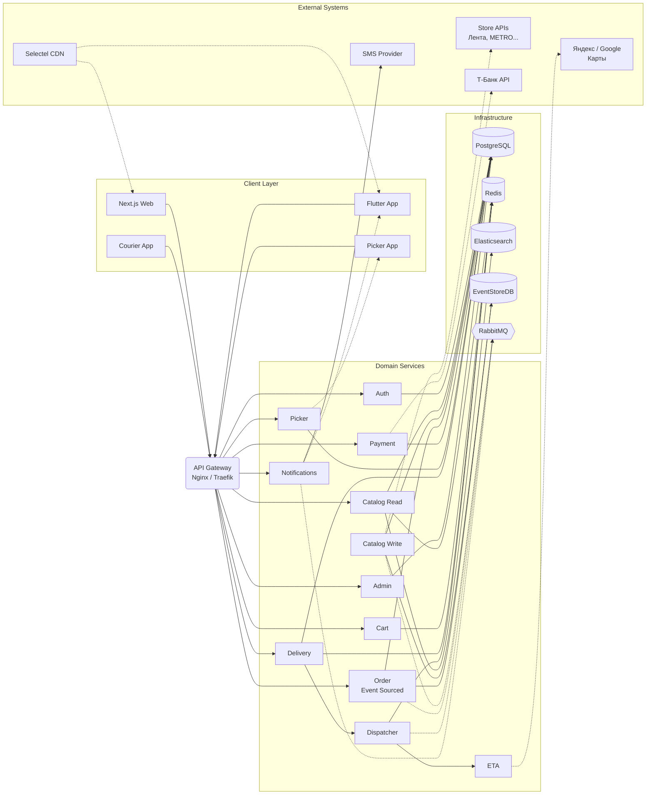

#### 2.5.1 Store API Integration Details

Детальные описания интеграций вынесены в отдельные файлы:
- **Лента (MVP):** [integrations/lenta.md](integrations/lenta.md)
- **Вкусвилл (V2):** [integrations/vkusvill.md](integrations/vkusvill.md)
- **Super Babylon (V2):** без API — физическое присутствие сборщика в магазине

### 2.6 Observability
**Источник:** Раздел 5.7.5 исходного документа.

| Компонент | Назначение | Интеграция |
|---|---|---|
| **Prometheus** | Сбор метрик со всех сервисов (`/metrics`) | Pull-модель |
| **Grafana** | Дашборды: `services-overview`, `business-metrics`, `slo-violations` | Предустановленные дашборды |
| **Loki + Promtail** | Централизованный сбор логов (JSON-structured) | LogQL для поиска |
| **Jaeger** | Distributed tracing | OpenTelemetry instrumentation |
| **Sentry** | Error tracking (backend + Flutter) | SDK на всех сервисах |
| **Яндекс.Метрика** | Бизнес-аналитика: конверсии, воронки, источники трафика | Установка счётчика на Web (Next.js) |

> **Разделение:** Prometheus/Grafana — технический мониторинг (латентность, ошибки, ёмкость). Яндекс.Метрика — бизнес-аналитика (поведение пользователей, конверсия).

### 2.7 API Versioning & Error Code Standard

**API Versioning:**
- Формат: URL prefix `/api/v1/`, `/api/v2/`
- Deprecation: заголовок `Sunset: Sat, 31 Dec 2026 23:59:59 GMT` за 6 месяцев до удаления
- Changelog: `CHANGELOG.md` в каждом сервисе

**Error Response Format:**
```json
{
  "error": {
    "code": "ORDER_NOT_FOUND",
    "message": "Заказ с указанным ID не найден",
    "details": { "order_id": "12345" },
    "request_id": "req_abc123"
  }
}
```

**Категории ошибок:**
| Диапазон | Категория | Примеры |
|---|---|---|
| `AUTH_*` | Аутентификация/авторизация | `AUTH_TOKEN_EXPIRED`, `AUTH_INSUFFICIENT_ROLE` |
| `VAL_*` | Валидация | `VAL_MISSING_FIELD`, `VAL_INVALID_FORMAT` |
| `BIZ_*` | Бизнес-логика | `BIZ_PRODUCT_UNAVAILABLE`, `BIZ_ORDER_CANNOT_CANCEL` |
| `INT_*` | Интеграция | `INT_PAYMENT_DECLINED`, `INT_STORE_API_ERROR` |
| `SYS_*` | Системные | `SYS_INTERNAL_ERROR`, `SYS_TIMEOUT` |

### 2.8 Mobile Application Architecture

Подробное описание мобильной архитектуры вынесено в отдельный ADR: **`ADR-007: Mobile Architecture`**.

Кратко: клиентские приложения на Flutter 3.x, единая кодовая база для iOS/Android. State management: Provider (пикер), BLoC + Provider (курьер), MobX (клиент). Offline: Hive (курьер), Firestore offline persistence (пикер).

### 2.9 Event Catalog

Система событий (Event-Driven через RabbitMQ). Каждое событие публикуется одним сервисом, потребляется одним или несколькими.

| Событие | Publisher | Consumers | Схема (ключевые поля) |
|---|---|---|---|
| `order.created` | Order Service | Dispatcher, Notification, Analytics | `order_id`, `user_id`, `store_id`, `total`, `items[]` |
| `order.paid` | Payment Service | Order, Dispatcher, Notification | `order_id`, `payment_id`, `amount`, `method` |
| `order.assigned` | Dispatcher | Order, Picker, Courier, Notification | `order_id`, `picker_id`, `courier_id`, `eta` |
| `order.picking_started` | Picker Service | Order, Notification, Analytics | `order_id`, `picker_id`, `started_at` |
| `order.picking_completed` | Picker Service | Delivery, Order, Notification | `order_id`, `picker_id`, `items_found`, `items_substituted` |
| `order.in_transit` | Delivery Service | Order, Notification, Tracking | `order_id`, `courier_id`, `eta`, `route[]` |
| `order.delivered` | Courier App | Order, Payment, Notification, Analytics | `order_id`, `courier_id`, `pod_signature`, `pod_photo` |
| `order.cancelled` | Order Service | Payment, Inventory, Notification | `order_id`, `reason`, `refund_amount` |
| `payment.refunded` | Payment Service | Order, Notification, Analytics | `order_id`, `refund_id`, `amount` |
| `inventory.low` | Inventory Service | Admin, Notification | `store_id`, `product_id`, `quantity` |
| `catalog.synced` | Catalog Write Service | Inventory, Analytics | `chain_id`, `products_count`, `errors` |
| `dispatch.cycle` | Dispatcher | ETA Estimator, Delivery | `zone_id`, `orders[]`, `couriers[]` |

---

### 2.10 State Machine Diagrams

Формальные State Machine Diagrams для ключевых сущностей. Каждый переход включает триггер, preconditions, postconditions, инициатора и публикуемое событие.

#### 2.10.1 Order

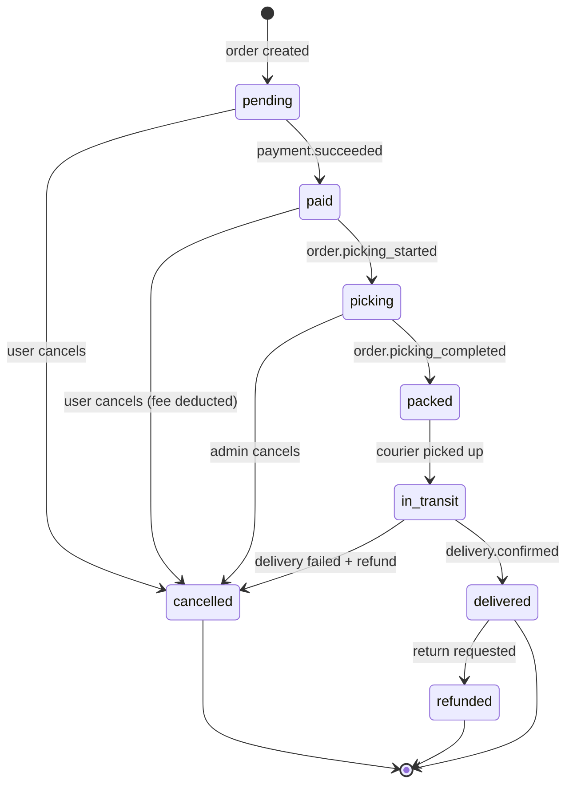

| Переход | Триггер | Preconditions | Postconditions | Инициатор | Событие |
|---------|---------|---------------|----------------|-----------|---------|
| `pending → paid` | `payment.succeeded` webhook | order.status == 'pending', payment.status == 'succeeded' | order.status = 'paid', payment recorded | Payment Service | `order.paid` |
| `pending → cancelled` | User clicks "Cancel" | order.status == 'pending' | order.status = 'cancelled', full refund | Customer | `order.cancelled` |
| `paid → picking` | Dispatcher assigns picker | order.status == 'paid', picker available | order.status = 'picking', picker_id set | Dispatcher | `order.picking_started` |
| `paid → cancelled` | User clicks "Cancel" | order.status == 'paid', picking not started | order.status = 'cancelled', refund minus fee | Customer | `order.cancelled` |
| `picking → packed` | Picker confirms packing | order.status == 'picking', all items processed | order.status = 'packed', packed_at set | Picker App | `order.picking_completed` |
| `picking → cancelled` | Admin cancels | order.status == 'picking' | order.status = 'cancelled', refund processed | Admin | `order.cancelled` |
| `packed → in_transit` | Courier picks up | order.status == 'packed', courier assigned | order.status = 'in_transit', picked_up_at set | Courier App | `order.in_transit` |
| `in_transit → delivered` | Courier confirms delivery | order.status == 'in_transit', POD captured | order.status = 'delivered', delivered_at set | Courier App | `order.delivered` |
| `in_transit → cancelled` | Delivery failed | order.status == 'in_transit', delivery failed | order.status = 'cancelled', full refund | System | `order.cancelled` |
| `delivered → refunded` | Return requested | order.status == 'delivered', within 14 days | order.status = 'refunded', refund processed | Customer | `payment.refunded` |

#### 2.10.2 Payment

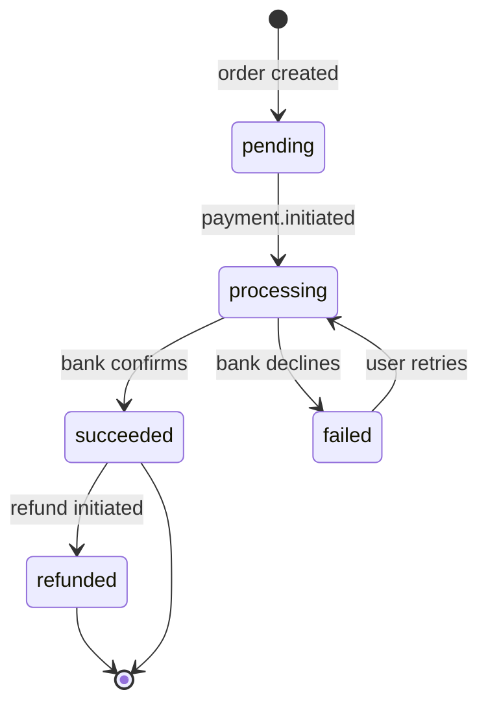

| Переход | Триггер | Preconditions | Postconditions | Инициатор | Событие |
|---------|---------|---------------|----------------|-----------|---------|
| `pending → processing` | User submits payment | payment.status == 'pending', payment method selected | payment.status = 'processing', bank request sent | Payment Service | — |
| `processing → succeeded` | Bank webhook (success) | payment.status == 'processing', 3DSecure passed | payment.status = 'succeeded', order.status = 'paid' | T-Bank | `order.paid` |
| `processing → failed` | Bank webhook (decline) | payment.status == 'processing', bank declined | payment.status = 'failed', error stored | T-Bank | — |
| `succeeded → refunded` | Admin initiates refund | payment.status == 'succeeded', refund requested | payment.status = 'refunded', money returned | Payment Service | `payment.refunded` |
| `failed → processing` | User retries payment | payment.status == 'failed', within retry limit | payment.status = 'processing', new bank request | Payment Service | — |

#### 2.10.3 Delivery

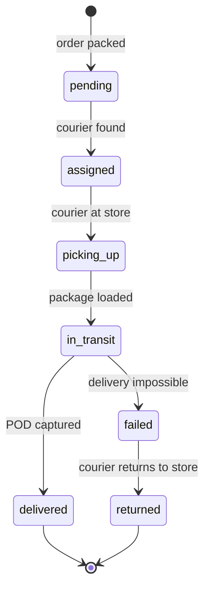

| Переход | Триггер | Preconditions | Postconditions | Инициатор | Событие |
|---------|---------|---------------|----------------|-----------|---------|
| `pending → assigned` | Dispatcher assigns courier | delivery.status == 'pending', courier found | delivery.status = 'assigned', courier_id, ETA set | Dispatcher | `order.assigned` |
| `assigned → picking_up` | Courier arrives at store | delivery.status == 'assigned', courier at store location | delivery.status = 'picking_up' | Courier App | — |
| `picking_up → in_transit` | Courier loads package | delivery.status == 'picking_up', package scanned | delivery.status = 'in_transit', route started | Courier App | `order.in_transit` |
| `in_transit → delivered` | Courier confirms delivery | delivery.status == 'in_transit', POD captured | delivery.status = 'delivered', delivered_at set | Courier App | `order.delivered` |
| `in_transit → failed` | Delivery timeout / customer unavailable | delivery.status == 'in_transit', max attempts reached | delivery.status = 'failed', return initiated | System | — |
| `failed → returned` | Courier returns package to store | delivery.status == 'failed', package intact | delivery.status = 'returned', stock restored | Courier App | — |

#### 2.10.4 Courier

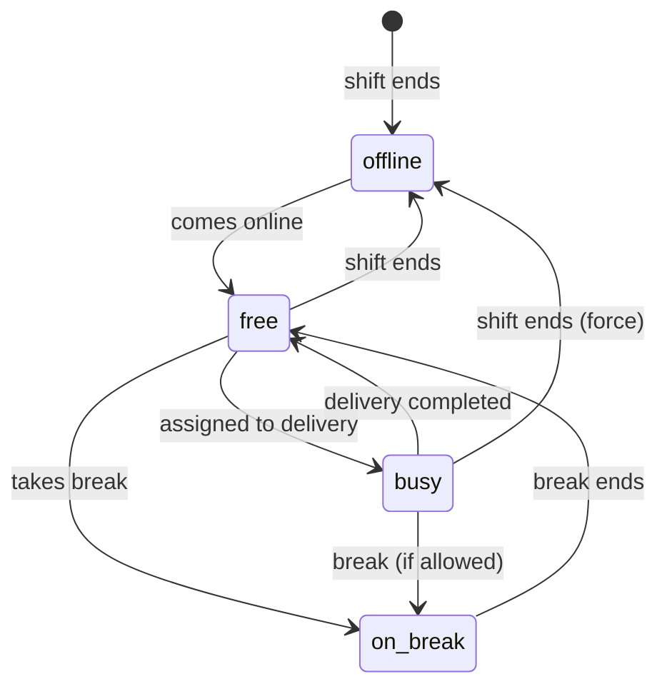

| Переход | Триггер | Preconditions | Postconditions | Инициатор | Событие |
|---------|---------|---------------|----------------|-----------|---------|
| `offline → free` | Courier comes online | courier.status == 'offline', shift scheduled | courier.status = 'free', available for dispatch | Courier App | — |
| `free → busy` | Delivery assigned | courier.status == 'free', dispatch picks courier | courier.status = 'busy', active_delivery_id set | Dispatcher | — |
| `busy → free` | Delivery completed | courier.status == 'busy', delivery marked done | courier.status = 'free', ready for next | Courier App | — |
| `free → on_break` | Courier starts break | courier.status == 'free', break quota remaining | courier.status = 'on_break', break_start set | Courier App | — |
| `on_break → free` | Break ends | courier.status == 'on_break', break_duration >= min | courier.status = 'free' | System | — |
| `free → offline` | Courier goes offline | courier.status == 'free' | courier.status = 'offline' | Courier App | — |

#### 2.10.5 Picker Task

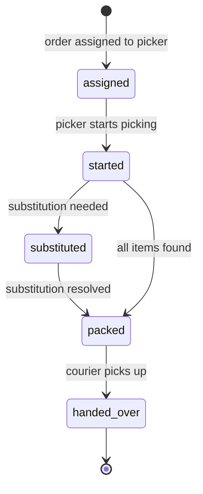

| Переход | Триггер | Preconditions | Postconditions | Инициатор | Событие |
|---------|---------|---------------|----------------|-----------|---------|
| `assigned → started` | Picker opens task | task.status == 'assigned', picker accepted | task.status = 'started', started_at set | Picker App | `order.picking_started` |
| `started → substituted` | Item out of stock, alternative found | task.status == 'started', item unavailable, customer agreed | task.status = 'substituted', substitution logged | Picker App | — |
| `substituted → packed` | All items processed | task.status == 'substituted', remaining items picked | task.status = 'packed', packed_at set | Picker App | — |
| `started → packed` | All items found | task.status == 'started', no substitutions needed | task.status = 'packed', packed_at set | Picker App | `order.picking_completed` |
| `packed → handed_over` | Courier receives package | task.status == 'packed', courier at store | task.status = 'handed_over', handover_at set | Courier App | — |

---

### 2.11 Sequence Diagrams

Sequence Diagrams для 5 критических сценариев. Участники — реальные сервисы из §2.3, события из §2.9. Сплошные стрелки (`→`) — синхронные вызовы, пунктирные (`-->>`) — асинхронные события.

#### 2.11.1 Оформление заказа

**Сценарий:** Клиент выбирает товары, оформляет заказ, оплачивает онлайн через Т-Банк.

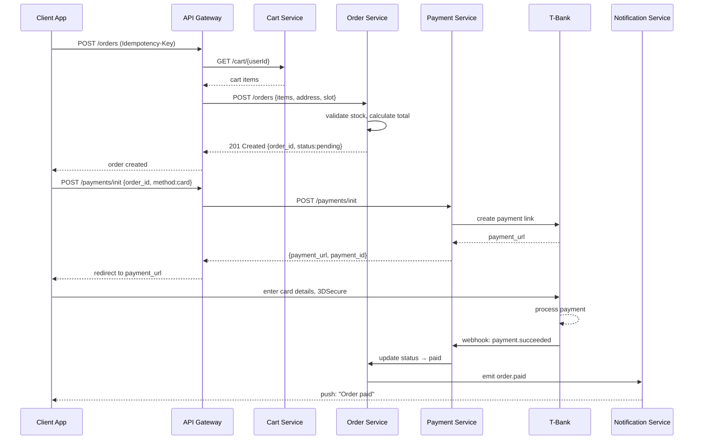

#### 2.11.2 Сборка с заменой товара

**Сценарий:** Пикер собирает заказ, обнаруживает отсутствующий товар, звонит клиенту, предлагает замену.

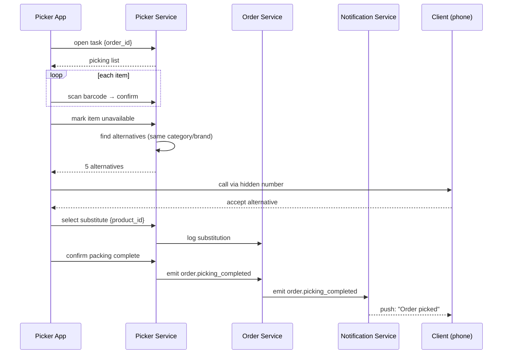

#### 2.11.3 Назначение курьера (Dispatch)

**Сценарий:** Заказ собран — диспетчер назначает ближайшего курьера, рассчитывает ETA, уведомляет клиента.

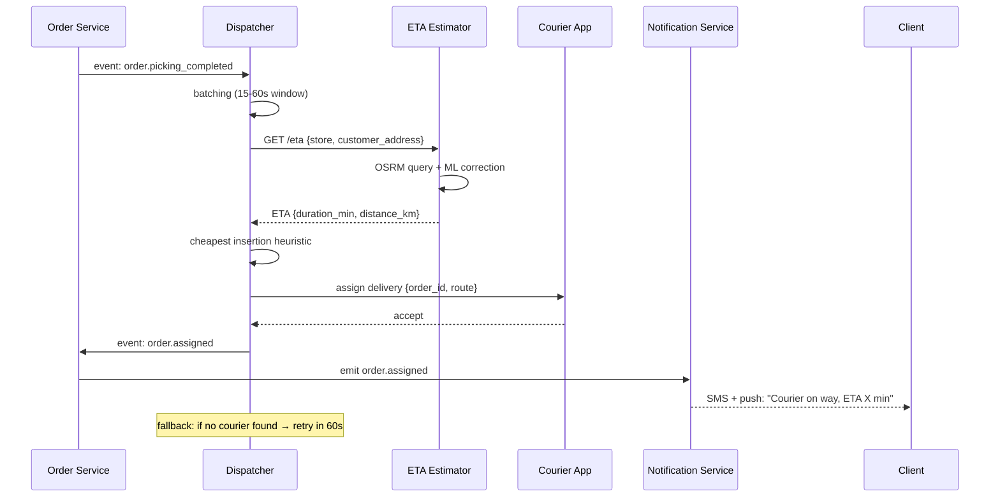

#### 2.11.4 Refund

**Сценарий:** Клиент запрашивает возврат, система инициирует refund через платёжный шлюз.

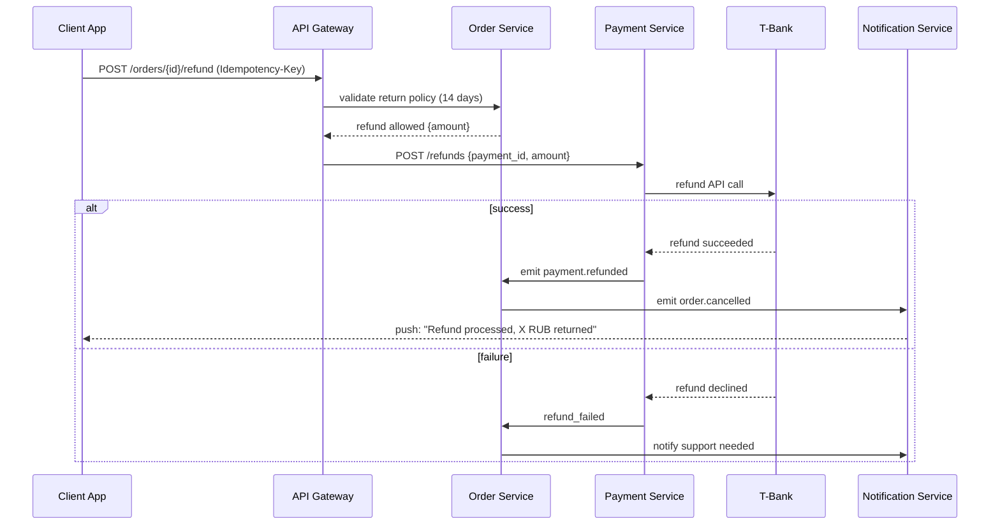

#### 2.11.5 Offline-sync курьера

**Сценарий:** Курьер теряет интернет во время доставки, отмечает доставку офлайн, данные синхронизируются позже.

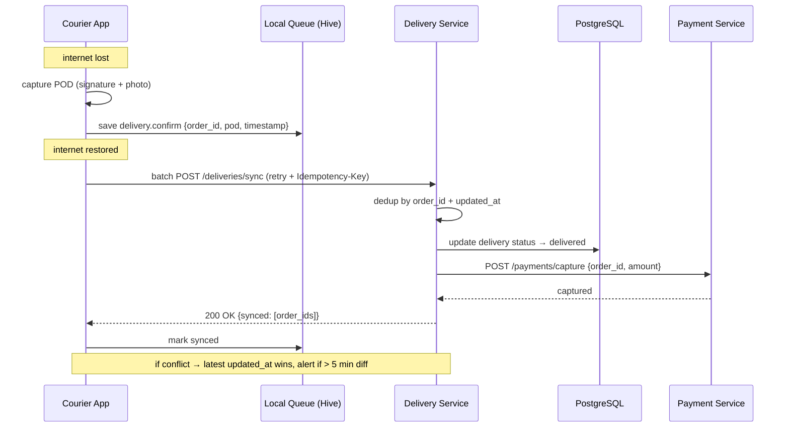

---

### 2.12 Event JSON Schemas

Стандартный envelope для всех событий и полные JSON Schema (draft-07) для каждого из 12 событий из §2.9.

#### 2.12.1 Envelope

Единая обёртка для всех событий в системе:

```json
{
  "event_id": "uuid-v4",
  "event_type": "order.created",
  "occurred_at": "2026-06-17T10:00:00Z",
  "aggregate_id": "order_12345",
  "aggregate_type": "order",
  "payload": { ... },
  "metadata": {
    "correlation_id": "uuid",
    "causation_id": "uuid",
    "user_id": "user_67890",
    "source": "order-service",
    "schema_version": "1.0"
  }
}
```

**Поля envelope:**

| Поле | Тип | Обязательное | Описание |
|------|-----|-------------|----------|
| `event_id` | string (uuid) | ✅ | Уникальный ID события |
| `event_type` | string (enum) | ✅ | Тип события из §2.9 |
| `occurred_at` | string (ISO8601) | ✅ | Время наступления события |
| `aggregate_id` | string | ✅ | ID сущности (напр. order_12345) |
| `aggregate_type` | string | ✅ | Тип сущности (order/payment/delivery/courier) |
| `payload` | object | ✅ | Тело события (зависит от event_type) |
| `metadata.correlation_id` | string (uuid) | ✅ | Для tracing — сквозной ID всей цепочки |
| `metadata.causation_id` | string (uuid) | ✅ | ID события-причины (parent event) |
| `metadata.user_id` | string | ❌ | ID пользователя, инициировавшего действие |
| `metadata.source` | string | ✅ | Сервис-отправитель |
| `metadata.schema_version` | string | ✅ | Версия схемы (semver) |

#### 2.12.2 Схемы событий

##### `order.created`

```json
{
  "$schema": "http://json-schema.org/draft-07/schema#",
  "type": "object",
  "required": ["order_id", "user_id", "store_id", "total", "items", "delivery_slot"],
  "properties": {
    "order_id": { "type": "string", "pattern": "^order_\\d+$" },
    "user_id": { "type": "string", "pattern": "^user_\\d+$" },
    "store_id": { "type": "string", "pattern": "^store_\\d+$" },
    "total": { "type": "number", "minimum": 0, "multipleOf": 0.01 },
    "delivery_fee": { "type": "number", "minimum": 0 },
    "items": {
      "type": "array",
      "minItems": 1,
      "items": {
        "type": "object",
        "required": ["product_id", "quantity", "price"],
        "properties": {
          "product_id": { "type": "string" },
          "quantity": { "type": "integer", "minimum": 1 },
          "price": { "type": "number", "minimum": 0 }
        }
      }
    },
    "delivery_slot": {
      "type": "object",
      "required": ["start", "end"],
      "properties": {
        "start": { "type": "string", "format": "date-time" },
        "end": { "type": "string", "format": "date-time" }
      }
    },
    "payment_method": { "type": "string", "enum": ["card", "sbp", "cash", "card_courier"] }
  }
}
```

**Пример:**
```json
{
  "order_id": "order_12345",
  "user_id": "user_67890",
  "store_id": "store_42",
  "total": 1850.50,
  "delivery_fee": 99.00,
  "items": [
    {"product_id": "prod_1001", "quantity": 2, "price": 450.00},
    {"product_id": "prod_1002", "quantity": 1, "price": 350.50}
  ],
  "delivery_slot": {"start": "2026-06-17T18:00:00Z", "end": "2026-06-17T20:00:00Z"},
  "payment_method": "card"
}
```

##### `order.paid`

```json
{
  "$schema": "http://json-schema.org/draft-07/schema#",
  "type": "object",
  "required": ["order_id", "payment_id", "amount", "method"],
  "properties": {
    "order_id": { "type": "string" },
    "payment_id": { "type": "string" },
    "amount": { "type": "number", "minimum": 0 },
    "method": { "type": "string", "enum": ["card", "sbp", "cash", "card_courier"] },
    "provider": { "type": "string", "enum": ["t-bank", "sbp"] },
    "paid_at": { "type": "string", "format": "date-time" }
  }
}
```

**Пример:** `{"order_id": "order_12345", "payment_id": "pay_9876", "amount": 1850.50, "method": "card", "provider": "t-bank", "paid_at": "2026-06-17T10:05:00Z"}`

##### `order.assigned`

```json
{
  "$schema": "http://json-schema.org/draft-07/schema#",
  "type": "object",
  "required": ["order_id", "picker_id", "courier_id", "eta"],
  "properties": {
    "order_id": { "type": "string" },
    "picker_id": { "type": "string" },
    "courier_id": { "type": "string" },
    "eta": {
      "type": "object",
      "required": ["delivery_min", "distance_km"],
      "properties": {
        "delivery_min": { "type": "integer", "minimum": 1 },
        "distance_km": { "type": "number", "minimum": 0 }
      }
    }
  }
}
```

**Пример:** `{"order_id": "order_12345", "picker_id": "picker_55", "courier_id": "courier_88", "eta": {"delivery_min": 35, "distance_km": 4.2}}`

##### `order.picking_started`

```json
{
  "$schema": "http://json-schema.org/draft-07/schema#",
  "type": "object",
  "required": ["order_id", "picker_id", "started_at"],
  "properties": {
    "order_id": { "type": "string" },
    "picker_id": { "type": "string" },
    "started_at": { "type": "string", "format": "date-time" }
  }
}
```

**Пример:** `{"order_id": "order_12345", "picker_id": "picker_55", "started_at": "2026-06-17T10:10:00Z"}`

##### `order.picking_completed`

```json
{
  "$schema": "http://json-schema.org/draft-07/schema#",
  "type": "object",
  "required": ["order_id", "picker_id", "items_found", "items_substituted"],
  "properties": {
    "order_id": { "type": "string" },
    "picker_id": { "type": "string" },
    "packed_at": { "type": "string", "format": "date-time" },
    "items_found": { "type": "integer", "minimum": 0 },
    "items_substituted": { "type": "integer", "minimum": 0 },
    "substitutions": {
      "type": "array",
      "items": {
        "type": "object",
        "properties": {
          "original_product_id": { "type": "string" },
          "substitute_product_id": { "type": "string" },
          "customer_approved": { "type": "boolean" }
        }
      }
    }
  }
}
```

**Пример:** `{"order_id": "order_12345", "picker_id": "picker_55", "packed_at": "2026-06-17T10:25:00Z", "items_found": 8, "items_substituted": 1, "substitutions": [{"original_product_id": "prod_1001", "substitute_product_id": "prod_1003", "customer_approved": true}]}`

##### `order.in_transit`

```json
{
  "$schema": "http://json-schema.org/draft-07/schema#",
  "type": "object",
  "required": ["order_id", "courier_id", "eta"],
  "properties": {
    "order_id": { "type": "string" },
    "courier_id": { "type": "string" },
    "eta": {
      "type": "object",
      "required": ["delivery_min", "distance_km"],
      "properties": {
        "delivery_min": { "type": "integer", "minimum": 1 },
        "distance_km": { "type": "number", "minimum": 0 }
      }
    },
    "route": {
      "type": "array",
      "items": {
        "type": "object",
        "properties": {
          "lat": { "type": "number" },
          "lng": { "type": "number" },
          "timestamp": { "type": "string", "format": "date-time" }
        }
      }
    }
  }
}
```

**Пример:** `{"order_id": "order_12345", "courier_id": "courier_88", "eta": {"delivery_min": 18, "distance_km": 2.5}}`

##### `order.delivered`

```json
{
  "$schema": "http://json-schema.org/draft-07/schema#",
  "type": "object",
  "required": ["order_id", "courier_id", "delivered_at"],
  "properties": {
    "order_id": { "type": "string" },
    "courier_id": { "type": "string" },
    "delivered_at": { "type": "string", "format": "date-time" },
    "pod_signature": { "type": "string", "description": "Base64-encoded signature image" },
    "pod_photo": { "type": "string", "description": "URL to delivery photo" },
    "payment_collected": { "type": "number", "description": "Amount collected on delivery" }
  }
}
```

**Пример:** `{"order_id": "order_12345", "courier_id": "courier_88", "delivered_at": "2026-06-17T10:50:00Z", "pod_signature": "iVBORw0KGgo...", "payment_collected": 350.00}`

##### `order.cancelled`

```json
{
  "$schema": "http://json-schema.org/draft-07/schema#",
  "type": "object",
  "required": ["order_id", "reason", "cancelled_at"],
  "properties": {
    "order_id": { "type": "string" },
    "reason": { "type": "string", "enum": ["user_cancelled", "admin_cancelled", "delivery_failed", "payment_failed", "timeout"] },
    "cancelled_at": { "type": "string", "format": "date-time" },
    "refund_amount": { "type": "number", "minimum": 0 },
    "refund_status": { "type": "string", "enum": ["pending", "processed", "none"] }
  }
}
```

**Пример:** `{"order_id": "order_12345", "reason": "user_cancelled", "cancelled_at": "2026-06-17T09:30:00Z", "refund_amount": 1850.50, "refund_status": "processed"}`

##### `payment.refunded`

```json
{
  "$schema": "http://json-schema.org/draft-07/schema#",
  "type": "object",
  "required": ["order_id", "refund_id", "amount", "refunded_at"],
  "properties": {
    "order_id": { "type": "string" },
    "refund_id": { "type": "string" },
    "amount": { "type": "number", "minimum": 0 },
    "refunded_at": { "type": "string", "format": "date-time" },
    "reason": { "type": "string" }
  }
}
```

**Пример:** `{"order_id": "order_12345", "refund_id": "refund_777", "amount": 1850.50, "refunded_at": "2026-06-17T11:00:00Z", "reason": "customer_return"}`

##### `inventory.low`

```json
{
  "$schema": "http://json-schema.org/draft-07/schema#",
  "type": "object",
  "required": ["store_id", "product_id", "quantity"],
  "properties": {
    "store_id": { "type": "string" },
    "product_id": { "type": "string" },
    "quantity": { "type": "integer", "minimum": 0 },
    "threshold": { "type": "integer", "minimum": 1 }
  }
}
```

**Пример:** `{"store_id": "store_42", "product_id": "prod_1001", "quantity": 3, "threshold": 10}`

##### `catalog.synced`

```json
{
  "$schema": "http://json-schema.org/draft-07/schema#",
  "type": "object",
  "required": ["chain_id", "synced_at"],
  "properties": {
    "chain_id": { "type": "string" },
    "synced_at": { "type": "string", "format": "date-time" },
    "products_count": { "type": "integer", "minimum": 0 },
    "categories_count": { "type": "integer", "minimum": 0 },
    "errors": { "type": "array", "items": { "type": "string" } },
    "duration_seconds": { "type": "integer", "minimum": 0 }
  }
}
```

**Пример:** `{"chain_id": "lenta", "synced_at": "2026-06-17T06:00:00Z", "products_count": 15234, "categories_count": 87, "errors": [], "duration_seconds": 145}`

##### `dispatch.cycle`

```json
{
  "$schema": "http://json-schema.org/draft-07/schema#",
  "type": "object",
  "required": ["zone_id", "cycle_id", "orders"],
  "properties": {
    "zone_id": { "type": "string" },
    "cycle_id": { "type": "string" },
    "orders": {
      "type": "array",
      "items": {
        "type": "object",
        "required": ["order_id", "store_id", "destination"],
        "properties": {
          "order_id": { "type": "string" },
          "store_id": { "type": "string" },
          "destination": {
            "type": "object",
            "properties": {
              "lat": { "type": "number" },
              "lng": { "type": "number" },
              "address": { "type": "string" }
            }
          },
          "weight_kg": { "type": "number", "maximum": 80 }
        }
      }
    },
    "available_couriers": {
      "type": "array",
      "items": {
        "type": "object",
        "properties": {
          "courier_id": { "type": "string" },
          "current_location": { "type": "object", "properties": { "lat": { "type": "number" }, "lng": { "type": "number" } } },
          "status": { "type": "string", "enum": ["free", "busy"] }
        }
      }
    }
  }
}
```

**Пример:** `{"zone_id": "zone_central", "cycle_id": "cycle_20260617_1845", "orders": [{"order_id": "order_12345", "store_id": "store_42", "destination": {"lat": 55.7558, "lng": 37.6173, "address": "ул. Тверская, 1"}, "weight_kg": 12.5}], "available_couriers": [{"courier_id": "courier_88", "current_location": {"lat": 55.7600, "lng": 37.6200}, "status": "free"}]}`

#### 2.12.3 Матрица соответствия

| Событие | Envelope event_type | Агрегат | Payload required fields | PII в payload |
|---------|---------------------|---------|------------------------|---------------|
| order.created | `order.created` | order | 6 | ❌ (user_id только ID) |
| order.paid | `order.paid` | order | 4 | ❌ |
| order.assigned | `order.assigned` | order | 4 | ❌ |
| order.picking_started | `order.picking_started` | order | 3 | ❌ |
| order.picking_completed | `order.picking_completed` | order | 4 | ❌ |
| order.in_transit | `order.in_transit` | delivery | 3 | ❌ |
| order.delivered | `order.delivered` | delivery | 3 | ❌ |
| order.cancelled | `order.cancelled` | order | 3 | ❌ |
| payment.refunded | `payment.refunded` | payment | 4 | ❌ |
| inventory.low | `inventory.low` | inventory | 3 | ❌ |
| catalog.synced | `catalog.synced` | catalog | 2 | ❌ |
| dispatch.cycle | `dispatch.cycle` | dispatch | 3 | ❌ |

---

### 3.1 Entity Relationship Diagram (ERD)
**Источник:** Раздел 5.4 + пункт 5 общего списка.

*Визуальная ER-диаграмма и ссылки на SQL-схемы.*

### 3.2 Catalog Schema (Архитектура хранения каталога)
**Источник:** Раздел 5.4 исходного документа.

```sql
-- Сеть (Лента, Metro, Вкусвилл...)
CREATE TABLE chains (
    id SERIAL PRIMARY KEY,
    name TEXT NOT NULL,
    slug TEXT UNIQUE,
    logo_url TEXT,
    created_at TIMESTAMPTZ DEFAULT NOW()
);

-- Конкретный магазин сети
CREATE TABLE stores (
    id SERIAL PRIMARY KEY,
    chain_id INTEGER REFERENCES chains(id),
    name TEXT NOT NULL,
    address TEXT,
    location GEOGRAPHY(POINT),
    working_hours JSONB,
    is_active BOOLEAN DEFAULT TRUE
);

-- Зона доставки магазина (полигон на карте)
CREATE TABLE delivery_zones (
    id SERIAL PRIMARY KEY,
    store_id INTEGER REFERENCES stores(id),
    polygon GEOGRAPHY(POLYGON),
    min_order_amount NUMERIC,
    delivery_fee NUMERIC
);

-- Товар (единица ассортимента сети)
CREATE TABLE chain_products (
    id SERIAL PRIMARY KEY,
    chain_id INTEGER REFERENCES chains(id),
    sku TEXT,
    barcode TEXT,
    name TEXT NOT NULL,
    brand TEXT,
    category_path TEXT[],
    unit TEXT,
    price NUMERIC,
    old_price NUMERIC,
    image_url TEXT,
    attributes JSONB,
    is_alcohol BOOLEAN DEFAULT FALSE,
    is_active BOOLEAN DEFAULT TRUE,
    UNIQUE(chain_id, sku)
);

-- Цена товара в конкретном магазине
CREATE TABLE store_prices (
    id SERIAL PRIMARY KEY,
    store_id INTEGER REFERENCES stores(id),
    chain_product_id INTEGER REFERENCES chain_products(id),
    price NUMERIC NOT NULL,
    old_price NUMERIC,
    quantity INTEGER,
    updated_at TIMESTAMPTZ DEFAULT NOW(),
    UNIQUE(store_id, chain_product_id)
);

-- Категория в каталоге платформы (наши, не сети)
CREATE TABLE categories (
    id SERIAL PRIMARY KEY,
    parent_id INTEGER REFERENCES categories(id),
    name TEXT NOT NULL,
    icon_url TEXT,
    sort_order INTEGER DEFAULT 0,
    price_from NUMERIC,         -- минимальная цена товара в категории (для фильтрации)
    price_to NUMERIC            -- максимальная цена товара в категории
);

-- Привязка товара сети к категории платформы
CREATE TABLE product_category_mappings (
    id SERIAL PRIMARY KEY,
    chain_product_id INTEGER REFERENCES chain_products(id),
    category_id INTEGER REFERENCES categories(id),
    UNIQUE(chain_product_id, category_id)
);

-- Фильтры категории (динамические)
CREATE TABLE category_filters (
    id SERIAL PRIMARY KEY,
    category_id INTEGER REFERENCES categories(id),
    filter_name TEXT NOT NULL,
    sort_order INTEGER DEFAULT 0
);

CREATE TABLE filter_values (
    id SERIAL PRIMARY KEY,
    filter_id INTEGER REFERENCES category_filters(id),
    value_name TEXT NOT NULL,
    sort_order INTEGER DEFAULT 0
);
```

### 3.3 Orders & Payments Schema
**Источник:** BP-03, BP-04, BP-07 исходного документа.

```sql
-- Корзина (временное хранение, Redis или PG)
CREATE TABLE carts (
    id SERIAL PRIMARY KEY,
    user_id INTEGER NOT NULL,
    store_id INTEGER REFERENCES stores(id),
    items JSONB NOT NULL DEFAULT '[]',
    promo_code TEXT,
    created_at TIMESTAMPTZ DEFAULT NOW(),
    updated_at TIMESTAMPTZ DEFAULT NOW()
);

-- Заказ
CREATE TABLE orders (
    id SERIAL PRIMARY KEY,
    user_id INTEGER NOT NULL,
    store_id INTEGER REFERENCES stores(id),
    status TEXT NOT NULL DEFAULT 'pending',
    -- Статусы: pending → paid → picking → packed → delivering → delivered
    --           cancelled, refunded
    total NUMERIC NOT NULL,
    delivery_fee NUMERIC NOT NULL DEFAULT 0,
    service_fee NUMERIC NOT NULL DEFAULT 0,
    weight_kg NUMERIC,
    delivery_address TEXT NOT NULL,
    delivery_lat NUMERIC,
    delivery_lng NUMERIC,
    payment_method TEXT NOT NULL,
    delivery_slot_date DATE,
    delivery_slot_start TIME,
    delivery_slot_end TIME,
    comment TEXT,
    substituted BOOLEAN DEFAULT FALSE,
    created_at TIMESTAMPTZ DEFAULT NOW(),
    updated_at TIMESTAMPTZ DEFAULT NOW()
);
CREATE INDEX idx_orders_user_id ON orders(user_id);
CREATE INDEX idx_orders_status ON orders(status);
CREATE INDEX idx_orders_store_id ON orders(store_id);

-- Позиции заказа
CREATE TABLE order_items (
    id SERIAL PRIMARY KEY,
    order_id INTEGER REFERENCES orders(id) ON DELETE CASCADE,
    product_id INTEGER REFERENCES chain_products(id),
    quantity NUMERIC NOT NULL,
    price NUMERIC NOT NULL,
    substituted BOOLEAN DEFAULT FALSE,
    substituted_from_id INTEGER REFERENCES order_items(id),
    picked BOOLEAN DEFAULT FALSE,
    UNIQUE(order_id, product_id)
);

-- Платежи
CREATE TABLE payments (
    id SERIAL PRIMARY KEY,
    order_id INTEGER REFERENCES orders(id),
    amount NUMERIC NOT NULL,
    status TEXT NOT NULL DEFAULT 'pending',
    -- Статусы: pending → succeeded → failed → refunded
    provider TEXT NOT NULL,
    provider_payment_id TEXT,
    created_at TIMESTAMPTZ DEFAULT NOW(),
    updated_at TIMESTAMPTZ DEFAULT NOW()
);

-- Возвраты
CREATE TABLE refunds (
    id SERIAL PRIMARY KEY,
    payment_id INTEGER REFERENCES payments(id),
    amount NUMERIC NOT NULL,
    reason TEXT,
    status TEXT NOT NULL DEFAULT 'pending',
    created_at TIMESTAMPTZ DEFAULT NOW()
);

-- Event store (аудит заказа, Event Sourcing)
CREATE TABLE order_events (
    id SERIAL PRIMARY KEY,
    order_id INTEGER REFERENCES orders(id),
    event_type TEXT NOT NULL,
    -- 'order.created', 'payment.received', 'picker.assigned',
    -- 'picking.started', 'picking.completed', 'courier.assigned',
    -- 'delivery.started', 'delivery.completed', 'order.cancelled'
    payload JSONB NOT NULL,
    created_at TIMESTAMPTZ DEFAULT NOW()
);
CREATE INDEX idx_order_events_order_id ON order_events(order_id);
```

### 3.4 Users & Auth Schema
**Источник:** BP-01, Раздел 5.13 исходного документа.

```sql
CREATE TYPE user_role AS ENUM ('customer', 'picker', 'courier', 'manager', 'super_admin');

-- Пользователи
CREATE TABLE users (
    id SERIAL PRIMARY KEY,
    phone TEXT UNIQUE NOT NULL,
    phone_verified BOOLEAN DEFAULT FALSE,
    email TEXT,
    name TEXT,
    role user_role NOT NULL DEFAULT 'customer',
    -- ПДн шифруются (AES-256) на уровне приложения
    encrypted_phone TEXT,
    encrypted_email TEXT,
    is_blocked BOOLEAN DEFAULT FALSE,
    blocked_until TIMESTAMPTZ,
    created_at TIMESTAMPTZ DEFAULT NOW(),
    updated_at TIMESTAMPTZ DEFAULT NOW()
);
CREATE INDEX idx_users_phone ON users(phone);
CREATE INDEX idx_users_role ON users(role);

-- Сессии (refresh token rotation)
CREATE TABLE sessions (
    id SERIAL PRIMARY KEY,
    user_id INTEGER REFERENCES users(id) ON DELETE CASCADE,
    refresh_token TEXT UNIQUE NOT NULL,
    device_info TEXT,
    ip_address INET,
    expires_at TIMESTAMPTZ NOT NULL,
    revoked BOOLEAN DEFAULT FALSE,
    created_at TIMESTAMPTZ DEFAULT NOW()
);
CREATE INDEX idx_sessions_user_id ON sessions(user_id);

-- Audit log (критические действия)
CREATE TABLE audit_log (
    id SERIAL PRIMARY KEY,
    user_id INTEGER REFERENCES users(id),
    action TEXT NOT NULL,
    -- 'user.login', 'order.cancel', 'order.status_change',
    -- 'user.role_change', 'payment.refund', 'admin.action'
    entity_type TEXT,
    entity_id INTEGER,
    details JSONB,
    ip_address INET,
    created_at TIMESTAMPTZ DEFAULT NOW()
);
CREATE INDEX idx_audit_log_user_id ON audit_log(user_id);
CREATE INDEX idx_audit_log_action ON audit_log(action);
CREATE INDEX idx_audit_log_created_at ON audit_log(created_at);
```

### 3.5 Delivery & Dispatch Schema
**Источник:** BP-06, BP-13 исходного документа.

```sql
-- Курьер
CREATE TABLE couriers (
    id SERIAL PRIMARY KEY,
    user_id INTEGER UNIQUE REFERENCES users(id),
    status TEXT NOT NULL DEFAULT 'offline',
    -- Статусы: offline, free, busy, on_break
    current_location GEOGRAPHY(POINT),
    last_location_update TIMESTAMPTZ,
    vehicle_type TEXT DEFAULT 'car',
    zone_id INTEGER REFERENCES delivery_zones(id),
    max_weight_kg NUMERIC DEFAULT 80,
    shift_start TIME,
    shift_end TIME,
    rating NUMERIC DEFAULT 5.0,
    created_at TIMESTAMPTZ DEFAULT NOW()
);
CREATE INDEX idx_couriers_status ON couriers(status);
CREATE INDEX idx_couriers_location ON couriers USING GIST(current_location);

-- Доставка
CREATE TABLE deliveries (
    id SERIAL PRIMARY KEY,
    order_id INTEGER UNIQUE REFERENCES orders(id),
    courier_id INTEGER REFERENCES couriers(id),
    status TEXT NOT NULL DEFAULT 'pending',
    -- Статусы: pending → assigned → picking_up → in_transit → delivered
    --           failed, returned
    assigned_at TIMESTAMPTZ,
    picked_up_at TIMESTAMPTZ,
    delivered_at TIMESTAMPTZ,
    eta_seconds INTEGER,
    eta_updated_at TIMESTAMPTZ,
    distance_meters INTEGER,
    courier_note TEXT,
    client_signature TEXT,
    photo_pod_url TEXT,
    created_at TIMESTAMPTZ DEFAULT NOW()
);
CREATE INDEX idx_deliveries_courier_id ON deliveries(courier_id);
CREATE INDEX idx_deliveries_status ON deliveries(status);

-- B2B компании
CREATE TABLE b2b_companies (
    id SERIAL PRIMARY KEY,
    name TEXT NOT NULL,
    inn TEXT UNIQUE NOT NULL,
    kpp TEXT,
    legal_address TEXT,
    actual_address TEXT,
    credit_limit NUMERIC,
    payment_deferral_days INTEGER DEFAULT 0,
    contract_number TEXT,
    contract_date DATE,
    edo_provider TEXT, -- 'diadoc' / 'sbis'
    is_active BOOLEAN DEFAULT TRUE,
    created_at TIMESTAMPTZ DEFAULT NOW()
);

-- Индивидуальные цены для B2B
CREATE TABLE b2b_prices (
    id SERIAL PRIMARY KEY,
    company_id INTEGER REFERENCES b2b_companies(id),
    product_id INTEGER REFERENCES chain_products(id),
    price NUMERIC NOT NULL,
    valid_from DATE NOT NULL,
    valid_until DATE,
    UNIQUE(company_id, product_id, valid_from)
);

-- B2B заказы
CREATE TABLE b2b_orders (
    id SERIAL PRIMARY KEY,
    order_id INTEGER UNIQUE REFERENCES orders(id),
    company_id INTEGER REFERENCES b2b_companies(id),
    po_number TEXT,
    delivery_note TEXT,
    invoice_url TEXT,
    upd_url TEXT,
    created_at TIMESTAMPTZ DEFAULT NOW()
);
```

### 3.6 Notifications & Promotions Schema
**Источник:** BP-08, BP-09 исходного документа.

```sql
-- Уведомления
CREATE TABLE notifications (
    id SERIAL PRIMARY KEY,
    user_id INTEGER REFERENCES users(id),
    channel TEXT NOT NULL, -- 'push', 'sms', 'email', 'telegram'
    event_type TEXT NOT NULL,
    -- 'order.created', 'payment.succeeded', 'delivery.assigned',
    -- 'delivery.delivered', 'promo.received', 'order.reminder'
    title TEXT,
    body TEXT NOT NULL,
    payload JSONB,
    status TEXT NOT NULL DEFAULT 'pending',
    -- Статусы: pending → sent → delivered → failed
    sent_at TIMESTAMPTZ,
    read_at TIMESTAMPTZ,
    created_at TIMESTAMPTZ DEFAULT NOW()
);
CREATE INDEX idx_notifications_user_id ON notifications(user_id);
CREATE INDEX idx_notifications_status ON notifications(status);

-- Промокоды
CREATE TABLE promo_codes (
    id SERIAL PRIMARY KEY,
    code TEXT UNIQUE NOT NULL,
    type TEXT NOT NULL, -- 'percent', 'fixed', 'free_delivery'
    value NUMERIC NOT NULL,
    max_uses INTEGER,
    used_count INTEGER DEFAULT 0,
    min_order_amount NUMERIC,
    max_discount NUMERIC,
    category_ids INTEGER[],
    first_order_only BOOLEAN DEFAULT FALSE,
    expires_at TIMESTAMPTZ,
    is_active BOOLEAN DEFAULT TRUE,
    created_at TIMESTAMPTZ DEFAULT NOW()
);

-- Использование промокодов
CREATE TABLE promo_code_uses (
    id SERIAL PRIMARY KEY,
    promo_code_id INTEGER REFERENCES promo_codes(id),
    order_id INTEGER REFERENCES orders(id),
    user_id INTEGER REFERENCES users(id),
    discount_amount NUMERIC NOT NULL,
    created_at TIMESTAMPTZ DEFAULT NOW()
);

-- Баллы лояльности
CREATE TABLE loyalty_points (
    id SERIAL PRIMARY KEY,
    user_id INTEGER UNIQUE REFERENCES users(id),
    balance NUMERIC NOT NULL DEFAULT 0,
    lifetime_earned NUMERIC DEFAULT 0,
    lifetime_spent NUMERIC DEFAULT 0,
    updated_at TIMESTAMPTZ DEFAULT NOW()
);

-- Транзакции баллов
CREATE TABLE loyalty_transactions (
    id SERIAL PRIMARY KEY,
    user_id INTEGER REFERENCES users(id),
    type TEXT NOT NULL, -- 'earn', 'spend', 'expire', 'refund'
    amount NUMERIC NOT NULL,
    order_id INTEGER REFERENCES orders(id),
    description TEXT,
    created_at TIMESTAMPTZ DEFAULT NOW()
);
```

---

## 4. Functional Requirements (Функциональные требования)

Каждый процесс описан по шаблону: триггер → шаги → данные → UI → интеграции → бизнес-правила → технические заметки → оценка.

**Источник:** Раздел 2.2 исходного документа.

### 4.1 Customer Domain (Клиент)

**Источник:** Раздел 2.2 исходного документа.

#### BP-01: Регистрация и аутентификация (14 чел.-дней)

**User Story:**
As a new customer,
I want to register with my phone number via SMS code,
So that I can start ordering without remembering passwords.

**Acceptance Criteria:**
Given I am on the registration screen
When I enter a valid phone number +7XXXXXXXXXX
Then the system sends a 4-digit SMS code within 10 seconds
And the code expires in 5 minutes

Given I have entered the wrong SMS code 3 times
When I try a 4th time
Then my number is blocked for 30 minutes
And I see a clear message with the unblock time

Given I am a returning user with an existing account
When I enter my phone number
Then the system recognizes my account and logs me in after SMS verification
And I do not need to re-enter my profile details

**Ссылки:**
→ State Machine: [§2.10 State Machine Diagrams](#210-state-machine-diagrams)
→ Sequence Diagram: [§2.11 Sequence Diagrams](#211-sequence-diagrams)
→ API endpoint: [§2.7 API Versioning & Error Code Standard](#27-api-versioning--error-code-standard)

**Триггер:** Пользователь открывает приложение / сайт

**Бизнес-шаги:**
1. **Ввод номера телефона** — Пользователь вводит номер в поле ввода (формат: +7XXXXXXXXXX)
2. **Отправка SMS с кодом** — Система генерирует 4-значный код, отправляет через SMS-провайдера (код жив 5 минут, 3 попытки ввода)
3. **Подтверждение кода** — Пользователь вводит код из SMS (при 3 неверных — блокировка на 30 мин)
4. **Создание/поиск профиля** — Если номер новый → создаётся профиль, если существующий → вход
5. **Выдача токена** — Система выдаёт JWT access + refresh токены (access — 15 мин, refresh — 30 дней)

**Данные процесса:**
- `users`: id, phone, name, email, role, created_at, updated_at
- `sessions`: id, user_id, refresh_token, expires_at, device_info

**UI / Интерфейсы:**
- Экран ввода номера
- Экран ввода SMS-кода
- Экран профиля (после регистрации)

**Интеграции:**
- SMS-провайдер (телефон, текст сообщения)

**Бизнес-правила:**
- Если пользователь не завершил регистрацию (не ввёл код) — номер считается незанятым
- Один номер — один аккаунт
- Админы создаются только через бэк-офис

**Технические заметки:**
- JWT access token (15 мин) + refresh token (30 дней, rotation)
- Rate limit: 3 запроса SMS/мин на номер
- Блокировка номера на 30 мин после 3 неверных попыток ввода кода

**Оценка:**

| Команда | Дней |
|---|---|
| Backend | 5 |
| Frontend | 3 |
| Mobile | 4 |
| QA | 2 |
| **Итого** | **14** |

---

#### BP-02: Каталог и поиск товаров (28 чел.-дней)

**User Story:**
As a customer,
I want to browse products by category, search by name, and apply filters,
So that I can quickly find the items I need.

**Acceptance Criteria:**
Given I am on the catalog page
When I select a category
Then I see a paginated list of products in that category
And each product card shows name, price, weight, and image

Given I enter a search query
When the system searches by product name and brand
Then I see matching results within 2 seconds
And irrelevant items are excluded

Given I apply a filter (e.g., brand or price range)
When the catalog updates
Then only products matching the filter are shown
And filter options update dynamically based on available products

**Ссылки:**
→ State Machine: [§2.10 State Machine Diagrams](#210-state-machine-diagrams)
→ Sequence Diagram: [§2.11 Sequence Diagrams](#211-sequence-diagrams)
→ API endpoint: [§2.7 API Versioning & Error Code Standard](#27-api-versioning--error-code-standard)

**Триггер:** Пользователь открывает каталог / вводит поисковый запрос

**Бизнес-шаги:**
1. **Выбор магазина** — Пользователь вводит адрес → система показывает доступные магазины (магазины определяются по зоне доставки адреса)
2. **Открытие каталога** — Пользователь выбирает категорию из списка (категории — дерево, 3 уровня: корневая → подкатегория → товары)
3. **Загрузка товаров** — Система выполняет запрос к БД / кэшу (пагинация)
4. **Фильтрация** — Пользователь выбирает фильтры (тип, бренд, цена, жирность и т.д.) (фильтры зависят от категории, динамические)
5. **Поиск** — Пользователь вводит текст поиска (поиск по названию, бренду)
6. **Отображение** — Система показывает карточки товаров с ценой и фото (фото с Selectel CDN)

**Данные процесса:**
- `categories`: id, parent_id, name, icon_path, sort_order
- `category_filters`: id, category_id, filter_name (например «Вид овоща», «Жирность», «Бренд»)
- `filter_values`: id, filter_id, value_name (например «Томаты», «Valio», «20%»)
- `products`: id, name, sku, barcode, price, old_price, category_id, images, attributes (JSONB)
- `stores`: id, name, chain_id, address, coordinates, working_hours
- `store_inventory`: store_id, product_id, quantity

**Структура фильтров:**
- Фильтры привязаны к категории, а не глобальные
- Пример для «Молоко и сливки»: Тип (молоко/сливки/козье), Обработка (стерилизованное/УВТ/пастеризованное), Жирность (0–40%), Фермерский продукт, Бренд
- Пример для «Овощи»: Вид овоща (томаты/перец/лук/...), Томаты (сливовидные/черри/...), Бренд

**Источник данных о товарах:**
- Цены и ассортимент получаются от сетей супермаркетов (API или парсинг)
- Актуальность остатков — не гарантирована, пикер проверяет в магазине

**UI / Интерфейсы:**
- Главная страница каталога (корневые категории с иконками)
- Список товаров (плитка/список, фото, цена, вес)
- Детальная карточка товара
- Поисковая строка
- Фильтры: сайдбар / выезжающая панель

**Бизнес-правила:**
- Цена = базовая цена сети - скидка (если есть акция/промокод)
- Наличие — не гарантируется до фактической сборки пикером
- Если товара нет в магазине — пикер звонит клиенту с вариантами замены
- Алкоголь и сигареты не доставляются (законодательный запрет)

**Технические заметки:**
- Фото товаров хранятся на Selectel CDN
- Пагинация списка товаров
- Фильтры динамические, зависят от категории
- Данные о ценах и ассортименте — внешние, от сетей супермаркетов (API или парсинг)

**Оценка:**

| Команда | Дней |
|---|---|
| Backend | 10 |
| Frontend | 6 |
| Mobile | 8 |
| QA | 4 |
| **Итого** | **28** |

---

#### BP-03: Оформление заказа (Корзина → Заказ) (34 чел.-дней)

**User Story:**
As a customer,
I want to add items to my cart, choose delivery options, and place an order,
So that my groceries are delivered to my address.

**Acceptance Criteria:**
Given I have items in my cart
When I proceed to checkout
Then I can select a delivery address, time slot, and payment method
And I see the final total including delivery fee

Given I have entered a valid promo code
When I apply it
Then the discount is reflected in the order total
And the discounted amount is shown clearly

Given I click "Place Order"
When the system creates the order
Then the order status is set to "Awaiting Payment" (online) or "Accepted" (cash)
And I receive a confirmation on screen

**Ссылки:**
→ State Machine: [§2.10 State Machine Diagrams](#210-state-machine-diagrams)
→ Sequence Diagram: [§2.11 Sequence Diagrams](#211-sequence-diagrams)
→ API endpoint: [§2.7 API Versioning & Error Code Standard](#27-api-versioning--error-code-standard)

**Триггер:** Пользователь выбирает товары и переходит к оформлению

**Бизнес-шаги:**
1. **Выбор магазина** — Система автоматически выбирает магазин по адресу (клиент может сменить магазин вручную)
2. **Добавление товаров** — Пользователь выбирает товары из каталога (можно добавить в заказ после оформления, пока сборка не началась)
3. **Применение промокода / баллов** — Пользователь вводит промокод (скидка не суммируется с другими акциями)
4. **Выбор временного слота** — Пользователь выбирает дату (сегодня/завтра/+3 дня) и интервал (слоты зависят от магазина и загрузки курьеров)
5. **Выбор адреса доставки** — Пользователь вводит или выбирает сохранённый (геокодирование, проверка попадания в зону доставки)
6. **Выбор способа оплаты** — Пользователь выбирает онлайн / СБП / картой курьеру / наличные
7. **Подтверждение** — Пользователь нажимает «Оформить заказ» (рассчитывается стоимость сборки и доставки)
8. **Создание заказа** — Система переводит статус в «Ожидает оплаты» (для онлайн) или «Принят» (для наличных)

**Особенность:** нет резервирования товаров при добавлении в корзину. Товар резервируется только после создания заказа. Актуальное наличие проверяет пикер в магазине.

**Данные процесса:**
- `carts`: id, user_id, store_id, items (JSONB), created_at, updated_at
- `orders`: id, user_id, store_id, status, total, delivery_fee, service_fee, delivery_address, payment_method, delivery_slot, weight, comment, created_at
- `order_items`: id, order_id, product_id, quantity, price, substituted (если замена), substituted_from_id
- `promo_codes`: id, code, type (percent/fixed/delivery), value, max_uses, used_count, min_order_amount, expires_at
- `loyalty_points`: id, user_id, balance

**UI / Интерфейсы:**
- Экран корзины (товары, количество, сумма, промокод)
- Экран оформления (адрес, слот, оплата)
- Экран подтверждения заказа
- Опция «Можно раньше» — согласие на более раннюю доставку

**Интеграции:**
- Геокодер (Яндекс.Карты) — адрес → координаты, проверка зоны доставки
- Telegram bot поддержки — изменение заказа

**Бизнес-правила:**
- Максимальный вес заказа: 80 кг
- Доставка бесплатна от определённой суммы (настраивается для каждого магазина)
- Можно заказать на сегодня, завтра или на 3 дня вперёд
- После оформления можно добавить товары кнопкой «В заказ» (до начала сборки)
- Время доставки: 10:00–22:00 (МСК)
- Стоимость сборки и доставки рассчитывается перед подтверждением
- Скидка по промокоду не суммируется с другими акциями

**Технические заметки:**
- Корзина хранится в JSONB, товары не резервируются до создания заказа
- Геокодирование через Яндекс.Карты
- Telegram bot для поддержки
- Вес заказа ограничен 80 кг

**Оценка:**

| Команда | Дней |
|---|---|
| Backend | 12 |
| Frontend | 8 |
| Mobile | 10 |
| QA | 4 |
| **Итого** | **34** |

---

#### BP-04: Оплата заказа (26 чел.-дней)

**User Story:**
As a customer,
I want to pay for my order online via bank card or SBP,
So that the order is confirmed and processed.

**Acceptance Criteria:**
Given I select online card payment
When I am redirected to the T-Bank payment gateway
Then my card details are entered on the bank's page (not our server)
And after successful 3DSecure, the order status changes to "Paid"

Given the bank declines my payment
When I receive the error notification
Then the order remains in "Awaiting Payment" status
And I can choose another payment method or retry

Given I choose to pay by cash on delivery
When the courier arrives
Then I can pay in cash and receive change
And the order is marked as delivered

**Ссылки:**
→ State Machine: [§2.10 State Machine Diagrams](#210-state-machine-diagrams)
→ Sequence Diagram: [§2.11 Sequence Diagrams](#211-sequence-diagrams)
→ API endpoint: [§2.7 API Versioning & Error Code Standard](#27-api-versioning--error-code-standard)

**Триггер:** Заказ создан со статусом «Ожидает оплаты»

**Бизнес-шаги:**
1. **Перенаправление на платёжный шлюз** — Система формирует ссылку на оплату (разные ссылки для разных банков)
2. **Ввод данных карты** — Пользователь вводит номер, срок, CVV (данные не проходят через наш сервер)
3. **Обработка платежа** — Банк списывает средства (3DSecure при необходимости)
4. **Callback от банка** — Система получает уведомление об успехе/отказе (webhook + polling)
5. **Обновление статуса заказа** — Успех → «Оплачен», отказ → ошибка пользователю

**Данные процесса:**
- `payments`: id, order_id, amount, status, provider, provider_payment_id, created_at
- `refunds`: id, payment_id, amount, reason, status

**Интеграции:**
- **Т-Банк (Тинькофф)** — сумма, order_id, success_url, fail_url → payment_url (основной шлюз)
- **СБП** — QR-код генерируется курьером при получении (вторичный)
- Карта курьеру — POS-терминал курьера (offline)
- Наличные — при получении (offline)

**Подтверждено:**
> «Для оплаты необходимо ввести реквизиты карты. Для этого мы перенаправим вас на платёжный шлюз банка Тинькофф. Соединение с платёжным шлюзом и передача информации осуществляется в защищённом режиме с использованием протокола шифрования SSL.»
> «Во время доставки курьер создаст для вас QR-код. Считайте его смартфоном и подтвердите операцию в приложении вашего банка.»

**Бизнес-правила:**
- Онлайн-оплата: перенаправление на шлюз Т-Банка, 3DSecure
- СБП: QR-код от курьера при получении, оплата через приложение банка
- Карта курьеру: POS-терминал на месте
- Наличные: оплата при получении, курьер выдаёт сдачу
- Электронный чек приходит на телефон/email
- Добавление карты: холд 1 руб. для проверки платежеспособности
- Полная стоимость списывается после получения и проверки заказа
- Refund: полный или частичный (по запросу менеджера)

**Технические заметки:**
- Webhook + polling для получения callback от банка
- Данные карты не проходят через сервер (PCI DSS compliance)
- Поддержка 3DSecure

**Оценка:**

| Команда | Дней |
|---|---|
| Backend | 15 |
| Frontend | 3 |
| Mobile | 3 |
| QA | 5 |
| **Итого** | **26** |

---

#### BP-10: Личный кабинет и история заказов (13 чел.-дней)

**User Story:**
As a customer,
I want to view my profile, order history, and manage my addresses,
So that I can track my activity and keep my information up to date.

**Acceptance Criteria:**
Given I am logged in and on my profile page
When I view my order history
Then I see a paginated list of all my orders with status, date, and total
And I can filter by order status

Given I want to edit my personal details
When I change my name or email
Then the changes are saved immediately
And my profile displays the updated information

Given I have no past orders
When I open the order history
Then I see a message that my order history is empty
And a CTA button to start shopping

**Ссылки:**
→ State Machine: [§2.10 State Machine Diagrams](#210-state-machine-diagrams)
→ Sequence Diagram: [§2.11 Sequence Diagrams](#211-sequence-diagrams)
→ API endpoint: [§2.7 API Versioning & Error Code Standard](#27-api-versioning--error-code-standard)

**Триггер:** Пользователь заходит в профиль

**Бизнес-шаги:**
1. **Просмотр/редактирование профиля** — Пользователь просматривает и редактирует имя, телефон, email
2. **Просмотр истории заказов** — Пользователь просматривает список заказов с пагинацией и фильтром по статусу
3. **Просмотр деталей заказа** — Пользователь просматривает товары, статус, трекинг
4. **Управление адресами** — Пользователь просматривает и управляет сохранёнными адресами доставки
5. **Избранное / Wishlist** — Пользователь управляет списком избранных товаров

**Данные процесса:**
- `users`: id, phone, name, email, role, created_at, updated_at (профиль)
- `orders`: id, user_id, store_id, status, total, delivery_address, delivery_slot, created_at (история)
- `addresses`: id, user_id, address, coordinates, label, is_default
- `wishlist`: id, user_id, product_id, created_at

**UI / Интерфейсы:**
- Страница профиля (имя, телефон, email)
- Список заказов (пагинация, фильтр по статусу)
- Детали заказа (товары, статус, трекинг)
- Сохранённые адреса доставки
- Избранное / Wishlist

**Бизнес-правила:**
- Пользователь может редактировать только свои данные
- История заказов доступна за всё время
- Удаление аккаунта — через поддержку

**Технические заметки:**
- Пагинация списка заказов
- Фильтрация по статусу заказа

**Оценка:**

| Команда | Дней |
|---|---|
| Backend | 4 |
| Frontend | 3 |
| Mobile | 4 |
| QA | 2 |
| **Итого** | **13** |

---

### 4.2 Picker Domain (Пикер)

**Источник:** Раздел 2.2 исходного документа.

#### BP-05: Сборка и упаковка заказа (21 чел.-дней)

**User Story:**
As a picker,
I want to receive picking lists, scan items, handle substitutions, and pack orders,
So that customers receive accurate and fresh products.

**Acceptance Criteria:**
Given I receive a new picking task in the picker app
When I open the order
Then I see a list of items with name, quantity, and location in the store
And I can scan barcodes to confirm each item

Given a product is out of stock
When I mark it as unavailable
Then the system suggests up to 5 alternative products from the same category
And I can call the customer to confirm a replacement

Given I have picked and packed all items
When I confirm the order as ready
Then the status changes to "Ready for Delivery"
And the order appears in the courier queue

**Ссылки:**
→ State Machine: [§2.10 State Machine Diagrams](#210-state-machine-diagrams)
→ Sequence Diagram: [§2.11 Sequence Diagrams](#211-sequence-diagrams)
→ API endpoint: [§2.7 API Versioning & Error Code Standard](#27-api-versioning--error-code-standard)

**Триггер:** Заказ оплачен / подтверждён

**Бизнес-шаги:**
1. **Поступление заказа пикеру** — Система отправляет заказ в приложение пикера (FIFO)
2. **Сборка товаров в зале** — Пикер идёт по списку, отбирает товары с полок (выбирает самые свежие, целые яйца, лучшие овощи/фрукты)
3. **Проверка наличия** — Пикер сверяет товар с заказом (если товара нет → звонит клиенту, предлагает замену)
4. **Замена товара** — Пикер предлагает альтернативу, клиент соглашается или отказывается (замена фиксируется в системе)
5. **Упаковка** — Пикер фасует по пакетам, термосумкам, контейнерам (соблюдение товарного соседства: мясо отдельно, химия отдельно)
6. **Передача курьеру** — Упакованный заказ передаётся курьеру (статус → «Передан в доставку»)

**Особенность:** сборка происходит в торговом зале супермаркета (не на складе). Пикеры работают непосредственно в гипермаркетах.

**Сценарий замены товара (поэтапно):**
1. **Обнаружение отсутствия** — Пикер нажимает «Нет в наличии» (система проверяет альтернативы в этом магазине)
2. **Поиск альтернатив** — Система ищет товары той же категории, того же бренда, аналогичной цены (приоритет: тот же бренд → та же категория → ближайшая цена)
3. **Предложение замен** — Система показывает пикеру список альтернатив до 5 (каждая с ценой, весом, фото)
4. **Звонок клиенту** — Пикер звонит клиенту через встроенный звонок (скрытый номер)
5. **Выбор альтернативы** — Клиент соглашается на одну из предложенных или просит другую
6. **Фиксация замены** — Замена записывается в `order_items.substituted_from_id` (цена замены может отличаться)
7. **Отказ от замены** — Клиент отказывается от товара (товар исключается из заказа, стоимость пересчитывается)

**Особенности замены:**
- Если клиент не берёт трубку — пикер оставляет товар в заказе (без замены), клиент может отказаться при получении
- Замена возможна только на товары в наличии в этом магазине (проверка по последней синхронизации)
- Цена замены фиксируется в момент согласия клиента (не меняется при пересчёте корзины)

**Данные процесса:**
- `orders`: id, user_id, store_id, status, total, items (JSONB)
- `order_items`: id, order_id, product_id, quantity, price, substituted, substituted_from_id
- `store_inventory`: store_id, product_id, quantity

**UI (внутреннее приложение пикера):**
- Список заказов на сборку
- Детали заказа со списком товаров
- Сканер штрихкодов
- Интерфейс замены товара (выбор альтернативы, звонок клиенту)
- Подтверждение упаковки

**Бизнес-правила:**
- Пикер отбирает товары максимально свежие (молоко/яйца — из глубины полки)
- При отсутствии товара → обязательный звонок клиенту
- Упаковка: термосумки для заморозки, отдельно для химии, хрупкое отдельно
- Опция «Меньше пакетов» — экологичная упаковка

**Технические заметки (архитектура приложения пикера):**
- **Архитектура:** Feature-first (models/screens/state/widgets)
- **State management:** Provider
- **Build flavors:** dev, dev_gooods, prod, prod_gooods
- **Real-time:** Cloud Firestore listeners (push)
- **Offline:** Firestore offline persistence
- **Сканер штрихкодов:** Scandit (scandit_flutter_datacapture_barcode)
- **Локальное хранение:** Firestore cache (SQLite)
- **Backend:** Firebase (Auth, Firestore, Crashlytics, Analytics, App Check)
- **CI/CD:** GitHub Actions — dev на tag push, prod вручную

**Сценарии работы пикера в офлайне:**
1. Нет интернета в подвале супермаркета — последний загруженный заказ остаётся на экране, сканер работает локально, отметки о сборке ставятся в local queue
2. Восстановление связи — queue синхронизируется с сервером (batch update), дубли разрешаются по updated_at
3. Замена товара — пикер звонит клиенту напрямую (голосовая связь, не требует интернета), после подтверждения вводит замену — данные попадают в queue

**Оценка:**

| Команда | Дней |
|---|---|
| Backend (API для пикера) | 8 |
| Mobile (приложение пикера) | 10 |
| QA | 3 |
| **Итого** | **21** |

---

### 4.3 Courier Domain (Курьер)

**Источник:** Раздел 2.2 исходного документа.

#### BP-06: Доставка заказа (29 чел.-дней)

**User Story:**
As a courier,
I want to receive delivery tasks with navigation, accept payments, and confirm delivery,
So that orders are delivered to customers on time.
As a customer,
I want to track my delivery in real time,
So that I know when to expect my order.

**Acceptance Criteria:**
Given I am a courier assigned a new delivery
When I view the task in the courier app
Then I see the pickup store, customer address, ETA, and order weight
And I can navigate to both locations

Given I arrive at the customer's address
When the customer accepts the order
Then I can record payment (card/cash/SBP QR)
And capture the customer's signature as proof of delivery

Given I lose internet connection during delivery
When I complete the delivery
Then the status update is queued locally
And automatically synced when connectivity is restored

**Ссылки:**
→ State Machine: [§2.10 State Machine Diagrams](#210-state-machine-diagrams)
→ Sequence Diagram: [§2.11 Sequence Diagrams](#211-sequence-diagrams)
→ API endpoint: [§2.7 API Versioning & Error Code Standard](#27-api-versioning--error-code-standard)

**Триггер:** Заказ собран и упакован пикером

**Бизнес-шаги:**
1. **Назначение курьера** — Система выбирает свободного автокурьера, ближайшего к магазину (курьер на личном авто, права кат. B, знание города)
2. **Получение заказа** — Курьер забирает упакованный заказ у пикера (проверка веса, макс. 80 кг)
3. **Построение маршрута** — Курьер строит маршрут в приложении (интеграция с картами)
4. **Доставка** — Курьер привозит заказ клиенту (клиент проверяет заказ)
5. **Приём оплаты** — Если не онлайн — курьер принимает оплату картой/наличными/СБП (СБП: курьер показывает QR-код)
6. **Завершение** — Система переводит статус в «Доставлен», деньги списаны

**Данные процесса:**
- `deliveries`: id, order_id, courier_id, status, assigned_at, picked_at, delivered_at
- `couriers`: id, user_id, status (free/busy), zone_id, vehicle_type, current_location (POINT)
- `delivery_zones`: id, store_id, polygon (GEOJSON), delivery_fee, min_order_amount

**UI / Интерфейсы:**
- **Приложение курьера (Android/iOS):** список заказов, навигация, сканер, приём оплаты, история
- **Трекинг для клиента:** отслеживание статуса (сборка → доставка)
- **Опция «Можно раньше»:** клиент готов принять заказ раньше выбранного слота

**Интеграции:**
- Карты (Яндекс / Google) — маршрут, навигация
- Т-Банк / СБП — приём оплаты курьером

**Технические заметки (алгоритм назначения курьера):**

**Математическая модель (Multi-objective optimization):**

| Цель (objective) | Что минимизируем | Вес |
|---|---|---|
| Время доставки | Суммарное время всех маршрутов | Высокий |
| SLA | Отклонение от обещанного временного слота | Высокий |
| Дистанция | Общий пробег всех курьеров | Средний |
| Disruption | Количество изменений в уже построенных маршрутах | Низкий |
| Fairness | Равномерность загрузки курьеров | Средний |
| Zone familiarity | Назначение курьеру заказов в знакомом районе | Низкий |

**Алгоритм:**
1. **Batching** — каждые 15–60 секунд собираем пул новых заказов (100–1000+)
2. **Cheapest Insertion Heuristic** — для каждого нового заказа находим оптимальное место в маршруте каждого курьера (минимальное увеличение времени/дистанции)
3. **2-opt local search** — после вставки всех заказов улучшаем маршруты перестановками (разворот подмаршрутов)
4. **Constraint satisfaction** — проверка: вместимость авто, смены курьеров (не более 8 ч), дедлайны окон доставки, география (зона доставки)

**Реализация:** service `delivery-dispatcher` с очередью RabbitMQ, идемпотентное назначение (каждый заказ назначается ровно один раз).

**Технические заметки (расчёт ETA доставки):**

**Гибридный подход (2 фазы):**

**Фаза 1 — OSRM (базовый маршрут):**
POST /table?sources={магазин}&destinations={адрес_клиента} → distance_m, duration_s (базовое время без учёта трафика)

**Фаза 2 — ML-коррекция (XGBoost / Ridge Regression):**

| Признак (feature) | Источник | Пример |
|---|---|---|
| `osrm_distance_m` | OSRM Table API | 5230 |
| `osrm_duration_s` | OSRM Table API | 780 |
| `departure_hour` | Время выезда курьера | 18 |
| `weekday` | День недели (0=Пн) | 5 |
| `is_weekend` | Выходной | 1 |
| `is_peak_morning` | 08:00–10:00 | 0 |
| `is_peak_evening` | 17:00–20:00 | 1 |
| `weather` | OpenWeather API | «rain» |
| `traffic_density` | Яндекс.Пробки / Google Traffic | 7/10 |
| `festival` | Календарь праздников | 0 |
| `rain_factor` | Сила дождя (0–1) | 0.7 |
| `service_time_min` | Время передачи/проверки заказа | 3 |
| `vehicle_type` | Тип авто курьера | «sedan» |

**Результаты моделей:**
| Модель | MAE (мин) | RMSE (мин) | R² |
|---|---|---|---|
| OSRM baseline | 4.8 | 5.9 | — |
| XGBoost | 3.10 | 3.84 | 0.8317 |
| Ridge Regression (traffic-adjusted) | 1.88 | — | 0.977 |

**Реализация:** микросервис `eta-estimator` — получает события `delivery.assigned`, запрашивает OSRM + погоду, возвращает скорректированное ETA. Кэш: 15 мин для одинаковых пар (магазин, адрес). ETA пересчитывается каждые 5 минут во время доставки (если курьер отклонился от маршрута или изменился трафик).

**Технические заметки (offline-first приложение курьера):**

| Компонент | Решение | Зачем |
|---|---|---|
| State management | Provider + BLoC | Provider для простых состояний (UI), BLoC для сложных (синхронизация, навигация) |
| Локальное хранение | Hive CE (hive_ce) + SharedPreferences + flutter_secure_storage | Hive — быстрая NoSQL БД на диске, работает без сети |
| Sync queue | Smart Sync Queue (модуль StoreToOffline/) | Очередь изменений: когда нет сети — кладём в Hive, при появлении — отправляем batch |
| Карты и навигация | Google Maps + Google Directions API + flutter_polyline_points | Off-route detection с визуальным + звуковым алертом, Live GPS с гироскопом |
| Офлайн-карты | Не поддерживается | Требуется кэширование тайлов — TODO для V2 |
| Оплата без интернета | Holds в локальной queue | Курьер нажимает «Оплачено» → запись в Hive → при появлении сети отправляется в платёжный шлюз |
| Документы (POD) | Digital signature + photo capture | Подпись клиента и фото заказа сохраняются локально, синхронизируются batch |
| Backend | Odoo JSON-RPC | Референс использует Odoo; для нас — API на Rails / Go |

**Сценарии работы курьера в офлайне:**
1. Нет сети в подъезде/лифте — заказ открыт, навигация по кэшированным данным, отметка «доставлен» ставится в queue
2. Пропала связь при приёме оплаты — hold в Hive, после восстановления — отправка в платёжный шлюз с проверкой дубликатов по order_id + amount
3. Длительный офлайн (например метро) — queue растёт локально, при появлении сети — batch upload с дедупликацией по updated_at

**Бизнес-правила:**
- Курьер — автокурьер (личное авто, права кат. B)
- Максимальный вес заказа: 80 кг
- Часы доставки: 10:00–22:00 (МСК)
- Заказы принимаются на сегодня, завтра и на 3 дня вперёд
- Стоимость доставки рассчитывается в корзине (может быть бесплатной от суммы)
- Если товар повреждён при доставке — возврат/замена через поддержку

**Оценка:**

| Команда | Дней |
|---|---|
| Backend | 10 |
| Mobile (курьер) | 12 |
| Frontend (трекинг) | 3 |
| QA | 4 |
| **Итого** | **29** |

---

### 4.4 Admin Domain (Администратор)

**Источник:** Раздел 2.2 исходного документа.

#### BP-07: Возврат и отмена заказа (14 чел.-дней)

**User Story:**
As a customer,
I want to cancel my order or return items,
So that I can get a refund when something goes wrong.

**Acceptance Criteria:**
Given my order is still being picked
When I request cancellation
Then the order is cancelled immediately
And the full amount is refunded within 24 hours

Given my order has already been delivered
When I request a return within 14 days
Then the courier picks up the returned items
And the refund is processed through the original payment method

Given my order is out for delivery
When I request cancellation
Then the cancellation is processed with a service fee deducted
And the remaining amount is refunded

**Ссылки:**
→ State Machine: [§2.10 State Machine Diagrams](#210-state-machine-diagrams)
→ Sequence Diagram: [§2.11 Sequence Diagrams](#211-sequence-diagrams)
→ API endpoint: [§2.7 API Versioning & Error Code Standard](#27-api-versioning--error-code-standard)

**Триггер:** Клиент хочет отменить заказ / вернуть товар

**Бизнес-шаги:**
1. **Запрос отмены** — Пользователь нажимает «Отменить заказ» (можно отменить, если статус ≠ «Передан в доставку»)
2. **Проверка возможности отмены** — Система проверяет статус заказа
3. **Отмена / Возврат** — Система переводит статус в «Отменён», инициируется refund (refund через тот же платёжный метод)
4. **Уведомление** — Система отправляет письмо/push об отмене
5. **Возврат товара (если передан курьеру)** — Курьер забирает товар (курьер получает задачу на возврат)

**Бизнес-правила:**
- До сборки: отмена мгновенно, возврат средств в течение 24 ч
- После сборки, до доставки: отмена возможна, но комиссия
- После доставки: возврат в течение 14 дней по закону о защите прав потребителей
- Возврат товара ненадлежащего качества: курьер забирает товар, деньги возвращаются
- Поддержка: Telegram-бот или телефон
- Возврат средств — через тот же платёжный метод, которым оплачивали

**Технические заметки:**
- Refund инициируется через тот же платёжный провайдер
- Курьер получает задачу на возврат через приложение курьера

**Оценка:**

| Команда | Дней |
|---|---|
| Backend | 6 |
| Frontend | 2 |
| Mobile | 3 |
| QA | 3 |
| **Итого** | **14** |

---

#### BP-08: Управление промокодами и акциями (10 чел.-дней)

**User Story:**
As a marketing manager,
I want to create promo codes with custom rules and limits,
So that I can run targeted promotions to attract customers.

**Acceptance Criteria:**
Given I am in the admin promo management section
When I create a new promo code
Then I can set type (percent/fixed/delivery), value, min order amount, max uses, and expiry date
And the promo code is saved and available for use

Given a customer enters an expired promo code
When the promo code is validated
Then the system rejects it with a clear "Promo code expired" message
And no discount is applied

Given a promo code has reached its usage limit
When a customer tries to apply it
Then the system rejects it with "Promo code usage limit reached"
And no discount is applied

**Ссылки:**
→ State Machine: [§2.10 State Machine Diagrams](#210-state-machine-diagrams)
→ Sequence Diagram: [§2.11 Sequence Diagrams](#211-sequence-diagrams)
→ API endpoint: [§2.7 API Versioning & Error Code Standard](#27-api-versioning--error-code-standard)

**Триггер:** Администратор создаёт акцию

**Бизнес-шаги:**
1. **Создание акции** — Админ заполняет форму: тип, размер, условия
2. **Применение в корзине** — При вводе промокода — пересчёт суммы (скидка не суммируется с другими акциями)

**Данные процесса:**
- `promo_codes`: id, code, type (percent/fixed/delivery), value, max_uses, used_count, min_order_amount, expires_at

**UI / Интерфейсы:**
- Форма создания промокода в админ-панели
- Отображение применения промокода в корзине

**Бизнес-правила:**
- Типы: процентная (например 10%), фиксированная (например 500 руб), бесплатная доставка
- Ограничения: минимальная сумма заказа, категории товаров, макс. количество использований
- Программа лояльности: начисление баллов за заказы, списание баллов при оплате
- Промокод на первый заказ — скидка для новых пользователей
- Скидка в день рождения
- Ограничение: скидки не суммируются с другими акциями

**Технические заметки:**
- Проверка промокода при каждом применении (срок действия, лимит использований)
- Интеграция с корзиной для пересчёта суммы

**Оценка:**

| Команда | Дней |
|---|---|
| Backend | 5 |
| Frontend | 3 |
| QA | 2 |
| **Итого** | **10** |

---

#### BP-11: Админ-панель (CRM / Бэк-офис) (40 чел.-дней)

**User Story:**
As an admin/manager,
I want to manage orders, products, users, and view analytics from a single panel,
So that I can run the platform efficiently.

**Acceptance Criteria:**
Given I log into the admin panel with admin credentials
When I navigate to the Orders section
Then I see a list of all orders with filters by status, date, and customer
And I can view order details, change status, and add comments

Given I need to add a new product
When I fill in the product form with name, price, images, and category
Then the product is saved and appears in the customer catalog within 5 minutes
And I can optionally import products via CSV/Excel

Given I access the user management section
When I search for a user by phone or name
Then I see the user's profile, order history, and account status
And I can block/unblock the user or change their role

**Ссылки:**
→ State Machine: [§2.10 State Machine Diagrams](#210-state-machine-diagrams)
→ Sequence Diagram: [§2.11 Sequence Diagrams](#211-sequence-diagrams)
→ API endpoint: [§2.7 API Versioning & Error Code Standard](#27-api-versioning--error-code-standard)

**Триггер:** Менеджер заходит в админку

**Бизнес-шаги:**
- **Управление заказами:** список, фильтры, просмотр, изменение статуса, комментирование
- **Управление товарами:** CRUD, импорт/экспорт (CSV/Excel), управление ценами
- **Управление пользователями:** список, блокировка, смена роли
- **Управление промокодами:** создание, статистика использований
- **Управление курьерами:** назначение зон, просмотр рейтинга
- **Аналитика:** дашборды (выручка, заказы, конверсия)

**Данные процесса:**
- `orders`, `products`, `users`, `promo_codes`, `couriers` — полный CRUD

**UI / Интерфейсы:**
- Веб-админка с разделением на модули (заказы, товары, пользователи, промокоды, курьеры, аналитика)
- Таблицы с фильтрами, поиском, пагинацией
- Формы создания/редактирования
- Дашборды с графиками

**Бизнес-правила:**
- Доступ только для пользователей с ролью admin/manager
- Аудит действий (лог изменений)

**Технические заметки:**
- Импорт/экспорт товаров через CSV/Excel
- Разграничение прав доступа (admin vs manager)
- Логирование всех действий

**Оценка:**

| Команда | Дней |
|---|---|
| Backend | 15 |
| Frontend | 20 |
| QA | 5 |
| **Итого** | **40** |

---

#### BP-12: Аналитика и дашборды (15 чел.-дней)

**User Story:**
As a business analyst,
I want to view key metrics and trends on a dashboard,
So that I can make data-driven business decisions.

**Acceptance Criteria:**
Given I open the analytics dashboard
When I select a date range
Then I see DAU/MAU, revenue, average order value, and conversion funnel
And all charts load within 3 seconds

Given I want to analyze delivery performance
When I view the operations dashboard
Then I see average picking time, average delivery time, and courier utilization
And I can drill down by store or time period

Given there is no data for the selected period
When the dashboard loads
Then I see a message "No data available for this period"
And empty charts with a prompt to adjust the filter

**Ссылки:**
→ State Machine: [§2.10 State Machine Diagrams](#210-state-machine-diagrams)
→ Sequence Diagram: [§2.11 Sequence Diagrams](#211-sequence-diagrams)
→ API endpoint: [§2.7 API Versioning & Error Code Standard](#27-api-versioning--error-code-standard)

**Триггер:** Запрос аналитика / руководителя

**Бизнес-шаги:**
1. **Выбор периода** — Пользователь выбирает период (день/неделя/месяц)
2. **Загрузка метрик** — Система агрегирует данные по заказам, пользователям, выручке
3. **Отображение дашборда** — Система показывает ключевые метрики и графики

**Метрики:**
- DAU/MAU, конверсия шагов воронки
- Выручка (день/неделя/месяц), средний чек
- Топ товаров, топ категорий
- Количество заказов по статусам
- Среднее время сборки, среднее время доставки

**UI / Интерфейсы:**
- Дашборды с графиками и таблицами
- Фильтры по дате, магазину, категории

**Технические заметки:**
- Агрегация данных для отчётов
- Кэширование результатов для быстрой загрузки

**Оценка:**

| Команда | Дней |
|---|---|
| Backend | 8 |
| Frontend | 5 |
| QA | 2 |
| **Итого** | **15** |

---

### 4.5 B2B Domain (Корпоративные заказы)

**Источник:** Раздел 2.2 исходного документа.

#### BP-13: B2B — Корпоративные заказы (27 чел.-дней)

**User Story:**
As a B2B client,
I want to place bulk orders with corporate pricing and deferred payment,
So that I can stock my office efficiently.

**Acceptance Criteria:**
Given I am registered as a legal entity
When I log into the B2B portal
Then I see personalized pricing for my company
And I can create an order with a higher minimum amount than B2C

Given I place a B2B order
When the order is submitted
Then the assigned manager reviews and confirms it
And I receive an invoice for payment with deferred terms

Given my company has a signed contract
When I need closing documents
Then the system generates UPD through EDO (Diadoc/SBIS)
And the documents are sent electronically

**Ссылки:**
→ State Machine: [§2.10 State Machine Diagrams](#210-state-machine-diagrams)
→ Sequence Diagram: [§2.11 Sequence Diagrams](#211-sequence-diagrams)
→ API endpoint: [§2.7 API Versioning & Error Code Standard](#27-api-versioning--error-code-standard)

**Триггер:** Представитель юрлица оформляет заказ для офиса

**Отличия от B2C:**

| Аспект | B2C | B2B |
|---|---|---|
| Заказчик | Физлицо | Юрлицо (компания) |
| Оплата | Онлайн / при получении | Безналичный расчёт, счёт, отсрочка платежа |
| Документы | Электронный чек (54-ФЗ) | Счёт, акт, накладная, УПД (через ЭДО) |
| Доставка | Квартира / дом | Офис, ресепшн, склад |
| Объём | 1–80 кг | До паллеты / несколько заказов одновременно |
| Повторение | Разовые | Регулярные (ежедневно / еженедельно) |
| Персонализация | Нет | Свой ассортимент, согласованные цены |

**Бизнес-шаги:**
1. **Регистрация юрлица** — Менеджер заполняет карточку: название, ИНН, КПП, юр./факт. адрес (договор оферты, подписание через ЭДО)
2. **Назначение персональных цен** — Менеджер согласовывает цены на определённые товары (фиксированные цены на 3–6 месяцев)
3. **Создание заказа** — Представитель выбирает товары из каталога (возможно, свой ассортимент) (минимальная сумма выше, чем в B2C)
4. **Подтверждение** — Менеджер проверяет заказ и подтверждает сборку
5. **Доставка** — Курьер доставляет в офис, получает подпись ответственного лица (акт приёма-передачи)
6. **Оплата** — Бухгалтерия выставляет счёт, оплата по безналу (3–30 дней) (отсрочка после утверждения кредитного лимита)
7. **Закрытие** — Менеджер оформляет УПД через ЭДО (Диадок / СБИС) (электронная подпись)

**Данные процесса:**
- `b2b_companies`: id, name, inn, kpp, legal_address, actual_address, credit_limit, payment_deferral_days, contract_number, contract_date, edo_provider (diadoc/sbis)
- `b2b_prices`: id, company_id, product_id, price, valid_from, valid_until
- `b2b_orders`: id, order_id, company_id, po_number (номер заказа компании), delivery_note

**UI / Интерфейсы:**
- **Личный кабинет юрлица:** свой каталог с ценами, история заказов, счета, закрывающие документы
- **Менеджер в админке:** управление компаниями, договорами, ценами, подтверждение заказов

**Интеграции:**
- **ЭДО (Диадок / СБИС)** — УПД, счета, акты
- **Бухгалтерия (1С)** — выгрузка счетов, актов сверки

**Бизнес-правила:**
- Только для юрлиц с подписанным договором оферты
- Персональные цены фиксируются на 3–6 месяцев
- Минимальная сумма заказа выше, чем в B2C
- Отсрочка платежа после утверждения кредитного лимита
- Закрывающие документы через ЭДО

**Технические заметки:**
- Интеграция с ЭДО (Диадок / СБИС) для обмена документами
- Интеграция с 1С для бухгалтерского учёта
- Разграничение каталога и цен для каждого юрлица

**Оценка:**

| Команда | Дней |
|---|---|
| Backend | 15 |
| Frontend | 8 |
| QA | 4 |
| **Итого** | **27** |

---

### 4.6 Cross-Cutting Domains (Сквозные)

**Источник:** Раздел 2.2 исходного документа.

#### BP-09: Уведомления (Push / SMS / Email) (9 чел.-дней)

**User Story:**
As a customer,
I want to receive order status notifications,
So that I stay informed without constantly checking the app.

**Acceptance Criteria:**
Given an order event occurs (created, paid, picked, delivered)
When I have push notifications enabled
Then I receive a push notification with the relevant status update
And the message contains order number and current status

Given the delivery is assigned and the courier is on the way
When the system sends a notification
Then I receive an SMS with the courier ETA
And a push notification with the same information

Given I do not want to receive promotional notifications
When I toggle promotional notifications off in settings
Then I stop receiving promo-related pushes
But still receive order-related notifications

**Ссылки:**
→ State Machine: [§2.10 State Machine Diagrams](#210-state-machine-diagrams)
→ Sequence Diagram: [§2.11 Sequence Diagrams](#211-sequence-diagrams)
→ API endpoint: [§2.7 API Versioning & Error Code Standard](#27-api-versioning--error-code-standard)

**Триггер:** Событие в системе (заказ создан, оплачен, доставлен)

**События и каналы:**

| Событие | Каналы | Шаблон |
|---|---|---|
| `order.created` | Push, Email | «Заказ №{id} принят, начали сборку» |
| `order.picker_started` | Push | «Пикер начал собирать заказ» |
| `order.substitution` | Звонок пикера | Пикер звонит, если товара нет в наличии |
| `payment.succeeded` | Push | «Заказ №{id} оплачен» |
| `delivery.assigned` | Push, SMS | «Курьер выехал, ETA {time}» |
| `delivery.delivered` | Push, Email | «Заказ №{id} доставлен. Спасибо!» |
| `promo.received` | Push | «Вам начислен промокод {code}» |
| `order.reminder` | Push | «Не забудьте подтвердить заказ на завтра» |

**Бизнес-правила:**
- Push-уведомления для мобильных клиентов
- Email для юридически значимых событий (чек, отмена)
- SMS для критичных уведомлений (курьер выехал)
- Звонок пикера — только при отсутствии товара (замена)

**Технические заметки:**
- Push через Firebase Cloud Messaging (FCM)
- Email через SMTP-провайдер
- SMS через SMS-провайдер
- Шаблонизация сообщений

**Оценка:**

| Команда | Дней |
|---|---|
| Backend | 5 |
| Mobile (push) | 2 |
| QA | 2 |
| **Итого** | **9** |

---

#### BP-14: Dynamic Pricing (динамическое ценообразование) (15 чел.-дней)

**User Story:**
As a pricing manager,
I want to configure dynamic pricing rules based on demand, weather, and other factors,
So that delivery pricing optimizes revenue and courier utilization.

**Acceptance Criteria:**
Given a customer is viewing the checkout
When the system calculates the delivery fee
Then the fee includes dynamic multipliers based on current conditions (time, weather, courier load)
And the final price is displayed before order confirmation

Given the weather is severe (snow, rain, frost below -15°C)
When the dynamic pricing engine runs
Then the delivery fee is multiplied by a weather factor (up to 1.5x)
But never exceeds 2x the base price

Given it is a public holiday with high demand
When a customer places an order
Then the holiday multiplier (up to 1.8x) is applied to the delivery fee
And the customer sees the reason for the surcharge

**Ссылки:**
→ State Machine: [§2.10 State Machine Diagrams](#210-state-machine-diagrams)
→ Sequence Diagram: [§2.11 Sequence Diagrams](#211-sequence-diagrams)
→ API endpoint: [§2.7 API Versioning & Error Code Standard](#27-api-versioning--error-code-standard)

**Триггер:** Изменение внешних факторов (пиковые часы, погода, праздники, загрузка курьеров)

**Факторы влияния на цену:**

| Фактор | Источник данных | Влияние |
|---|---|---|
| Загрузка курьеров | Dispatch service (свободные / все курьеры) | Чем меньше свободных — тем выше цена доставки |
| Время суток | Системное время | Пик 17:00–20:00 (вечерний час пик) — надбавка |
| День недели | Календарь | Пятница, суббота — надбавка; будни — базовая цена |
| Погода | OpenWeather API | Дождь, снег, мороз (< -15°C) — надбавка 20–50% |
| Праздники | Календарь праздников | Новый год, 8 марта, 14 февраля — надбавка |
| Расстояние | OSRM (до магазина → до клиента) | Чем дальше — тем дороже доставка |
| Вес заказа | Order service | > 50 кг — надбавка за логистику |
| История клиента | Analytics | Лояльные клиенты (10+ заказов) — скидка |

**Математическая модель:**
```
base_delivery_fee = zone.base_fee
multipliers = [
  courier_availability_factor,    # 0.8–2.0
  time_factor,                     # 1.0 (день) / 1.3 (пик)
  weather_factor,                  # 1.0 (ясно) / 1.5 (снегопад)
  holiday_factor,                  # 1.0 (будни) / 1.8 (Новый год)
  distance_factor,                 # 1.0 (3 км) / 1.5 (10 км)
  weight_factor                    # 1.0 (< 30 кг) / 1.3 (> 50 кг)
]
final_fee = base_delivery_fee * product(multipliers)
```

**Бизнес-правила:**
- Максимальная надбавка — 2× от базовой цены (продуктовый ритейл — не авиабилеты)
- Клиент видит финальную цену до оформления (в корзине)
- Клиент может отложить заказ на час — цена может измениться в обе стороны
- Dynamic Pricing не влияет на цены товаров (только на стоимость сборки/доставки)
- Если не уверены — выпускать как MVP с фиксированной ценой, добавить в V2/V3

**Технические заметки:**
- ML-модель для расчёта мультипликаторов
- Интеграция с OpenWeather API для данных о погоде
- Интеграция с OSRM для расчёта расстояния
- Интеграция с Dispatch service для загрузки курьеров

**Оценка:**

| Команда | Дней |
|---|---|
| Backend (ML модель + API) | 10 |
| Frontend (отображение динамической цены) | 3 |
| QA | 2 |
| **Итого** | **15** |

### 4.7 Feature Map (Карта функциональных требований)

**Источник:** Раздел 4 исходного документа.

Полная карта функций с Mermaid-диаграммой и текстовым списком вынесена в [feature-map.md](feature-map.md).

---

### 4.8 Cross-Cutting: Offline Strategy

Система должна работать в условиях нестабильного соединения — ключевое требование для пикеров (подвалы магазинов) и курьеров (тоннели, отдалённые районы).

| Сценарий | Компонент | Стратегия |
|---|---|---|
| **Пикер: нет интернета в магазине** | Picker App (Flutter + Firestore) | Firestore offline persistence — последний загруженный заказ на экране, сканер работает локально, отметки в local queue. При восстановлении — batch sync с сервером, разрешение конфликтов по `updated_at` |
| **Курьер: нет связи в пути** | Courier App (Flutter + Hive) | Hive — локальное хранилище маршрута, статусов, фото. Smart Sync Queue — batch upload при появлении сети. Off-route detection работает на локальных данных |
| **Сервер: потеря связи с магазином** | Catalog Sync Service | Последние известные цены/остатки остаются в кэше (Redis). Шедулер повторяет запрос с exponential backoff (30s → 5min → 15min → 1h) |
| **Клиент: обрыв при оплате** | Payment Service | Идемпотентность платежей (idempotency_key). При обрыве — проверка статуса через GET /payments/{id}. Hold на карте снимается через 24ч если не подтверждён |
| **Клиент: прерванное оформление заказа** | Cart Service | Корзина живёт в Redis с TTL 24ч. При reconnect — восстановление корзины по session_id |
| **Отправка уведомлений** | Notification Service | Dead letter queue для недоставленных push/SMS. Retry 3 раза с интервалом. После 3-х неудач — fallback на SMS |

### 4.9 Customer Support Workflow

| Аспект | Описание |
|---|---|
| **Каналы связи** | Чат в приложении, Telegram-бот (MVP), телефон (через API телефонии) |
| **Типовые обращения** | Замена товара не согласована, задержка доставки, неверная позиция, возврат средств, проблема с промокодом |
| **Инструмент поддержки** | Админ-панель (BP-11): просмотр заказа, история событий, отправка сообщения клиенту, ручное изменение статуса, оформление возврата |
| **SLA ответа** | Первый ответ: < 15 мин (часы работы 9:00–22:00). Критичные (ошибка оплаты): < 5 мин |
| **Эскалация** | 1-я линия: чат/Telegram → бот отвечает автоматически по FAQ. 2-я линия: менеджер в админке. 3-я линия: технический специалист (DEV) |
| **Интеграции** | Email/SMS для offline-клиентов. Telegram Bot API. API телефонии для звонков (через скрытый номер) |

---

## 5. Infrastructure & DevOps (Инфраструктура)

### 5.1 Environments (Окружения)
**Источник:** Раздел 5.10.1 исходного документа.

| Окружение | Цель | Развёртывание | База данных | Доступ |
|---|---|---|---|---|
| **dev** | Разработка, feature-ветки | Docker Compose на машине разработчика | PostgreSQL + Redis (локальные) | Разработчики |
| **staging** | Интеграционное тестирование | GitHub Actions → Docker Compose на Selectel VM | PostgreSQL + Redis + ES (shared staging) | Команда + QA |
| **prod** | Продуктив | GitHub Actions → Docker Compose / K8s | PostgreSQL (RDS/Self-hosted) + Redis Cluster + ES | Продуктив |

### 5.2 CI/CD Pipeline
**Источник:** Раздел 5.10.2 исходного документа.

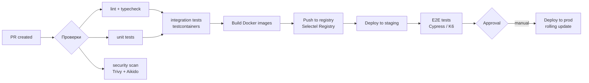

**Ключевые правила:**
- Ветка `main` всегда зелёная — все проверки обязательны
- Feature-флаги для включения/выключения фич без деплоя
- Rollback: `git revert` + деплой предыдущего Docker-образа
- Production deploy — только с manual approval
- Миграции БД — через `strong_migrations` (Rails) или `golang-migrate`, обратно-совместимые

### 5.3 Deployment & Release Strategy
**Источник:** Раздел 5.15 исходного документа.

**Цикл релиза:**
| Этап | Длительность | Подробности |
|---|---|---|
| **Feature development** | 1–2 недели | Feature branch → PR → code review → тесты |
| **Staging validation** | 1–2 дня | QA-тестирование на staging, авто-тесты |
| **Release candidate** | — | Создание тега `v{major}.{minor}.{patch}` |
| **Production deploy** | rolling update | Без downtime, по одному сервису |
| **Post-deploy monitoring** | 1 час | Наблюдение за ошибками (Sentry) + метриками (Grafana) |
| **Hotfix** | < 1 часа | Ветка от `main` → тесты → деплой |

**Feature flags:**
- Использовать `Flipper` (Rails) / `LaunchDarkly` для включения/выключения фич без деплоя
- Пример: `feature_b2b_orders` — включает B2B-интерфейс в админке
- Флаг живёт не дольше 2 спринтов → удаляется после стабилизации

**Rollback:**
1. `git revert <sha>` на `main`
2. CI билдит предыдущий образ
3. Rolling update сервиса
4. Проверка метрик (Grafana + Sentry)
5. Уведомление команды

**Деплой мобильных приложений:**
| Платформа | Staging | Production |
|---|---|---|
| **iOS** | TestFlight (внутреннее тестирование) | App Store Review (1–3 дня) |
| **Android** | Internal Testing Track (Google Play) | Production Track |
| **Huawei AppGallery** | — | Ручная выгрузка `.apk` |
| **RuStore** | — | Ручная выгрузка |

### 5.4 Monitoring & Alerting
**Источник:** Раздел 5.7.5 исходного документа.

- Prometheus + Grafana (метрики, дашборды)
- Loki + Promtail (логи)
- Jaeger (tracing, критичные сценарии)
- Sentry (error tracking, алерт на каждый новый error type)
- Uptime Kuma (healthcheck)

### 5.5 Performance & SLAs
**Источник:** Раздел 5.11 исходного документа.

| Метрика | Цель (SLO) | Измерение |
|---|---|---|
| **Время ответа API каталога** | p95 < 500ms | Prometheus + Grafana |
| **Время ответа API заказа** | p95 < 200ms | Prometheus |
| **Доступность (Uptime)** | 99.9% (исключая плановые окна) | Uptime Kuma / Grafana |
| **Количество заказов/день** | MVP: 100; V2: 1000; V3: 10000 | Business metrics |
| **Время сборки заказа** | < 30 мин (среднее) | Picker app → Backend |
| **Время доставки** | < 60 мин (город) | Courier app → Backend |
| **Допустимый downtime** | < 1 час / месяц | PagerDuty / Oncall |
| **RPS (каталог)** | MVP: 50; V2: 500; V3: 5000 | K6 + Prometheus |
| **RPS (оформление)** | MVP: 5; V2: 50; V3: 500 | K6 |

**Бюджет ошибок (Error Budget):** 99.9% uptime = 43 мин/месяц downtime. Если бюджет исчерпан — новые деплои блокируются до выяснения причины.

### 5.6 Incident Response

| Severity | Определение | Реакция | Время реакции |
|---|---|---|---|
| **P0 (Critical)** | Система не работает: платёжный шлюз недоступен, каталог не грузится, все заказы встали | Немедленный созвон команды. Rollback последнего деплоя. Информирование в Slack #incident | < 5 мин |
| **P1 (Major)** | Серьёзная деградация: медленный каталог, ошибки оплаты у 10%+ пользователей | Дежурный подключается. Фикс в течение часа. Hotfix через CI | < 15 мин |
| **P2 (Minor)** | Частичная деградация: не грузятся фото, медленный поиск | Фикс в рамках текущего или следующего спринта | < 4 ч |
| **P3 (Cosmetic)** | Косметические баги: кривой шрифт, опечатка | В бэклог, приоритет ниже фич | Следующий спринт |

**Инструменты:** Sentry (алерт на каждый новый error type), Uptime Kuma (healthcheck), Grafana (SLO violation alert)

### 5.7 Backup & Disaster Recovery

| Параметр | Значение |
|---|---|
| **RPO (потери данных)** | ≤ 1 час (PgBouncer + WAL streaming) |
| **RTO (восстановление)** | ≤ 4 часа (из бэкапа на новый сервер) |
| **Частота бэкапов** | Полный: ежедневно в 03:00. WAL: каждые 15 мин. Логи: ежедневно |
| **Хранение** | Полные: 30 дней. WAL: 7 дней. Снимки перед релизом: 90 дней |
| **Шифрование бэкапов** | AES-256 (GPG), ключи в GitHub Secrets |
| **Restore-тест** | Автоматический restore на staging каждую неделю (GitHub Actions) |
| **DR-план** | Selectel → резервный регион. DNS-переключение через Cloudflare. Восстановление: Terraform apply → restore DB → verify healthcheck |
| **Критические данные** | Таблицы заказов (`orders`, `payments`, `deliveries`), пользователи (`users`), конфигурация адаптеров (`chains`) |

### 5.8 FinOps (Оптимизация расходов на облако)

Подробнее — в [finops.md](finops.md).

### 5.9 Service Readiness Checklist

Перед запуском каждого нового сервиса в production:

- [ ] Healthcheck endpoint (`/health` + `/ready`)
- [ ] Prometheus metrics (`/metrics`)
- [ ] Sentry SDK (error tracking)
- [ ] Structured logging (JSON, correlation_id)
- [ ] Graceful shutdown (SIGTERM → drain connections → exit)
- [ ] Rate limiting (100 req/s per instance)
- [ ] Resource limits (CPU/memory requests + limits)
- [ ] Readiness/liveness probes (K8s) или healthcheck (Docker Compose)
- [ ] Backup: WAL archiving + PgBouncer
- [ ] Runbook: как деплоить, как откатывать, как диагностировать
- [ ] On-call: кто дежурный, куда слать алерт
- [ ] Тесты: unit + integration + contract
- [ ] API documentation (Swagger/OpenAPI для REST endpoints)

---

## 6. Security & Compliance (Безопасность)

### 6.1 Authentication & Authorization
**Источник:** Раздел 5.13.1 исходного документа.

| Роль | Доступ | Привилегии |
|---|---|---|
| **Клиент** | Web / Mobile | Каталог, корзина, заказы, личный кабинет, промокоды |
| **Пикер** | Picker App | Список заказов (только назначенные), сканер, замена товара, отметки сборки |
| **Курьер** | Courier App | Назначенные доставки, навигация, приём оплаты, фото, подпись |
| **Менеджер (Admin)** | Admin Panel | Заказы (все), товары, пользователи, курьеры, промокоды, аналитика |
| **Супер-админ** | Admin Panel (full) | Всё + управление ролями, доступ к логам, audit trail |
| **DevOps** | Инфраструктура | Доступ к серверам, CI/CD, мониторинг, БД (read-only) |

### 6.2 Data Protection
**Источник:** Раздел 5.13.2 исходного документа.

| Область | Политика |
|---|---|
| **Аутентификация** | JWT access (15 мин) + refresh (30 дней, rotation); возможность принудительного завершения всех сессий |
| **Rate limiting** | 100 req/min на пользователя; 1000 req/min на IP (Nginx `limit_req`) |
| **Шифрование** | TLS 1.3 для всех внешних соединений; шифрование ПДн в БД (AES-256); пароли — bcrypt |
| **Безопасность API** | CSRF-токены (Web); API-ключи для внешних интеграций; CORS — только домены приложения |
| **Аудит** | `audit_log` — кто, когда, что сделал с заказом/пользователем/товаром. Хранить 1 год |
| **Секреты** | `.env` Vault / GitHub Secrets (не в репозитории); ротация ключей каждые 90 дней |
| **Мониторинг безопасности** | Sentry (error tracking) + Aikido (SAST, dependency scan, secret leaks) на каждый PR |

### 6.3 Legal Requirements (Юридические требования)
**Источник:** Раздел 5.12 исходного документа.

| Требование | Закон | Что нужно реализовать |
|---|---|---|
| **Персональные данные** | 152-ФЗ «О персональных данных» | Согласие на обработку ПДн при регистрации; шифрование ПДн в БД (столбцы phone, email — AES-256); уведомление Роскомнадзора; возможность удалить данные по запросу |
| **Электронные чеки** | 54-ФЗ «О применении ККТ» | Фискальный чек на каждую операцию (продажа, возврат); отправка чека в ОФД; передача клиенту (SMS/Email/QR); ФФД 1.2 (текущий стандарт) |
| **Маркировка товаров** | «Честный знак» (ЦРПТ) | Табак (с 2020), обувь (2020), одежда (2021), молочная продукция (2023), вода (2023), пиво (2024); API «Честного знака» — вывод из оборота при продаже; сканер DataMatrix кодов в приложении пикера |
| **Алкоголь** | 171-ФЗ, ЕГАИС | **Платформа не доставляет алкоголь** — в спецификации достаточно указать, что алкогольные товары исключены. **Если решение изменится:** интеграция с ЕГАИС, лицензия, ограничение времени продажи |
| **Закон о защите прав потребителей** | ЗоЗПП | Возврат товара надлежащего качества в течение 7–14 дней; возврат товара ненадлежащего качества — полный возврат средств; информация о товаре (состав, вес, срок годности) |

**Практические рекомендации:**
- На старте (MVP) достаточно 54-ФЗ (чеки) и базового 152-ФЗ
- Маркировка «Честный знак» — только если в ассортименте есть табак/молочка/вода (на старте исключить)
- Алкоголь — не доставляем, снять галочку в админке сети

### 6.4 Accessibility (Доступность)

Базовые требования (MVP):

| Требование | Реализация |
|---|---|
| **Контрастность** | Минимум 4.5:1 для текста, 3:1 для крупного текста |
| **Навигация с клавиатуры** | Все интерактивные элементы доступны с Tab/Enter |
| **Скринридеры** | `alt` на всех изображениях товаров, ARIA-атрибуты на динамическом контенте |
| **Размер текста** | Увеличение до 200% без потери функциональности (rem-единицы) |
| **Цветовая слепота** | Статусы заказа: иконка + текст + цвет (не только цвет) |

**Проверка:** Axe DevTools (Web — каждый PR).

---

## 7. Testing Strategy (Стратегия тестирования)

**Источник:** Раздел 5.9 исходного документа.

### 7.1 Test Levels

| Уровень | Что тестируем | Инструменты | Цель |
|---|---|---|---|
| **Unit** | Use cases, business rules, DB queries | RSpec (Rails), `testify` (Go), `mockery` (mock generation) | Каждый use case изолированно, mock всех внешних зависимостей |
| **Integration** | Реальный сервис с реальными зависимостями | `testcontainers` (PostgreSQL, Redis, RabbitMQ в Docker) | Проверка, что сервис корректно работает с БД, брокером, кэшем |
| **Contract** | API между сервисами | Pact (CDC) или Spring Cloud Contract | Сервис A → Сервис B: контракт на формат запроса/ответа |
| **E2E** | Полный сценарий через все сервисы | Cypress (Web), K6 (API), Detox (Mobile) | Оформление заказа → оплата → сборка → доставка |
| **Load** | RPS, latency, memory under load | K6 (скачать скрипты: `search_only.js`, `trip_matching.js`, `stress_test.js`, `soak_test.js`) | Выдержит ли система 100 заказов/день? 1000? 10000? |
| **Security** | SAST, dependency scan, secrets | SonarCloud, Trivy, Aikido (каждом PR) | Утечки секретов, CVE в зависимостях |

### 7.2 Инфраструктура тестирования

| Компонент | Решение |
|---|---|
| **CI-пайплайн** | GitHub Actions: lint → unit → integration → E2E (параллельно) |
| **Testcontainers** | Docker-контейнеры для каждой интеграции: PostgreSQL, Redis, RabbitMQ, EventStoreDB |
| **Mock generation** | `mockery` для Go, `rspec-mocks` + `factory_bot` для Rails |
| **Тестовые данные** | `factory_bot` (Rails), `testdata` (Go), seeds для E2E |
| **Code coverage** | SimpleCov (Rails), `go test -cover` (Go), миморальный порог 80% |
| **Quality gate** | SonarCloud блокирует PR при падении coverage или новых когнитивных сложностях |

### 7.3 Critical E2E Scenarios

1. **Оформление заказа:** выбор магазина → каталог → корзина → слот → оплата онлайн → статус «Оплачен»
2. **Сборка:** заказ появляется у пикера → пикер отмечает товары → замена → упаковка → «Передан курьеру»
3. **Доставка:** назначение курьера → построение маршрута → статус «В пути» → ETA → «Доставлен»
4. **Отмена:** отмена до сборки → возврат средств; отмена после сборки → комиссия
5. **Промокод:** ввод → пересчёт суммы → применение → отмена применения
6. **Добавление в заказ после оформления:** новый товар → обновление корзины пикера → сборка

### 7.4 Load Testing Targets

| Сценарий | Целевые метрики |
|---|---|
| **100 одновременных пользователей просматривают каталог** | p95 < 500ms |
| **10 заказов/мин** | Order Service p95 < 200ms, 0 ошибок |
| **Dispatch: 1000 заказов за цикл (30 сек)** | Алгоритм укладывается в 5 секунд |
| **ETA estimator: 100 запросов/сек** | p95 < 300ms |

---

## 8. Project Estimation & Roadmap (Оценка и план)

### 8.1 Effort Estimation by BP

Полная таблица оценок вынесена в [ESTIMATION.md](ESTIMATION.md).

> **Итого:** ~350 человеко-дней (≈ 17–18 месяцев работы команды из 3–4 человек)
> С поправкой на риски (×1.2 интеграции ×1.3 новизна) = **546 чел.-дней** (~27 месяцев / 3 dev)

### 8.2 Store Integration Costs
**Источник:** Раздел 5.8 исходного документа.

| Компонент | Дней |
|---|---|
| Модель данных: сети, магазины, зоны, товары, цены | 5 |
| Интеграция с 1-й сетью (API/парсинг + нормализация) | 15 |
| Каждая следующая сеть (тиражирование) | 8 |
| Система синхронизации: шедулер, обновление цен/остатков | 10 |
| Каталог: категории, фильтры, поиск (Elasticsearch) | 10 |
| API каталога с учётом магазина пользователя | 8 |
| Админка: управление сетями, маппинг категорий | 8 |
| **Итого** | **64** |

### 8.3 MVP vs V2 vs V3 Roadmap

#### 8.3.1 MoSCoW-приоритизация внутри MVP

| Приоритет | Фичи | Оценка (чел.-дней) |
|---|---|---|
| **M — Must have** (без этого продукт не работает) | Регистрация по телефону (BP-01), Каталог с 1 сетью (BP-02), Корзина → Оформление → Оплата (Т-Банк) (BP-03 + BP-04), Приложение пикера (базовое: сканер, замена, упаковка) (BP-05), Приложение курьера (базовое: навигация, приём оплаты) (BP-06), Админка (базовое: заказы, товары, пользователи) (BP-11), Инфраструктура (Docker Compose + CI/CD MVP) | 210 |
| **S — Should have** (важно, но можно в V1.1) | Возврат и отмена (BP-07), Уведомления push/SMS (BP-09), Личный кабинет и история (BP-10), Промокоды (BP-08), Аналитика базовая (BP-12), S3/CDN для изображений | 70 |
| **C — Could have** (если успеваем) | Базовый поиск через PG ILIKE (не ES), Telegram-бот поддержки, Опция «Можно раньше», Трекинг для клиента (базовый: статусы) | 30 |
| **W — Won't have** (V2) | Dynamic Pricing, B2B, Elasticsearch, Мониторинг (Prometheus), Huawei/RuStore, B2B | 40 |
| **MVP total** | | **~310** |

#### 8.3.2 Дорожная карта по этапам

| Этап | Длительность | Ключевые фичи | Оценка |
|---|---|---|---|
| **MVP** | 6–8 мес | 1 сеть (Лента), регистрация, каталог, корзина, Т-Банк, пикер/курьер базовые, админка, Docker Compose | ~310 чел.-дней |
| **V1.x** | +2–3 мес | Доработки MVP: возвраты, уведомления, промокоды, аналитика | +70 |
| **V2** | +4–6 мес | 2–3 сети (METRO, Вкусвилл), СБП, Prometheus+Grafana, Sentry, Elasticsearch, B2B, Push, Huawei/RuStore | +120 |
| **V3** | +6–12 мес | K8s, Dynamic Pricing, OSRM+ML ETA, dispatch engine, Честный знак, лояльность, баллы | +150 |

---

## 9. Appendices (Приложения)

### 9.1 О документе: Discovery-фаза

Настоящий документ — результат **Discovery-фазы** (исследовательского этапа перед разработкой). Discovery проведён для всесторонней оценки идеи, снижения рисков и формирования единого видения продукта у всех стейкхолдеров.

| Аспект | Описание |
|---|---|
| **Цель** | Оценить коммерческий потенциал, сформировать общее видение, выявить риски, заложить основу для планирования |
| **Что сделано** | Анализ рынка и конкурентов, исследование ЦА (B2C + B2B), описание AS IS / TO BE, прототипирование архитектуры, сбор и приоритизация требований, выявление рисков |
| **Участники** | Хранитель идеи, аналитики (системные/бизнес), архитекторы, UX |
| **Результаты** | SRS-документ (настоящий), границы проекта, оценка сроков и бюджета (~350 чел.-дней), Roadmap (MVP/V2/V3), 14 описанных бизнес-процессов |
| **Риски, зафиксированные на Discovery** | Сложность интеграций с сетями (разные API, форматы данных), неточность онлайн-остатков, offline-сценарии пикеров/курьеров, юридические требования (152-ФЗ, 54-ФЗ) |

**Ключевой вывод Discovery:** продукт востребован (рынок доставки продуктов растёт), B2C — бизнес на объёме (низкая маржинальность), B2B — бизнес на сервисе (высокая маржинальность). Рекомендуемый старт: 1 сеть (Лента), Санкт-Петербург, MVP за 6–8 месяцев.

### 9.2 References & Open-Source

Полный каталог референсов вынесен в [references/README.md](references/README.md).

### 9.3 Completeness Checklist
**Источник:** Приложение B исходного документа.

*Разделы считаются готовыми после переноса содержимого из исходного документа.*

- ✅ 1.1 Purpose & Scope (включая AS IS, Geography, Personas)
- ✅ 1.2 Glossary
- ✅ 1.3 Non-Functional Requirements (включая Food Safety, i18n)
- ✅ 1.4 External Integrations
- ✅ 1.5 Error Handling
- ✅ 1.6 Business Model (включая Franchise)
- ✅ 2.1–2.9 Architecture (включая Event Catalog, Лента API, Façade)
- ✅ 3.1–3.6 Data Model
- ✅ 4.1–4.9 Functional Requirements (все 14 BP + Feature Map + Offline + Support)
- ✅ 5.1–5.9 Infrastructure (включая Incident, Backup, FinOps, Readiness Checklist)
- ✅ 6.1–6.4 Security & Compliance (включая Accessibility)
- ✅ 7.1–7.4 Testing
- ✅ 8.1–8.3 Estimation & Roadmap
- ✅ 9.1–9.5 Appendices

### 9.4 Developer Quick-Start

| Параметр | Значение |
|---|---|
| **Репозиторий** | Монорепозиторий: `/services/` (backend), `/apps/` (frontend, mobile), `/infra/` (Docker, CI) |
| **Backend** | Rails 5.1+, Ruby 2.6–2.7, Sidekiq ~6.x |
| **Frontend** | Next.js 10, React 17, MobX ~6.x |
| **Mobile** | Flutter 3.x (iOS + Android) |
| **База данных** | PostgreSQL 13+
| **Очереди** | RabbitMQ |
| **Кэш** | Redis 6+ |
| **Поиск** | Elasticsearch 7.x (V2) |
| **Инфраструктура** | Docker Compose (dev), Selectel (prod) |
| **CI/CD** | GitHub Actions: lint → unit → integration → E2E |
| **Мониторинг** | Sentry (ошибки), Prometheus + Grafana (V2) |

**Локальный запуск:**
```bash
docker compose up          # поднять все сервисы
docker compose up -d pg redis rabbitmq  # только инфраструктура
rails s                    # backend (dev)
npm run dev                # frontend (dev)
```

**Первый PR:**
1. Создать feature branch от `main`
2. `git commit -m "feat: ..."` (линтер проверит)
3. Открыть Pull Request → CI запустит lint + unit + integration
4. После approval — squash merge в `main`
5. Авто-деплой на staging; прод — вручную через GitHub Actions


### 9.5 Текущее состояние системы (AS IS)

Полное описание AS IS вынесено в [AUDIT_AS_IS.md](AUDIT_AS_IS.md). Включает: схему БД, API-запросы, ключевые алгоритмы, инфраструктуру и состав команды.
