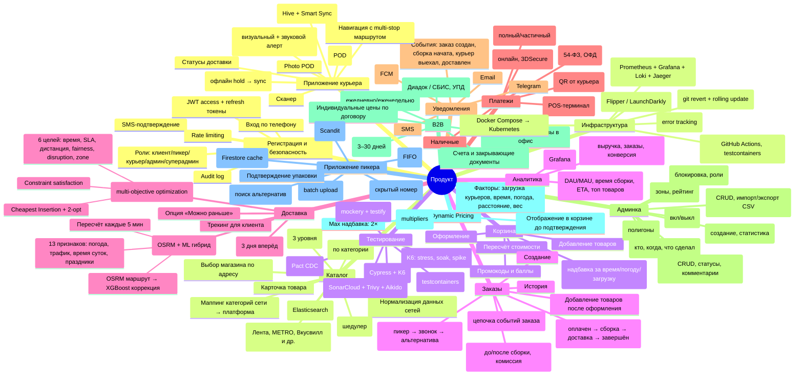

# Feature Map (Карта функциональных требований)

**Источник:** §4.7 SRS.md

Карта всех функций продукта на основе описанных процессов:

**Текстовый список функций (для печати):**

- **Регистрация и безопасность**
  - Вход по телефону
  - SMS-подтверждение
  - Роли: клиент/пикер/курьер/админ/суперадмин
  - JWT access + refresh токены
  - Rate limiting
  - Audit log
- **Каталог**
  - Выбор магазина по адресу
  - Категории (3 уровня)
  - Поиск (Elasticsearch)
  - Динамические фильтры (по категории)
  - Карточка товара
  - Нормализация данных сетей
  - Маппинг категорий сети → платформа
  - Адаптеры сетей (Лента, METRO, Вкусвилл и др.)
  - Синхронизация цен/остатков (шедулер)
- **Корзина**
  - Добавление товаров
  - Промокоды и баллы
  - Dynamic Pricing (надбавка за время/погоду/загрузку)
  - Пересчёт стоимости
  - Оформление
- **Заказы**
  - Создание
  - Статусы (оплачен → сборка → доставка → завершён)
  - Добавление товаров после оформления
  - История
  - Замена товара (пикер → звонок → альтернатива)
  - Возврат и отмена (до/после сборки, комиссия)
  - Event Sourcing (цепочка событий заказа)
- **Доставка**
  - Временные слоты (3 дня вперёд)
  - Dispatch (multi-objective optimization)
    - Cheapest Insertion + 2-opt
    - 6 целей: время, SLA, дистанция, fairness, disruption, zone
    - Constraint satisfaction
  - ETA (OSRM + ML гибрид)
    - OSRM маршрут → XGBoost коррекция
    - 13 признаков: погода, трафик, время суток, праздники
    - Пересчёт каждые 5 мин
  - Трекинг для клиента
  - Опция «Можно раньше»
- **Платежи**
  - Т-Банк (онлайн, 3DSecure)
  - СБП (QR от курьера)
  - Карта курьеру (POS-терминал)
  - Наличные
  - Refund (полный/частичный)
  - Чек (54-ФЗ, ОФД)
- **Уведомления**
  - Push (FCM)
  - SMS
  - Email
  - Telegram
  - События: заказ создан, сборка начата, курьер выехал, доставлен
- **Админка**
  - Управление заказами (CRUD, статусы, комментарии)
  - Управление товарами (CRUD, импорт/экспорт CSV)
  - Пользователи (блокировка, роли)
  - Промокоды (создание, статистика)
  - Курьеры и пикеры (зоны, рейтинг)
  - Магазины и зоны доставки (полигоны)
  - Управление сетями-адаптерами (вкл/выкл)
  - Audit log (кто, когда, что сделал)
- **B2B**
  - Корпоративные заказы в офис
  - Регулярные поставки (ежедневно/еженедельно)
  - Индивидуальные цены по договору
  - Отсрочка платежа (3–30 дней)
  - ЭДО (Диадок / СБИС, УПД)
  - Счета и закрывающие документы
- **Dynamic Pricing**
  - Факторы: загрузка курьеров, время, погода, расстояние, вес
  - Формула: base_fee × product(multipliers)
  - Max надбавка: 2×
  - Отображение в корзине до подтверждения
- **Приложение пикера**
  - Список заказов (FIFO)
  - Сканер штрихкодов (Scandit)
  - Замены товаров (поиск альтернатив)
  - Звонок клиенту (скрытый номер)
  - Offline-режим (Firestore cache)
  - Smart Sync Queue (batch upload)
  - Подтверждение упаковки
- **Приложение курьера**
  - Навигация с multi-stop маршрутом
  - Offline-режим (Hive + Smart Sync)
  - Off-route detection (визуальный + звуковой алерт)
  - Приём оплаты (офлайн hold → sync)
  - Digital Signature (POD)
  - Photo POD
  - Сканер
  - Статусы доставки
- **Инфраструктура**
  - CI/CD (GitHub Actions, testcontainers)
  - Docker Compose → Kubernetes
  - Мониторинг (Prometheus + Grafana + Loki + Jaeger)
  - Sentry (error tracking)
  - Feature flags (Flipper / LaunchDarkly)
  - Rollback (git revert + rolling update)
- **Тестирование**
  - Unit (mockery + testify)
  - Integration (testcontainers)
  - Contract (Pact CDC)
  - E2E (Cypress + K6)
  - Load (K6: stress, soak, spike)
  - Security (SonarCloud + Trivy + Aikido)
- **Аналитика**
  - Дашборды (Grafana)
  - Отчёты (выручка, заказы, конверсия)
  - Метрики (DAU/MAU, время сборки, ETA, топ товаров)
