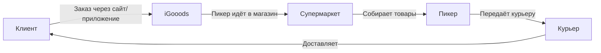

# Анализ сервиса iGooods

**Дата:** 2026-06-17
**Цель:** Собрать всё, что известно об iGooods, для создания продукта-аналога

---

## 1. О компании

| Параметр | Значение | Источник |
|---|---|---|
| **Основан** | 2015 | igooods.ru |
| **Модель** | Доставка продуктов ИЗ супермаркетов (не свой склад) | igooods.ru |
| **Города** | СПб, Москва, Владимир, Калуга, Ростов-на-Дону, Рязань, Тверь, Ярославль | igooods.ru |
| **Разработчик** | H&H (handh) — package name `ru.handh.igooods` | Google Play |
| **Франшиза** | Есть (franchise.igooods.ru) | igooods.ru |
| **B2B** | Доставка в офисы (корпоративная) | igooods.ru/business |
| **Сайт** | https://igooods.ru | |

---

## 2. Бизнес-модель (как это работает)



**Ключевые особенности:**
- Не владеют товаром — работают как агрегатор доставки из существующих магазинов
- Пикер собирает заказ прямо в торговом зале
- При отсутствии товара — пикер звонит клиенту, предлагает замену
- Доставка в день заказа
- Можно заказать на 3 дня вперёд
- Максимальный вес заказа: 80 кг

---

## 3. Технологический стек (восстановленный)

### 3.1 Бэкенд

| Компонент | Технология | Подтверждение |
|---|---|---|
| **Язык/Фреймворк** | Ruby on Rails ~5.1 | `tilvin/hotels` (test task), `ruby-style-guide` форк |
| **База данных** | PostgreSQL (предположительно) | SQLite3 в dev, PostgreSQL типичен для Rails в prod |
| **Аутентификация** | Sorcery | Gemfile: `gem 'sorcery'` |
| **Авторизация** | access-granted | Gemfile: `gem 'access-granted'` |
| **Шаблоны** | Haml | Gemfile: `gem 'haml-rails'` |
| **Загрузка файлов** | Carrierwave + MiniMagick | Gemfile |
| **Фронтенд (старый)** | jQuery + Bootstrap + CoffeeScript + Turbolinks | Gemfile |
| **Тестирование** | RSpec + FactoryGirl + Capybara | Gemfile |

### 3.2 Фронтенд

| Компонент | Технология | Подтверждение |
|---|---|---|
| **Фреймворк** | Next.js 10.0.3 | `ChebotarevKonstantin/igooods` — `package.json` |
| **UI-библиотека** | React 17.0.1 | package.json |
| **State management** | MobX | `igooods/test-task-1` — требование к тестовому |
| **Сборка** | Webpack + Babel 7 | test-task-1 |
| **Стили** | PostCSS + CSS modules | test-task-1 |

### 3.3 Мобильные приложения

| Платформа | Технология | App Store ID / Пакет |
|---|---|---|
| **Android** | Java (исторически) | `ru.handh.igooods` |
| **iOS** | Неизвестно (Swift/Kotlin Multiplatform?) | App Store: id1176196585 |
| **AppGallery (Huawei)** | Портировано | C107188291 |
| **RuStore** | Портировано | `ru.handh.igooods` |

### 3.4 Инфраструктура

| Компонент | Технология |
|---|---|
| **CDN/Хостинг изображений** | Selectel (selcdn.net) |
| **Аналитика** | Яндекс.Метрика, Mail.Ru Top |
| **Платёжный шлюз** | Т-Банк (Тинькофф) |
| **Поддержка** | Telegram bot (@igooodssupportbot) |

---

## 4. Бизнес-процессы (полный перечень)

### 4.1 Клиентские процессы
1. **Регистрация** — по номеру телефона, SMS-код
2. **Выбор магазина** — по геолокации пользователя
3. **Каталог** — категории + фильтры (бренд, тип, жирность, цена)
4. **Корзина** — добавление, удаление, промокоды, баллы
5. **Оформление заказа** — адрес, время слота, способ оплаты
6. **Оплата** — онлайн (Т-Банк), СБП (QR), карта/нал курьеру
7. **Трекинг** — отслеживание статуса: сборка → доставка
8. **Добавление в заказ** — можно пока не начали собирать
9. **История заказов** — в личном кабинете
10. **Возврат** — через поддержку (Telegram/телефон)

### 4.2 Внутренние процессы
11. **Сборка заказа (пикер)** — поиск товаров в магазине, замена при отсутствии
12. **Упаковка** — термосумки, товарное соседство, опция «меньше пакетов»
13. **Назначение курьера** — маршрутизация
14. **Доставка** — от склада/магазина до клиента
15. **Списание оплаты** — после проверки заказа клиентом

### 4.3 Административные процессы
16. **Управление магазинами/сетями** — подключение новых сетей
17. **Управление зонами доставки** — гео-зон
18. **Управление пикерами и курьерами**
19. **Аналитика** — заказы, выручка, конверсия
20. **Франшиза** — управление партнёрами
21. **B2B** — корпоративные заказы

### 4.4 Процессы поддержки
22. **Чат поддержки** — Telegram bot
23. **Звонки** — +7(812)985-55-06
24. **Возвраты и претензии**

---

## 5. Модель данных (восстановленная)

### 5.1 Каталог (из DATA.js)
```
Category
├── id: number
├── name: string
├── icon_path: string
├── price: { from: number, to: number }
├── child_categories: Category[]
└── filters: Filter[]

Filter
├── id: number
├── name: string
└── values: FilterValue[]

FilterValue
├── id: number
└── name: string
```

### 5.2 Предполагаемые сущности (не подтверждено)

```
User
├── id, phone, name, email, password_hash
├── role (client/curier/picker/admin/manager)
└── created_at

Order
├── id, user_id, store_id, status
├── total, delivery_fee, service_fee
├── delivery_address (geojson)
├── delivery_time_slot
├── payment_method
├── weight
├── comment
├── created_at, updated_at

OrderItem
├── id, order_id, product_id
├── quantity, price
└── substituted (если заменили товар)

Store (магазин)
├── id, name, chain_id
├── address, coordinates
├── working_hours
└── delivery_zones[]

DeliveryZone
├── id, store_id
├── polygon (geojson)
├── delivery_fee
└── min_order_amount

Picker (сборщик)
├── id, user_id, store_id
└── status (free/busy)

Courier
├── id, user_id, zone_id
├── vehicle_type
├── current_location (point)
└── status (free/busy/delivering)

Payment
├── id, order_id, amount, status
├── provider (tinkoff/sbp/cash)
├── provider_payment_id
└── created_at

PromoCode
├── id, code, type (percent/fixed)
├── value, max_uses, used_count
└── expires_at

LoyaltyPoints
├── id, user_id, balance
└── transactions[]
```

---

## 6. Интеграции (известные и предполагаемые)

| Система | Назначение | Тип |
|---|---|---|
| **Т-Банк (Тинькофф)** | Платёжный шлюз | REST API |
| **СБП** | Оплата по QR-коду | API |
| **Супермаркеты** | Получение ассортимента и цен | API / Парсинг |
| **Selectel CDN** | Хостинг изображений товаров | CDN |
| **Яндекс.Метрика** | Веб-аналитика | JS |
| **Telegram** | Поддержка клиентов | Bot API |
| **СМС-провайдер** | Отправка кодов подтверждения | API |
| **Email-провайдер** | Электронные чеки | SMTP/API |
| **Карты (Яндекс/Google)** | Геокодирование, отображение | API |

---

## 7. Белые пятна (чего мы НЕ знаем)

| Область | Что нужно узнать | Как узнать |
|---|---|---|
| **Схема БД** | Таблицы, связи, индексы | Доступ к текущей БД |
| **API** | Эндпоинты, форматы запросов/ответов | Сетевые запросы из приложения/сайта |
| **Алгоритм назначения курьера** | Как распределяются заказы | Бизнес-логика (нужен доступ к коду) |
| **Интеграция с сетями** | Как получают цены и остатки | API супермаркетов / парсинг |
| **Ценообразование** | Маржа, комиссия, тарифы доставки | Бизнес-документация |
| **Приложение пикера** | Функции, экраны | Google Play / App Store |
| **iOS приложение** | Стек (Swift/SwiftUI/Flutter) | App Store или вакансии |
| **Нагрузка** | RPS, заказов/день, кол-во юзеров | Метрики (Grafana/Datadog) |
| **Команда** | Сколько разработчиков, роли | Вакансии, LinkedIn |
| **История архитектуры** | Были ли переезды, рефакторинги | Статьи на Habr/VC |

---

## 8. Выводы для проекта-аналога

### Что можно скопировать
- **Бизнес-модель:** доставка из супермаркетов (не нужен свой склад)
- **Структура каталога:** категории → фильтры → бренды
- **Процесс:** заказ → сборка пикером → доставка курьером
- **Платежи:** онлайн + СБП + наличные
- **Статусы заказа:** отслеживание в реальном времени

### Что нужно спроектировать с нуля
- **Алгоритм маршрутизации** курьеров (главная сложность логистики)
- **Интеграция с конкретными сетями** (каждая сеть = отдельная интеграция)
- **Зоны доставки** (гео-партиционирование)

### Ключевые риски
1. **Интеграция с супермаркетами** — нет единого стандарта API
2. **Актуальность остатков** — магазины не дают онлайн-доступ к остаткам
3. **Логистика last-mile** — назначение курьеров, ETA, оптимизация маршрутов
4. **Замены товаров** — пикер должен уметь заменять отсутствующие позиции
5. **Холодовая цепь** — термосумки, товарное соседство
