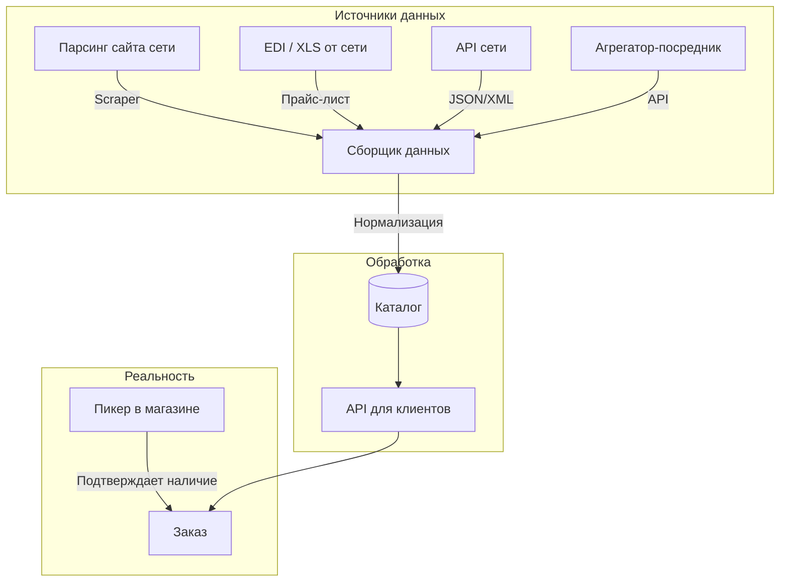

# API супермаркетов: исследование интеграций

**Дата:** 2026-06-17
**Цель:** Понять, как iGooods и другие агрегаторы получают данные о товарах, ценах и остатках от сетей

---

## 1. Сводная таблица

| Сеть | Оф. API для партнёров | Продуктовый фид | EDI | Как агрегатор получает данные |
|---|---|---|---|---|
| **Лента** | ❌ (есть внутр. API lenta.com) | ❌ | Да | Парсинг сайта / EDI / коммерческое соглашение |
| **METRO** | ✅ (только METRO Markets B2B) | ❌ | Да (EDI Culture Center) | EDI + прямое соглашение |
| **Super Babylon** | ❌ | ❌ | Нет | Сборка в магазине (пикер iGooods) |
| **Утконос МИНИ** | ❌ | ❌ | Да (Ediweb) | Через СберМаркет или парсинг |
| **Вкусвилл** | ✅ (MCP API — экспериментальный) | ❌ | Нет | **MCP JSON-RPC API** |

---

## 2. Детали по каждой сети

### 2.1 Лента

**Сайт:** lenta.com
**Фронтенд:** Angular (lazy-loaded chunks), PHP-бэкенд
**Защита:** Qrator (JavaScript challenge) — curl и скрипты блокируются. Требуется headless-браузер (Playwright/Puppeteer) для прохождения.

**Официального API нет.** Есть **два внутренних API**:

#### 2.1.1 Старый API: `/api/rest/*` (PHP RPC-style)

Формат запроса (JSON RPC-style, MarketingPartnerKey из cookies `App_Cache_MPK`):

```json
{
  "request": {
    "Head": {
      "MarketingPartnerKey": "mp300-{uuid}",
      "Version": "web-12.0.633",
      "Client": "angular_web_0.0.2",
      "Method": "sessionGet",
      "SessionToken": "",
      "RequestId": "sessionGet_{random}",
      "DeviceId": "{uuid}",
      "Domain": "spb"
    },
    "Body": {}
  }
}
```

Формат ответа:

```json
{
  "Head": {
    "RequestId": "...",
    "Created": "2026-06-17 02:47:14",
    "Method": "sessionGet",
    "Status": "success",
    "SessionToken": "{token}",
    "ServerName": "php"
  },
  "Body": { ... }
}
```

**Эндпоинты:**

| Метод | Endpoint | Описание | Статус |
|---|---|---|---|
| POST | `/api/rest/sessionGet` | Получение/обновление сессии | ✅ Работает |
| POST | `/api/rest/cartLookup` | Просмотр корзины | ✅ Работает |
| POST | `/api/rest/catalogGetCategories` | Категории каталога | ❌ требует сессии |
| POST | `/api/rest/catalogGetProducts` | Товары | ❌ требует сессии |
| POST | `/api/rest/catalogSearch` | Поиск товаров | ❌ требует сессии |
| POST | `/api/rest/productGet` | Товар по ID | ❌ требует сессии |
| POST | `/api/rest/productGetBySku` | Товар по SKU | ❌ требует сессии |
| POST | `/api/rest/deliveryGet` | Информация о доставке | ❌ требует сессии |
| POST | `/api/rest/deliveryGetStores` | Магазины доставки | ❌ требует сессии |
| POST | `/api/rest/deliveryGetIntervals` | Интервалы доставки | ❌ требует сессии |
| POST | `/api/rest/deliveryGetAddresses` | Адреса доставки | ❌ требует сессии |
| POST | `/api/rest/orderGet` | Заказы пользователя | ❌ требует сессии |
| POST | `/api/rest/orderCreate` | Создание заказа | ❌ требует сессии |
| POST | `/api/rest/orderCheckout` | Оформление заказа | ❌ требует сессии |
| POST | `/api/rest/userGet` | Профиль пользователя | ❌ требует сессии |
| POST | `/api/rest/favoritesGet` | Избранное | ❌ требует сессии |
| POST | `/api/rest/promotionsGet` | Акции | ❌ требует сессии |
| POST | `/api/rest/promotionGetById` | Акция по ID | ❌ требует сессии |

**Ошибка без сессии:** `Utk\Utkapi_Exception_MarketingPartner_InvalidKey` (код 16)

#### 2.1.2 Новый API Gateway: `/api-gateway/v1/*` (RESTful JSON)

Работает **без** MarketingPartnerKey — использует cookies/JWT токены.

| Метод | Endpoint | Описание |
|---|---|---|
| GET | `/api-gateway/v1/frontend/features` | Фича-флаги (GrowthBook) |
| GET | `/api-gateway/v1/region/list` | Список регионов |
| GET | `/api-gateway/v1/region/user` | Регион текущего пользователя |
| POST | `/api-gateway/v1/auth/passport/token/guest` | Получение гостевого токена (JWT) |
| POST | `/api-gateway/v1/stores/pickup/search` | Поиск магазинов для самовывоза |
| GET | `/api-gateway/v1/stores/pickup/recent` | Недавние магазины |
| GET | `/api-gateway/v1/delivery/mode` | Режим доставки |
| POST | `/api-gateway/v1/catalog/items/recommendations` | Рекомендации товаров |
| GET | `/api-gateway/v1/catalog/items/{id}` | Товар по ID |
| POST | `/api-gateway/v1/catalog/items/collections` | Товары коллекции |
| GET | `/api-gateway/v1/pages/types/{typeId}/widgets` | Виджеты по типу страницы |
| POST | `/api-gateway/v1/pages/places/widgets` | Виджеты по местам |
| GET | `/api-gateway/v1/pages/widgets/{id}` | Виджет по ID |
| GET | `/api-gateway/v1/banners/adhweb` | Баннеры |
| GET | `/api-gateway/v1/sem/redirect` | Редиректы |
| POST | `/api-gateway/v1/sem/usepattern` | Семантический эндпоинт |

**Аутентификация:**
1. `POST /api-gateway/v1/auth/passport/token/guest` → `{"expiresIn": 3600, "sessionId": "..."}`
2. JWT в куках: `PassportAccessToken` (Bearer), `PassportRefreshToken`

**Рекомендации:** `POST /api-gateway/v1/catalog/items/recommendations`
```json
{
  "id": 12345,
  "recommendType": "1",   // или "2"
  "offset": 0,
  "limit": 50
}
```

**Товары коллекции:** `POST /api-gateway/v1/catalog/items/collections`
```json
{ "collectionId": 310004503 }
```
Ответ содержит `items`, `filters` (с брендами, рейтингом и т.д.), `collections`.

**Поиск товаров по категории — SSR + коллекции.** Каталог рендерится на сервере (Angular Universal), товары доставляются в HTML. Для API-доступа к товарам категории:

1. Получить `collectionId` через виджеты страницы:
   - `GET /api-gateway/v1/pages/types/{typeId}/widgets` — виджеты по типу страницы
   - Или `POST /api-gateway/v1/pages/places/widgets` с `{"placeIds": [...], "categoryId": "153"}`
2. Загрузить товары по коллекции:
   - `POST /api-gateway/v1/catalog/items/collections` с `{"collectionId": 310004503}`
3. **Product ID из SSR:** В HTML товары имеют ID вида `product-{id}` (напр. `product-94429`).
4. **URL товара:** `https://lenta.com/product/{slug}-{id}/`

Альтернативы для получения списка товаров:
- **SSR-парсинг:** загрузить `https://lenta.com/catalog/{slug}-{id}/` и распарсить HTML
- **Старый PHP API:** `POST /api/rest/catalogGetProducts` — существует, но класс не найден (возможно, удалён или переименован)

Фронтенд Angular загружает товары каталога через комбинацию:
1. `POST /api-gateway/v1/pages/places/widgets` — получение виджетов для страницы (содержат `collectionId`)
2. `POST /api-gateway/v1/catalog/items/collections` — загрузка товаров коллекции
3. `POST /api-gateway/v1/catalog/items/recommendations` — рекомендации

Вероятные недокументированные эндпоинты (требуют исследования через Network вкладку браузера):
- `GET /api-gateway/v1/catalog/items/list?categoryId={id}&offset=0&limit=24` (400 — неверные параметры)
- `GET /api-gateway/v1/catalog/categories` (400 — нужен параметр)
- `POST /api-gateway/v1/catalog/items/search` (405 — неверный метод)

**Формат товара (из SSR HTML):**
```html
<lu-product-card card-size="XL" card-hover="false">
  <a href="https://lenta.com/product/limony-ves-094429/" class="product-card small-vertical">
    <!-- картинка, название, цена, вес/объём -->
  </a>
</lu-product-card>
```

**Пример данных из HTML:**
- **ID товара:** `94429` (из `product-94429`)
- **Название:** `Лимоны, весовые`
- **URL:** `/product/limony-ves-094429/`
- **Цена:** найдена через паттерн `[0-9]+\.[0-9]{2}[\s]*[₽р]`
- **Картинка:** `https://sitecdn.api.lenta.com/assets-ng/ui-kit/empty-image.svg` (placeholder, реальная через lazy load)
- **Компонент:** `<lu-product-card>` + `<lu-product-card-image>`

**SSR:** Angular 21.1.1 с Universal (SSR). Страница категории рендерится полностью на сервере — 40+ товаров в HTML. Клиентская гидратация добавляет lazy-загрузку картинок и интерактив.

**CDN для ассетов:** `https://sitecdn.api.lenta.com/`
**CDN для изображений:** `https://cdn.api.lenta.com/resample/webp/{size}/photo/...`

#### 2.1.3 URL-структура фронтенда

| URL | Описание |
|---|---|
| `/` | Главная |
| `/catalog/{slug}-{id}/` | Категория каталога (напр. `/catalog/frukty-153/`) |
| `/product/{slug}-{id}/` | Карточка товара (напр. `/product/moloko-pitevoe-3-2-720ml-12345/`) |
| `/search?query={text}` | Поиск |
| `/action/detail/{id}` | Акция/спецпредложение |

#### 2.1.4 Технологии

- **Бэкенд:** PHP (выяснено из ServerName в API-ответах)
- **Фронтенд:** Angular 17+ (SSR — Angular Universal, lazy modules, `ngsw-bootstrap.js` — Service Worker)
- **Feature flags:** GrowthBook (CDN: `growthbook-cdn.api.lenta.com`)
- **Защита:** Qrator Labs (DDoS protection, JS challenge)
- **Версия:** `web-12.0.633`
- **Клиент:** `angular_web_0.0.2`
- **Доп. интеграции:** Max (st.max.ru), Яндекс Passport (аутентификация), Яндекс Rotor (антибот)
- **Мульти-брендовая платформа:** runtime-скрипт содержит API-домены нескольких сетей:
  - `api.lenta.com` — Лента
  - `api.domlenta.ru` — ДомЛента
  - `api.utkonos.ru` — Утконос
  - `api.monetka.ru` — Монетка
  - Это может означать единую платформу для нескольких брендов

**Внутренняя конфигурация:**
- `window.APP_CONFIG = {"APP_API_URL": "http://lenta-site-api"}` — внутренний URL API (Kubernetes service)

#### 2.1.5 Данные магазинов (регионы)

Регионы Ленты (из `/api-gateway/v1/region/list`):
- Москва и МО (id: 1, slug: moscow)
- Санкт-Петербург и область (id: 3, slug: spb)
- Уфа (id: 5, slug: ufa)
- Нижний Новгород (id: 7, slug: nnov)
- Екатеринбург (id: 9, slug: ekb)
- Казань (id: 11, slug: kzn)
- Красноярск (id: 13, slug: krsk)
- Краснодар (id: 15, slug: krd)

**Партнёрская программа:** [lenta.tech](https://lenta.tech/products) — B2B-продукты (аналитика, RPA, EDI Hub), **не API каталога**.

### 2.2 METRO Cash & Carry

**Developer Portal:** [developer.metro-selleroffice.com](https://developer.metro-selleroffice.com/) — OpenAPI для B2B-маркетплейса (не для продуктового каталога).

**EDI:** METRO Russia использует EDI через [EDI Culture Center](http://edicult.ru/metro.html). Документы: ORDERS, DESADV, RECADV, INVOIC.

**Портал поставщика:** [supplier-support.metro-cc.ru](https://supplier-support.metro-cc.ru/)

**Вывод:** API есть, но только для B2B-маркетплейса и для поставщиков (EDI), не для агрегаторов доставки.

### 2.3 Super Babylon

**Сайт:** superbabylon.ru

**Ключевое открытие:** на сайте написано **«Доставка работает через igooods»**. То есть Super Babylon сам не занимается доставкой — iGooods является их эксклюзивным партнёром по доставке.

**Интеграция:** НЕ через API. Пикеры iGooods физически приходят в магазины Super Babylon и собирают заказы с полок.

### 2.4 Утконос МИНИ

**Сайт:** utkonos.ru

**EDI:** работает через [Ediweb](http://ediweb.com/ru-ru/support/kb/1207) (документы: ORDERS, ORDRSP, DESADV, RECADV).

**Особенность:** Утконос МИНИ — суббренд Утконос Онлайн. Товары на этой витрине — фактически ассортимент **Ленты**, доступный через платформу **СберМаркет**.

**Вывод:** данные Утконос МИНИ = данные Ленты + платформа СберМаркета.

### 2.5 Вкусвилл

**Сайт:** vkusvill.ru

**API: ЕСТЬ!** Экспериментальный MCP-сервер (Model Context Protocol).

| Endpoint | Описание |
|---|---|
| `vkusvill_products_search(q, page, sort)` | Поиск товаров по названию |
| `vkusvill_product_details(id)` | Детали товара: состав, КБЖУ, ингредиенты |
| `vkusvill_cart_link_create(products[])` | Генерация ссылки на корзину |

**Статья на Habr:** https://habr.com/ru/companies/vkusvill/articles/981866/ (декабрь 2025)

**Ограничения:** экспериментальный, нет остатков по адресу, макс. 20 позиций в корзине.

**Open-source инструменты:**
- [Elzehorn/vv_mcp](https://github.com/Elzehorn/vv_mcp) — MCP клиент/сервер
- [vakovalskii/vkusvill-agent](https://github.com/vakovalskii/vkusvill-agent) — AI-агент
- [2heoh/vkusvill-mcp-server-example](https://github.com/2heoh/vkusvill-mcp-server-example) — пример реализации

---

## 3. Как агрегаторы получают данные (общая схема)



**Вывод:** ни одна из сетей не даёт гарантированно точных остатков в реальном времени. Фактическое наличие **всегда подтверждает пикер** в магазине.

---

## 4. Open-source инструменты для работы с API российских сетей

| Инструмент | Сеть | Язык | Описание |
|---|---|---|---|
| [Open-Inflation/perekrestok_api](https://github.com/Open-Inflation/perekrestok_api) | Перекрёсток | Python | Неофициальный API (MIT) |
| [Viroopadas/pyaterochka_api](https://github.com/Viroopadas/pyaterochka_api) | Пятёрочка | Python | Неофициальный API |
| [Elzehorn/vv_mcp](https://github.com/Elzehorn/vv_mcp) | Вкусвилл | Python | MCP клиент |
| Parse.bot | Мульти-сеть | — | Коммерческий API-агрегатор |

---

## 4. Cookbook: как исследовать API сети

1. **Если сайт защищён Qrator/Cloudflare** — curl не сработает. Используй Playwright с headless-браузером и куками из реальной сессии.
2. **Перехватывай API-вызовы** через `page.on('request')` и `page.on('response')`.
3. **Загружай страницу дважды:** сначала главную (загрузка сессии), потом целевую (каталог/товар).
4. **Ищи inline-данные:** `__NEXT_DATA__` (Next.js), `ng-state` (Angular SSR), `window.__INITIAL_STATE__`.
5. **Анализируй JS-бандлы:** ищи URL-паттерны через regex в главном чанке и source maps.
6. **Проверяй консольные логеры:** некоторые Angular-приложения логируют API-вызовы в debug-режиме.

## 5. Выводы для проекта

1. **Единого API нет** — каждая сеть интеграция по-своему
2. **Парсинг** — основной способ получения данных для большинства сетей
3. **Вкусвилл** — единственная сеть с открытым API (MCP), можно считать эталоном
4. **Точных остатков** не даёт никто — пикеры проверяют вживую
5. **Super Babylon** — не просто магазин, а уже партнёр iGooods (доставка = iGooods)
6. **Коммерческое соглашение** с сетью даёт больше, чем публичный API (EDI, XLS-выгрузки)
7. **Лента** имеет два API: старый PHP RPC (`/api/rest/`) и новый REST Gateway (`/api-gateway/v1/`). Оба недокументированы. Для доступа требуется headless-браузер (Qrator).
8. **API Gateway Ленты** — RESTful, без MarketingPartnerKey, через JWT/куки. Перспективен для интеграции.
9. **Angular-фронтенд Ленты** — SSR (Angular Universal), lazy-loaded модули, Service Worker, feature flags через GrowthBook.
10. **Мульти-брендовая платформа:** фронтенд Ленты обслуживает также ДомЛента, Утконос, Монетку через единую кодовую базу.
11. **Продуктовый эндпоинт не найден** — товары по категории загружаются через виджеты (`pages/places/widgets`) и коллекции (`catalog/items/collections`). Для точного эндпоинта нужно открыть каталог в браузере и перехватить запросы из Network-вкладки.
