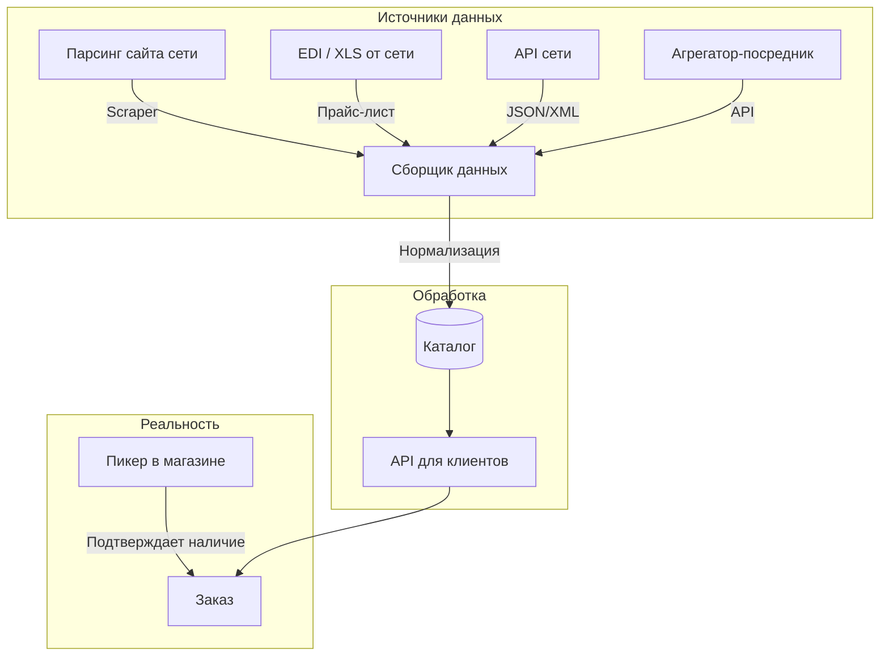

# API супермаркетов: исследование интеграций

**Дата:** 2026-06-17
**Цель:** Понять, как iGooods и другие агрегаторы получают данные о товарах, ценах и остатках от сетей

---

## 1. Сводная таблица

| Сеть | Оф. API для партнёров | Продуктовый фид | EDI | Как агрегатор получает данные |
|---|---|---|---|---|
| **Лента** | ❌ (есть внутр. API lenta.com) | ❌ | Да | Парсинг сайта / EDI / коммерческое соглашение |
| **METRO** | ✅ (только METRO Markets B2B) | ❌ | Да (EDI Culture Center) | EDI + прямое соглашение |
| **Super Babylon** | ❌ | ❌ | Нет | Сборка в магазине (пикер iGooods) |
| **Утконос МИНИ** | ❌ | ❌ | Да (Ediweb) | Через СберМаркет или парсинг |
| **Вкусвилл** | ✅ (MCP API — экспериментальный) | ❌ | Нет | **MCP JSON-RPC API** |

---

## 2. Детали по каждой сети

### 2.1 Лента

**Сайт:** lenta.com
**Официального API нет.** Есть внутренние недокументированные эндпоинты:

| Endpoint | Описание |
|---|---|
| `GET /api/v1/stores/` | Список магазинов |
| `POST /api/v1/skus/list` | Список товаров (требуются cookies) |
| `GET /api/v1/stores/{id}/home` | Акции |
| `GET /api/v1/stores/{id}/crazypromotions` | Акции (crazypromotions) |

Доступные данные: названия, цены (текущая + старая), фото, категории, штрихкоды, остатки.

**Партнёрская программа:** [lenta.tech](https://lenta.tech/products) — B2B-продукты (аналитика, RPA, EDI Hub), **не API каталога**.

### 2.2 METRO Cash & Carry

**Developer Portal:** [developer.metro-selleroffice.com](https://developer.metro-selleroffice.com/) — OpenAPI для B2B-маркетплейса (не для продуктового каталога).

**EDI:** METRO Russia использует EDI через [EDI Culture Center](http://edicult.ru/metro.html). Документы: ORDERS, DESADV, RECADV, INVOIC.

**Портал поставщика:** [supplier-support.metro-cc.ru](https://supplier-support.metro-cc.ru/)

**Вывод:** API есть, но только для B2B-маркетплейса и для поставщиков (EDI), не для агрегаторов доставки.

### 2.3 Super Babylon

**Сайт:** superbabylon.ru

**Ключевое открытие:** на сайте написано **«Доставка работает через igooods»**. То есть Super Babylon сам не занимается доставкой — iGooods является их эксклюзивным партнёром по доставке.

**Интеграция:** НЕ через API. Пикеры iGooods физически приходят в магазины Super Babylon и собирают заказы с полок.

### 2.4 Утконос МИНИ

**Сайт:** utkonos.ru

**EDI:** работает через [Ediweb](http://ediweb.com/ru-ru/support/kb/1207) (документы: ORDERS, ORDRSP, DESADV, RECADV).

**Особенность:** Утконос МИНИ — суббренд Утконос Онлайн. Товары на этой витрине — фактически ассортимент **Ленты**, доступный через платформу **СберМаркет**.

**Вывод:** данные Утконос МИНИ = данные Ленты + платформа СберМаркета.

### 2.5 Вкусвилл

**Сайт:** vkusvill.ru

**API: ЕСТЬ!** Экспериментальный MCP-сервер (Model Context Protocol).

| Endpoint | Описание |
|---|---|
| `vkusvill_products_search(q, page, sort)` | Поиск товаров по названию |
| `vkusvill_product_details(id)` | Детали товара: состав, КБЖУ, ингредиенты |
| `vkusvill_cart_link_create(products[])` | Генерация ссылки на корзину |

**Статья на Habr:** https://habr.com/ru/companies/vkusvill/articles/981866/ (декабрь 2025)

**Ограничения:** экспериментальный, нет остатков по адресу, макс. 20 позиций в корзине.

**Open-source инструменты:**
- [Elzehorn/vv_mcp](https://github.com/Elzehorn/vv_mcp) — MCP клиент/сервер
- [vakovalskii/vkusvill-agent](https://github.com/vakovalskii/vkusvill-agent) — AI-агент
- [2heoh/vkusvill-mcp-server-example](https://github.com/2heoh/vkusvill-mcp-server-example) — пример реализации

---

## 3. Как агрегаторы получают данные (общая схема)

**Вывод:** ни одна из сетей не даёт гарантированно точных остатков в реальном времени. Фактическое наличие **всегда подтверждает пикер** в магазине.

---

## 4. Open-source инструменты для работы с API российских сетей

| Инструмент | Сеть | Язык | Описание |
|---|---|---|---|
| [Open-Inflation/perekrestok_api](https://github.com/Open-Inflation/perekrestok_api) | Перекрёсток | Python | Неофициальный API (MIT) |
| [Viroopadas/pyaterochka_api](https://github.com/Viroopadas/pyaterochka_api) | Пятёрочка | Python | Неофициальный API |
| [Elzehorn/vv_mcp](https://github.com/Elzehorn/vv_mcp) | Вкусвилл | Python | MCP клиент |
| Parse.bot | Мульти-сеть | — | Коммерческий API-агрегатор |

---

## 5. Выводы для проекта

1. **Единого API нет** — каждая сеть интеграция по-своему
2. **Парсинг** — основной способ получения данных для большинства сетей
3. **Вкусвилл** — единственная сеть с открытым API (MCP), можно считать эталоном
4. **Точных остатков** не даёт никто — пикеры проверяют вживую
5. **Super Babylon** — не просто магазин, а уже партнёр iGooods (доставка = iGooods)
6. **Коммерческое соглашение** с сетью даёт больше, чем публичный API (EDI, XLS-выгрузки)
