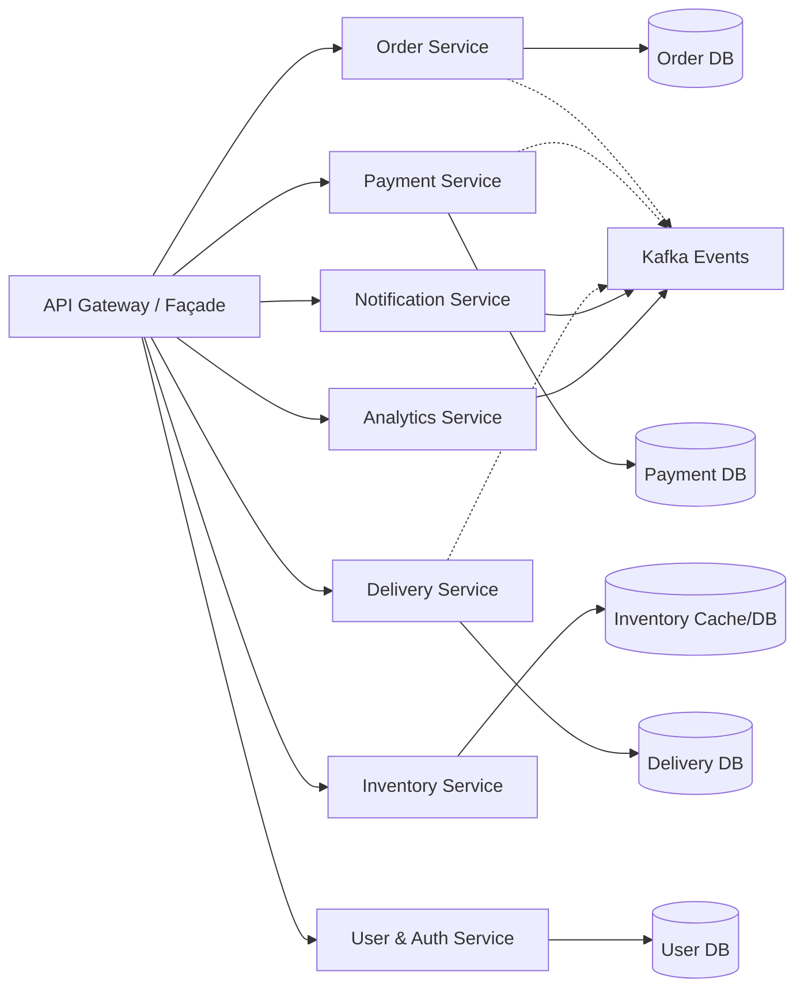
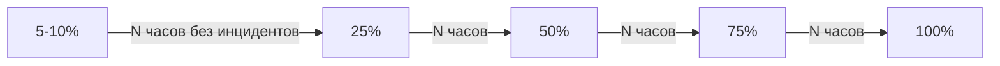
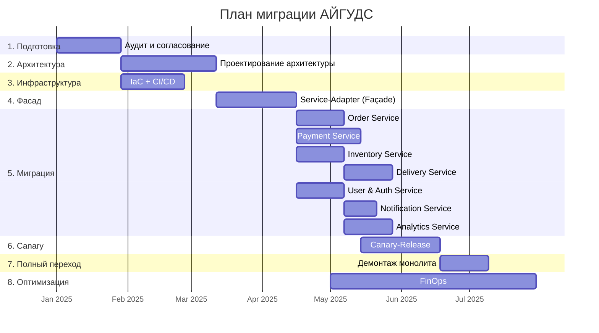

# План оптимизации архитектуры АЙГУДС
## Миграция с монолитной архитектуры на микросервисную

| Мета-информация | |
|---|---|
| **Статус** | Черновик |
| **Версия** | 1.0 |
| **Дата** | {{дата}} |
| **Автор** | {{автор}} |
| **Утверждающий** | {{утверждающий}} |

---

## Содержание

1. [Подготовительный этап](#1-подготовительный-этап)
2. [Проектирование новой архитектуры](#2-проектирование-новой-архитектуры)
3. [Подготовка инфраструктуры](#3-подготовка-инфраструктуры)
4. [Разработка Service-Adapter (Façade)](#4-разработка-service-adapter-fa%C3%A7ade)
5. [Модульная миграция бизнес-логики](#5-%D0%BC%D0%BE%D0%B4%D1%83%D0%BB%D1%8C%D0%BD%D0%B0%D1%8F-%D0%BC%D0%B8%D0%B3%D1%80%D0%B0%D1%86%D0%B8%D1%8F-%D0%B1%D0%B8%D0%B7%D0%BD%D0%B5%D1%81-%D0%BB%D0%BE%D0%B3%D0%B8%D0%BA%D0%B8)
6. [Canary-Release и проверка](#6-canary-release-%D0%B8-%D0%BF%D1%80%D0%BE%D0%B2%D0%B5%D1%80%D0%BA%D0%B0)
7. [Полный переход и демонтаж старого монолита](#7-%D0%BF%D0%BE%D0%BB%D0%BD%D1%8B%D0%B9-%D0%BF%D0%B5%D1%80%D0%B5%D1%85%D0%BE%D0%B4-%D0%B8-%D0%B4%D0%B5%D0%BC%D0%BE%D0%BD%D1%82%D0%B0%D0%B6-%D1%81%D1%82%D0%B0%D1%80%D0%BE%D0%B3%D0%BE-%D0%BC%D0%BE%D0%BD%D0%BE%D0%BB%D0%B8%D1%82%D0%B0)
8. [Оптимизация расходов (FinOps)](#8-%D0%BE%D0%BF%D1%82%D0%B8%D0%BC%D0%B8%D0%B7%D0%B0%D1%86%D0%B8%D1%8F-%D1%80%D0%B0%D1%81%D1%85%D0%BE%D0%B4%D0%BE%D0%B2-finops)
9. [Тестирование и контроль качества](#9-%D1%82%D0%B5%D1%81%D1%82%D0%B8%D1%80%D0%BE%D0%B2%D0%B0%D0%BD%D0%B8%D0%B5-%D0%B8-%D0%BA%D0%BE%D0%BD%D1%82%D1%80%D0%BE%D0%BB%D1%8C-%D0%BA%D0%B0%D1%87%D0%B5%D1%81%D1%82%D0%B2%D0%B0)
10. [Мониторинг и процесс реагирования](#10-%D0%BC%D0%BE%D0%BD%D0%B8%D1%82%D0%BE%D1%80%D0%B8%D0%BD%D0%B3-%D0%B8-%D0%BF%D1%80%D0%BE%D1%86%D0%B5%D1%81%D1%81-%D1%80%D0%B5%D0%B0%D0%B3%D0%B8%D1%80%D0%BE%D0%B2%D0%B0%D0%BD%D0%B8%D1%8F)
11. [Итоговый поток работ](#11-%D0%B8%D1%82%D0%BE%D0%B3%D0%BE%D0%B2%D1%8B%D0%B9-%D0%BF%D0%BE%D1%82%D0%BE%D0%BA-%D1%80%D0%B0%D0%B1%D0%BE%D1%82)
12. [Приложения](#12-%D0%BF%D1%80%D0%B8%D0%BB%D0%BE%D0%B6%D0%B5%D0%BD%D0%B8%D1%8F)

---

## 1. Подготовительный этап

**Срок:** 3–4 недели
**Ответственный:** Product Owner, Tech-lead
**Ключевой результат:** Утверждённый план миграции с согласованными требованиями и метриками

### 1.1 Аудит текущей системы

| Область | Действия | Ожидаемый результат |
|---|---|---|
| **Репозитории** | Инвентаризация всех репозиториев, веток, политик мержа | Карта репозиториев, устранение мёртвого кода |
| **Зависимости** | Анализ библиотек, фреймворков, версий | Матрица зависимостей, план обновлений |
| **Схемы БД** | Реверс-инжиниринг схем, поиск связанных таблиц | ER-диаграммы, выявление границ данных |
| **Очереди** | Аудит RabbitMQ/Kafka: топики, consumer-группы, задержки | Схема потоков событий |
| **Метрики** | Сбор latency, RPS, error rate, использования ресурсов | Базовые показатели производительности |
| **Затраты** | Анализ расходов на облачные ресурсы | Отчёт FinOps с разбивкой по сервисам |

### 1.2 Согласование бизнес-требований

- **Функциональные требования:** перечень обязательных функций UI (веб, мобильное приложение)
- **Требования к производительности:** целевые latency (p50/p95/p99), RPS, время отклика
- **SLA:** допустимое время простоя, время восстановления (RTO/RPO)
- **Безопасность:** требования к аутентификации, авторизации, шифрованию, PCI DSS (для платежей)
- **Бюджет:** лимиты затрат на инфраструктуру в переходный период и после миграции

### 1.3 Формирование команды

| Роль | Участник | Ответственность |
|---|---|---|
| **Product Owner** | {{PO}} | Приоритизация, согласование требований, приёмка |
| **Tech-lead** | {{TL}} | Архитектурные решения, код-ревью, стандарты |
| **Backend-engineers (3–5)** | {{разработчики}} | Разработка микросервисов, фасада |
| **DevOps (1–2)** | {{девопсы}} | Инфраструктура, CI/CD, мониторинг |
| **QA (1–2)** | {{тестировщики}} | Тестирование, автотесты, нагрузка |
| **Security Engineer** | {{безопасник}} | Аудит безопасности, пентесты |
| **Data-engineer** | {{дата-инженер}} | Миграция данных, ETL, аналитика |
| **FinOps Engineer** | {{финопс}} | Контроль затрат, оптимизация |

### 1.4 Краткое описание проекта

- **Цель:** Миграция монолитной архитектуры на микросервисную для повышения масштабируемости, надёжности и скорости поставки
- **Ожидаемый ROI:** Снижение time-to-market на 40%, уменьшение времени инцидентов на 60%, оптимизация затрат на 25%
- **Риски:**
  - Высокая связанность данных в монолите — сложность декомпозиции
  - Риск потери данных при миграции
  - Увеличение операционной сложности (N сервисов вместо 1)
- **Критерии «Достаточно» (Definition of Done):**
  - 100% запросов обрабатываются новыми микросервисами
  - Метрики производительности не хуже исходных (p95 latency ≤ baseline)
  - Zero data loss при миграции
  - Все тесты проходят в CI/CD

---

## 2. Проектирование новой архитектуры

**Срок:** 4–6 недель
**Ответственный:** Tech-lead, System Architect
**Ключевой результат:** Архитектурная документация в Git

### 2.1 Технологический стек

| Компонент | Технология | Обоснование |
|---|---|---|
| **Язык/фреймворк** | Go / Java (Spring Boot) | Производительность / экосистема |
| **API Gateway** | Kong / Envoy / NGINX | Маршрутизация, rate limiting, auth |
| **Service Mesh** | Istio / Linkerd | Наблюдаемость, трафик-контроль |
| **Очереди** | Apache Kafka / Redpanda | Высокая пропускная способность |
| **Базы данных** | PostgreSQL (основная), Redis (кэш) | Надёжность, скорость |
| **Контейнеризация** | Docker, Kubernetes | Оркестрация, масштабирование |
| **CI/CD** | GitLab CI / GitHub Actions | Автоматизация сборки и деплоя |
| **Мониторинг** | Prometheus + Grafana + Loki + Tempo | Метрики, логи, трассировка |

### 2.2 Границы микросервисов (Domain Boundaries)



| Микросервис | Ответственность | Владение данными |
|---|---|---|
| **Order Service** | CRUD заказов, расчёт стоимости, жизненный цикл заказа | `orders`, `order_items`, `order_history` |
| **Payment Service** | Обработка платежей, интеграция с банками, токенизация | `payments`, `payment_methods`, `transactions` |
| **Inventory Service** | Управление остатками, резервирование, синхронизация со складом | `inventory`, `reservations` |
| **Delivery Service** | Расчёт ETA, назначение курьера, отслеживание доставки | `deliveries`, `couriers`, `delivery_zones` |
| **User & Auth Service** | Профили, аутентификация (JWT/OAuth2), RBAC | `users`, `roles`, `sessions` |
| **Notification Service** | Отправка email, SMS, push-уведомлений | `notifications`, `templates` |
| **Analytics Service** | Сбор событий, агрегация, экспорт в DWH | События из Kafka → ClickHouse |

### 2.3 API-дизайн

**Версия V1 (Façade, обратная совместимость)**
- Полное копирование существующего API монолита
- Эндпоинты: `/api/v1/*`
- Ответы идентичны старому API (полевое соответствие)

**Версия V2 (Новые сервисы)**
- RESTful дизайн, единые conventions
- Эндпоинты: `/api/v2/orders/*`, `/api/v2/payments/*` и т.д.
- GraphQL для сложных запросов (опционально)

### 2.4 Стратегия миграции данных

Реализуется паттерн **Strangler-Fig** (поэтапное «удушение» монолита):

1. **Репликация изменений:** любые изменения в монолитной БД реплицируются в новую БД (Kafka Connect / Debezium CDC)
2. **Двойная запись (Dual Write):** при миграции каждого модуля запись производится одновременно в старую и новую БД
3. **Верификация:** cron-задачи сравнивают данные в старой и новой БД, расхождения логируются
4. **Финализация:** после полного перехода старая БД переводится в read-only и затем декомиссируется

### 2.5 Паттерн Strangler-Fig

```
                    ┌─────────────┐
                    │   Клиент    │
                    └──────┬──────┘
                           │
                    ┌──────▼──────┐
                    │   Façade    │ (API Gateway)
                    │  Gateway    │
                    └──┬───┬───┬──┘
                       │   │   │
              ┌────────▼┐ ┌▼──▼──┐ ┌──────────┐
              │  V1 Route│ │V2     │ │   V2    │
              │(старый  │ │Route  │ │  Route  │
              │ монолит)│ │Service│ │ Service │
              └─────────┘ │  A    │ │    B    │
                          └───────┘ └──────────┘
```

- Façade анализирует путь запроса (`/api/v1/*` vs `/api/v2/*`)
- V1-запросы либо проксируются в монолит, либо трансформируются в вызовы новых микросервисов
- V2-запросы направляются напрямую в новые сервисы
- Постепенно V1-маршруты заменяются вызовами V2-сервисов

### 2.6 Документация

- **Диаграммы:** PlantUML / Mermaid в репозитории
- **Run-books:** описание процедур запуска, остановки, отката каждого сервиса
- **ADR (Architecture Decision Records):** `docs/adr/*.md` — каждое ключевое архитектурное решение
- **Хранение:** Git (Markdown + диаграммы), актуальная версия в `main`

---

## 3. Подготовка инфраструктуры

**Срок:** 3–4 недели (параллельно с этапом 2)
**Ответственный:** DevOps, Platform Engineer
**Ключевой результат:** Рабочий Kubernetes-кластер с CI/CD и мониторингом

### 3.1 Инфраструктурный код (IaC)

- Terraform / Pulumi для облачных ресурсов
- Helm-чарты для сервисов в Kubernetes
- Разделение окружений: `dev`, `staging`, `prod`

### 3.2 CI/CD Pipeline

| Этап | Инструмент | Действие |
|---|---|---|
| **Lint** | golangci-lint / checkstyle | Статический анализ |
| **Unit-тесты** | go test / JUnit | Модульное тестирование |
| **Сборка** | Docker Build | Сборка образов, тегирование |
| **Push** | Container Registry | Загрузка образов |
| **Deploy (staging)** | ArgoCD / Flux | Автоматический деплой в staging |
| **E2E-тесты** | Playwright / Cypress | Интеграционные тесты |
| **Deploy (prod)** | ArgoCD / Flux | Canary/Blue-Green деплой |

**Правила:**
- Пайплайн обязателен для всех сервисов
- Любой провал тестов блокирует деплой
- Ветка `main` всегда деплотабельна

### 3.3 Мониторинг и алёрты

- **Метрики:** Prometheus + Grafana (дашборды по сервисам)
- **Логи:** Loki / Elasticsearch + Kibana
- **Трассировка:** Tempo / Jaeger (OpenTelemetry)
- **Алёрты:** Alertmanager → Telegram / Slack / PagerDuty
- **SLA-дашборды:** uptime, latency, error budget

### 3.4 Наблюдаемость (Observability)

Каждый микросервис обязан:
1. Экспортировать метрики в Prometheus (RED-метрики: Rate, Errors, Duration)
2. Писать структурированные логи (JSON, уровень: info/warn/error)
3. Пробрасывать контекст трассировки (trace_id, span_id)

---

## 4. Разработка Service-Adapter (Façade)

**Срок:** 4–6 недель
**Ответственный:** Backend-engineers (2–3)
**Ключевой результат:** Gateway, полностью совместимый со старым API

### 4.1 Реализация API-Gateway

- **Маршрутизация:** приём запросов `/api/v1/*`, определение целевого бэкенда
- **Трансформация:** маппинг полей из формата монолита в формат микросервисов
- **Протокол:** JSON ↔ Protobuf (при необходимости)
- **Типы маршрутов:**
  1. `proxy` — прямая передача в монолит (временная мера)
  2. `transform` — трансформация запроса и вызов нового микросервиса
  3. `aggregate` — агрегация ответов от нескольких микросервисов

### 4.2 Надёжность и отказоустойчивость

| Механизм | Описание | Конфигурация |
|---|---|---|
| **Idempotency** | Повторная отправка того же запроса не меняет состояние | Ключ идемпотентности в заголовке `Idempotency-Key` |
| **Retry** | Автоматический повтор при временных ошибках | Exponential backoff, max 3 попытки |
| **Circuit Breaker** | Отключение неисправного сервиса | Порог: 50% ошибок за 10 сек → размыкание |
| **Fallback** | При недоступности нового сервиса — вызов монолита | Проверка health-check монолита |
| **Timeout** | Ограничение времени ответа | 5 сек (по умолчанию), настраивается |

### 4.3 Контрактное тестирование

- **Pact / Spring Cloud Contract** — проверка соответствия ответов фасада старому API
- **Сценарии:** все существующие эндпоинты монолита
- **Пайплайн:** тесты запускаются при каждом изменении фасада

### 4.4 Unit-тесты и развёртывание

- **Покрытие:** не менее 80% бизнес-логики
- **Namespace:** `facade` (отдельный от монолита и новых сервисов)
- **Ресурсы:** 2–4 pod, HPA по CPU/memory

---

## 5. Модульная миграция бизнес-логики

**Срок:** 8–16 недель (2–4 недели на сервис)
**Ответственный:** Backend-engineers
**Ключевой результат:** Каждый микросервис работает в production под фасадом

### 5.1 Алгоритм миграции (для каждого сервиса)

1. **Описание API** — OpenAPI 3.0 спецификация, генерация кода (oapi-codegen / swagger-codegen)
2. **Реализация бизнес-логики** — портирование из монолита с рефакторингом
3. **Модульное тестирование** — unit-тесты, интеграционные тесты (не менее 80%)
4. **Миграция данных** — ETL-скрипты, двойная запись, верификация
5. **Сборка и деплой** — Docker → ArgoCD → отдельный namespace
6. **Проверка через фасад** — маршрутизация V1-запросов к новому сервису
7. **Нагрузочное тестирование** — k6 / Locust, сравнение с baseline

### 5.2 Order Service

- CRUD: создание, обновление, отмена, статусы заказов
- Расчёт стоимости: товары, скидки, налоги, доставка
- Публикация событий: `order.created`, `order.updated`, `order.cancelled`
- **API:** `POST /api/v2/orders`, `GET /api/v2/orders/{id}`, `PATCH /api/v2/orders/{id}`
- **Хранилище:** PostgreSQL (orders)

### 5.3 Payment Service

- **Унифицированный API:** единый интерфейс для всех провайдеров
- **Интеграция с банками:**
  - Т-Банк (Tinkoff API)
  - Альфа-Банк (Alpha API)
  - Сбер (SberPay API)
- **Токенизация:** замена PAN на токен, безопасное хранение
- **PCI DSS:** соответствие требованиям, изолированное окружение
- **События:** `payment.pending`, `payment.succeeded`, `payment.failed`, `payment.refunded`
- **Хранилище:** PostgreSQL (payments, payment_methods encrypted)

### 5.4 Inventory Service

- Синхронизация со складскими системами (WMS, ERP)
- Кэширование остатков в Redis (TTL = 60 сек)
- Резервирование товаров при создании заказа
- API: `GET /api/v2/inventory/{sku}`, `POST /api/v2/inventory/reserve`

### 5.5 Delivery Service

- Расчёт ETA (карты, дистанция, загрузка курьеров)
- Интеграция с курьерскими службами (СДЭК, Boxberry, собственные курьеры)
- Публикация событий: `delivery.assigned`, `delivery.in_transit`, `delivery.delivered`
- API: `POST /api/v2/deliveries`, `GET /api/v2/deliveries/{id}`

### 5.6 User & Auth Service

- Миграция профилей пользователей из монолита
- Аутентификация: JWT (access + refresh tokens)
- Авторизация: RBAC (роли: client, admin, manager, courier)
- OAuth2 / Social Login (Google, VK, Яндекс)
- API: `POST /api/v2/auth/login`, `POST /api/v2/auth/register`, `GET /api/v2/users/me`

### 5.7 Notification Service

- **Каналы:**
  - Email (SMTP / SendGrid / Mailgun)
  - SMS (Twilio / провайдеры РФ)
  - Push (Firebase / APNs)
  - In-app (WebSocket)
- **Шаблоны:** Go templates / Handlebars, хранение в БД
- **Очередь:** Kafka consumer, обработка с подтверждением

### 5.8 Analytics Service

- Сбор событий из Kafka
- Агрегация метрик (заказы/день, выручка, конверсия)
- Экспорт в DWH (ClickHouse / Snowflake)
- API для дашбордов: `GET /api/v2/analytics/revenue`, `GET /api/v2/analytics/orders`

---

## 6. Canary-Release и проверка

**Срок:** 4–6 недель (перекрывается с этапом 5)
**Ответственный:** DevOps, QA
**Ключевой результат:** Уверенность в стабильности новых сервисов перед полным переходом

### 6.1 Настройка разделения трафика

- **Инструмент:** Istio VirtualService / Flagger / Argo Rollouts
- **Начальное соотношение:** 5–10% трафика на новые сервисы, 90–95% на монолит (через фасад)
- **Метод:** header-based (для внутреннего тестирования) + weight-based (для пользователей)

### 6.2 Метрики для сравнения

| Метрика | Порог | Действие при превышении |
|---|---|---|
| **Latency (p95)** | ≥120% от baseline | Автоматический откат до 0% |
| **Error rate** | ≥1% | Автоматический откат |
| **Задержка очередей** | ≥500 мс (p99) | Алёрт, анализ |
| **CPU/Memory** | ≥80% utilization | HPA + алёрт |
| **SLA** | Нарушение error budget | Остановка canary |

### 6.3 Автоматический откат

- При превышении любого порога — Flagger автоматически направляет 100% трафика обратно на стабильную версию
- Уведомление команды в Slack/Telegram
- Пост-мортем после инцидента

### 6.4 Пошаговое увеличение доли трафика



- **Минимальное время на каждом шаге:** 24 часа (prod), 4 часа (staging)
- **Решение о переходе:** Tech-lead + PO после валидации метрик

### 6.5 Двойная запись в переходный период

- Все изменения пишутся и в старую, и в новую БД
- Фоновый процесс верификации сверяет записи
- Расхождения логируются и исправляются в пользу нового сервиса

---

## 7. Полный переход и демонтаж старого монолита

**Срок:** 2–4 недели
**Ответственный:** Tech-lead, DevOps
**Ключевой результат:** Монолит полностью выведен из эксплуатации

### 7.1 Перенаправление 100% трафика

- Фасад направляет все запросы к новым микросервисам
- Монолит переводится в read-only режим
- Наблюдение за метриками в течение 1–2 недель

### 7.2 Отключение и удаление ресурсов

- Остановка VM/контейнеров монолита
- Удаление load balancer, DNS-записей, storage volumes
- Резервное копирование перед удалением

### 7.3 Пост-мортем и валидация

- **Сравнение бизнес-метрик:** до и после миграции (заказы/день, конверсия, выручка)
- **Сравнение технических метрик:** latency, error rate, uptime
- **Документирование уроков (Lessons Learned):** что пошло хорошо, что можно улучшить

### 7.4 Обновление документации

- Архитектурные схемы — актуальное состояние
- Run-books — обновлены под микросервисы
- README каждого сервиса — контакты ответственных

### 7.5 Декомиссия ресурсов

- Удаление неиспользуемых облачных ресурсов
- Освобождение IP-адресов, DNS-зон
- Отчёт об освобождённых мощностях и экономии

---

## 8. Оптимизация расходов (FinOps)

**Срок:** Continuous (начиная с этапа 3)
**Ответственный:** FinOps Engineer, DevOps
**Ключевой результат:** Снижение затрат на инфраструктуру на 25–30%

### 8.1 Использование Spot/Preemptible Instances

- **Test/Staging:** 100% spot instances
- **Production:** до 60% spot instances для stateless сервисов
- **Риск:** возможность прерывания — обязательный graceful shutdown

### 8.2 Автоматическое масштабирование

- **HPA (Horizontal Pod Autoscaler):** по CPU, memory, custom metrics (RPS)
- **VPA (Vertical Pod Autoscaler):** рекомендации по ресурсам
- **Cluster Autoscaler:** добавление/удаление нод
- **Scaling to zero:** для dev/тестовых окружений в нерабочее время

### 8.3 Managed-сервисы

| Сервис | Managed-аналог | Экономия |
|---|---|---|
| PostgreSQL | RDS / Cloud SQL / YDB | Снижение operational overhead |
| Redis | ElastiCache / Memorystore | Автоматический backup/failover |
| Kafka | Confluent Cloud / Managed Kafka | Без администрирования кластера |
| Kubernetes | EKS / GKE / Managed K8s | Без master-нод |

### 8.4 Оптимизация хранения

- **Логи:** ротация (retention: 7 дней), холодное хранение (S3 Glacier)
- **Метрики:** агрегация, даунсемплинг старых данных
- **Резервные копии:** инкрементальные, хранение по политике
- **Неиспользуемые volumes:** автоматическое удаление

### 8.5 Бюджетные алёрты

- **Ежемесячный бюджет:** разбивка по сервисам и окружениям
- **Пороги:** 80% → предупреждение, 100% → алёрт, 120% → эскалация
- **Инструменты:** AWS Budgets / GCP Budgets / Kubecost

---

## 9. Тестирование и контроль качества

**Срок:** Continuous (все этапы)
**Ответственный:** QA Engineer
**Ключевой результат:** Стабильность и совместимость на каждом этапе

### 9.1 Пирамида тестирования

```
         ╱╲
        ╱ E2E ╲           ← 5% тестов
       ╱────────╲
      ╱ Contract ╲        ← 10% тестов
     ╱────────────╲
    ╱ Integration  ╲      ← 25% тестов
   ╱────────────────╲
  ╱   Unit-tests     ╲    ← 60% тестов
 ╱────────────────────╲
```

### 9.2 Unit-тесты и интеграционные тесты

- **Язык:** Go: `testing` + `testify`; Java: JUnit + Mockito
- **Покрытие:** ≥80% строк кода
- **Mock-зависимости:** внешние сервисы, БД (testcontainers), очереди

### 9.3 Contract-тесты

- **Инструмент:** Pact (consumer-driven contracts)
- **Провайдеры:** каждый микросервис публикует контракты
- **Консьюмеры:** фасад и другие сервисы проверяют совместимость
- **Результат:** ни одно изменение API не ломает существующих клиентов

### 9.4 End-to-End тесты

- **Инструмент:** Playwright / Cypress (веб), Detox (мобильное)
- **Сценарии:** критический путь пользователя (регистрация → заказ → оплата → доставка)
- **Окружение:** staging, полный набор микросервисов

### 9.5 Нагрузочные и стресс-тесты

- **Инструмент:** k6 / Locust / Vegeta
- **Сценарии:**
  - Нагрузочный: типичный RPS × 2 в течение 30 мин
  - Стрессовый: RPS × 10 до отказа
  - Spike: резкий скачок RPS × 5
  - Soak: длительная нагрузка (2–4 часа)
- **Метрики:** p50/p95/p99 latency, throughput, error rate, использование ресурсов

### 9.6 Тесты безопасности

- **SAST:** статический анализ кода (SonarQube / Semgrep)
- **SCA:** анализ зависимостей (Snyk / Trivy)
- **DAST:** динамическое тестирование (OWASP ZAP)
- **Container scan:** Trivy / Clair (сканирование образов)
- **Penetration testing:** периодический (ежеквартально)

### 9.7 Автоматизация в CI/CD

```yaml
# GitLab CI example
stages:
  - lint
  - unit-test
  - build
  - contract-test
  - integration-test
  - security-scan
  - e2e-test
  - load-test
  - deploy
```

**Правила:**
- Любой провал тестов → блокировка мержа
- Stage `load-test` — опциональный, запускается по требованию
- Stage `security-scan` — обязателен перед деплоем в prod

---

## 10. Мониторинг и процесс реагирования

**Срок:** Continuous
**Ответственный:** DevOps, SRE
**Ключевой результат:** Обнаружение и реагирование на инциденты в течение 5 минут

### 10.1 Мониторинг производительности

**RED-метрики для каждого сервиса:**
- **Rate:** запросов/сек, throughput очередей
- **Errors:** HTTP 5xx, business errors, panics
- **Duration:** p50/p95/p99 latency (разбивка по эндпоинтам)

### 10.2 Мониторинг инфраструктуры

- **Kubernetes:** состояние подов, нод, PVC, HPA
- **Базы данных:** connections, query latency, replication lag, disk usage
- **Очереди:** producer lag, consumer lag, message rate
- **Сеть:** bandwidth, dropped packets, TLS handshake  time

### 10.3 SLA-дашборды и алёрты

| Показатель | Цель (SLO) | Метод измерения |
|---|---|---|
| **Uptime (API Gateway)** | 99.95% | Prometheus + Blackbox Exporter |
| **Uptime (каждый сервис)** | 99.9% | Аналогично |
| **Latency p95 (API)** | ≤500 мс | Request duration histogram |
| **Error rate** | ≤0.1% | HTTP status counters |
| **Время восстановления (MTTR)** | ≤30 мин | PagerDuty timeline |

### 10.4 Алёрты по уровням критичности

| Уровень | Пример | Канал | Время реакции |
|---|---|---|---|
| **P0 (Critical)** | Сервис недоступен, потеря данных | PagerDuty + Telegram | 5 мин |
| **P1 (High)** | Замедление > p95, ошибки > 1% | Telegram + Slack | 15 мин |
| **P2 (Medium)** | Приближение лимитов, предупреждения | Slack | 1 час |
| **P3 (Low)** | Информационные уведомления | E-mail | 24 часа |

### 10.5 Run-books для инцидентов

Шаблон run-book:
```
## Название инцидента
**Приоритет:** P0
**Сервис:** Order Service

### Симптомы
- Ошибки 500 при создании заказа
- Метрика error_rate > 5%

### Диагностика
1. Проверить логи: kubectl logs -n order -l app=order-service
2. Проверить БД: pg_isready, запрос `SELECT count(*) FROM orders`
3. Проверить очередь: kafka-consumer-groups --bootstrap-server ...

### Действия по восстановлению
1. Рестарт пода: kubectl rollout restart -n order
2. Если не помогло — откат: kubectl rollout undo -n order
3. Если БД недоступна — переключение на replica
```

---

## 11. Итоговый поток работ

### 11.1 Общая диаграмма этапов



### 11.2 Сводка этапов и сроков

| № | Этап | Длительность | Зависимости |
|---|---|---|---|
| 1 | Аудит и согласование требований | 3–4 нед | — |
| 2 | Проектирование архитектуры | 4–6 нед | Этап 1 |
| 3 | Создание инфраструктуры и CI/CD | 3–4 нед | Этап 1 (параллельно с 2) |
| 4 | Реализация фасада-gateway | 4–6 нед | Этапы 2, 3 |
| 5 | Поэтапная миграция микросервисов | 8–16 нед | Этап 4 |
| 6 | Canary-релиз и мониторинг | 4–6 нед | Этап 5 |
| 7 | Полный переход и вывод из эксплуатации | 2–4 нед | Этап 6 |
| 8 | Оптимизация расходов | Continuous | Начиная с Этапа 3 |
| 9 | Тестирование и мониторинг | Continuous | Все этапы |

**Ориентировочная общая длительность:** 6–9 месяцев

### 11.3 Ключевые риски и митигации

| Риск | Вероятность | Влияние | Митигация |
|---|---|---|---|
| Высокая связанность данных | Высокая | Критическое | Тщательный анализ данных, CDC, двойная запись |
| Несовместимость API | Средняя | Высокое | Contract-тесты, фасад как буфер |
| Потеря данных при миграции | Низкая | Критическое | Репликация, верификация, backup |
| Увеличение latency из-за сетевых вызовов | Средняя | Среднее | Service Mesh, кэширование, асинхронность |
| Сопротивление команды изменениям | Средняя | Среднее | Тренинги, вовлечение в принятие решений |
| Перерасход бюджета | Средняя | Высокое | FinOps, бюджетные алёрты, spot instances |

---

## 12. Приложения

### A. Шаблон ADR (Architecture Decision Record)
```
# ADR-{N}: {Название решения}

**Дата:** {дата}
**Статус:** Proposed | Accepted | Deprecated
**Контекст:** {описание проблемы}
**Решение:** {описание решения}
**Альтернативы:** {рассмотренные варианты}
**Последствия:** {плюсы, минусы, компромиссы}
```

### B. Чек-лист готовности сервиса к production

- [ ] OpenAPI спецификация утверждена
- [ ] Unit-тесты (≥80% покрытия)
- [ ] Интеграционные тесты проходят
- [ ] Contract-тесты зелёные
- [ ] Docker-образ собран, загружен в registry
- [ ] Helm-чарт готов
- [ ] Terraform-ресурсы созданы
- [ ] CI/CD пайплайн настроен
- [ ] Метрики экспортируются в Prometheus
- [ ] Дашборды в Grafana созданы
- [ ] Алёрты настроены
- [ ] Run-book написан
- [ ] Load-test пройден (≥ ожидаемого RPS)
- [ ] Security scan пройден
- [ ] Документация обновлена

### C. Глоссарий

| Термин | Определение |
|---|---|
| **Strangler-Fig** | Паттерн поэтапной миграции — новый код постепенно заменяет старый |
| **Façade** | Промежуточный слой, обеспечивающий совместимость старого и нового API |
| **Canary Release** | Выкатка новой версии на часть пользователей для проверки |
| **Dual Write** | Одновременная запись в старую и новую БД в переходный период |
| **Circuit Breaker** | Паттерн отказоустойчивости, предотвращающий каскадные сбои |
| **Idempotency** | Свойство операции: повторный вызов даёт тот же результат |
| **FinOps** | Практика управления облачными затратами |
| **SLO / SLA / SLI** | Service Level Objective / Agreement / Indicator |

---

> **Следующие шаги:**
> 1. Утвердить документ и согласовать с ключевыми стейкхолдерами
> 2. Начать аудит текущей системы (Этап 1)
> 3. Сформировать команду и назначить ответственных
> 4. Определить конкретные даты и вехи в project management системе
