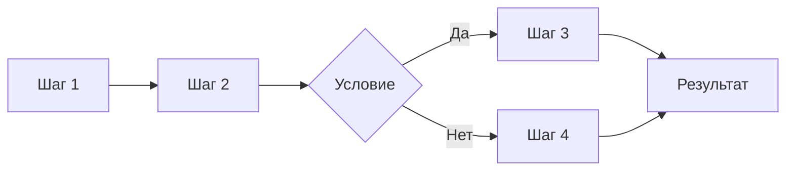
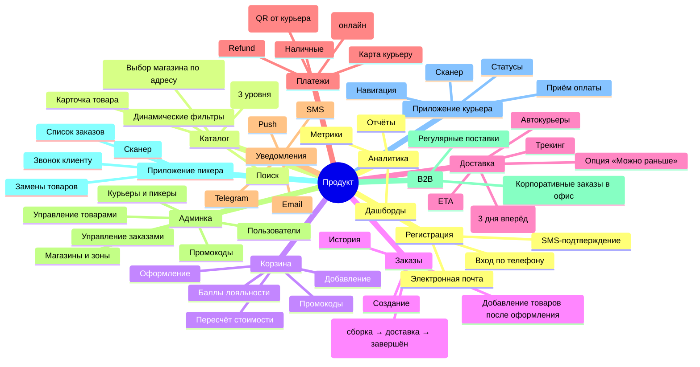
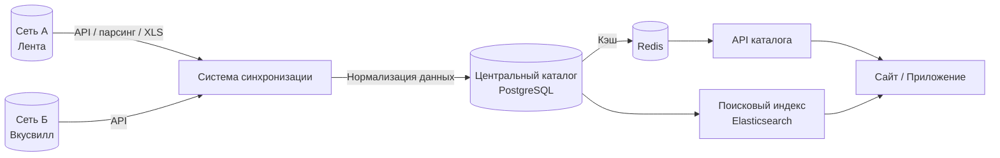

# Шаблон спецификации продукта

> **Назначение:** Описать бизнес-процессы текущей системы так, чтобы команда разработки могла оценить сроки и реализовать продукт-аналог.
>
> **Как работать с документом:**
> 1. Выделить все сквозные бизнес-процессы системы
> 2. Каждый процесс описать по шаблону раздела 2
> 3. После описания всех процессов — собрать итоговые оценки (раздел 3)
> 4. На основе процессов сформировать карту требований (раздел 4)

---

## 1. Общая информация о продукте

| Поле | Значение |
|---|---|
| **Название продукта** | |
| **Назначение** | Доставка продуктов из супермаркетов (агрегатор, не свой склад) |
| **Целевая аудитория** | B2C (покупатели), B2B (корпоративные заказы в офис) |
| **Ключевые бизнес-метрики** | Кол-во заказов/день, выручка, средний чек, конверсия, время сборки, время доставки |
| **Текущее состояние** | |
| **Платформы** | Web (Next.js), iOS, Android (ru.handh.igooods), Huawei AppGallery, RuStore |

---

## 2. Каталог бизнес-процессов

### 2.1 Структура описания одного процесса

```yaml
ИДЕНТИФИКАТОР: BP-{N}
НАЗВАНИЕ:       {Краткое название}
ВЛАДЕЛЕЦ:       {Роль, кто отвечает за процесс}
ТРИГГЕР:        {Что запускает процесс}
РЕЗУЛЬТАТ:      {Что считается успешным завершением}
```

#### 2.1.1 Бизнес-шаги



| № | Шаг | Участник | Система | Действие | Бизнес-правило |
|---|---|---|---|---|---|
| 1 | | | | | |
| 2 | | | | | |
| ... | | | | | |

**Альтернативные сценарии:**
- **Ошибка 1:** {что идёт не так} → {как система обрабатывает}
- **Ошибка 2:** {что идёт не так} → {как система обрабатывает}

#### 2.1.2 Данные процесса

| Сущность | Поля | Где хранится | Связи |
|---|---|---|---|
| `{entity_1}` | {перечень полей} | {БД/таблица} | {связи с другими сущностями} |
| `{entity_2}` | {перечень полей} | {БД/таблица} | {связи} |

#### 2.1.3 UI / Интерфейсы

| Экран / Компонент | Роль | Действия | Данные для отображения |
|---|---|---|---|
| {название экрана} | {кто видит} | {что можно сделать} | {какие данные показывает} |
| | | | |

#### 2.1.4 Интеграции (внешние системы)

| Система | Назначение | Данные | Направление |
|---|---|---|---|
| {банк / CRM / склад} | {зачем} | {какие данные передаются} | входящая / исходящая |
| | | | |

#### 2.1.5 Бизнес-правила и логика

```
Если {условие} → {действие}
При {ситуация} → {исключение / альтернатива}
Формула: {расчёт значения}
```

#### 2.1.6 Технические заметки для разработки

- {особенности реализации}
- {сложные моменты}
- {потенциальные узкие места}

#### 2.1.7 Оценка

| Категория | Трудозатраты (чел.-дней) | Примечание |
|---|---|---|
| Backend | | |
| Frontend (Web) | | |
| Mobile (iOS) | | |
| Mobile (Android) | | |
| DevOps / Infra | | |
| QA | | |
| **Итого на процесс** | **0** | |

---

### 2.2 Шаблоны для заполнения (процессы)

#### BP-01: Регистрация и аутентификация пользователя

<details>
<summary>Развернуть</summary>

| | |
|---|---|
| **Триггер** | Пользователь открывает приложение / сайт |
| **Результат** | Пользователь аутентифицирован, получен токен сессии |
| **Владелец** | User & Auth |

**Шаги:**
| № | Шаг | Участник | Действие | Бизнес-правило |
|---|---|---|---|---|
| 1 | Ввод номера телефона | Пользователь | Вводит номер в поле ввода | Формат: +7XXXXXXXXXX |
| 2 | Отправка SMS с кодом | Система | Генерирует 4-значный код, отправляет через SMS-провайдера | Код жив 5 минут, 3 попытки ввода |
| 3 | Подтверждение кода | Пользователь | Вводит код из SMS | При 3 неверных — блокировка на 30 мин |
| 4 | Создание/поиск профиля | Система | Если номер новый → создаётся профиль, если существующий → вход | |
| 5 | Выдача токена | Система | JWT access + refresh токены | Access — 15 мин, Refresh — 30 дней |

**Данные:**
| Сущность | Поля |
|---|---|
| `users` | id, phone, name, email, role, created_at, updated_at |
| `sessions` | id, user_id, refresh_token, expires_at, device_info |

**UI:**
- Экран ввода номера
- Экран ввода SMS-кода
- Экран профиля (после регистрации)

**Интеграции:**
| Система | Данные |
|---|---|
| SMS-провайдер | Телефон, текст сообщения |

**Бизнес-правила:**
- Если пользователь не завершил регистрацию (не ввёл код) — номер считается незанятым
- Один номер — один аккаунт
- Админы создаются только через бэк-офис

**Оценка:**
| Команда | Дней |
|---|---|
| Backend | 5 |
| Frontend | 3 |
| Mobile | 4 |
| QA | 2 |
| **Итого** | **14** |
</details>

---

#### BP-02: Каталог и поиск товаров

<details>
<summary>Развернуть</summary>

| | |
|---|---|
| **Триггер** | Пользователь открывает каталог / вводит поисковый запрос |
| **Результат** | Пользователь видит список товаров с ценой, наличием, характеристиками |
| **Владелец** | Catalog / Inventory |

**Шаги:**
| № | Шаг | Участник | Действие | Бизнес-правило |
|---|---|---|---|---|
| 1 | Выбор магазина | Пользователь | Вводит адрес → система показывает доступные магазины | Магазины определяются по зоне доставки адреса |
| 2 | Открытие каталога | Пользователь | Выбирает категорию из списка | Категории — дерево (3 уровня: корневая → подкатегория → товары) |
| 3 | Загрузка товаров | Система | Запрос к БД / кэшу | Пагинация |
| 4 | Фильтрация | Пользователь | Выбирает фильтры (тип, бренд, цена, жирность и т.д.) | Фильтры зависят от категории (динамические) |
| 5 | Поиск | Пользователь | Вводит текст поиска | Поиск по названию, бренду |
| 6 | Отображение | Система | Показывает карточки товаров с ценой и фото | Фото с Selectel CDN |

**Данные:**
| Сущность | Поля |
|---|---|
| `categories` | id, parent_id, name, icon_path, sort_order |
| `category_filters` | id, category_id, filter_name (например «Вид овоща», «Жирность», «Бренд») |
| `filter_values` | id, filter_id, value_name (например «Томаты», «Valio», «20%») |
| `products` | id, name, sku, barcode, price, old_price, category_id, images, attributes (JSONB) |
| `stores` | id, name, chain_id, address, coordinates, working_hours |
| `store_inventory` | store_id, product_id, quantity |

**Структура фильтров (из DATA.js iGooods):**
- Фильтры привязаны к категории, а не глобальные
- Пример для «Молоко и сливки»: Тип (молоко/сливки/козье), Обработка (стерилизованное/УВТ/пастеризованное), Жирность (0–40%), Фермерский продукт, Бренд
- Пример для «Овощи»: Вид овоща (томаты/перец/лук/...), Томаты (сливовидные/черри/...), Бренд

**Источник данных о товарах:**
- Цены и ассортимент получаются от сетей супермаркетов (API или парсинг)
- Актуальность остатков — не гарантирована, пикер проверяет в магазине

**UI:**
- Главная страница каталога (корневые категории с иконками)
- Список товаров (плитка/список, фото, цена, вес)
- Детальная карточка товара
- Поисковая строка
- Фильтры: сайдбар / выезжающая панель

**Бизнес-правила:**
- Цена = базовая цена сети - скидка (если есть акция/промокод)
- Наличие — не гарантируется до фактической сборки пикером
- Если товара нет в магазине — пикер звонит клиенту с вариантами замены
- Алкоголь и сигареты не доставляются (законодательный запрет)

**Оценка:**
| Команда | Дней |
|---|---|
| Backend | 10 |
| Frontend | 6 |
| Mobile | 8 |
| QA | 4 |
| **Итого** | **28** |
</details>

---

#### BP-03: Оформление заказа (Корзина → Заказ)

<details>
<summary>Развернуть</summary>

| | |
|---|---|
| **Триггер** | Пользователь выбирает товары и переходит к оформлению |
| **Результат** | Заказ создан, пикер начал сборку в магазине |
| **Владелец** | Cart → Order |

**Шаги:**
| № | Шаг | Участник | Действие | Бизнес-правило |
|---|---|---|---|---|
| 1 | Выбор магазина | Система | Автоматически выбирает магазин по адресу | Клиент может сменить магазин вручную |
| 2 | Добавление товаров | Пользователь | Выбирает товары из каталога | Можно добавить в заказ после оформления, пока сборка не началась |
| 3 | Применение промокода / баллов | Пользователь | Вводит промокод | Скидка не суммируется с другими акциями |
| 4 | Выбор временного слота | Пользователь | Выбирает дату (сегодня/завтра/+3 дня) и интервал | Слоты зависят от магазина и загрузки курьеров |
| 5 | Выбор адреса доставки | Пользователь | Вводит или выбирает сохранённый | Геокодирование, проверка попадания в зону доставки |
| 6 | Выбор способа оплаты | Пользователь | Онлайн / СБП / Картой курьеру / Наличные | |
| 7 | Подтверждение | Пользователь | Нажимает «Оформить заказ» | Рассчитывается стоимость сборки и доставки |
| 8 | Создание заказа | Система | Статус: «Ожидает оплаты» (для онлайн) или «Принят» (для наличных) | |

**Особенность iGooods:** нет резервирования товаров при добавлении в корзину. Товар резервируется только после создания заказа. Актуальное наличие проверяет пикер в магазине.

**Данные:**
| Сущность | Поля |
|---|---|
| `carts` | id, user_id, store_id, items (JSONB), created_at, updated_at |
| `orders` | id, user_id, store_id, status, total, delivery_fee, service_fee, delivery_address, payment_method, delivery_slot, weight, comment, created_at |
| `order_items` | id, order_id, product_id, quantity, price, substituted (если замена), substituted_from_id |
| `promo_codes` | id, code, type (percent/fixed/delivery), value, max_uses, used_count, min_order_amount, expires_at |
| `loyalty_points` | id, user_id, balance |

**UI:**
- Экран корзины (товары, количество, сумма, промокод)
- Экран оформления (адрес, слот, оплата)
- Экран подтверждения заказа
- Опция «Можно раньше» — согласие на более раннюю доставку

**Интеграции:**
| Система | Данные |
|---|---|
| Геокодер (Яндекс.Карты) | Адрес → координаты, проверка зоны доставки |
| Telegram bot (@igooodssupportbot) | Поддержка, изменение заказа |

**Бизнес-правила:**
- Максимальный вес заказа: 80 кг
- Доставка бесплатна от определённой суммы (настраивается для каждого магазина)
- Можно заказать на сегодня, завтра или на 3 дня вперёд
- После оформления можно добавить товары кнопкой «В заказ» (до начала сборки)
- Время доставки: 10:00–22:00 (МСК)
- Стоимость сборки и доставки рассчитывается перед подтверждением

**Оценка:**
| Команда | Дней |
|---|---|
| Backend | 12 |
| Frontend | 8 |
| Mobile | 10 |
| QA | 4 |
| **Итого** | **34** |
</details>

---

#### BP-04: Оплата заказа

<details>
<summary>Развернуть</summary>

| | |
|---|---|
| **Триггер** | Заказ создан со статусом «Ожидает оплаты» |
| **Результат** | Заказ оплачен (статус: «Оплачен») или отклонён |
| **Владелец** | Payment |

**Шаги:**
| № | Шаг | Участник | Действие | Бизнес-правило |
|---|---|---|---|---|
| 1 | Перенаправление на платёжный шлюз | Система | Формирует ссылку на оплату | Разные ссылки для разных банков |
| 2 | Ввод данных карты | Пользователь | Вводит номер, срок, CVV | Данные не проходят через наш сервер |
| 3 | Обработка платежа | Банк | Списывает средства | 3DSecure при необходимости |
| 4 | Callback от банка | Система | Получает уведомление об успехе/отказе | Webhook + polling |
| 5 | Обновление статуса заказа | Система | Успех → «Оплачен», Отказ → ошибка пользователю | |

**Данные:**
| Сущность | Поля |
|---|---|
| `payments` | id, order_id, amount, status, provider, provider_payment_id, created_at |
| `refunds` | id, payment_id, amount, reason, status |

**Интеграции:**
| Система | Данные | Тип |
|---|---|---|
| **Т-Банк (Тинькофф)** | Сумма, order_id, success_url, fail_url → payment_url | **Основной шлюз** |
| **СБП** | QR-код генерируется курьером при получении | Вторичный |
| Карта курьеру | POS-терминал курьера | Offline |
| Наличные | При получении | Offline |

**Подтверждено с сайта igooods.ru:**
> «Для оплаты необходимо ввести реквизиты карты. Для этого мы перенаправим вас на платёжный шлюз банка Тинькофф. Соединение с платёжным шлюзом и передача информации осуществляется в защищённом режиме с использованием протокола шифрования SSL.»
> «Во время доставки курьер создаст для вас QR-код. Считайте его смартфоном и подтвердите операцию в приложении вашего банка.»

**Бизнес-правила:**
- Онлайн-оплата: перенаправление на шлюз Т-Банка, 3DSecure
- СБП: QR-код от курьера при получении, оплата через приложение банка
- Карта курьеру: POS-терминал на месте
- Наличные: оплата при получении, курьер выдаёт сдачу
- Электронный чек приходит на телефон/email
- Добавление карты: холд 1 руб. для проверки платежеспособности
- Полная стоимость списывается после получения и проверки заказа
- Refund: полный или частичный (по запросу менеджера)

**Оценка:**
| Команда | Дней |
|---|---|
| Backend | 15 |
| Frontend | 3 |
| Mobile | 3 |
| QA | 5 |
| **Итого** | **26** |
</details>

---

#### BP-05: Сборка и упаковка заказа

<details>
<summary>Развернуть</summary>

| | |
|---|---|
| **Триггер** | Заказ оплачен / подтверждён |
| **Результат** | Заказ собран, упакован, передан курьеру |
| **Владелец** | Order Fulfillment |

**Шаги:**
| № | Шаг | Участник | Действие | Бизнес-правило |
|---|---|---|---|---|
| 1 | Поступление заказа пикеру | Система | Заказ появляется в приложении пикера | FIFO |
| 2 | Сборка товаров в зале | Пикер | Идёт по списку, отбирает товары с полок | Выбирает самые свежие (из глубины полки), целые яйца, лучшие овощи/фрукты |
| 3 | Проверка наличия | Пикер | Сверяет товар с заказом | Если товара нет → звонит клиенту, предлагает замену |
| 4 | Замена товара | Пикер + Клиент | Пикер предлагает альтернативу, клиент соглашается или отказывается | Замена фиксируется в системе |
| 5 | Упаковка | Пикер | Фасовка по пакетам, термосумкам, контейнерам | Соблюдение товарного соседства (мясо отдельно, химия отдельно) |
| 6 | Передача курьеру | Пикер | Упакованный заказ передаётся курьеру | Статус → «Передан в доставку» |

**Особенность iGooods:** сборка происходит в торговом зале супермаркета (не на складе). Пикеры — сотрудники iGooods, работают в гипермаркетах.

**UI (внутреннее приложение пикера):**
- Список заказов на сборку
- Детали заказа со списком товаров
- Сканер штрихкодов
- Интерфейс замены товара (выбор альтернативы, звонок клиенту)
- Подтверждение упаковки

**Бизнес-правила:**
- Пикер отбирает товары максимально свежие (молоко/яйца — из глубины полки)
- При отсутствии товара → обязательный звонок клиенту
- Упаковка: термосумки для заморозки, отдельно для химии, хрупкое отдельно
- Опция «Меньше пакетов» — экологичная упаковка

**Оценка:**
| Команда | Дней |
|---|---|
| Backend (API для пикера) | 8 |
| Mobile (приложение пикера) | 10 |
| QA | 3 |
| **Итого** | **21** |
</details>

---

#### BP-06: Доставка заказа

<details>
<summary>Развернуть</summary>

| | |
|---|---|
| **Триггер** | Заказ собран и упакован пикером |
| **Результат** | Заказ доставлен клиенту, оплата получена |
| **Владелец** | Delivery / Logistics |

**Шаги:**
| № | Шаг | Участник | Действие | Бизнес-правило |
|---|---|---|---|---|
| 1 | Назначение курьера | Система | Выбор свободного автокурьера, ближайшего к магазину | Курьер на личном авто, права кат. B, знание города |
| 2 | Получение заказа | Курьер | Забирает упакованный заказ у пикера | Проверка веса (макс. 80 кг) |
| 3 | Построение маршрута | Курьер | Строит маршрут в приложении | Интеграция с картами |
| 4 | Доставка | Курьер | Привозит заказ клиенту | Клиент проверяет заказ |
| 5 | Приём оплаты | Курьер | Если не онлайн — принимает оплату картой/наличными/СБП | СБП: курьер показывает QR-код |
| 6 | Завершение | Система | Статус «Доставлен», деньги списаны | |

**Данные:**
| Сущность | Поля |
|---|---|
| `deliveries` | id, order_id, courier_id, status, assigned_at, picked_at, delivered_at |
| `couriers` | id, user_id, status (free/busy), zone_id, vehicle_type, current_location (POINT) |
| `delivery_zones` | id, store_id, polygon (GEOJSON), delivery_fee, min_order_amount |

**UI:**
- **Приложение курьера (Android/iOS):** список заказов, навигация, сканер, приём оплаты, история
- **Трекинг для клиента:** отслеживание статуса (сборка → доставка)
- **Опция «Можно раньше»:** клиент готов принять заказ раньше выбранного слота

**Интеграции:**
| Система | Данные |
|---|---|
| Карты (Яндекс / Google) | Маршрут, навигация |
| Т-Банк / СБП | Приём оплаты курьером |

**Бизнес-правила:**
- Курьер — автокурьер (личное авто, права кат. B)
- Максимальный вес заказа: 80 кг
- Часы доставки: 10:00–22:00 (МСК)
- Заказы принимаются на сегодня, завтра и на 3 дня вперёд
- Стоимость доставки рассчитывается в корзине (может быть бесплатной от суммы)
- Если товар повреждён при доставке — возврат/замена через поддержку

**Оценка:**
| Команда | Дней |
|---|---|
| Backend | 10 |
| Mobile (курьер) | 12 |
| Frontend (трекинг) | 3 |
| QA | 4 |
| **Итого** | **29** |
</details>

---

#### BP-07: Возврат и отмена заказа

<details>
<summary>Развернуть</summary>

| | |
|---|---|
| **Триггер** | Клиент хочет отменить заказ / вернуть товар |
| **Результат** | Заказ отменён / возврат оформлен, деньги возвращены |
| **Владелец** | Order → Payment → Refund |

**Шаги:**
| № | Шаг | Участник | Действие | Бизнес-правило |
|---|---|---|---|---|
| 1 | Запрос отмены | Пользователь | Нажимает «Отменить заказ» | Можно отменить, если статус ≠ «Передан в доставку» |
| 2 | Проверка возможности отмены | Система | Проверяет статус заказа | |
| 3 | Отмена / Возврат | Система | Статус → «Отменён», инициируется refund | Refund через тот же платёжный метод |
| 4 | Уведомление | Система | Письмо/push об отмене | |
| 5 | Возврат товара (если передан курьеру) | Курьер | Забирает товар | Курьер получает задачу на возврат |

**Бизнес-правила:**
- До сборки: отмена мгновенно, возврат средств в течение 24 ч
- После сборки, до доставки: отмена возможна, но комиссия
- После доставки: возврат в течение 14 дней по закону о защите прав потребителей
- Возврат товара ненадлежащего качества: курьер забирает товар, деньги возвращаются
- Поддержка: Telegram (@igooodssupportbot) или телефон 8 (812) 985-55-06
- Возврат средств — через тот же платёжный метод, которым оплачивали

**Оценка:**
| Команда | Дней |
|---|---|
| Backend | 6 |
| Frontend | 2 |
| Mobile | 3 |
| QA | 3 |
| **Итого** | **14** |
</details>

---

#### BP-08: Управление промокодами и акциями

<details>
<summary>Развернуть</summary>

| | |
|---|---|
| **Триггер** | Администратор создаёт акцию |
| **Результат** | Промокод / скидка применяется в корзине |
| **Владелец** | Marketing → Order |

**Шаги:**
| № | Шаг | Участник | Действие | Бизнес-правило |
|---|---|---|---|---|
| 1 | Создание акции | Админ | Заполняет форму: тип, размер, условия | |
| 2 | Применение в корзине | Система | При вводе промокода — пересчёт суммы | Скидка не суммируется с другими акциями |

**Бизнес-правила:**
- Типы: процентная (например 10%), фиксированная (например 500 руб), бесплатная доставка
- Ограничения: минимальная сумма заказа, категории товаров, макс. количество использований
- Программа лояльности: начисление баллов за заказы, списание баллов при оплате
- Промокод на первый заказ — скидка для новых пользователей
- Скидка в день рождения
- Ограничение: скидки не суммируются с другими акциями

**Оценка:**
| Команда | Дней |
|---|---|
| Backend | 5 |
| Frontend | 3 |
| QA | 2 |
| **Итого** | **10** |
</details>

---

#### BP-09: Уведомления (Push / SMS / Email)

<details>
<summary>Развернуть</summary>

| | |
|---|---|
| **Триггер** | Событие в системе (заказ создан, оплачен, доставлен) |
| **Результат** | Пользователь получил уведомление |
| **Владелец** | Notification |

**События и каналы:**
| Событие | Каналы | Шаблон |
|---|---|---|
| `order.created` | Push, Email | «Заказ №{id} принят, начали сборку» |
| `order.picker_started` | Push | «Пикер начал собирать заказ» |
| `order.substitution` | Звонок пикера | Пикер звонит, если товара нет в наличии |
| `payment.succeeded` | Push | «Заказ №{id} оплачен» |
| `delivery.assigned` | Push, SMS | «Курьер выехал, ETA {time}» |
| `delivery.delivered` | Push, Email | «Заказ №{id} доставлен. Спасибо!» |
| `promo.received` | Push | «Вам начислен промокод {code}» |
| `order.reminder` | Push | «Не забудьте подтвердить заказ на завтра» |

**Оценка:**
| Команда | Дней |
|---|---|
| Backend | 5 |
| Mobile (push) | 2 |
| QA | 2 |
| **Итого** | **9** |
</details>

---

#### BP-10: Личный кабинет и история заказов

<details>
<summary>Развернуть</summary>

| | |
|---|---|
| **Триггер** | Пользователь заходит в профиль |
| **Результат** | Пользователь видит свои данные, историю заказов |
| **Владелец** | User / Order |

**Функции:**
- Просмотр/редактирование профиля (имя, телефон, email)
- Список заказов (пагинация, фильтр по статусу)
- Детали заказа (товары, статус, трекинг)
- Сохранённые адреса доставки
- Избранное / Wishlist

**Оценка:**
| Команда | Дней |
|---|---|
| Backend | 4 |
| Frontend | 3 |
| Mobile | 4 |
| QA | 2 |
| **Итого** | **13** |
</details>

---

#### BP-11: Админ-панель (CRM / Бэк-офис)

<details>
<summary>Развернуть</summary>

| | |
|---|---|
| **Триггер** | Менеджер заходит в админку |
| **Результат** | Менеджер управляет заказами, товарами, пользователями |
| **Владелец** | Admin |

**Модули:**
1. **Заказы:** список, фильтры, просмотр, изменение статуса, комментирование
2. **Товары:** CRUD, импорт/экспорт (CSV/Excel), управление ценами
3. **Пользователи:** список, блокировка, смена роли
4. **Промокоды:** создание, статистика использований
5. **Курьеры:** назначение зон, просмотр рейтинга
6. **Аналитика:** дашборды (выручка, заказы, конверсия)

**Оценка:**
| Команда | Дней |
|---|---|
| Backend | 15 |
| Frontend | 20 |
| QA | 5 |
| **Итого** | **40** |
</details>

---

#### BP-12: Аналитика и дашборды

<details>
<summary>Развернуть</summary>

| | |
|---|---|
| **Триггер** | Запрос аналитика / руководителя |
| **Результат** | Отчёт с ключевыми метриками |
| **Владелец** | Analytics |

**Метрики:**
- DAU/MAU, конверсия шагов воронки
- Выручка (день/неделя/месяц), средний чек
- Топ товаров, топ категорий
- Количество заказов по статусам
- Среднее время сборки, среднее время доставки

**Оценка:**
| Команда | Дней |
|---|---|
| Backend | 8 |
| Frontend | 5 |
| QA | 2 |
| **Итого** | **15** |
</details>

---

## 3. Сводная оценка

### 3.1 Итого по всем процессам

| ID | Процесс | Backend | Frontend | Mobile (клиент) | Mobile (пикер/курьер) | DevOps | QA | **Всего** |
|---|---|---|---|---|---|---|---|---|---|
| BP-01 | Регистрация и аутентификация | 5 | 3 | 4 | — | 1 | 2 | **15** |
| BP-02 | Каталог и поиск товаров | 10 | 6 | 8 | — | 1 | 4 | **29** |
| BP-03 | Оформление заказа | 12 | 8 | 10 | — | 1 | 4 | **35** |
| BP-04 | Оплата заказа | 15 | 3 | 3 | — | 1 | 5 | **27** |
| BP-05 | Сборка и упаковка | 8 | — | — | 10 | 1 | 3 | **22** |
| BP-06 | Доставка заказа | 10 | 3 | 4 | 12 | 1 | 4 | **34** |
| BP-07 | Возврат и отмена | 6 | 2 | 3 | 1 | 1 | 3 | **16** |
| BP-08 | Промокоды и акции | 5 | 3 | — | — | — | 2 | **10** |
| BP-09 | Уведомления | 5 | — | 2 | 2 | 1 | 2 | **12** |
| BP-10 | Личный кабинет | 4 | 3 | 4 | — | — | 2 | **13** |
| BP-11 | Админ-панель | 15 | 20 | — | — | — | 5 | **40** |
| BP-12 | Аналитика | 8 | 5 | — | — | 2 | 2 | **17** |
| **Cross-cutting** | Инфраструктура, CI/CD | — | — | — | — | 20 | — | **20** |
| **Cross-cutting** | Интеграции (Т-Банк, СБП, SMS) | 10 | — | — | — | — | 5 | **15** |
| | **Итого** | **113** | **59** | **38** | **25** | **30** | **43** | **305** |

> **Общая оценка:** ~290 человеко-дней (≈ 14–15 месяцев работы команды из 3–4 человек)

### 3.2 Поправка на риски

| Фактор | Коэффициент |
|---|---|
| Сложность интеграций | 1.2 |
| Неполнота требований | 1.3 |
| Новая команда (без опыта в предметной области) | 1.3 |
| Стабильная команда с опытом | 1.0 |

**Пример:** 290 × 1.2 (интеграции) × 1.3 (новизна) = **452 чел.-дня** (~22 месяца на команду из 3 человек)

---

## 4. Карта функциональных требований (Feature Map)

На основе описанных процессов строится карта всех функций продукта:



---

## 5. Магазины-сети и архитектура каталога

### 5.1 Подключённые сети супермаркетов (iGooods)

| Сеть | Тип | Особенности оплаты | Зоны доставки |
|---|---|---|---|
| **Лента** | Гипермаркет | Все способы | Почти все районы |
| **Metro** | Оптовый гипермаркет | Все способы | Ограниченные зоны |
| **Super Babylon** | Супермаркет | Все способы | Ограниченные зоны |
| **Утконос МИНИ** | Супермаркет | Все способы | Ограниченные зоны |
| **Вкусвилл** | Супермаркет здорового питания | **Только карта онлайн** | Ограниченные зоны |

**Каждая сеть** — отдельная интеграция со своим:
- API / форматом данных
- Списком товаров и ценами
- Зонами доставки
- Ограничениями по оплате

### 5.2 Жизненный цикл данных каталога



### 5.3 Как данные попадают в систему (схема для каждой сети)

| Этап | Описание | Проблемы |
|---|---|---|
| **1. Получение данных** | Сеть предоставляет: список товаров, цены, акции, остатки | Нет единого стандарта — каждая сеть по-своему |
| **2. Нормализация** | Приведение к единой схеме: маппинг полей, категорий, единиц измерения | Разные названия, разная глубина категорий |
| **3. Обогащение** | Добавление: своих категорий, фото (с Selectel CDN), описаний | Фото не всегда есть у сетей |
| **4. Хранение** | PostgreSQL: товары с привязкой к сети/магазину + цены | У каждого магазина свои цены на те же товары |
| **5. Кэширование** | Redis: горячие данные (категории, топ товаров) | Инвалидация кэша при изменении цен |
| **6. Поиск** | Elasticsearch: полнотекстовый поиск + фильтры | Фильтры динамические (разные для категорий) |
| **7. Отдача** | API: товары, цены, остатки с учётом выбранного магазина | Один товар может быть в нескольких магазинах по разной цене |

### 5.4 Архитектура хранения каталога (ключевые сущности)

```sql
-- Сеть (Лента, Metro, Вкусвилл...)
CREATE TABLE chains (
    id SERIAL PRIMARY KEY,
    name TEXT NOT NULL,          -- «Лента»
    slug TEXT UNIQUE,            -- 'lenta'
    logo_url TEXT,
    created_at TIMESTAMPTZ DEFAULT NOW()
);

-- Конкретный магазин сети
CREATE TABLE stores (
    id SERIAL PRIMARY KEY,
    chain_id INTEGER REFERENCES chains(id),
    name TEXT NOT NULL,           -- «Лента - ул. Савушкина, 112»
    address TEXT,
    location GEOGRAPHY(POINT),
    working_hours JSONB,          -- '{ "mon": "09:00-23:00", ... }'
    is_active BOOLEAN DEFAULT TRUE
);

-- Зона доставки магазина (полигон на карте)
CREATE TABLE delivery_zones (
    id SERIAL PRIMARY KEY,
    store_id INTEGER REFERENCES stores(id),
    polygon GEOGRAPHY(POLYGON),   -- гео-полигон
    min_order_amount NUMERIC,     -- минимальная сумма заказа
    delivery_fee NUMERIC          -- стоимость доставки (0 = бесплатно)
);

-- Товар (единица ассортимента сети)
CREATE TABLE chain_products (
    id SERIAL PRIMARY KEY,
    chain_id INTEGER REFERENCES chains(id),
    sku TEXT,                      -- артикул в системе сети
    barcode TEXT,
    name TEXT NOT NULL,
    brand TEXT,
    category_path TEXT[],           -- путь категории в сети
    unit TEXT,                      -- 'шт', 'кг', 'л', 'г'
    price NUMERIC,                  -- текущая цена в сети
    old_price NUMERIC,              -- цена без скидки (для акции)
    image_url TEXT,
    attributes JSONB,               -- специфичные атрибуты сети
    is_alcohol BOOLEAN DEFAULT FALSE,
    is_active BOOLEAN DEFAULT TRUE,
    UNIQUE(chain_id, sku)
);

-- Цена товара в конкретном магазине
CREATE TABLE store_prices (
    id SERIAL PRIMARY KEY,
    store_id INTEGER REFERENCES stores(id),
    chain_product_id INTEGER REFERENCES chain_products(id),
    price NUMERIC NOT NULL,         -- цена в этом магазине
    old_price NUMERIC,
    quantity INTEGER,               -- остаток (если доступен)
    updated_at TIMESTAMPTZ DEFAULT NOW(),
    UNIQUE(store_id, chain_product_id)
);

-- Категория в каталоге iGooods (наши, не сети)
CREATE TABLE categories (
    id SERIAL PRIMARY KEY,
    parent_id INTEGER REFERENCES categories(id),
    name TEXT NOT NULL,
    icon_url TEXT,
    sort_order INTEGER DEFAULT 0
);

-- Привязка товара сети к категории iGooods
CREATE TABLE product_category_mappings (
    id SERIAL PRIMARY KEY,
    chain_product_id INTEGER REFERENCES chain_products(id),
    category_id INTEGER REFERENCES categories(id),
    UNIQUE(chain_product_id, category_id)
);

-- Фильтры категории (динамические)
CREATE TABLE category_filters (
    id SERIAL PRIMARY KEY,
    category_id INTEGER REFERENCES categories(id),
    filter_name TEXT NOT NULL,       -- «Вид овоща», «Жирность», «Бренд»
    sort_order INTEGER DEFAULT 0
);

CREATE TABLE filter_values (
    id SERIAL PRIMARY KEY,
    filter_id INTEGER REFERENCES category_filters(id),
    value_name TEXT NOT NULL,        -- «Томаты», «20%», «Valio»
    sort_order INTEGER DEFAULT 0
);
```

### 5.5 API интеграции (по каждой сети)

**Способы получения данных от сетей (от простого к сложному):**

| Способ | Пример | Сложность | Проблемы |
|---|---|---|---|
| **Парсинг сайта** | Сбор данных с сайта магазина | Средняя | Сайт может меняться, блокировки |
| **API сети** | JSON/XML feed от сети | Низкая | Не у всех сетей есть |
| **XLS/CSV от партнёра** | Выгрузка прайс-листов | Средняя | Неактуальные данные, ручной процесс |
| **Агрегатор данных** | Единый API через посредника | Низкая | Дороже, но проще |

**Частота синхронизации:**
- Цены: каждые 1–4 часа
- Акции: ежедневно
- Остатки: раз в несколько часов (не guarantee реального времени)
- Новые товары: ежедневно

### 5.6 Ключевая особенность (из iGooods)

> **«Это демо-каталог. Реальные товары и цены могут отличаться в зависимости от адреса и магазина»**

Это значит:
1. При входе пользователь выбирает **адрес**
2. Система определяет **доступные магазины** (по зонам доставки)
3. Цены и ассортимент показываются **для конкретного магазина**
4. Фактическое наличие **подтверждает пикер** в магазине (онлайн-остатки неточны)

### 5.7 Что нужно реализовать (оценка)

| Компонент | Дней |
|---|---|
| Модель данных: сети, магазины, зоны, товары, цены | 5 |
| Интеграция с 1-й сетью (API/парсинг + нормализация) | 15 |
| Каждая следующая сеть (тиражирование) | 8 |
| Система синхронизации: шедулер, обновление цен/остатков | 10 |
| Каталог: категории, фильтры, поиск (Elasticsearch) | 10 |
| API каталога с учётом магазина пользователя | 8 |
| Админка: управление сетями, маппинг категорий | 8 |
| **Итого** | **64** |

---

## 6. Что запросить у текущего разработчика

Если есть доступ к текущей системе — вот точный список, что попросить.
Отсортировано от самого важного к опциональному.

### 6.1 Схема БД (критично)

Это даст **все таблицы, типы полей, связи, индексы** — готовую модель для вашего проекта.

```sql
-- PostgreSQL:
pg_dump --schema-only -h host -U user -d database > schema.sql

-- MySQL:
mysqldump --no-data -h host -u user -p database > schema.sql
```

**Если нет доступа:** попросите ER-диаграмму (экспорт из DBeaver / DataGrip / pgAdmin в PNG/PDF).

### 6.2 API-запросы (критично)

Попросите **Har-файл** (Chrome DevTools → Network → Export HAR) — просто откройте сайт и сделайте основные действия:

| Действие | Что даст |
|---|---|
| Зайти в каталог → выбрать товар | Эндпоинты каталога, структуру товара |
| Добавить в корзину → оформить заказ | API корзины и заказов |
| Оплатить | Платёжный flow |
| Посмотреть историю заказов | API личного кабинета |

**Или:** ссылку на **Swagger / OpenAPI / Postman-коллекцию**.

**Формулировка запроса:**
> «Скинь дамп схемы БД (`pg_dump --schema-only`) и har-файл с парой запросов из приложения — оформление заказа и каталог. Это займёт 10 минут.»

### 6.3 Ключевые алгоритмы (важно)

| Что спросить | Формулировка |
|---|---|
| **Назначение курьера** | «Как система понимает, какому курьеру отдать заказ?» |
| **Расчёт ETA** | «Как считается время доставки?» |
| **Остатки товаров** | «Откуда берутся актуальные остатки? Магазин даёт API или парсинг?» |
| **Замены** | «Что происходит, когда товара нет в наличии?» |

### 6.4 Инфраструктура и состав команды (опционально)

| Что спросить |
|---|
| Сколько backend / frontend / mobile разработчиков? |
| Есть ли DevOps / QA отдельно? |
| Какая база данных (PostgreSQL / MySQL) и очереди (RabbitMQ / Kafka)? |

---

## 7. Шаг 1: Как заполнять этот шаблон

Вот пошаговая инструкция, как превратить текущий сервис в этот документ:

### Этап A: Инвентаризация процессов (1–2 дня)

| № | Действие | Результат |
|---|---|---|
| 1 | Открыть текущее приложение и пройти все сценарии пользователя | Список user journeys |
| 2 | Открыть админ-панель — записать все разделы и действия | Список admin-функций |
| 3 | Посмотреть интеграции (банки, SMS, карты, склады) | Список интеграций |
| 4 | Собрать все системные события (уведомления, действия) | Список триггеров |

### Этап B: Заполнение карточек процессов (1–2 дня на процесс)

Для каждого процесса из списка:
1. Открыть шаблон BP-XX (скопировать секцию)
2. Описать шаги (достаточно 80% точности, не обязательно 100%)
3. Указать, какие данные используются
4. Описать бизнес-правила («если X, то Y»)
5. Проставить предварительную оценку в днях

### Этап C: Валидация (2–3 дня)

1. Показать документ разработчикам → уточнить оценки
2. Показать бизнес-заказчику → подтвердить полноту процессов
3. Зафиксировать приоритеты (MVP → V2 → V3)

### Этап D: Финальный документ

1. Собрать все BP-карточки в один документ
2. Построить сводную таблицу оценок
3. Утвердить документ → передать в разработку

---

## Приложение: Пустой шаблон для копирования

```markdown
### BP-{N}: {Название процесса}

| | |
|---|---|
| **Триггер** | |
| **Результат** | |
| **Владелец** | |

**Шаги:**
| № | Шаг | Участник | Действие | Бизнес-правило |
|---|---|---|---|---|
| 1 | | | | |
| 2 | | | | |
| 3 | | | | |

**Данные:**
| Сущность | Поля | Где хранится |
|---|---|---|
| | | |

**UI / Интерфейсы:**
| Экран | Роль | Действия |
|---|---|---|
| | | |

**Интеграции:**
| Система | Назначение | Данные |
|---|---|---|
| | | |

**Бизнес-правила:**
- ...
- ...

**Оценка:**
| Команда | Дней |
|---|---|
| Backend | |
| Frontend | |
| Mobile | |
| QA | |
| **Итого** | |
```

---

> **Следующие шаги для вас:**
> 1. Пройтись по вашему текущему сервису и составить список процессов (раздел 5, Этап A)
> 2. Каждый процесс описать по шаблону BP-XX
> 3. Заполнить сводную таблицу оценок (раздел 3)
> 4. После утверждения — документ становится техническим заданием для команды

---

## Приложение B: Чеклист полноты документа

### ✅ Разделы, которые уже заполнены

| # | Раздел | Статус |
|---|---|---|
| 1 | BP-01: Регистрация и аутентификация | ✅ |
| 2 | BP-02: Каталог и поиск товаров | ✅ |
| 3 | BP-03: Корзина → Оформление заказа | ✅ |
| 4 | BP-04: Оплата заказа | ✅ |
| 5 | BP-05: Сборка и упаковка (пикер) | ✅ |
| 6 | BP-06: Доставка заказа (курьер) | ✅ |
| 7 | BP-07: Возврат и отмена | ✅ |
| 8 | BP-08: Промокоды и акции | ✅ |
| 9 | BP-09: Уведомления (Push/SMS/Email) | ✅ |
| 10 | BP-10: Личный кабинет и история заказов | ✅ |
| 11 | BP-11: Админ-панель (CRM / Бэк-офис) | ✅ |
| 12 | BP-12: Аналитика и дашборды | ✅ |
| 13 | Раздел 5: Архитектура каталога (сети, магазины, зоны, товары) | ✅ |
| 14 | Раздел 6: Что запросить у разработчика | ✅ |

### ❌ Чего не хватает (нужно добавить)

| # | Раздел | Почему важно |
|---|---|---|
| **Архитектура и инфраструктура** |
| 1 | **Общая архитектура системы** | Монолит / микросервисы? Как компоненты связаны? Схема коммуникации. |
| 2 | **Технологический стек** | Язык, фреймворк, БД, очереди, кэш, CDN, облако, CI/CD |
| 3 | **CI/CD и инфраструктура** | Развёртывание, окружения (dev/stage/prod), контейнеризация |
| 4 | **Мониторинг и алертинг** | Как отслеживаем ошибки, метрики, uptime, логи |
| 5 | **Performance / SLAs** | RPS, время ответа API (< 200ms?), допустимый downtime, кол-во заказов/день |
| **Безопасность и compliance** |
| 6 | **Юридические требования** | 152-ФЗ (ПДн), 54-ФЗ (чеки), маркировка «Честный знак», алкоголь |
| 7 | **Безопасность и ролевая модель** | Роли (клиент/пикер/курьер/админ), шифрование, аудит действий |
| **Интеграции** |
| 8 | **Архитектура подключения сетей** | Паттерн адаптера: как подключать новую сеть минимальными усилиями |
| 9 | **Алгоритм назначения курьера** | Как система решает, какому курьеру отдать заказ |
| 10 | **Алгоритм расчёта ETA доставки** | Как считается время прибытия курьера |
| 11 | **Сценарий замены товара** | Полный flow: пикер → звонок клиенту → выбор альтернативы → фиксация |
| **Архитектура мобильных приложений** |
| 12 | **Архитектура приложения пикера** | Sync/async работа, offline-режим (нет интернета в подвале супермаркета) |
| 13 | **Архитектура приложения курьера** | Навигация, офлайн-карты, приём оплаты без интернета |
| **Бизнес-процессы** |
| 14 | **BP-B2B: Корпоративные заказы** | Заказ в офис, регулярные поставки, отсрочка платежа, юрлицо |
| 15 | **BP-Dynamic Pricing** | Динамическое ценообразование (пиковые часы, погода, праздники) |
| **Стратегия** |
| 16 | **MVP vs V2 vs V3** | Приоритизация: что делаем в первую очередь |
| 17 | **Стратегия тестирования** | Unit / Integration / E2E, нагрузочное тестирование |
| 18 | **Деплой и релизная стратегия** | Как часто выкатываем, rollback, feature flags |
| **Исследования референсов** |
| 19 | **Анализ API сетей** | ✅ Готово в `references/github/store-apis-research.md` |
| 20 | **Разбор DATA.js (iGooods)** | ✅ Готово в `references/github/catalog-data.js` |
| 21 | **Анализ стека iGooods** | ✅ Готово в `references/github/igooods-analysis.md` |
| 22 | **План оптимизации архитектуры** | ✅ Готово в `ПЛАН_ОПТИМИЗАЦИИ_АЙГУДС.md` |

### 📊 Итого

| Категория | Готово | Не хватает | Всего |
|---|---|---|---|
| Бизнес-процессы (BP) | 12 | 2 (B2B, Dynamic Pricing) | 14 |
| Архитектура и инфраструктура | 0 | 5 | 5 |
| Безопасность и юриспруденция | 0 | 2 | 2 |
| Интеграции и алгоритмы | 0 | 4 | 4 |
| Мобильные приложения | 0 | 2 | 2 |
| Стратегия | 0 | 3 | 3 |
| Исследования (references) | 4 | 0 | 4 |
| **Всего** | **16** | **18** | **34** |
