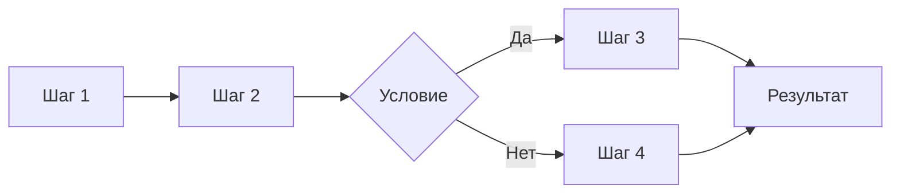
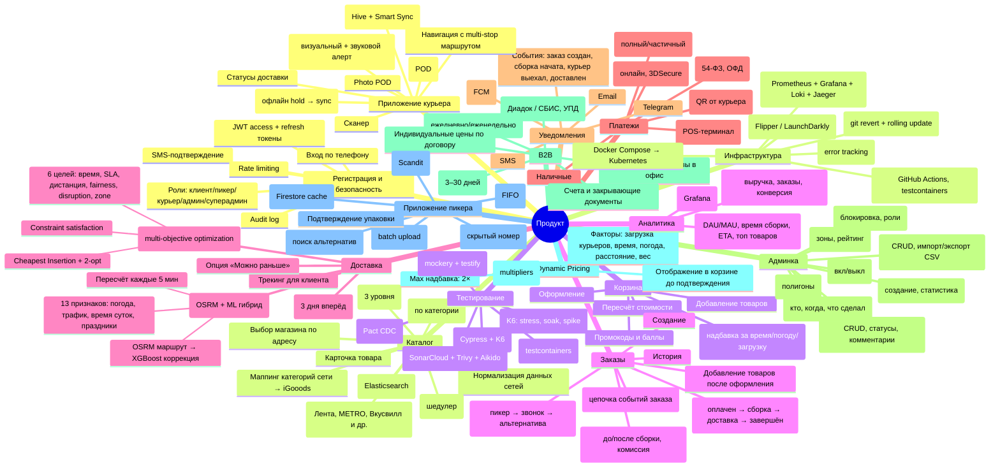
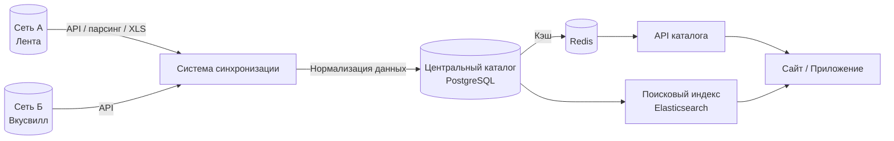
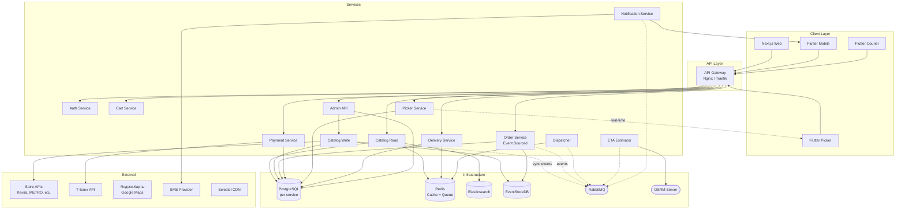
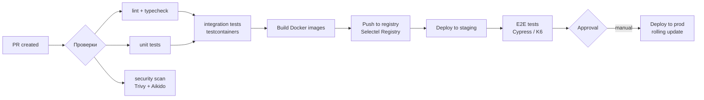
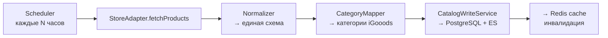

# Шаблон спецификации продукта

> **Назначение:** Описать бизнес-процессы текущей системы так, чтобы команда разработки могла оценить сроки и реализовать продукт-аналог.
>
> **Как работать с документом:**
> 1. Выделить все сквозные бизнес-процессы системы
> 2. Каждый процесс описать по шаблону раздела 2
> 3. После описания всех процессов — собрать итоговые оценки (раздел 3)
> 4. На основе процессов сформировать карту требований (раздел 4)

---

## 1. Общая информация о продукте

| Поле | Значение |
|---|---|
| **Название продукта** | |
| **Назначение** | Доставка продуктов из супермаркетов (агрегатор, не свой склад) |
| **Целевая аудитория** | B2C (покупатели), B2B (корпоративные заказы в офис) |
| **Ключевые бизнес-метрики** | Кол-во заказов/день, выручка, средний чек, конверсия, время сборки, время доставки |
| **Текущее состояние** | |
| **Платформы** | Web (Next.js), iOS, Android (ru.handh.igooods), Huawei AppGallery, RuStore |
| **Технологический стек** | Backend: Ruby on Rails 5.1+ (см. `references/github/dependencies/backend-gemfile`) · Frontend: Next.js 10 + React 17 + MobX (см. `references/github/dependencies/frontend-package.json`) · Mobile: Flutter (iOS/Android) · DB: PostgreSQL · Cache: Redis · CDN: Selectel · Docker Compose для локальной разработки (референс: [nextjs-rails-postgresql-docker](https://github.com/wimpykid719/nextjs-rails-postgresql-docker)) |

### 1.1 Технологический стек (детально)

| Уровень | Технология | Версия | Назначение |
|---|---|---|---|
| **Backend** | Ruby on Rails | 5.1+ | API, бизнес-логика, админка |
| | Ruby | 2.6–2.7 | Язык рантайма (см. Gemfile) |
| | Sidekiq | ~6.x | Фоновые задачи (уведомления, синхронизация) |
| **Frontend** | Next.js | 10 | SSR + SPA-роутинг |
| | React | 17 | UI-компоненты |
| | MobX | ~6.x | State management |
| **Mobile** | Flutter | 3.x | Кроссплатформенное мобильное приложение |
| **Базы данных** | PostgreSQL | 13+ | Основное хранилище |
| | Redis | 6+ | Кэш, очередь (Sidekiq), сессии |
| | Elasticsearch | 7.x | Поисковый индекс (каталог товаров) |
| **Инфраструктура** | Selectel | — | Облако, CDN (изображения товаров) |
| | Docker / Docker Compose | — | Локальная разработка, тестовые среды |
| | Nginx | — | Reverse proxy, API Gateway |
| **Мониторинг** | Sentry | — | Error tracking (backend + mobile) |
| | Prometheus + Grafana | — | Метрики + дашборды |
| | Jaeger | — | Distributed tracing |
| **Платежи** | Т-Банк API | — | Онлайн-оплата |
| | СБП (QR) | — | Оплата при получении |

*Детальный разбор зависимостей:* `references/github/dependencies/`

### 1.2 Глоссарий

#### Роли
| Термин | Определение |
|---|---|
| **Пикер** | Сотрудник, который находится в торговом зале супермаркета и собирает товары по списку заказа. Использует мобильное приложение (Picker App) со сканером штрихкодов. Проверяет свежесть товаров, упаковывает, при отсутствии товара звонит клиенту для согласования замены. |
| **Курьер** | Водитель-экспедитор на личном автомобиле (категория B). Доставляет заказ от магазина клиенту, принимает оплату (карта/СБП/наличные), оформляет подпись и фото подтверждения доставки. Использует мобильное приложение (Courier App) с навигацией. |
| **Менеджер (Admin)** | Операционный сотрудник, работающий в веб-админке: управляет заказами (статусы, комментирование), товарами, пользователями, промокодами, курьерами, магазинами и зонами доставки. |
| **Супер-админ** | Администратор системы с полным доступом: управление ролями, просмотр audit log, доступ к инфраструктуре. |
| **DevOps** | Инженер, отвечающий за инфраструктуру: CI/CD, серверы, мониторинг, базы данных, развёртывание. |

#### Бизнес-термины
| Термин | Определение |
|---|---|
| **Агрегатор доставки** | Бизнес-модель, при которой сервис не владеет складом/товаром, а доставляет заказы из существующих супермаркетов. Пикеры собирают заказ в торговом зале магазина, сервис берёт комиссию. |
| **Сеть супермаркетов** | Партнёр-ритейлер, с которым интегрирован сервис (Лента, METRO, Вкусвилл, Super Babylon, Утконос МИНИ). Каждая сеть имеет свой API/формат данных, свои цены, ассортимент и зоны доставки. |
| **Сборка заказа (Order Picking)** | Процесс отбора товаров из торгового зала магазина по списку заказа. Включает: перемещение по залу, сканирование штрихкодов, проверку свежести, упаковку, передачу курьеру. |
| **Слот доставки (Delivery Slot)** | Временной интервал, в который клиент ожидает доставку. Стандартный шаг — 1–2 часа. Клиент выбирает из доступных слотов при оформлении. Слоты доступны на сегодня, завтра и до 3 дней вперёд. |
| **Зона доставки (Delivery Zone)** | Географическая область (полигон на карте), закреплённая за магазином. Если адрес клиента попадает в зону — магазин может доставить заказ. Если адрес на пересечении зон — клиент может выбрать магазин. |
| **Замена товара (Substitution)** | Процедура, когда заказанного товара нет в наличии в магазине. Пикер находит альтернативу (тот же бренд/категория/цена), звонит клиенту, предлагает замену. Клиент соглашается, отказывается или просит другой вариант. |
| **Автокурьер** | Курьер, использующий личный автомобиль (не служебный транспорт). Требуются права категории B, знание города. Максимальный вес заказа — 80 кг. |
| **Опция «Можно раньше»** | Согласие клиента на доставку раньше выбранного слота, если у сервиса появится «окно». Используется для оптимизации загрузки курьеров. |
| **Товарное соседство** | Правило упаковки: товары с разными требованиями к хранению упаковываются отдельно. Заморозка — в термосумки, химия — отдельно от продуктов, хрупкое — отдельно, мясо/рыба — отдельно от овощей. |

#### Технические термины — каталог и данные
| Термин | Определение |
|---|---|
| **Адаптер сети (Store Adapter)** | Программный модуль, реализующий единый интерфейс `StoreAdapter` для конкретной сети супермаркетов. Скрывает различия в API/форматах каждой сети за общим контрактом (`getProducts`, `getPrices`, `getStocks`, `getCategories`, `searchProducts`). |
| **Нормализация данных (Normalization)** | Приведение данных от сети (разные форматы, названия полей, единицы измерения, вложенность категорий) к единой внутренней схеме БД. Включает: маппинг полей, преобразование единиц, очистку дубликатов. |
| **Маппинг категорий (Category Mapping)** | Сопоставление категорий товаров, пришедших от сети, с категориями каталога iGooods. Один товар сети → одна категория iGooods. Выполняется в админке менеджером. |
| **Динамические фильтры** | Фильтры, которые меняются в зависимости от выбранной категории. Например, для «Молоко» — жирность и обработка; для «Овощи» — вид овоща и сорт. Описываются в таблицах `category_filters` и `filter_values`. |
| **Sync Queue (Smart Sync Queue)** | Механизм офлайн-синхронизации в мобильных приложениях пикера и курьера. Когда нет сети — изменения (отметки о сборке, оплате, подписи) сохраняются локально (Hive/Firestore cache). При восстановлении сети — отправляются batch-запросом с дедупликацией по `updated_at`. |

#### Технические термины — доставка
| Термин | Определение |
|---|---|
| **Dispatch (алгоритм назначения)** | Система, которая решает, какому курьеру и в каком порядке назначить заказы. Использует multi-objective optimization: 6 целей (время доставки, SLA, дистанция, disruption, fairness, zone familiarity). Цикл пересчёта — 15–60 секунд. |
| **Cheapest Insertion Heuristic** | Жадный алгоритм вставки нового заказа в существующие маршруты курьеров. Для каждого возможного места вставки вычисляется прирост стоимости (время/дистанция). Выбирается место с минимальным приростом. |
| **2-opt local search** | Алгоритм улучшения маршрута: перестановка двух рёбер маршрута (разворот подмаршрута). Применяется после Cheapest Insertion для финальной оптимизации. |
| **Constraint satisfaction** | Проверка ограничений при назначении заказа курьеру: вместимость автомобиля, оставшаяся смена (не более 8 ч), дедлайны окон доставки, географическая зона. |
| **OSRM (Open Source Routing Machine)** | Сервер для построения маршрутов и расчёта дистанций на основе OpenStreetMap. Используется для базового ETA (без учёта трафика). API: Table (матрица расстояний), Route (геометрия маршрута). |
| **ETA (Estimated Time of Arrival)** | Прогнозируемое время прибытия курьера к клиенту. Рассчитывается гибридным методом: OSRM (базовый маршрут) + ML-коррекция (XGBoost/Ridge Regression, учитывает погоду, трафик, время суток, праздники). |

#### Архитектурные паттерны
| Термин | Определение |
|---|---|
| **Микросервисная архитектура** | Архитектурный стиль, при котором система состоит из множества небольших независимых сервисов (Auth, Catalog, Order, Payment, Delivery, Dispatcher, ETA, Notifications и др.), каждый со своей БД и API. Сервисы общаются через RabbitMQ (events) и REST/gRPC (синхронные запросы). |
| **DDD (Domain-Driven Design)** | Подход к проектированию, при котором архитектура следует бизнес-доменам. Каждый домен (Catalog, Order, Delivery) имеет свои модели, правила и язык (Ubiquitous Language). Границы доменов фиксируются Bounded Context'ами. |
| **CQRS (Command Query Responsibility Segregation)** | Разделение операций на команды (запись: создание/изменение) и запросы (чтение). Позволяет оптимизировать модели чтения и записи по-разному. В архитектуре: Catalog Write Service (PostgreSQL + EventStoreDB) vs Catalog Read Service (MongoDB/Elasticsearch). |
| **Event Sourcing** | Хранение состояния системы как последовательности событий (event stream), а не текущего состояния. Каждое изменение — событие (OrderCreated, PaymentReceived, PickerAssigned). Позволяет восстановить любое предыдущее состояние и получить полный аудит. |
| **Vertical Slice Architecture** | Организация кода, при которой каждая фича (use case) реализуется сквозным «срезом»: handler → use case → repository. В отличие от слоёной архитектуры, где код группируется по техническому признаку (контроллеры, сервисы, репозитории). |
| **Event-Driven Architecture** | Архитектура, в которой сервисы общаются через асинхронные события. Сервис-источник публикует событие в RabbitMQ, сервисы-подписчики реагируют. Пример: Order Service публикует `order.created` → Dispatcher назначает курьера → ETA Estimator считает время. |
| **Feature Flag (функциональный переключатель)** | Механизм включения/выключения функциональности без деплоя кода. Позволяет: включать фичи для ограниченной аудитории (canary), мгновенно отключать проблемные фичи, делать CI/CD без ветвления. |

#### Инфраструктура
| Термин | Определение |
|---|---|
| **Окружения (Environments)** | Изолированные копии системы: **dev** (локальная разработка, Docker Compose), **staging** (интеграционное тестирование на Selectel VM, общая БД), **prod** (продуктив, PostgreSQL RDS). |
| **CI/CD (Continuous Integration / Continuous Delivery)** | Автоматизация сборки, тестирования и развёртывания. GitHub Actions: PR → lint + unit + security → integration (testcontainers) → build + push → deploy staging → E2E → approval → deploy prod (rolling update). |
| **Rolling update** | Стратегия деплоя без downtime: экземпляры сервиса заменяются по одному. Новый экземпляр запускается, проверяется healthcheck, старый останавливается. При ошибке — автоматический rollback. |
| **Rollback** | Откат версии сервиса на предыдущую стабильную. Процедура: `git revert` → CI билдит предыдущий Docker-образ → rolling update сервиса → проверка метрик (Grafana + Sentry). |
| **Error Budget** | Бюджет ошибок: допустимое время недоступности сервиса за период. При 99.9% SLO — 43 минуты в месяц. Если бюджет исчерпан — новые деплои блокируются. |
| **Observability stack** | Набор инструментов мониторинга: Prometheus (метрики), Grafana (дашборды), Loki (логи), Jaeger (трассировка), Sentry (ошибки). Каждый микросервис экспортирует `/metrics` и отправляет структурированные логи. |

#### Юридические и регуляторные термины
| Термин | Определение |
|---|---|
| **152-ФЗ «О персональных данных»** | Федеральный закон, регулирующий сбор, хранение и обработку персональных данных граждан РФ. Требует: согласие на обработку, шифрование ПДн, уведомление Роскомнадзора, возможность удаления данных. |
| **54-ФЗ «О применении ККТ»** | Федеральный закон, обязывающий выдавать фискальный чек при каждой операции продажи/возврата. Чек передаётся в ОФД и клиенту (SMS/Email). Формат фискальных данных — ФФД 1.2. |
| **Честный знак (ЦРПТ)** | Российская система маркировки товаров. Обязательна для: табака, обуви, одежды, молочной продукции, воды, пива. При продаже — DataMatrix код выводится из оборота через API ЦРПТ. |
| **ЕГАИС** | Единая государственная автоматизированная система учёта алкоголя. Требуется при продаже алкогольной продукции (в текущей спецификации — алкоголь не доставляется). |
| **ОФД (Оператор фискальных данных)** | Провайдер, который получает фискальные чеки от кассы, проверяет, передаёт в ФНС и хранит. Без ОФД невозможно применять ККТ. |
| **ЭДО (Электронный документооборот)** | Система обмена юридически значимыми электронными документами (счета, акты, УПД) между организациями через оператора (Диадок, СБИС). Используется для B2B-заказов. |
| **УПД (Универсальный передаточный документ)** | Документ, совмещающий функции счёта-фактуры и акта/накладной. Используется при B2B-продажах для закрытия сделки. Передаётся через ЭДО. |
| **ЗоЗПП (Закон о защите прав потребителей)** | Регулирует отношения между продавцом и покупателем-физлицом. Право на возврат товара надлежащего качества в течение 7–14 дней, на возврат бракованного товара — полная компенсация. |

---

### 1.3 Non-Functional Requirements (NFR)

*Сводка нефункциональных требований. Детали — в соответствующих подразделах Раздела 5.*

#### 1.3.1 Performance и ёмкость

| Требование | Цель (SLO) | Приоритет | Детали |
|---|---|---|---|
| **Время ответа API каталога** | p95 < 500ms | Must | 5.11 |
| **Время ответа API заказа** | p95 < 200ms | Must | 5.11 |
| **Время ответа dispatch (1000 заказов)** | < 5 сек за цикл | Must | 5.9.4 |
| **RPS каталога (MVP → V3)** | 50 → 500 → 5000 | Should | 5.11 |
| **RPS оформления заказа** | 5 → 50 → 500 | Should | 5.11 |
| **Время сборки заказа (среднее)** | < 30 мин | Must | 5.11 |
| **Время доставки (среднее)** | < 60 мин (город) | Must | 5.11 |
| **Ёмкость системы (заказов/день)** | 100 (MVP) → 1000 (V2) → 10000 (V3) | Must | 5.11 |

#### 1.3.2 Availability и надёжность

| Требование | Цель | Приоритет | Детали |
|---|---|---|---|
| **Uptime (исключая плановые окна)** | 99.9% | Must | 5.11 |
| **Error budget** | 43 мин/месяц | Must | 5.11 |
| **Плановое окно обслуживания** | 02:00–04:00 МСК, не чаще 1 раза в месяц | Should | 5.15 |
| **At-least-once delivery событий** | Все события RabbitMQ доставляются минимум 1 раз | Must | — |
| **Idempotent обработка заказов** | Повторная отправка события не создаёт дубликат заказа | Must | — |
| **Circuit breaker для внешних API** | При 5+ ошибках подряд — переключение на fallback (кэш/офлайн) | Should | — |
| **Dead letter queue** | Необработанные события — в DLQ, алерт оператору | Should | — |

#### 1.3.3 Масштабируемость

| Требование | Решение | Приоритет |
|---|---|---|
| **Горизонтальное масштабирование** | Stateless сервисы (API Gateway, Catalog Read, ETA) — добавление реплик. Stateful (Order, Payment) — через read replicas БД | Must |
| **Базы данных** | PostgreSQL — connection pooling (PgBouncer) + read replicas. Redis — Cluster mode. Elasticsearch — sharding | Should |
| **Очереди** | RabbitMQ — увеличение consumer'ов для тяжёлых очередей (sync, dispatch) | Must |
| **CDN** | Selectel CDN для изображений товаров — не нагружать backend | Must |
| **Автоскейлинг** | V2+: Kubernetes HPA по CPU/RPS | Could |

#### 1.3.4 Безопасность

| Требование | Цель | Приоритет | Детали |
|---|---|---|---|
| **Аутентификация** | JWT access (15 мин) + refresh (30 дней, rotation) | Must | 5.13 |
| **Авторизация (RBAC)** | 5 ролей: клиент, пикер, курьер, менеджер, супер-админ | Must | 5.13 |
| **Шифрование в покое** | ПДн (телефон, email) — AES-256 на уровне столбцов БД | Must | 5.13 |
| **Шифрование в транзите** | TLS 1.3 для всех внешних соединений | Must | 5.13 |
| **Rate limiting** | 100 req/min на пользователя, 1000 req/min на IP | Must | 5.13 |
| **Аудит** | `audit_log` — кто, когда, что сделал. Хранение — 1 год | Must | 5.13 |
| **SAST / dependency scan** | Каждый PR — SonarCloud + Aikido + Trivy | Should | 5.9.1 |
| **Secret management** | GitHub Secrets / Vault, ротация каждые 90 дней | Must | 5.13 |

#### 1.3.5 Надёжность данных и восстановление

| Требование | Цель | Приоритет |
|---|---|---|
| **Резервное копирование БД** | PostgreSQL — daily full backup + WAL streaming (point-in-time recovery). Retention: 30 дней | Must |
| **RPO (Recovery Point Objective)** | < 1 час (допустимая потеря данных) | Should |
| **RTO (Recovery Time Objective)** | < 4 часа (время восстановления после отказа) | Should |
| **Disaster Recovery** | Реплика в другом дата-центре Selectel (асинхронная) | Could |

#### 1.3.6 Наблюдаемость

| Требование | Решение | Приоритет | Детали |
|---|---|---|---|
| **Метрики** | Prometheus — `/metrics` на каждом сервисе | Must | 5.7.5 |
| **Дашборды** | Grafana — `services-overview`, `business-metrics`, `slo-violations` | Must | 5.7.5 |
| **Логи** | Loki + Promtail — JSON-structured, централизованный сбор | Must | 5.7.5 |
| **Трассировка** | Jaeger — OpenTelemetry на критических сценариях (оформление заказа, оплата) | Should | 5.7.5 |
| **Error tracking** | Sentry — backend (Rails/Go) + mobile (Flutter). Алерт на каждый новый error type | Must | 5.7.5 |
| **Uptime мониторинг** | Uptime Kuma / Grafana — проверка healthcheck каждого сервиса раз в 1 мин | Must | — |

#### 1.3.7 Удобство использования (Usability)

| Требование | Цель | Приоритет |
|---|---|---|
| **Время загрузки мобильного приложения** | < 3 сек (холодный старт) | Should |
| **Время отклика UI** | p95 < 200ms (веб), < 300ms (mobile) | Should |
| **Offline-режим пикера** | Заказ остаётся на экране при потере сети, отметки о сборке — в локальной очереди | Must |
| **Offline-режим курьера** | Навигация, оплата, подпись — работают без интернета | Must |
| **Адаптивный дизайн (Web)** | Mobile + Desktop (mobile-first) | Should |
| **Доступность (Accessibility)** | WCAG 2.1 AA для веб-версии | Could |

#### 1.3.8 Портативность и совместимость

| Требование | Цель | Приоритет |
|---|---|---|
| **Web-браузеры** | Chrome, Firefox, Safari, Edge — последние 2 мажорные версии | Must |
| **iOS** | iOS 15+ | Must |
| **Android** | Android 11+ | Must |
| **Доп. платформы** | Huawei AppGallery, RuStore | Should |
| **API** | RESTful (JSON) + Swagger/OpenAPI документация для всех публичных эндпоинтов | Should |

#### 1.3.9 Maintainability (удобство поддержки)

| Требование | Цель | Приоритет |
|---|---|---|
| **Code coverage** | > 80% (unit), критические сценарии — > 90% | Should |
| **Линтеры и статический анализ** | RuboCop (Rails), golangci-lint (Go), ESLint (Next.js) | Should |
| **Документация** | Swagger для API, ADR для архитектурных решений, README для каждого сервиса | Should |
| **Feature flags** | Flipper (Rails) / LaunchDarkly — включение/выключение фич без деплоя | Should |
| **Quality gate в CI** | SonarCloud — блокировка PR при падении coverage или новых когнитивных сложностях | Should |

#### 1.3.10 Хранение данных и retention

| Тип данных | Срок хранения | Основание | Приоритет |
|---|---|---|---|
| **Заказы и платежи** | 3 года | Налоговое законодательство (ст. 23 НК РФ) | Must |
| **Персональные данные** | До запроса на удаление | 152-ФЗ | Must |
| **Audit log** | 1 год | Политика безопасности | Must |
| **Логи приложений (Loki)** | 90 дней | Практика | Should |
| **Кэш Redis (цены/остатки)** | 15 мин (TTL) | Актуальность данных | Must |
| **Изображения товаров (CDN)** | Пока товар активен + 30 дней | — | Should |
| **Неисполненные offline-очереди** | 7 дней (после — алерт оператору) | Целостность данных | Should |

#### Приоритеты NFR (легенда)

| Приоритет | Значение |
|---|---|
| **Must** | Без этого требования продукт не может быть запущен в MVP |
| **Should** | Важно, но можно отложить до V2 при дефиците ресурсов |
| **Could** | Желательно, но реализуется при наличии времени/средств |

### 1.4 Сводная таблица внешних интеграций

*Все внешние системы, с которыми взаимодействует продукт.*

#### Платёжные системы

| Система | Назначение | Тип интеграции | Данные | Критичность | BP |
|---|---|---|---|---|---|
| **Т-Банк API** | Онлайн-оплата заказов | REST API + Webhook | Сумма, order_id, success_url, fail_url → payment_url; callback об оплате | CRITICAL | BP-04 |
| **СБП (QR)** | Оплата при получении через СБП | QR-код, генерируется в приложении курьера | Сумма, order_id → QR; уведомление об оплате | HIGH | BP-04 |
| **Платёжный шлюз для карт курьеру** | POS-терминал курьера (карта) | Внешний POS-терминал (Sberbank / Т-Банк эквайринг) | Сумма, карта (терминал не наш) | MEDIUM | BP-04 |

#### Сети супермаркетов (адаптеры)

| Система | Назначение | Тип интеграции | Данные | Критичность | Раздел |
|---|---|---|---|---|---|
| **Лента API** | Каталог, цены, остатки | REST API Gateway (Qrator, Angular SSR + collections) | Товары, цены, категории, акции, остатки | CRITICAL | 5.14 |
| **METRO API** | Каталог, цены, остатки | TBD (парсинг / API) | Товары, цены, остатки | HIGH | 5.14 |
| **Вкусвилл API** | Каталог, цены, остатки | MCP JSON-RPC | Товары, цены, остатки | HIGH | 5.14 |
| **Super Babylon** | Каталог, цены, остатки | Парсинг / XLS | Товары, цены | MEDIUM | 5.14 |
| **Утконос МИНИ** | Каталог, цены, остатки | API / парсинг | Товары, цены | MEDIUM | 5.14 |

#### Карты и геоданные

| Система | Назначение | Тип интеграции | Данные | Критичность | BP |
|---|---|---|---|---|---|
| **Яндекс.Карты / Google Maps** | Геокодирование адреса, проверка зоны доставки | REST API (геокодер) | Адрес → координаты | HIGH | BP-03 |
| **Google Maps SDK** | Навигация курьера, отображение на карте | Mobile SDK (Flutter) | Маршрут, геометрия, ETA | HIGH | BP-06 |
| **Google Directions API** | Multi-stop маршруты, ETA | REST API | Точки → маршрут, дистанция, время | HIGH | BP-06 |
| **OSRM (Open Source Routing Machine)** | Матрица дистанций для dispatch + ETA | HTTP API (Table + Route) | Магазин, адреса → дистанция, длительность | HIGH | BP-06 |

#### Уведомления и коммуникации

| Система | Назначение | Тип интеграции | Данные | Критичность | BP |
|---|---|---|---|---|---|
| **SMS-провайдер** | SMS-код аутентификации, уведомления о статусе | SMS API | Телефон, текст сообщения | HIGH | BP-01, BP-09 |
| **Firebase Cloud Messaging (FCM)** | Push-уведомления (Android + iOS) | Firebase SDK | Устройство → push-уведомление | HIGH | BP-09 |
| **Apple Push Notification (APNs)** | Push-уведомления (iOS) | APNs через FCM | Устройство → push | HIGH | BP-09 |
| **Telegram (@igooodssupportbot)** | Поддержка клиентов, изменение заказа | Telegram Bot API | ID чата, текст сообщения | MEDIUM | BP-03 |

#### Мобильная инфраструктура

| Система | Назначение | Тип интеграции | Данные | Критичность | BP |
|---|---|---|---|---|---|
| **Firebase Firestore** | Real-time база приложения пикера (список заказов, офлайн-кэш) | Firestore SDK (Flutter) | Заказы, статусы сборки, замены | HIGH | BP-05 |
| **Firebase Auth** | Аутентификация пикера в приложении | Firebase SDK | Телефон, токен | HIGH | BP-05 |
| **Firebase Crashlytics** | Error tracking мобильных приложений | Firebase SDK | Stacktrace, логи | MEDIUM | BP-05, BP-06 |
| **Scandit SDK** | Сканер штрихкодов в приложении пикера | Mobile SDK (Flutter) | Штрихкод → данные товара | HIGH | BP-05 |

#### Юридические и фискальные

| Система | Назначение | Тип интеграции | Данные | Критичность | Раздел |
|---|---|---|---|---|---|
| **ОФД (Оператор фискальных данных)** | Фискализация чеков (54-ФЗ) | REST API / JSON | Чек (сумма, товары, ставка НДС) → фискальный признак | CRITICAL | 5.12 |
| **Честный знак (ЦРПТ)** | Вывод из оборота маркированных товаров | REST API | DataMatrix код товара | MEDIUM (MVP — не требуется) | 5.12 |
| **ЭДО (Диадок / СБИС)** | Обмен УПД, счетами для B2B | REST API / API ЭДО | УПД, счёт, акт | HIGH (B2B) | BP-13 |

#### Погода и внешние данные

| Система | Назначение | Тип интеграции | Данные | Критичность | BP |
|---|---|---|---|---|---|
| **OpenWeather API** | Погода для ETA (коррекция времени доставки) и Dynamic Pricing | REST API | Координаты → температура, осадки, ветер | MEDIUM | BP-06, BP-14 |
| **Календарь праздников** | Праздничные дни для Dynamic Pricing | Статический файл / API | Дата → флаг праздника | LOW | BP-14 |

#### Инфраструктура

| Система | Назначение | Тип интеграции | Данные | Критичность | Раздел |
|---|---|---|---|---|---|
| **Selectel Cloud** | Облачная инфраструктура (серверы, CDN, объектное хранилище) | API / Console | Образы Docker, статика, изображения товаров | CRITICAL | 5.10 |
| **Selectel CDN** | Раздача изображений товаров | CDN (HTTP) | Изображения | HIGH | BP-02 |
| **GitHub Actions** | CI/CD пайплайн | SaaS | Код → сборка → тесты → деплой | CRITICAL | 5.10 |
| **Docker Registry (Selectel)** | Хранение Docker-образов | Container Registry API | Образы сервисов | CRITICAL | 5.10 |

#### Публикация мобильных приложений

| Платформа | Назначение | Процесс | Критичность |
|---|---|---|---|
| **App Store (iOS)** | Публикация приложений клиента, пикера, курьера | TestFlight → App Store Review (1–3 дня) | HIGH |
| **Google Play (Android)** | Публикация приложений клиента, пикера, курьера | Internal Testing → Production | HIGH |
| **Huawei AppGallery** | Публикация для устройств Huawei | Ручная выгрузка .apk | MEDIUM |
| **RuStore** | Публикация для РФ | Ручная выгрузка | MEDIUM |

#### Итого: 30+ внешних систем

| Категория | Кол-во | CRITICAL | HIGH | MEDIUM | LOW |
|---|---|---|---|---|---|
| Платёжные системы | 3 | 1 | 1 | 1 | 0 |
| Сети супермаркетов | 5 | 1 | 2 | 2 | 0 |
| Карты и геоданные | 4 | 0 | 4 | 0 | 0 |
| Уведомления и коммуникации | 4 | 0 | 3 | 1 | 0 |
| Мобильная инфраструктура | 4 | 0 | 3 | 1 | 0 |
| Юридические и фискальные | 3 | 1 | 1 | 1 | 0 |
| Погода и внешние данные | 2 | 0 | 0 | 1 | 1 |
| Инфраструктура | 4 | 3 | 1 | 0 | 0 |
| Публикация приложений | 4 | 0 | 2 | 2 | 0 |
| **Всего** | **33** | **6** | **17** | **9** | **1** |

### 1.5 Обработка исключительных ситуаций (Error Handling)

*Описание поведения системы при отказах внешних систем, внутренних сервисов и нештатных бизнес-сценариях.*

#### 1.5.1 Отказы внешних систем

| Система | Тип отказа | Реакция системы | Действие оператора |
|---|---|---|---|
| **Сеть магазина (Лента, METRO и др.)** | API недоступен (5xx, timeout) | 1. Используем последние синхронизированные цены/остатки (кэш Redis, TTL 15 мин · но если API недоступен > 30 мин — помечаем сеть как «нет данных») 2. Заказы по этой сети не принимаются, в UI — «Магазин временно недоступен» 3. При синхронизации — retry 3 раза с exponential backoff, затем DLQ | Связаться с техподдержкой сети. Alert в Sentry после 3-го отказа |
| | Данные повреждены (невалидный JSON, несоответствие схеме) | 1. Пропускаем повреждённый объект, логируем 2. Предыдущие корректные данные остаются в БД 3. Алерт разработчику | Проверить формат данных сети, обновить адаптер |
| **Т-Банк API** | Платёжный шлюз не отвечает | 1. Пользователь видит «Оплата временно недоступна. Попробуйте позже или выберите другой способ оплаты» 2. Заказ остаётся со статусом «Ожидает оплаты» 3. Retry через 30 сек (макс. 3 попытки), затем алерт | Проверить статус шлюза (status.tbank.ru) |
| | Платёж отклонён банком | 1. Пользователь видит причину отказа (недостаточно средств, карта не поддерживается) 2. Предлагаем другой способ оплаты 3. Заказ не отменяется, ожидает 30 мин | Не требуется |
| | Webhook не пришёл | 1. Polling статуса платежа каждые 10 сек в течение 2 мин 2. Если не пришёл — запрос статуса в Т-Банк API 3. После 2 мин — заказ отменяется, refund | Ручная проверка платежа |
| **SMS-провайдер** | Не отправляется SMS | 1. Retry 3 раза с интервалом 5 сек 2. Если все неудачны — fallback на голосовой звонок с кодом (если доступен) 3. Иначе — ошибка пользователю «Не удалось отправить код. Попробуйте позже» | Проверить баланс SMS-провайдера |
| **Яндекс.Карты / геокодер** | API недоступен | 1. Fallback на Google Maps геокодер 2. Если оба недоступны — пользователь вводит адрес вручную (текст), без проверки зоны доставки. Менеджер подтверждает вручную | Проверить статус API |
| **OSRM сервер** | Не отвечает | 1. ETA считается только по ML-модели (без OSRM-базы) на основе последнего известного расстояния 2. Dispatch использует геодезическое расстояние (haversine) вместо дорожного | Перезапустить OSRM-сервер |
| **OpenWeather API** | Не отвечает | 1. ETA — только OSRM-база, без погодной коррекции 2. Dynamic Pricing — без weather-фактора | Не требуется (некритично) |
| **Firebase Firestore** | Недоступен | 1. Приложение пикера работает офлайн (последние кэшированные данные) 2. Новые заказы не приходят в реальном времени — polling через REST API каждые 10 сек 3. Отметки о сборке — в локальную очередь (Hive) | Проверить Firebase Console (статус firebase.google.com) |
| **Selectel CDN** | Изображения не загружаются | 1. Показываем placeholder-изображение товара 2. Fallback на direct URL из Selectel object storage (минуя CDN) | Проверить статус CDN |

#### 1.5.2 Отказы внутренних сервисов

| Сервис | Тип отказа | Реакция системы | Действие оператора |
|---|---|---|---|
| **PostgreSQL** | Недоступна (одна из) | 1. Сервис, владеющий этой БД, перестаёт отвечать (503) 2. API Gateway редиректит запросы на fallback (кэшированные данные) 3. Если недоступна БД заказов — новые заказы не создаются, в UI — «Ведутся технические работы» 4. Автоматический failover на read replica (5–30 сек) | Проверить статус PostgreSQL, запустить WAL replay |
| **Redis** | Недоступен | 1. Кэш каталога не работает — запросы идут напрямую в PostgreSQL (деградация производительности) 2. Сессии пользователей сброшены — требуется повторный вход 3. Sidekiq не может взять задачи — очередь растёт в Redis-буфере | Перезапустить Redis, проверить AOF/RDB |
| **RabbitMQ** | Недоступен | 1. Event-driven коммуникация останавливается 2. События теряются (не persistent) или буферизируются у отправителя 3. Заказы создаются, но dispatch/уведомления не отправляются 4. При восстановлении — очередь освобождается | Перезапустить RabbitMQ, проверить очереди на целостность |
| **Elasticsearch** | Недоступен | 1. Поиск по каталогу работает через PostgreSQL `ILIKE` (без фильтров) 2. Динамические фильтры не работают | Перезапустить ES, проверить shards |
| **API Gateway (Nginx)** | Недоступен | 1. Все внешние запросы не проходят (502) 2. DNS TTL — 5 мин (настроить на резервный Gateway) | Перезапустить Nginx, проверить upstreams |
| **Dispatcher (dispatch)** | Не отвечает > 30 сек | 1. Заказы не назначаются курьерам 2. Order service публикует `dispatch.timeout_exceeded` 3. Менеджер в админке видит заказы в статусе «Требует назначения» и назначает курьера вручную | Перезапустить dispatch service |

#### 1.5.3 Бизнес-исключения (сценарии)

| Сценарий | Обработка |
|---|---|
| **Товара нет в наличии в магазине** | BP-05: замена (7-шаговый сценарий: поиск альтернатив → звонок клиенту → фиксация). Если клиент не берёт трубку — товар остаётся в заказе без замены, клиент может отказаться при получении |
| **Заказ не подтверждён > 30 мин после создания** | Автоматическая отмена заказа (статус «Отменён по таймауту»). Уведомление пользователю |
| **Платёж не прошёл > 30 мин** | Автоматическая отмена заказа. Уведомление: «Заказ отменён — оплата не получена» |
| **Курьер не назначен > 5 мин** | Эскалация: повторный dispatch через 30 сек (до 3 раз). Если не назначен — алерт менеджеру в админку, ручное назначение |
| **Курьер опаздывает > 15 мин от ETA** | Push-уведомление клиенту: «Курьер задерживается. Новое ETA: ...». Алерт менеджеру |
| **Офлайн-очередь пикера не синхронизируется > 1 час** | Алерт оператору: пикер может быть в зоне без связи. Менеджер связывается с пикером по телефону |
| **Офлайн-очередь курьера не синхронизируется > 2 часа** | Алерт оператору: курьер может быть в зоне без связи или проблемы с приложением. Менеджер связывается с курьером |
| **Клиент не получает SMS 3 раза подряд** | Блокировать отправку SMS на 1 час. Уведомить поддержку (Telegram бот). Предложить клиенту альтернативный способ входа |
| **Пикер не начал сборку > 15 мин после назначения** | Эскалация: алерт менеджеру. Менеджер перераспределяет заказ другому пикеру |
| **Вес заказа превышает 80 кг** | Блокировка оформления. UI: «Максимальный вес заказа — 80 кг. Уменьшите количество товаров или разделите на 2 заказа» |
| **Адрес вне зоны доставки** | UI: «К сожалению, мы пока не доставляем по этому адресу. Попробуйте другой адрес или выберите другой магазин». Предложить ближайшие доступные магазины |
| **Feature flag выключен** | UI: фича скрыта/отключена. Backend: эндпоинт возвращает 404. Данные: не собираются. |

#### 1.5.4 Dead Letter Queue (DLQ) политика

| Очередь (RabbitMQ) | Причина попадания в DLQ | Действие | Периодичность проверки |
|---|---|---|---|
| `order.sync` | Синхронизация заказа с сетью магазина не удалась после 3 retry | Алерт разработчику, ручная синхронизация | 1 раз/день |
| `payment.process` | Платёж не обработан после 3 retry | Алерт, ручная проверка платежа | 1 час |
| `notification.send` | Уведомление (push/SMS) не отправлено после 3 retry | Логирование, повтор при следующем событии | Не требуется |
| `delivery.dispatch` | Назначение курьера не удалось | Эскалация менеджеру (см. выше) | 5 мин |
| `eta.calculate` | ETA не рассчитан | Fallback на OSRM baseline (без ML) | Не требуется |

#### 1.5.5 Матрица timeout'ов

| Компонент | Timeout | Retry | Fallback |
|---|---|---|---|
| Store API (сеть) | 10 сек | 3 (exponential backoff: 1s, 3s, 9s) | Последний кэш (Redis) |
| Т-Банк API | 15 сек | 3 (5s, 15s, 30s) | Предложить другой способ оплаты |
| Геокодер | 5 сек | 2 | Альтернативный геокодер |
| OSRM | 5 сек | 1 | Haversine distance |
| OpenWeather | 3 сек | 1 | Пропустить фактор погоды |
| SMS-провайдер | 10 сек | 3 | Голосовой звонок / ошибка |
| Firebase Firestore | 10 сек | 3 (SDK > автоматически) | Polling REST API |

---

## 2. Каталог бизнес-процессов

### 2.1 Структура описания одного процесса
```yaml
ИДЕНТИФИКАТОР: BP-{N}
НАЗВАНИЕ:       {Краткое название}
ВЛАДЕЛЕЦ:       {Роль, кто отвечает за процесс}
ТРИГГЕР:        {Что запускает процесс}
РЕЗУЛЬТАТ:      {Что считается успешным завершением}
```

#### 2.1.1 Бизнес-шаги



| № | Шаг | Участник | Система | Действие | Бизнес-правило |
|---|---|---|---|---|---|
| 1 | | | | | |
| 2 | | | | | |
| ... | | | | | |

**Альтернативные сценарии:**
- **Ошибка 1:** {что идёт не так} → {как система обрабатывает}
- **Ошибка 2:** {что идёт не так} → {как система обрабатывает}

#### 2.1.2 Данные процесса

| Сущность | Поля | Где хранится | Связи |
|---|---|---|---|
| `{entity_1}` | {перечень полей} | {БД/таблица} | {связи с другими сущностями} |
| `{entity_2}` | {перечень полей} | {БД/таблица} | {связи} |

#### 2.1.3 UI / Интерфейсы

| Экран / Компонент | Роль | Действия | Данные для отображения |
|---|---|---|---|
| {название экрана} | {кто видит} | {что можно сделать} | {какие данные показывает} |
| | | | |

#### 2.1.4 Интеграции (внешние системы)

| Система | Назначение | Данные | Направление |
|---|---|---|---|
| {банк / CRM / склад} | {зачем} | {какие данные передаются} | входящая / исходящая |
| | | | |

#### 2.1.5 Бизнес-правила и логика

```
Если {условие} → {действие}
При {ситуация} → {исключение / альтернатива}
Формула: {расчёт значения}
```

#### 2.1.6 Технические заметки для разработки

- {особенности реализации}
- {сложные моменты}
- {потенциальные узкие места}

#### 2.1.7 Оценка

| Категория | Трудозатраты (чел.-дней) | Примечание |
|---|---|---|
| Backend | | |
| Frontend (Web) | | |
| Mobile (iOS) | | |
| Mobile (Android) | | |
| DevOps / Infra | | |
| QA | | |
| **Итого на процесс** | **0** | |

---

### 2.2 Шаблоны для заполнения (процессы)

#### BP-01: Регистрация и аутентификация пользователя

<details>
<summary>Развернуть</summary>

| | |
|---|---|
| **Триггер** | Пользователь открывает приложение / сайт |
| **Результат** | Пользователь аутентифицирован, получен токен сессии |
| **Владелец** | User & Auth |

**Шаги:**
| № | Шаг | Участник | Действие | Бизнес-правило |
|---|---|---|---|---|
| 1 | Ввод номера телефона | Пользователь | Вводит номер в поле ввода | Формат: +7XXXXXXXXXX |
| 2 | Отправка SMS с кодом | Система | Генерирует 4-значный код, отправляет через SMS-провайдера | Код жив 5 минут, 3 попытки ввода |
| 3 | Подтверждение кода | Пользователь | Вводит код из SMS | При 3 неверных — блокировка на 30 мин |
| 4 | Создание/поиск профиля | Система | Если номер новый → создаётся профиль, если существующий → вход | |
| 5 | Выдача токена | Система | JWT access + refresh токены | Access — 15 мин, Refresh — 30 дней |

**Данные:**
| Сущность | Поля |
|---|---|
| `users` | id, phone, name, email, role, created_at, updated_at |
| `sessions` | id, user_id, refresh_token, expires_at, device_info |

**UI:**
- Экран ввода номера
- Экран ввода SMS-кода
- Экран профиля (после регистрации)

**Интеграции:**
| Система | Данные |
|---|---|
| SMS-провайдер | Телефон, текст сообщения |

**Бизнес-правила:**
- Если пользователь не завершил регистрацию (не ввёл код) — номер считается незанятым
- Один номер — один аккаунт
- Админы создаются только через бэк-офис

**Оценка:**
| Команда | Дней |
|---|---|
| Backend | 5 |
| Frontend | 3 |
| Mobile | 4 |
| QA | 2 |
| **Итого** | **14** |
</details>

---

#### BP-02: Каталог и поиск товаров

<details>
<summary>Развернуть</summary>

| | |
|---|---|
| **Триггер** | Пользователь открывает каталог / вводит поисковый запрос |
| **Результат** | Пользователь видит список товаров с ценой, наличием, характеристиками |
| **Владелец** | Catalog / Inventory |

**Шаги:**
| № | Шаг | Участник | Действие | Бизнес-правило |
|---|---|---|---|---|
| 1 | Выбор магазина | Пользователь | Вводит адрес → система показывает доступные магазины | Магазины определяются по зоне доставки адреса |
| 2 | Открытие каталога | Пользователь | Выбирает категорию из списка | Категории — дерево (3 уровня: корневая → подкатегория → товары) |
| 3 | Загрузка товаров | Система | Запрос к БД / кэшу | Пагинация |
| 4 | Фильтрация | Пользователь | Выбирает фильтры (тип, бренд, цена, жирность и т.д.) | Фильтры зависят от категории (динамические) |
| 5 | Поиск | Пользователь | Вводит текст поиска | Поиск по названию, бренду |
| 6 | Отображение | Система | Показывает карточки товаров с ценой и фото | Фото с Selectel CDN |

**Данные:**
| Сущность | Поля |
|---|---|
| `categories` | id, parent_id, name, icon_path, sort_order |
| `category_filters` | id, category_id, filter_name (например «Вид овоща», «Жирность», «Бренд») |
| `filter_values` | id, filter_id, value_name (например «Томаты», «Valio», «20%») |
| `products` | id, name, sku, barcode, price, old_price, category_id, images, attributes (JSONB) |
| `stores` | id, name, chain_id, address, coordinates, working_hours |
| `store_inventory` | store_id, product_id, quantity |

**Структура фильтров (из DATA.js iGooods):**
- Фильтры привязаны к категории, а не глобальные
- Пример для «Молоко и сливки»: Тип (молоко/сливки/козье), Обработка (стерилизованное/УВТ/пастеризованное), Жирность (0–40%), Фермерский продукт, Бренд
- Пример для «Овощи»: Вид овоща (томаты/перец/лук/...), Томаты (сливовидные/черри/...), Бренд

**Источник данных о товарах:**
- Цены и ассортимент получаются от сетей супермаркетов (API или парсинг)
- Актуальность остатков — не гарантирована, пикер проверяет в магазине

**UI:**
- Главная страница каталога (корневые категории с иконками)
- Список товаров (плитка/список, фото, цена, вес)
- Детальная карточка товара
- Поисковая строка
- Фильтры: сайдбар / выезжающая панель

**Бизнес-правила:**
- Цена = базовая цена сети - скидка (если есть акция/промокод)
- Наличие — не гарантируется до фактической сборки пикером
- Если товара нет в магазине — пикер звонит клиенту с вариантами замены
- Алкоголь и сигареты не доставляются (законодательный запрет)

**Оценка:**
| Команда | Дней |
|---|---|
| Backend | 10 |
| Frontend | 6 |
| Mobile | 8 |
| QA | 4 |
| **Итого** | **28** |
</details>

---

#### BP-03: Оформление заказа (Корзина → Заказ)

<details>
<summary>Развернуть</summary>

| | |
|---|---|
| **Триггер** | Пользователь выбирает товары и переходит к оформлению |
| **Результат** | Заказ создан, пикер начал сборку в магазине |
| **Владелец** | Cart → Order |

**Шаги:**
| № | Шаг | Участник | Действие | Бизнес-правило |
|---|---|---|---|---|
| 1 | Выбор магазина | Система | Автоматически выбирает магазин по адресу | Клиент может сменить магазин вручную |
| 2 | Добавление товаров | Пользователь | Выбирает товары из каталога | Можно добавить в заказ после оформления, пока сборка не началась |
| 3 | Применение промокода / баллов | Пользователь | Вводит промокод | Скидка не суммируется с другими акциями |
| 4 | Выбор временного слота | Пользователь | Выбирает дату (сегодня/завтра/+3 дня) и интервал | Слоты зависят от магазина и загрузки курьеров |
| 5 | Выбор адреса доставки | Пользователь | Вводит или выбирает сохранённый | Геокодирование, проверка попадания в зону доставки |
| 6 | Выбор способа оплаты | Пользователь | Онлайн / СБП / Картой курьеру / Наличные | |
| 7 | Подтверждение | Пользователь | Нажимает «Оформить заказ» | Рассчитывается стоимость сборки и доставки |
| 8 | Создание заказа | Система | Статус: «Ожидает оплаты» (для онлайн) или «Принят» (для наличных) | |

**Особенность iGooods:** нет резервирования товаров при добавлении в корзину. Товар резервируется только после создания заказа. Актуальное наличие проверяет пикер в магазине.

**Данные:**
| Сущность | Поля |
|---|---|
| `carts` | id, user_id, store_id, items (JSONB), created_at, updated_at |
| `orders` | id, user_id, store_id, status, total, delivery_fee, service_fee, delivery_address, payment_method, delivery_slot, weight, comment, created_at |
| `order_items` | id, order_id, product_id, quantity, price, substituted (если замена), substituted_from_id |
| `promo_codes` | id, code, type (percent/fixed/delivery), value, max_uses, used_count, min_order_amount, expires_at |
| `loyalty_points` | id, user_id, balance |

**UI:**
- Экран корзины (товары, количество, сумма, промокод)
- Экран оформления (адрес, слот, оплата)
- Экран подтверждения заказа
- Опция «Можно раньше» — согласие на более раннюю доставку

**Интеграции:**
| Система | Данные |
|---|---|
| Геокодер (Яндекс.Карты) | Адрес → координаты, проверка зоны доставки |
| Telegram bot (@igooodssupportbot) | Поддержка, изменение заказа |

**Бизнес-правила:**
- Максимальный вес заказа: 80 кг
- Доставка бесплатна от определённой суммы (настраивается для каждого магазина)
- Можно заказать на сегодня, завтра или на 3 дня вперёд
- После оформления можно добавить товары кнопкой «В заказ» (до начала сборки)
- Время доставки: 10:00–22:00 (МСК)
- Стоимость сборки и доставки рассчитывается перед подтверждением

**Оценка:**
| Команда | Дней |
|---|---|
| Backend | 12 |
| Frontend | 8 |
| Mobile | 10 |
| QA | 4 |
| **Итого** | **34** |
</details>

---

#### BP-04: Оплата заказа

<details>
<summary>Развернуть</summary>

| | |
|---|---|
| **Триггер** | Заказ создан со статусом «Ожидает оплаты» |
| **Результат** | Заказ оплачен (статус: «Оплачен») или отклонён |
| **Владелец** | Payment |

**Шаги:**
| № | Шаг | Участник | Действие | Бизнес-правило |
|---|---|---|---|---|
| 1 | Перенаправление на платёжный шлюз | Система | Формирует ссылку на оплату | Разные ссылки для разных банков |
| 2 | Ввод данных карты | Пользователь | Вводит номер, срок, CVV | Данные не проходят через наш сервер |
| 3 | Обработка платежа | Банк | Списывает средства | 3DSecure при необходимости |
| 4 | Callback от банка | Система | Получает уведомление об успехе/отказе | Webhook + polling |
| 5 | Обновление статуса заказа | Система | Успех → «Оплачен», Отказ → ошибка пользователю | |

**Данные:**
| Сущность | Поля |
|---|---|
| `payments` | id, order_id, amount, status, provider, provider_payment_id, created_at |
| `refunds` | id, payment_id, amount, reason, status |

**Интеграции:**
| Система | Данные | Тип |
|---|---|---|
| **Т-Банк (Тинькофф)** | Сумма, order_id, success_url, fail_url → payment_url | **Основной шлюз** |
| **СБП** | QR-код генерируется курьером при получении | Вторичный |
| Карта курьеру | POS-терминал курьера | Offline |
| Наличные | При получении | Offline |

**Подтверждено с сайта igooods.ru:**
> «Для оплаты необходимо ввести реквизиты карты. Для этого мы перенаправим вас на платёжный шлюз банка Тинькофф. Соединение с платёжным шлюзом и передача информации осуществляется в защищённом режиме с использованием протокола шифрования SSL.»
> «Во время доставки курьер создаст для вас QR-код. Считайте его смартфоном и подтвердите операцию в приложении вашего банка.»

**Бизнес-правила:**
- Онлайн-оплата: перенаправление на шлюз Т-Банка, 3DSecure
- СБП: QR-код от курьера при получении, оплата через приложение банка
- Карта курьеру: POS-терминал на месте
- Наличные: оплата при получении, курьер выдаёт сдачу
- Электронный чек приходит на телефон/email
- Добавление карты: холд 1 руб. для проверки платежеспособности
- Полная стоимость списывается после получения и проверки заказа
- Refund: полный или частичный (по запросу менеджера)

**Оценка:**
| Команда | Дней |
|---|---|
| Backend | 15 |
| Frontend | 3 |
| Mobile | 3 |
| QA | 5 |
| **Итого** | **26** |
</details>

---

#### BP-05: Сборка и упаковка заказа

<details>
<summary>Развернуть</summary>

| | |
|---|---|
| **Триггер** | Заказ оплачен / подтверждён |
| **Результат** | Заказ собран, упакован, передан курьеру |
| **Владелец** | Order Fulfillment |

**Шаги:**
| № | Шаг | Участник | Действие | Бизнес-правило |
|---|---|---|---|---|
| 1 | Поступление заказа пикеру | Система | Заказ появляется в приложении пикера | FIFO |
| 2 | Сборка товаров в зале | Пикер | Идёт по списку, отбирает товары с полок | Выбирает самые свежие (из глубины полки), целые яйца, лучшие овощи/фрукты |
| 3 | Проверка наличия | Пикер | Сверяет товар с заказом | Если товара нет → звонит клиенту, предлагает замену |
| 4 | Замена товара | Пикер + Клиент | Пикер предлагает альтернативу, клиент соглашается или отказывается | Замена фиксируется в системе |
| 5 | Упаковка | Пикер | Фасовка по пакетам, термосумкам, контейнерам | Соблюдение товарного соседства (мясо отдельно, химия отдельно) |
| 6 | Передача курьеру | Пикер | Упакованный заказ передаётся курьеру | Статус → «Передан в доставку» |

**Особенность iGooods:** сборка происходит в торговом зале супермаркета (не на складе). Пикеры — сотрудники iGooods, работают в гипермаркетах.

**UI (внутреннее приложение пикера):**
- Список заказов на сборку
- Детали заказа со списком товаров
- Сканер штрихкодов
- Интерфейс замены товара (выбор альтернативы, звонок клиенту)
- Подтверждение упаковки

**Сценарий замены товара (поэтапно):**

| № | Шаг | Участник | Действие | Бизнес-правило |
|---|---|---|---|---|
| 1 | Обнаружение отсутствия | Пикер | Товара нет на полке → пикер нажимает «Нет в наличии» | Система проверяет, есть ли альтернативы в этом магазине |
| 2 | Поиск альтернатив | Система | Ищет товары той же категории, того же бренда, аналогичной цены | Приоритет: тот же бренд → та же категория → ближайшая цена |
| 3 | Предложение замен | Система | Показывает пикеру список альтернатив (до 5) | Каждая альтернатива с ценой, весом, фото |
| 4 | Звонок клиенту | Пикер | Звонит клиенту через встроенный звонок (скрытый номер) | Вызов не раскрывает личный номер пикера |
| 5 | Выбор альтернативы | Клиент | Соглашается на одну из предложенных или просит другую | Клиент может попросить пикера посмотреть другие варианты |
| 6 | Фиксация замены | Система | Замена записывается в `order_items.substituted_from_id` | Цена замены может отличаться: клиент платит как за замену, а не как за оригинал |
| 7 | Отказ от замены | Клиент | Клиент отказывается от товара | Товар исключается из заказа, стоимость пересчитывается |

**Особенности:**
- Если клиент не берёт трубку — пикер оставляет товар в заказе (без замены), клиент может отказаться при получении
- Замена возможна только на товары **в наличии** в этом магазине (проверка по последней синхронизации)
- Цена замены фиксируется в момент согласия клиента (не меняется при пересчёте корзины)

**Бизнес-правила:**
- Пикер отбирает товары максимально свежие (молоко/яйца — из глубины полки)
- При отсутствии товара → обязательный звонок клиенту
- Упаковка: термосумки для заморозки, отдельно для химии, хрупкое отдельно
- Опция «Меньше пакетов» — экологичная упаковка

**Архитектура приложения пикера (мобильное):**

*Референс:* [heymigrolino-picking-app](https://github.com/gpietro/heymigrolino-picking-app) (Flutter)

| Компонент | Решение | Обоснование |
|---|---|---|
| **Архитектура** | Feature-first (models/screens/state/widgets) | Каждая фича (список заказов, сканер, замена) — изолированная папка |
| **State management** | Provider | Достаточно для простых экранов, нетребователен к ресурсам (средство в зале не флагман) |
| **Build flavors** | `dev`, `dev_gooods`, `prod`, `prod_gooods` | Отдельные конфиги для тестовой и продуктовой среды iGooods |
| **Real-time** | Cloud Firestore listeners (push) | Заказ появляется мгновенно на экране пикера, без polling |
| **Offline** | Firestore offline persistence | Кэширует последние данные локально; при потере сети пикер видит текущий заказ до конца сборки |
| **Сканер штрихкодов** | Scandit (`scandit_flutter_datacapture_barcode`) | Промышленный сканер, работает офлайн, поддержка EAN-13, QR, DataMatrix |
| **Локальное хранение** | Firestore cache (SQLite) | Не требует отдельной БД — Firestore управляет кэшем автоматически |
| **Backend** | Firebase (Auth, Firestore, Crashlytics, Analytics, App Check) | Бессерверная архитектура для MVP пикера |
| **CI/CD** | GitHub Actions — dev на tag push, prod вручную | Раздельные пайплайны для безопасности прода |

**Сценарии работы пикера в офлайне:**
1. **Нет интернета в подвале супермаркета** — последний загруженный заказ остаётся на экране, сканер работает локально, отметки о сборке ставятся в local queue
2. **Восстановление связи** — queue синхронизируется с сервером (batch update), дубли разрешаются по `updated_at`
3. **Замена товара** — пикер звонит клиенту напрямую (голосовая связь, не требует интернета), после подтверждения вводит замену — данные попадают в queue

**Оценка:**
| Команда | Дней |
|---|---|
| Backend (API для пикера) | 8 |
| Mobile (приложение пикера) | 10 |
| QA | 3 |
| **Итого** | **21** |
</details>

---

#### BP-06: Доставка заказа

<details>
<summary>Развернуть</summary>

| | |
|---|---|
| **Триггер** | Заказ собран и упакован пикером |
| **Результат** | Заказ доставлен клиенту, оплата получена |
| **Владелец** | Delivery / Logistics |

**Шаги:**
| № | Шаг | Участник | Действие | Бизнес-правило |
|---|---|---|---|---|
| 1 | Назначение курьера | Система | Выбор свободного автокурьера, ближайшего к магазину | Курьер на личном авто, права кат. B, знание города |
| 2 | Получение заказа | Курьер | Забирает упакованный заказ у пикера | Проверка веса (макс. 80 кг) |
| 3 | Построение маршрута | Курьер | Строит маршрут в приложении | Интеграция с картами |
| 4 | Доставка | Курьер | Привозит заказ клиенту | Клиент проверяет заказ |
| 5 | Приём оплаты | Курьер | Если не онлайн — принимает оплату картой/наличными/СБП | СБП: курьер показывает QR-код |
| 6 | Завершение | Система | Статус «Доставлен», деньги списаны | |

**Данные:**
| Сущность | Поля |
|---|---|
| `deliveries` | id, order_id, courier_id, status, assigned_at, picked_at, delivered_at |
| `couriers` | id, user_id, status (free/busy), zone_id, vehicle_type, current_location (POINT) |
| `delivery_zones` | id, store_id, polygon (GEOJSON), delivery_fee, min_order_amount |

**UI:**
- **Приложение курьера (Android/iOS):** список заказов, навигация, сканер, приём оплаты, история
- **Трекинг для клиента:** отслеживание статуса (сборка → доставка)
- **Опция «Можно раньше»:** клиент готов принять заказ раньше выбранного слота

**Интеграции:**
| Система | Данные |
|---|---|
| Карты (Яндекс / Google) | Маршрут, навигация |
| Т-Банк / СБП | Приём оплаты курьером |

**Технические заметки для разработки:**

**1. Алгоритм назначения курьера (dispatch)**

*Референс:* [project-allot](https://github.com/sjlouji/project-allot) (TypeScript)

**Постановка задачи:** Дано N заказов и M курьеров. Назначить каждый заказ курьеру так, чтобы минимизировать общую стоимость доставки при соблюдении ограничений.

**Математическая модель (Multi-objective optimization):**

| Цель (objective) | Что минимизируем | Вес |
|---|---|---|
| **Время доставки** | Суммарное время всех маршрутов | Высокий |
| **SLA** | Отклонение от обещанного временного слота | Высокий |
| **Дистанция** | Общий пробег всех курьеров | Средний |
| **Disruption** | Количество изменений в уже построенных маршрутах | Низкий |
| **Fairness** | Равномерность загрузки курьеров | Средний |
| **Zone familiarity** | Назначение курьеру заказов в знакомом районе | Низкий |

**Алгоритм:**
1. **Batching** — каждые 15–60 секунд собираем пул новых заказов (100–1000+)
2. **Cheapest Insertion Heuristic** — для каждого нового заказа находим оптимальное место в маршруте каждого курьера (минимальное увеличение времени/дистанции)
3. **2-opt local search** — после вставки всех заказов улучшаем маршруты перестановками (разворот подмаршрутов)
4. **Constraint satisfaction** — проверка: вместимость авто, смены курьеров (не более 8 ч), дедлайны окон доставки, география (зона доставки)

**Реализация:** service `delivery-dispatcher` с очередью RabbitMQ, идемпотентное назначение (каждый заказ назначается ровно один раз).

---

**2. Расчёт ETA доставки**

*Референсы:* [Food_Delivery_ETA_Prediction](https://github.com/ronchaudhuri1998/Food_Delivery_ETA_Prediction) (Python, XGBoost), [last-mile-route-optimization-system](https://github.com/Tthaodangiu/last-mile-route-optimization-system) (OSRM + ML)

**Гибридный подход (2 фазы):**

**Фаза 1 — OSRM (базовый маршрут):**
```
POST /table?sources={магазин}&destinations={адрес_клиента}
→ distance_m, duration_s (базовое время без учёта трафика)
```

**Фаза 2 — ML-коррекция (XGBoost / Ridge Regression):**

| Признак (feature) | Источник | Пример |
|---|---|---|
| `osrm_distance_m` | OSRM Table API | 5230 |
| `osrm_duration_s` | OSRM Table API | 780 |
| `departure_hour` | Время выезда курьера | 18 |
| `weekday` | День недели (0=Пн) | 5 |
| `is_weekend` | Выходной | 1 |
| `is_peak_morning` | 08:00–10:00 | 0 |
| `is_peak_evening` | 17:00–20:00 | 1 |
| `weather` | OpenWeather API | «rain» |
| `traffic_density` | Яндекс.Пробки / Google Traffic | 7/10 |
| `festival` | Календарь праздников | 0 |
| `rain_factor` | Сила дождя (0–1) | 0.7 |
| `service_time_min` | Время передачи/проверки заказа | 3 |
| `vehicle_type` | Тип авто курьера | «sedan» |

**Результаты моделей (из референсов):**
| Модель | MAE (мин) | RMSE (мин) | R² |
|---|---|---|---|
| OSRM baseline | 4.8 | 5.9 | — |
| XGBoost | **3.10** | 3.84 | 0.8317 |
| Ridge Regression (traffic-adjusted) | **1.88** | — | 0.977 |

**Реализация:** микросервис `eta-estimator` — получает события `delivery.assigned`, запрашивает OSRM + погоду, возвращает скорректированное ETA. Кэш: 15 мин для одинаковых пар (магазин, адрес).

**Замечание:** ETA пересчитывается каждые 5 минут во время доставки (если курьер отклонился от маршрута или изменился трафик).

---

**3. Offline-first приложение курьера**

*Референс:* [mobo_delivery](https://github.com/mobo-open-source/mobo_delivery) (Flutter)

| Компонент | Решение | Зачем |
|---|---|---|
| **State management** | Provider + BLoC | Provider для простых состояний (UI), BLoC для сложных (синхронизация, навигация) |
| **Локальное хранение** | Hive CE (`hive_ce`) + SharedPreferences + flutter_secure_storage | Hive — быстрая NoSQL БД на диске, работает без сети |
| **Sync queue** | Smart Sync Queue (модуль `StoreToOffline/`) | Очередь изменений: когда нет сети — кладём в Hive, при появлении — отправляем batch |
| **Карты и навигация** | Google Maps + Google Directions API + flutter_polyline_points | Off-route detection с визуальным + звуковым алертом, Live GPS с гироскопом |
| **Офлайн-карты** | *Не поддерживается* | Требуется кэширование тайлов (MAPS.ME / OsmAnd подход) — **TODO для V2** |
| **Оплата без интернета** | Holds в локальной queue | Курьер нажимает «Оплачено» → запись в Hive → при появлении сети отправляется в платёжный шлюз |
| **Документы (POD)** | Digital signature + photo capture | Подпись клиента и фото заказа сохраняются локально, синхронизируются batch |
| **Backend** | Odoo JSON-RPC | Референс использует Odoo; для нас — API на Rails / Go |

**Сценарии работы курьера в офлайне:**
1. **Нет сети в подъезде/лифте** — заказ открыт, навигация по кэшированным данным, отметка «доставлен» ставится в queue
2. **Пропала связь при приёме оплаты** — hold в Hive, после восстановления — отправка в платёжный шлюз с проверкой дубликатов по `order_id + amount`
3. **Длительный офлайн (например метро)** — queue растёт локально, при появлении сети — batch upload с дедупликацией по `updated_at`

**Бизнес-правила:**
- Курьер — автокурьер (личное авто, права кат. B)
- Максимальный вес заказа: 80 кг
- Часы доставки: 10:00–22:00 (МСК)
- Заказы принимаются на сегодня, завтра и на 3 дня вперёд
- Стоимость доставки рассчитывается в корзине (может быть бесплатной от суммы)
- Если товар повреждён при доставке — возврат/замена через поддержку

**Оценка:**
| Команда | Дней |
|---|---|
| Backend | 10 |
| Mobile (курьер) | 12 |
| Frontend (трекинг) | 3 |
| QA | 4 |
| **Итого** | **29** |
</details>

---

#### BP-07: Возврат и отмена заказа

<details>
<summary>Развернуть</summary>

| | |
|---|---|
| **Триггер** | Клиент хочет отменить заказ / вернуть товар |
| **Результат** | Заказ отменён / возврат оформлен, деньги возвращены |
| **Владелец** | Order → Payment → Refund |

**Шаги:**
| № | Шаг | Участник | Действие | Бизнес-правило |
|---|---|---|---|---|
| 1 | Запрос отмены | Пользователь | Нажимает «Отменить заказ» | Можно отменить, если статус ≠ «Передан в доставку» |
| 2 | Проверка возможности отмены | Система | Проверяет статус заказа | |
| 3 | Отмена / Возврат | Система | Статус → «Отменён», инициируется refund | Refund через тот же платёжный метод |
| 4 | Уведомление | Система | Письмо/push об отмене | |
| 5 | Возврат товара (если передан курьеру) | Курьер | Забирает товар | Курьер получает задачу на возврат |

**Бизнес-правила:**
- До сборки: отмена мгновенно, возврат средств в течение 24 ч
- После сборки, до доставки: отмена возможна, но комиссия
- После доставки: возврат в течение 14 дней по закону о защите прав потребителей
- Возврат товара ненадлежащего качества: курьер забирает товар, деньги возвращаются
- Поддержка: Telegram (@igooodssupportbot) или телефон 8 (812) 985-55-06
- Возврат средств — через тот же платёжный метод, которым оплачивали

**Оценка:**
| Команда | Дней |
|---|---|
| Backend | 6 |
| Frontend | 2 |
| Mobile | 3 |
| QA | 3 |
| **Итого** | **14** |
</details>

---

#### BP-08: Управление промокодами и акциями

<details>
<summary>Развернуть</summary>

| | |
|---|---|
| **Триггер** | Администратор создаёт акцию |
| **Результат** | Промокод / скидка применяется в корзине |
| **Владелец** | Marketing → Order |

**Шаги:**
| № | Шаг | Участник | Действие | Бизнес-правило |
|---|---|---|---|---|
| 1 | Создание акции | Админ | Заполняет форму: тип, размер, условия | |
| 2 | Применение в корзине | Система | При вводе промокода — пересчёт суммы | Скидка не суммируется с другими акциями |

**Бизнес-правила:**
- Типы: процентная (например 10%), фиксированная (например 500 руб), бесплатная доставка
- Ограничения: минимальная сумма заказа, категории товаров, макс. количество использований
- Программа лояльности: начисление баллов за заказы, списание баллов при оплате
- Промокод на первый заказ — скидка для новых пользователей
- Скидка в день рождения
- Ограничение: скидки не суммируются с другими акциями

**Оценка:**
| Команда | Дней |
|---|---|
| Backend | 5 |
| Frontend | 3 |
| QA | 2 |
| **Итого** | **10** |
</details>

---

#### BP-09: Уведомления (Push / SMS / Email)

<details>
<summary>Развернуть</summary>

| | |
|---|---|
| **Триггер** | Событие в системе (заказ создан, оплачен, доставлен) |
| **Результат** | Пользователь получил уведомление |
| **Владелец** | Notification |

**События и каналы:**
| Событие | Каналы | Шаблон |
|---|---|---|
| `order.created` | Push, Email | «Заказ №{id} принят, начали сборку» |
| `order.picker_started` | Push | «Пикер начал собирать заказ» |
| `order.substitution` | Звонок пикера | Пикер звонит, если товара нет в наличии |
| `payment.succeeded` | Push | «Заказ №{id} оплачен» |
| `delivery.assigned` | Push, SMS | «Курьер выехал, ETA {time}» |
| `delivery.delivered` | Push, Email | «Заказ №{id} доставлен. Спасибо!» |
| `promo.received` | Push | «Вам начислен промокод {code}» |
| `order.reminder` | Push | «Не забудьте подтвердить заказ на завтра» |

**Оценка:**
| Команда | Дней |
|---|---|
| Backend | 5 |
| Mobile (push) | 2 |
| QA | 2 |
| **Итого** | **9** |
</details>

---

#### BP-10: Личный кабинет и история заказов

<details>
<summary>Развернуть</summary>

| | |
|---|---|
| **Триггер** | Пользователь заходит в профиль |
| **Результат** | Пользователь видит свои данные, историю заказов |
| **Владелец** | User / Order |

**Функции:**
- Просмотр/редактирование профиля (имя, телефон, email)
- Список заказов (пагинация, фильтр по статусу)
- Детали заказа (товары, статус, трекинг)
- Сохранённые адреса доставки
- Избранное / Wishlist

**Оценка:**
| Команда | Дней |
|---|---|
| Backend | 4 |
| Frontend | 3 |
| Mobile | 4 |
| QA | 2 |
| **Итого** | **13** |
</details>

---

#### BP-11: Админ-панель (CRM / Бэк-офис)

<details>
<summary>Развернуть</summary>

| | |
|---|---|
| **Триггер** | Менеджер заходит в админку |
| **Результат** | Менеджер управляет заказами, товарами, пользователями |
| **Владелец** | Admin |

**Модули:**
1. **Заказы:** список, фильтры, просмотр, изменение статуса, комментирование
2. **Товары:** CRUD, импорт/экспорт (CSV/Excel), управление ценами
3. **Пользователи:** список, блокировка, смена роли
4. **Промокоды:** создание, статистика использований
5. **Курьеры:** назначение зон, просмотр рейтинга
6. **Аналитика:** дашборды (выручка, заказы, конверсия)

**Оценка:**
| Команда | Дней |
|---|---|
| Backend | 15 |
| Frontend | 20 |
| QA | 5 |
| **Итого** | **40** |
</details>

---

#### BP-12: Аналитика и дашборды

<details>
<summary>Развернуть</summary>

| | |
|---|---|
| **Триггер** | Запрос аналитика / руководителя |
| **Результат** | Отчёт с ключевыми метриками |
| **Владелец** | Analytics |

**Метрики:**
- DAU/MAU, конверсия шагов воронки
- Выручка (день/неделя/месяц), средний чек
- Топ товаров, топ категорий
- Количество заказов по статусам
- Среднее время сборки, среднее время доставки

**Оценка:**
| Команда | Дней |
|---|---|
| Backend | 8 |
| Frontend | 5 |
| QA | 2 |
| **Итого** | **15** |
</details>

---

#### BP-13: B2B — Корпоративные заказы

<details>
<summary>Развернуть</summary>

| | |
|---|---|
| **Триггер** | Представитель юрлица оформляет заказ для офиса |
| **Результат** | Заказ доставлен, оплата по договору / отсрочка |
| **Владелец** | B2B Sales → Order |

**Отличия от B2C:**
| Аспект | B2C | B2B |
|---|---|---|
| **Заказчик** | Физлицо | Юрлицо (компания) |
| **Оплата** | Онлайн / при получении | Безналичный расчёт, счёт, отсрочка платежа |
| **Документы** | Электронный чек (54-ФЗ) | Счёт, акт, накладная, УПД (через ЭДО) |
| **Доставка** | Квартира / дом | Офис, ресепшн, склад |
| **Объём** | 1–80 кг | До паллеты / несколько заказов одновременно |
| **Повторение** | Разовые | Регулярные (ежедневно / еженедельно) |
| **Персонализация** | Нет | Свой ассортимент, согласованные цены |

**Шаги:**
| № | Шаг | Участник | Действие | Бизнес-правило |
|---|---|---|---|---|
| 1 | Регистрация юрлица | Менеджер | Заполняет карточку: название, ИНН, КПП, юр./факт. адрес | Договор оферты, подписание через ЭДО |
| 2 | Назначение персональных цен | Менеджер | Менеджер согласовывает цены на определённые товары | Фиксированные цены на 3–6 месяцев |
| 3 | Создание заказа | Представитель | Выбирает товары из каталога (возможно, свой ассортимент) | Минимальная сумма выше, чем в B2C |
| 4 | Подтверждение | Менеджер | Менеджер проверяет заказ и подтверждает сборку | |
| 5 | Доставка | Курьер | Доставляет в офис, получает подпись ответственного лица | Акт приёма-передачи |
| 6 | Оплата | Бухгалтерия | Выставление счёта, оплата по безналу (3–30 дней) | Отсрочка после утверждения кредитного лимита |
| 7 | Закрытие | Менеджер | УПД через ЭДО (Диадок / СБИС) | Электронная подпись |

**Данные:**
| Сущность | Поля |
|---|---|
| `b2b_companies` | id, name, inn, kpp, legal_address, actual_address, credit_limit, payment_deferral_days, contract_number, contract_date, edo_provider (diadoc/sbis) |
| `b2b_prices` | id, company_id, product_id, price, valid_from, valid_until |
| `b2b_orders` | id, order_id, company_id, po_number (номер заказа компании), delivery_note |

**UI:**
- **Личный кабинет юрлица:** свой каталог с ценами, история заказов, счета, закрывающие документы
- **Менеджер в админке:** управление компаниями, договорами, ценами, подтверждение заказов

**Интеграции:**
| Система | Данные |
|---|---|
| **ЭДО (Диадок / СБИС)** | УПД, счета, акты |
| **Бухгалтерия (1С)** | Выгрузка счетов, актов сверки |

**Оценка:**
| Команда | Дней |
|---|---|
| Backend | 15 |
| Frontend | 8 |
| QA | 4 |
| **Итого** | **27** |
</details>

---

#### BP-14: Dynamic Pricing (динамическое ценообразование)

<details>
<summary>Развернуть</summary>

| | |
|---|---|
| **Триггер** | Изменение внешних факторов (пиковые часы, погода, праздники, загрузка курьеров) |
| **Результат** | Корректировка стоимости сборки/доставки в реальном времени |
| **Владелец** | Pricing / Data Science |

**Факторы влияния на цену:**

| Фактор | Источник данных | Влияние |
|---|---|---|
| **Загрузка курьеров** | Dispatch service (свободные / все курьеры) | Чем меньше свободных — тем выше цена доставки |
| **Время суток** | Системное время | Пик 17:00–20:00 (вечерний час пик) — надбавка |
| **День недели** | Календарь | Пятница, суббота — надбавка; будни — базовая цена |
| **Погода** | OpenWeather API | Дождь, снег, мороз (< -15°C) — надбавка 20–50% |
| **Праздники** | Календарь праздников | Новый год, 8 марта, 14 февраля — надбавка |
| **Расстояние** | OSRM (до магазина → до клиента) | Чем дальше — тем дороже доставка |
| **Вес заказа** | Order service | > 50 кг — надбавка за логистику |
| **История клиента** | Analytics | Лояльные клиенты (10+ заказов) — скидка |

**Математическая модель:**
```
base_delivery_fee = zone.base_fee
multipliers = [
  courier_availability_factor,    # 0.8–2.0
  time_factor,                     # 1.0 (день) / 1.3 (пик)
  weather_factor,                  # 1.0 (ясно) / 1.5 (снегопад)
  holiday_factor,                  # 1.0 (будни) / 1.8 (Новый год)
  distance_factor,                 # 1.0 (3 км) / 1.5 (10 км)
  weight_factor                    # 1.0 (< 30 кг) / 1.3 (> 50 кг)
]
final_fee = base_delivery_fee * product(multipliers)
```

**Правила:**
- Максимальная надбавка — **2×** от базовой цены (продуктовый ритейл — не авиабилеты)
- Клиент видит финальную цену **до оформления** (в корзине)
- Клиент может отложить заказ на час — цена может измениться в обе стороны
- Dynamic Pricing **не влияет** на цены товаров (только на стоимость сборки/доставки)
- Если не уверены — выпускать как MVP с фиксированной ценой, добавить в V2/V3

**Оценка:**
| Команда | Дней |
|---|---|
| Backend (ML модель + API) | 10 |
| Frontend (отображение динамической цены) | 3 |
| QA | 2 |
| **Итого** | **15** |
</details>

---

## 3. Сводная оценка

### 3.1 Итого по всем процессам

| ID | Процесс | Backend | Frontend | Mobile (клиент) | Mobile (пикер/курьер) | DevOps | QA | **Всего** |
|---|---|---|---|---|---|---|---|---|---|
| BP-01 | Регистрация и аутентификация | 5 | 3 | 4 | — | 1 | 2 | **15** |
| BP-02 | Каталог и поиск товаров | 10 | 6 | 8 | — | 1 | 4 | **29** |
| BP-03 | Оформление заказа | 12 | 8 | 10 | — | 1 | 4 | **35** |
| BP-04 | Оплата заказа | 15 | 3 | 3 | — | 1 | 5 | **27** |
| BP-05 | Сборка и упаковка | 8 | — | — | 10 | 1 | 3 | **22** |
| BP-06 | Доставка заказа | 10 | 3 | 4 | 12 | 1 | 4 | **34** |
| BP-07 | Возврат и отмена | 6 | 2 | 3 | 1 | 1 | 3 | **16** |
| BP-08 | Промокоды и акции | 5 | 3 | — | — | — | 2 | **10** |
| BP-09 | Уведомления | 5 | — | 2 | 2 | 1 | 2 | **12** |
| BP-10 | Личный кабинет | 4 | 3 | 4 | — | — | 2 | **13** |
| BP-11 | Админ-панель | 15 | 20 | — | — | — | 5 | **40** |
| BP-12 | Аналитика | 8 | 5 | — | — | 2 | 2 | **17** |
| BP-13 | B2B: Корпоративные заказы | 15 | 8 | — | — | — | 4 | **27** |
| BP-14 | Dynamic Pricing | 10 | 3 | — | — | — | 2 | **15** |
| **Cross-cutting** | Инфраструктура, CI/CD | — | — | — | — | 20 | — | **20** |
| **Cross-cutting** | Интеграции (Т-Банк, СБП, SMS) | 10 | — | — | — | — | 5 | **15** |
| | **Итого** | **138** | **70** | **38** | **25** | **30** | **49** | **350** |

> **Общая оценка:** ~350 человеко-дней (≈ 17–18 месяцев работы команды из 3–4 человек)

### 3.2 Поправка на риски

| Фактор | Коэффициент |
|---|---|
| Сложность интеграций | 1.2 |
| Неполнота требований | 1.3 |
| Новая команда (без опыта в предметной области) | 1.3 |
| Стабильная команда с опытом | 1.0 |

**Пример:** 350 × 1.2 (интеграции) × 1.3 (новизна) = **546 чел.-дня** (~27 месяцев на команду из 3 человек)

---

## 4. Карта функциональных требований (Feature Map)

На основе описанных процессов строится карта всех функций продукта:



---

## 5. Магазины-сети и архитектура каталога

### 5.1 Подключённые сети супермаркетов (iGooods)

| Сеть | Тип | Особенности оплаты | Зоны доставки |
|---|---|---|---|
| **Лента** | Гипермаркет | Все способы | Почти все районы |
| **Metro** | Оптовый гипермаркет | Все способы | Ограниченные зоны |
| **Super Babylon** | Супермаркет | Все способы | Ограниченные зоны |
| **Утконос МИНИ** | Супермаркет | Все способы | Ограниченные зоны |
| **Вкусвилл** | Супермаркет здорового питания | **Только карта онлайн** | Ограниченные зоны |

**Каждая сеть** — отдельная интеграция со своим:
- API / форматом данных
- Списком товаров и ценами
- Зонами доставки
- Ограничениями по оплате

### 5.2 Жизненный цикл данных каталога



### 5.3 Как данные попадают в систему (схема для каждой сети)

| Этап | Описание | Проблемы |
|---|---|---|
| **1. Получение данных** | Сеть предоставляет: список товаров, цены, акции, остатки | Нет единого стандарта — каждая сеть по-своему |
| **2. Нормализация** | Приведение к единой схеме: маппинг полей, категорий, единиц измерения | Разные названия, разная глубина категорий |
| **3. Обогащение** | Добавление: своих категорий, фото (с Selectel CDN), описаний | Фото не всегда есть у сетей |
| **4. Хранение** | PostgreSQL: товары с привязкой к сети/магазину + цены | У каждого магазина свои цены на те же товары |
| **5. Кэширование** | Redis: горячие данные (категории, топ товаров) | Инвалидация кэша при изменении цен |
| **6. Поиск** | Elasticsearch: полнотекстовый поиск + фильтры | Фильтры динамические (разные для категорий) |
| **7. Отдача** | API: товары, цены, остатки с учётом выбранного магазина | Один товар может быть в нескольких магазинах по разной цене |

### 5.4 Архитектура хранения каталога (ключевые сущности)

```sql
-- Сеть (Лента, Metro, Вкусвилл...)
CREATE TABLE chains (
    id SERIAL PRIMARY KEY,
    name TEXT NOT NULL,          -- «Лента»
    slug TEXT UNIQUE,            -- 'lenta'
    logo_url TEXT,
    created_at TIMESTAMPTZ DEFAULT NOW()
);

-- Конкретный магазин сети
CREATE TABLE stores (
    id SERIAL PRIMARY KEY,
    chain_id INTEGER REFERENCES chains(id),
    name TEXT NOT NULL,           -- «Лента - ул. Савушкина, 112»
    address TEXT,
    location GEOGRAPHY(POINT),
    working_hours JSONB,          -- '{ "mon": "09:00-23:00", ... }'
    is_active BOOLEAN DEFAULT TRUE
);

-- Зона доставки магазина (полигон на карте)
CREATE TABLE delivery_zones (
    id SERIAL PRIMARY KEY,
    store_id INTEGER REFERENCES stores(id),
    polygon GEOGRAPHY(POLYGON),   -- гео-полигон
    min_order_amount NUMERIC,     -- минимальная сумма заказа
    delivery_fee NUMERIC          -- стоимость доставки (0 = бесплатно)
);

-- Товар (единица ассортимента сети)
CREATE TABLE chain_products (
    id SERIAL PRIMARY KEY,
    chain_id INTEGER REFERENCES chains(id),
    sku TEXT,                      -- артикул в системе сети
    barcode TEXT,
    name TEXT NOT NULL,
    brand TEXT,
    category_path TEXT[],           -- путь категории в сети
    unit TEXT,                      -- 'шт', 'кг', 'л', 'г'
    price NUMERIC,                  -- текущая цена в сети
    old_price NUMERIC,              -- цена без скидки (для акции)
    image_url TEXT,
    attributes JSONB,               -- специфичные атрибуты сети
    is_alcohol BOOLEAN DEFAULT FALSE,
    is_active BOOLEAN DEFAULT TRUE,
    UNIQUE(chain_id, sku)
);

-- Цена товара в конкретном магазине
CREATE TABLE store_prices (
    id SERIAL PRIMARY KEY,
    store_id INTEGER REFERENCES stores(id),
    chain_product_id INTEGER REFERENCES chain_products(id),
    price NUMERIC NOT NULL,         -- цена в этом магазине
    old_price NUMERIC,
    quantity INTEGER,               -- остаток (если доступен)
    updated_at TIMESTAMPTZ DEFAULT NOW(),
    UNIQUE(store_id, chain_product_id)
);

-- Категория в каталоге iGooods (наши, не сети)
CREATE TABLE categories (
    id SERIAL PRIMARY KEY,
    parent_id INTEGER REFERENCES categories(id),
    name TEXT NOT NULL,
    icon_url TEXT,
    sort_order INTEGER DEFAULT 0
);

-- Привязка товара сети к категории iGooods
CREATE TABLE product_category_mappings (
    id SERIAL PRIMARY KEY,
    chain_product_id INTEGER REFERENCES chain_products(id),
    category_id INTEGER REFERENCES categories(id),
    UNIQUE(chain_product_id, category_id)
);

-- Фильтры категории (динамические)
CREATE TABLE category_filters (
    id SERIAL PRIMARY KEY,
    category_id INTEGER REFERENCES categories(id),
    filter_name TEXT NOT NULL,       -- «Вид овоща», «Жирность», «Бренд»
    sort_order INTEGER DEFAULT 0
);

CREATE TABLE filter_values (
    id SERIAL PRIMARY KEY,
    filter_id INTEGER REFERENCES category_filters(id),
    value_name TEXT NOT NULL,        -- «Томаты», «20%», «Valio»
    sort_order INTEGER DEFAULT 0
);
```

### 5.5 API интеграции (по каждой сети)

**Способы получения данных от сетей (от простого к сложному):**

| Способ | Пример | Сложность | Проблемы |
|---|---|---|---|
| **Парсинг сайта** | Сбор данных с сайта магазина | Средняя | Сайт может меняться, блокировки |
| **API сети** | JSON/XML feed от сети | Низкая | Не у всех сетей есть |
| **XLS/CSV от партнёра** | Выгрузка прайс-листов | Средняя | Неактуальные данные, ручной процесс |
| **Агрегатор данных** | Единый API через посредника | Низкая | Дороже, но проще |

**Частота синхронизации:**
- Цены: каждые 1–4 часа
- Акции: ежедневно
- Остатки: раз в несколько часов (не guarantee реального времени)
- Новые товары: ежедневно

### 5.6 Ключевая особенность (из iGooods)

> **«Это демо-каталог. Реальные товары и цены могут отличаться в зависимости от адреса и магазина»**

Это значит:
1. При входе пользователь выбирает **адрес**
2. Система определяет **доступные магазины** (по зонам доставки)
3. Цены и ассортимент показываются **для конкретного магазина**
4. Фактическое наличие **подтверждает пикер** в магазине (онлайн-остатки неточны)

### 5.7 Архитектура системы (предлагаемая)

На основе анализа open-source референсов ([go-food-delivery-microservices](https://github.com/mehdihadeli/go-food-delivery-microservices), [uitgo_monorepo](https://github.com/Hungquan5/uitgo_monorepo)) и текущего стека iGooods.

#### 5.7.1 Выбор архитектурного стиля

**Микросервисная архитектура** (миграция с монолита Rails).

*Обоснование:* каждый BP можно масштабировать независимо, изолировать сбои в одной сети/платёжном шлюзе, использовать разный стек (Go/Node.js для dispatch, Python для ML ETA).

*Архитектурные паттерны:*
| Паттерн | Где применить | Зачем |
|---|---|---|
| **DDD (Domain-Driven Design)** | Catalog, Order, Delivery | Сложная бизнес-логика с разными контекстами (сеть магазинов ≠ доставка) |
| **CQRS** | Catalog (Read/Write split) | Чтение каталога (веб-клиенты) vs запись (админка, синхронизация) — разные нагрузки и модели |
| **Event Sourcing** | Order Service | Полная аудитория заказа — цепочка событий (создан → оплачен → назначен пикер → собран → передан курьеру → доставлен) |
| **Vertical Slice** | Каждый сервис | Каждая фича — сквозная реализация (handler → use case → repository) |
| **Event-Driven** | Межсервисная коммуникация | RabbitMQ — асинхронная доставка событий (order.created → dispatch → eta) |

#### 5.7.2 Состав микросервисов

| Сервис | BP | Технология | Хранилище | Коммуникация |
|---|---|---|---|---|
| **API Gateway** | Cross-cutting | Nginx / Traefik | — | REST → сервисы |
| **Auth Service** | BP-01 | Rails | PostgreSQL + Redis (sessions) | REST + JWT |
| **Catalog Service (Read)** | BP-02 | Next.js → API | PostgreSQL (cache: Redis, search: ES) | REST + GraphQL |
| **Catalog Service (Write)** | BP-02, Chain sync | Ruby (Sidekiq worker) | PostgreSQL + EventStoreDB | Events (RabbitMQ) |
| **Cart Service** | BP-03 | Rails | Redis | REST (stateless) |
| **Order Service** | BP-03, BP-07 | Rails + Event Sourcing | PostgreSQL + EventStoreDB | Events + REST |
| **Payment Service** | BP-04 | Rails / Go | PostgreSQL | REST + Webhooks |
| **Picker Service** | BP-05 | Rails + Flutter API | PostgreSQL | REST + Firestore (real-time) |
| **Delivery Service** | BP-06 | Go / Rails | PostgreSQL | Events + REST |
| **Dispatcher** | BP-06 | Go (или TypeScript) | Redis (geospatial) + PostgreSQL | Events (RabbitMQ) |
| **ETA Estimator** | BP-06 | Python / Go | Redis (кэш OSRM) | Events + REST |
| **Notification Service** | BP-09 | Rails (Sidekiq) | PostgreSQL (templates) | Events (RabbitMQ) |
| **Admin API** | BP-11 | Rails Admin | PostgreSQL | REST |

*Коммуникация:* сервисы общаются через RabbitMQ (event-driven). REST/gRPC — только для синхронных запросов (API Gateway → сервисы). Event Sourcing — EventStoreDB для Order.

#### 5.7.3 Архитектурные решения (ADRs)

| ID | Решение | Статус | Обоснование |
|---|---|---|---|
| ADR-001 | **Микросервисы вместо монолита** | ✓ | Изоляция blast radius, независимое масштабирование, разный стек для разных задач |
| ADR-002 | **RabbitMQ для event-driven** | ✓ | Проверенный брокер, поддержка в Rails (Bunny/Sneakers), гарантированная доставка |
| ADR-003 | **PostgreSQL per service + Redis cache + ES search** | ✓ | Каждый сервис владеет своей БД, Redis для горячего кэша каталога, ES для поиска |
| ADR-004 | **Read/Write split Catalog** | ✓ | Чтение каталога (веб/мобайл) — высокая нагрузка, запись (админка, синхронизация) — редкая, тяжёлая |
| ADR-005 | **Flutter для mobile (picker + courier)** | ✓ | Кроссплатформенность, единая кодовая база, offline-first экосистема (Hive + sync queue) |
| ADR-006 | **Redis GEO для dispatch** | ✓ | `GEOADD`/`GEORADIUS` — p95 < 100ms для поиска ближайших курьеров, против ~380ms с PostGIS |

#### 5.7.4 Интеграционная схема (Context Map)



#### 5.7.5 Наблюдаемость (Observability)

| Компонент | Назначение | Интеграция |
|---|---|---|
| **Prometheus** | Сбор метрик со всех сервисов (`/metrics`) | Pull-модель |
| **Grafana** | Дашборды: `services-overview`, `business-metrics`, `slo-violations` | Предустановленные дашборды |
| **Loki + Promtail** | Централизованный сбор логов (JSON-structured) | LogQL для поиска |
| **Jaeger** | Distributed tracing | OpenTelemetry instrumentation |
| **Sentry** | Error tracking (backend + Flutter) | SDK на всех сервисах |

#### 5.7.6 Референсы

- **[go-food-delivery-microservices](https://github.com/mehdihadeli/go-food-delivery-microservices)** (Go) — полная реализация: DDD + CQRS + Event Sourcing, экосистема testcontainers, Prometheus+Grafana+Jaeger
- **[uitgo_monorepo](https://github.com/Hungquan5/uitgo_monorepo)** — 4 ADR с обоснованием, observability стог (Loki+Promtail+Sentry), K6-тесты, GitOps (ArgoCD), Terraform, security scanning (SonarCloud + Aikido + Trivy)
- Детальный разбор текущего стека iGooods: `references/github/igooods-analysis.md`

### 5.8 Что нужно реализовать (оценка)

| Компонент | Дней |
|---|---|
| Модель данных: сети, магазины, зоны, товары, цены | 5 |
| Интеграция с 1-й сетью (API/парсинг + нормализация) | 15 |
| Каждая следующая сеть (тиражирование) | 8 |
| Система синхронизации: шедулер, обновление цен/остатков | 10 |
| Каталог: категории, фильтры, поиск (Elasticsearch) | 10 |
| API каталога с учётом магазина пользователя | 8 |
| Админка: управление сетями, маппинг категорий | 8 |
| **Итого** | **64** |

### 5.9 Стратегия тестирования

*Референс:* [go-food-delivery-microservices](https://github.com/mehdihadeli/go-food-delivery-microservices) — testcontainers-go + mockery + testify; [uitgo_monorepo](https://github.com/Hungquan5/uitgo_monorepo) — K6 + SonarCloud

#### 5.9.1 Уровни тестирования

| Уровень | Что тестируем | Инструменты | Цель |
|---|---|---|---|
| **Unit** | Use cases, business rules, DB queries | RSpec (Rails), `testify` (Go), `mockery` (mock generation) | Каждый use case изолированно, mock всех внешних зависимостей |
| **Integration** | Реальный сервис с реальными зависимостями | `testcontainers` (PostgreSQL, Redis, RabbitMQ в Docker) | Проверка, что сервис корректно работает с БД, брокером, кэшем |
| **Contract** | API между сервисами | Pact (CDC) или Spring Cloud Contract | Сервис A → Сервис B: контракт на формат запроса/ответа |
| **E2E** | Полный сценарий через все сервисы | Cypress (Web), K6 (API), Detox (Mobile) | Оформление заказа → оплата → сборка → доставка |
| **Load** | RPS, latency, memory under load | K6 (скачать скрипты: `search_only.js`, `trip_matching.js`, `stress_test.js`, `soak_test.js`) | Выдержит ли система 100 заказов/день? 1000? 10000? |
| **Security** | SAST, dependency scan, secrets | SonarCloud, Trivy, Aikido (каждом PR) | Утечки секретов, CVE в зависимостях |

#### 5.9.2 Инфраструктура тестирования

| Компонент | Решение |
|---|---|
| **CI-пайплайн** | GitHub Actions: lint → unit → integration → E2E (параллельно) |
| **Testcontainers** | Docker-контейнеры для каждой интеграции: PostgreSQL, Redis, RabbitMQ, EventStoreDB |
| **Mock generation** | `mockery` для Go, `rspec-mocks` + `factory_bot` для Rails |
| **Тестовые данные** | `factory_bot` (Rails), `testdata` (Go), seeds для E2E |
| **Code coverage** | SimpleCov (Rails), `go test -cover` (Go), миморальный порог 80% |
| **Quality gate** | SonarCloud блокирует PR при падении coverage или новых когнитивных сложностях |

#### 5.9.3 Критические сценарии (требуют E2E тестов)

1. **Оформление заказа:** выбор магазина → каталог → корзина → слот → оплата онлайн → статус «Оплачен»
2. **Сборка:** заказ появляется у пикера → пикер отмечает товары → замена → упаковка → «Передан курьеру»
3. **Доставка:** назначение курьера → построение маршрута → статус «В пути» → ETA → «Доставлен»
4. **Отмена:** отмена до сборки → возврат средств; отмена после сборки → комиссия
5. **Промокод:** ввод → пересчёт суммы → применение → отмена применения
6. **Добавление в заказ после оформления:** новый товар → обновление корзины пикера → сборка

#### 5.9.4 Нагрузочное тестирование

| Сценарий | Целевые метрики |
|---|---|
| **100 одновременных пользователей просматривают каталог** | p95 < 500ms |
| **10 заказов/мин** | Order Service p95 < 200ms, 0 ошибок |
| **Dispatch: 1000 заказов за цикл (30 сек)** | Алгоритм укладывается в 5 секунд |
| **ETA estimator: 100 запросов/сек** | p95 < 300ms |

### 5.10 CI/CD и инфраструктура

#### 5.10.1 Окружения

| Окружение | Цель | Развёртывание | База данных | Доступ |
|---|---|---|---|---|
| **dev** | Разработка, feature-ветки | Docker Compose на машине разработчика | PostgreSQL + Redis (локальные) | Разработчики |
| **staging** | Интеграционное тестирование | GitHub Actions → Docker Compose на Selectel VM | PostgreSQL + Redis + ES (shared staging) | Команда + QA |
| **prod** | Продуктив | GitHub Actions → Docker Compose / K8s | PostgreSQL (RDS/Self-hosted) + Redis Cluster + ES | Продуктив |

#### 5.10.2 CI/CD Pipeline (GitHub Actions)



**Ключевые правила:**
- Ветка `main` всегда зелёная — все проверки обязательны
- Feature-флаги для включения/выключения фич без деплоя
- Rollback: `git revert` + деплой предыдущего Docker-образа
- Production deploy — только с manual approval
- Миграции БД — через `strong_migrations` (Rails) или `golang-migrate`, обратно-совместимые

#### 5.10.3 Инфраструктура

| Компонент | Provider | Конфигурация |
|---|---|---|
| **Облако** | Selectel / Timeweb Cloud | VPC, приватные подсети, security groups |
| **Контейнеризация** | Docker + Docker Compose | V1: Compose на одной VM; V2: Kubernetes (k3s / kind) |
| **Базы данных** | Self-hosted на Selectel VM или Managed DB | PostgreSQL 15 + Redis 7 + Elasticsearch 7.x |
| **Объектное хранилище** | Selectel CDN / S3-compatible | Изображения товаров, статика |
| **Мониторинг** | Prometheus + Grafana + Loki + Jaeger | Docker Compose стог |
| **CI/CD** | GitHub Actions | Self-hosted runner на Selectel для staging/prod |
| **DNS** | Selectel DNS / Cloudflare | A-записи, CNAME для CDN, TLS (Let's Encrypt) |

### 5.11 Performance / SLAs

| Метрика | Цель (SLO) | Измерение |
|---|---|---|
| **Время ответа API каталога** | p95 < 500ms | Prometheus + Grafana |
| **Время ответа API заказа** | p95 < 200ms | Prometheus |
| **Доступность (Uptime)** | 99.9% (исключая плановые окна) | Uptime Kuma / Grafana |
| **Количество заказов/день** | MVP: 100; V2: 1000; V3: 10000 | Business metrics |
| **Время сборки заказа** | < 30 мин (среднее) | Picker app → Backend |
| **Время доставки** | < 60 мин (город) | Courier app → Backend |
| **Допустимый downtime** | < 1 час / месяц | PagerDuty / Oncall |
| **RPS (каталог)** | MVP: 50; V2: 500; V3: 5000 | K6 + Prometheus |
| **RPS (оформление)** | MVP: 5; V2: 50; V3: 500 | K6 |

**Бюджет ошибок (Error Budget):** 99.9% uptime = 43 мин/месяц downtime. Если бюджет исчерпан — новые деплои блокируются до выяснения причины.

### 5.12 Юридические требования (152-ФЗ, 54-ФЗ, маркировка, алкоголь)

| Требование | Закон | Что нужно реализовать |
|---|---|---|
| **Персональные данные** | 152-ФЗ «О персональных данных» | Согласие на обработку ПДн при регистрации; шифрование ПДн в БД (столбцы phone, email — AES-256); уведомление Роскомнадзора; возможность удалить данные по запросу |
| **Электронные чеки** | 54-ФЗ «О применении ККТ» | Фискальный чек на каждую операцию (продажа, возврат); отправка чека в ОФД; передача клиенту (SMS/Email/QR); ФФД 1.2 (текущий стандарт) |
| **Маркировка товаров** | «Честный знак» (ЦРПТ) | Табак (с 2020), обувь (2020), одежда (2021), молочная продукция (2023), вода (2023), пиво (2024); API «Честного знака» — вывод из оборота при продаже; сканер DataMatrix кодов в приложении пикера |
| **Алкоголь** | 171-ФЗ, ЕГАИС | **iGooods не доставляет алкоголь** (подтверждено с сайта) — в спецификации достаточно указать, что алкогольные товары исключены. **Если решение изменится:** интеграция с ЕГАИС, лицензия, ограничение времени продажи |
| **Закон о защите прав потребителей** | ЗоЗПП | Возврат товара надлежащего качества в течение 7–14 дней; возврат товара ненадлежащего качества — полный возврат средств; информация о товаре (состав, вес, срок годности) |

**Практические рекомендации:**
- На старте (MVP) достаточно 54-ФЗ (чеки) и базового 152-ФЗ
- Маркировка «Честный знак» — только если в ассортименте есть табак/молочка/вода (на старте исключить)
- Алкоголь — не доставляем, снять галочку в админке сети

### 5.13 Безопасность и ролевая модель

#### 5.13.1 Роли

| Роль | Доступ | Привилегии |
|---|---|---|
| **Клиент** | Web / Mobile | Каталог, корзина, заказы, личный кабинет, промокоды |
| **Пикер** | Picker App | Список заказов (только назначенные), сканер, замена товара, отметки сборки |
| **Курьер** | Courier App | Назначенные доставки, навигация, приём оплаты, фото, подпись |
| **Менеджер (Admin)** | Admin Panel | Заказы (все), товары, пользователи, курьеры, промокоды, аналитика |
| **Супер-админ** | Admin Panel (full) | Всё + управление ролями, доступ к логам, audit trail |
| **DevOps** | Инфраструктура | Доступ к серверам, CI/CD, мониторинг, БД (read-only) |

#### 5.13.2 Политики безопасности

| Область | Политика |
|---|---|
| **Аутентификация** | JWT access (15 мин) + refresh (30 дней, rotation); возможность принудительного завершения всех сессий |
| **Rate limiting** | 100 req/min на пользователя; 1000 req/min на IP (Nginx `limit_req`) |
| **Шифрование** | TLS 1.3 для всех внешних соединений; шифрование ПДн в БД (AES-256); пароли — bcrypt |
| **Безопасность API** | CSRF-токены (Web); API-ключи для внешних интеграций; CORS — только домены приложения |
| **Аудит** | `audit_log` — кто, когда, что сделал с заказом/пользователем/товаром. Хранить 1 год |
| **Секреты** | `.env` Vault / GitHub Secrets (не в репозитории); ротация ключей каждые 90 дней |
| **Мониторинг безопасности** | Sentry (error tracking) + Aikido (SAST, dependency scan, secret leaks) на каждый PR |

### 5.14 Архитектура подключения сетей (паттерн адаптера)

Каждая сеть супермаркетов — отдельная интеграция с уникальным API/форматом. Единый интерфейс для подключения новой сети:

```typescript
// Пример интерфейса адаптера сети (TypeScript)
interface StoreAdapter {
  getProducts(params: { storeId: string; updatedSince?: Date }): Promise<Product[]>;
  getPrices(params: { storeId: string; productIds: string[] }): Promise<Price[]>;
  getStocks(params: { storeId: string; productIds: string[] }): Promise<Stock[]>;
  getCategories(): Promise<Category[]>;
  searchProducts(query: string, storeId: string): Promise<Product[]>;
}
```

**Реализация для каждой сети:**

| Сеть | Класс адаптера | Метод получения | Особенности |
|---|---|---|---|
| **Лента** | `LentaAdapter` | API Gateway (POST `/api-gateway/v1/...`) | Qrator, SSR, collections-based, Angular |
| **METRO** | `MetroAdapter` | API / парсинг | TBD (исследовать) |
| **Вкусвилл** | `VkusvillAdapter` | MCP JSON-RPC | Экспериментальный протокол |
| **Super Babylon** | `BabylonAdapter` | Парсинг / XLS | TBD |
| **Утконос МИНИ** | `UtkonosAdapter` | API / парсинг | TBD |

**Абстрактный workflow адаптера:**


**Стоимость добавления новой сети:**
| Компонента | Дней |
|---|---|
| Адаптер сети (изучить API + написать) | 10–15 |
| Нормализация + маппинг категорий | 3–5 |
| Интеграционное тестирование | 2–3 |
| **Итого на новую сеть** | **15–23** |

### 5.15 Деплой и релизная стратегия

**Цикл релиза:**
| Этап | Длительность | Подробности |
|---|---|---|
| **Feature development** | 1–2 недели | Feature branch → PR → code review → тесты |
| **Staging validation** | 1–2 дня | QA-тестирование на staging, авто-тесты |
| **Release candidate** | — | Создание тега `v{major}.{minor}.{patch}` |
| **Production deploy** | rolling update | Без downtime, по одному сервису |
| **Post-deploy monitoring** | 1 час | Наблюдение за ошибками (Sentry) + метриками (Grafana) |
| **Hotfix** | < 1 часа | Ветка от `main` → тесты → деплой |

**Feature flags:**
- Использовать `Flipper` (Rails) / `LaunchDarkly` для включения/выключения фич без деплоя
- Пример: `feature_b2b_orders` — включает B2B-интерфейс в админке
- Флаг живёт не дольше 2 спринтов → удаляется после стабилизации

**Rollback:**
1. `git revert <sha>` на `main`
2. CI билдит предыдущий образ
3. Rolling update сервиса
4. Проверка метрик (Grafana + Sentry)
5. Уведомление команды

**Деплой мобильных приложений:**
| Платформа | Staging | Production |
|---|---|---|
| **iOS** | TestFlight (внутреннее тестирование) | App Store Review (1–3 дня) |
| **Android** | Internal Testing Track (Google Play) | Production Track |
| **Huawei AppGallery** | — | Ручная выгрузка `.apk` |
| **RuStore** | — | Ручная выгрузка |

### 5.16 MVP vs V2 vs V3 (приоритизация)

*Примечание:* это **предварительная** дорожная карта, требующая утверждения с бизнесом.

#### MVP (6–8 месяцев)

**Цель:** запустить базовый сервис, работающий в одном районе с одной сетью.

| Что входит | Что НЕ входит |
|---|---|
| Регистрация (телефон + SMS) | B2B |
| Каталог (одна сеть, 3 уровня категорий, поиск, фильтры) | Dynamic Pricing |
| Корзина и оформление заказа | Алкоголь |
| Оплата онлайн (Т-Банк) + наличные курьеру | Маркировка «Честный знак» |
| Приложение пикера (базовое: список заказов, сканер, замена) | Мониторинг и алертинг (базовый Prometheus) |
| Приложение курьера (базовое: навигация, оплата) | Kubernetes (Docker Compose достаточно) |
| Админка (заказы, товары, пользователи) | Elasticsearch (поиск через PostgreSQL `ILIKE`) |
| Инфраструктура: Docker Compose, GitHub Actions | |

#### V2 (следующие 4–6 месяцев)

| Добавляется |
|---|
| Вторая и третья сети (Вкусвилл, METRO) |
| Оплата СБП (QR от курьера) + карта курьеру |
| Prometheus + Grafana + Sentry |
| Elasticsearch для поиска |
| B2B (корпоративные заказы) |
| Push-уведомления (FCM) |
| Huawei AppGallery + RuStore |

#### V3 (дальнейшее развитие)

| Добавляется |
|---|
| Kubernetes для production |
| Dynamic Pricing (ML-based) |
| ETA через OSRM + ML |
| Dispatch engine (multi-objective optimization) |
| Маркировка «Честный знак» (молочка, вода) |
| Лояльность: баллы, реферальная программа |
| План оптимизации архитектуры (монолит → микросервисы) |

---

## 6. Что запросить у текущего разработчика

Если есть доступ к текущей системе — вот точный список, что попросить.
Отсортировано от самого важного к опциональному.

### 6.1 Схема БД (критично)

Это даст **все таблицы, типы полей, связи, индексы** — готовую модель для вашего проекта.

```sql
-- PostgreSQL:
pg_dump --schema-only -h host -U user -d database > schema.sql

-- MySQL:
mysqldump --no-data -h host -u user -p database > schema.sql
```

**Если нет доступа:** попросите ER-диаграмму (экспорт из DBeaver / DataGrip / pgAdmin в PNG/PDF).

### 6.2 API-запросы (критично)

Попросите **Har-файл** (Chrome DevTools → Network → Export HAR) — просто откройте сайт и сделайте основные действия:

| Действие | Что даст |
|---|---|
| Зайти в каталог → выбрать товар | Эндпоинты каталога, структуру товара |
| Добавить в корзину → оформить заказ | API корзины и заказов |
| Оплатить | Платёжный flow |
| Посмотреть историю заказов | API личного кабинета |

**Или:** ссылку на **Swagger / OpenAPI / Postman-коллекцию**.

**Формулировка запроса:**
> «Скинь дамп схемы БД (`pg_dump --schema-only`) и har-файл с парой запросов из приложения — оформление заказа и каталог. Это займёт 10 минут.»

### 6.3 Ключевые алгоритмы (важно)

| Что спросить | Формулировка |
|---|---|
| **Назначение курьера** | «Как система понимает, какому курьеру отдать заказ?» |
| **Расчёт ETA** | «Как считается время доставки?» |
| **Остатки товаров** | «Откуда берутся актуальные остатки? Магазин даёт API или парсинг?» |
| **Замены** | «Что происходит, когда товара нет в наличии?» |

### 6.4 Инфраструктура и состав команды (опционально)

| Что спросить |
|---|
| Сколько backend / frontend / mobile разработчиков? |
| Есть ли DevOps / QA отдельно? |
| Какая база данных (PostgreSQL / MySQL) и очереди (RabbitMQ / Kafka)? |

---

## 7. Шаг 1: Как заполнять этот шаблон

Вот пошаговая инструкция, как превратить текущий сервис в этот документ:

### Этап A: Инвентаризация процессов (1–2 дня)

| № | Действие | Результат |
|---|---|---|
| 1 | Открыть текущее приложение и пройти все сценарии пользователя | Список user journeys |
| 2 | Открыть админ-панель — записать все разделы и действия | Список admin-функций |
| 3 | Посмотреть интеграции (банки, SMS, карты, склады) | Список интеграций |
| 4 | Собрать все системные события (уведомления, действия) | Список триггеров |

### Этап B: Заполнение карточек процессов (1–2 дня на процесс)

Для каждого процесса из списка:
1. Открыть шаблон BP-XX (скопировать секцию)
2. Описать шаги (достаточно 80% точности, не обязательно 100%)
3. Указать, какие данные используются
4. Описать бизнес-правила («если X, то Y»)
5. Проставить предварительную оценку в днях

### Этап C: Валидация (2–3 дня)

1. Показать документ разработчикам → уточнить оценки
2. Показать бизнес-заказчику → подтвердить полноту процессов
3. Зафиксировать приоритеты (MVP → V2 → V3)

### Этап D: Финальный документ

1. Собрать все BP-карточки в один документ
2. Построить сводную таблицу оценок
3. Утвердить документ → передать в разработку

---

## Приложение: Пустой шаблон для копирования

```markdown
### BP-{N}: {Название процесса}

| | |
|---|---|
| **Триггер** | |
| **Результат** | |
| **Владелец** | |

**Шаги:**
| № | Шаг | Участник | Действие | Бизнес-правило |
|---|---|---|---|---|
| 1 | | | | |
| 2 | | | | |
| 3 | | | | |

**Данные:**
| Сущность | Поля | Где хранится |
|---|---|---|
| | | |

**UI / Интерфейсы:**
| Экран | Роль | Действия |
|---|---|---|
| | | |

**Интеграции:**
| Система | Назначение | Данные |
|---|---|---|
| | | |

**Бизнес-правила:**
- ...
- ...

**Оценка:**
| Команда | Дней |
|---|---|
| Backend | |
| Frontend | |
| Mobile | |
| QA | |
| **Итого** | |
```

---

> **Следующие шаги для вас:**
> 1. Пройтись по вашему текущему сервису и составить список процессов (раздел 5, Этап A)
> 2. Каждый процесс описать по шаблону BP-XX
> 3. Заполнить сводную таблицу оценок (раздел 3)
> 4. После утверждения — документ становится техническим заданием для команды

---

## Приложение B: Чеклист полноты документа

### ✅ Все разделы документа (полностью заполнены)

| # | Раздел | Где находится |
|---|---|---|
| **Бизнес-процессы** |
| 1 | BP-01: Регистрация и аутентификация | Раздел 2 |
| 2 | BP-02: Каталог и поиск товаров | Раздел 2 |
| 3 | BP-03: Корзина → Оформление заказа | Раздел 2 |
| 4 | BP-04: Оплата заказа | Раздел 2 |
| 5 | BP-05: Сборка и упаковка (пикер) + сценарий замены | Раздел 2 |
| 6 | BP-06: Доставка заказа (курьер) + dispatch + ETA | Раздел 2 |
| 7 | BP-07: Возврат и отмена | Раздел 2 |
| 8 | BP-08: Промокоды и акции | Раздел 2 |
| 9 | BP-09: Уведомления (Push/SMS/Email) | Раздел 2 |
| 10 | BP-10: Личный кабинет и история заказов | Раздел 2 |
| 11 | BP-11: Админ-панель (CRM / Бэк-офис) | Раздел 2 |
| 12 | BP-12: Аналитика и дашборды | Раздел 2 |
| 13 | BP-13: B2B — Корпоративные заказы (новый) | Раздел 2 |
| 14 | BP-14: Dynamic Pricing (новый) | Раздел 2 |
| **Архитектура и инфраструктура** |
| 15 | Общая архитектура системы (микросервисы, ADRs, C4-диаграмма) | Раздел 5.7 |
| 16 | Технологический стек (детально: версии, компоненты) | Раздел 1.1 |
| 17 | CI/CD и инфраструктура (окружения, пайплайн, облако) | Раздел 5.10 |
| 18 | Мониторинг и observability (Prometheus, Grafana, Loki, Jaeger, Sentry) | Раздел 5.7.5 |
| 19 | Performance / SLAs (RPS, latency, uptime, error budget) | Раздел 5.11 |
| **Безопасность и compliance** |
| 20 | Юридические требования (152-ФЗ, 54-ФЗ, маркировка, алкоголь, ЗоЗПП) | Раздел 5.12 |
| 21 | Безопасность и ролевая модель (RBAC, шифрование, rate limiting, аудит) | Раздел 5.13 |
| **Интеграции и алгоритмы** |
| 22 | Архитектура подключения сетей (паттерн адаптера, интерфейс, стоимость) | Раздел 5.14 |
| 23 | Алгоритм назначения курьера (multi-objective optimization) | BP-06 |
| 24 | Алгоритм расчёта ETA (OSRM + XGBoost/Ridge гибрид) | BP-06 |
| **Архитектура мобильных приложений** |
| 25 | Архитектура приложения пикера (Flutter, Provider, Firestore, Scandit, offline) | BP-05 |
| 26 | Архитектура приложения курьера (Flutter, BLoC+Provider, Hive, Smart Sync, offline) | BP-06 |
| **Стратегия** |
| 27 | Стратегия тестирования (unit/integration/contract/E2E/load/security) | Раздел 5.9 |
| 28 | Деплой и релизная стратегия (feature flags, rollback, mobile deploy) | Раздел 5.15 |
| 29 | MVP vs V2 vs V3 (дорожная карта приоритизации) | Раздел 5.16 |
| **Исследования референсов** |
| 30 | Анализ API сетей (Лента, Вкусвилл) | `references/github/store-apis-research.md` |
| 31 | Разбор DATA.js (iGooods) | `references/github/catalog-data.js` |
| 32 | Анализ стека iGooods (Rails, Next.js, Flutter, PostgreSQL, Redis) | `references/github/igooods-analysis.md` |
| 33 | План оптимизации архитектуры (монолит → микросервисы) | `ПЛАН_ОПТИМИЗАЦИИ_АЙГУДС.md` |
| 34 | Open-source референсы (7 частичных разделов → описаны) | `references/github/open-source-references.md` |
| **Инфраструктурные разделы** |
| 35 | Раздел 6: Что запросить у разработчика | Раздел 6 |

### 📊 Итого

| Категория | Кол-во |
|---|---|
| Бизнес-процессы (BP) | 14 ✅ |
| Архитектура и инфраструктура | 5 ✅ |
| Безопасность и compliance | 2 ✅ |
| Интеграции и алгоритмы | 3 ✅ |
| Мобильные приложения | 2 ✅ |
| Стратегия | 3 ✅ |
| Исследования (references) | 5 ✅ |
| Инфраструктурные разделы | 1 ✅ |
| **Всего** | **35 ✅** |
