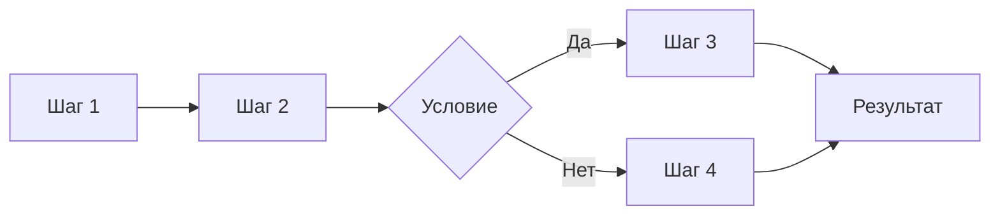
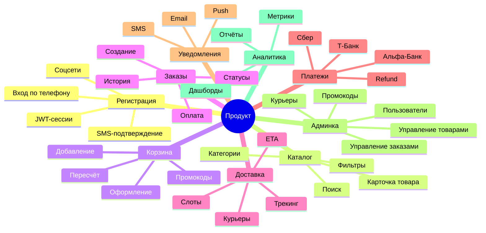

# Шаблон спецификации продукта

> **Назначение:** Описать бизнес-процессы текущей системы так, чтобы команда разработки могла оценить сроки и реализовать продукт-аналог.
>
> **Как работать с документом:**
> 1. Выделить все сквозные бизнес-процессы системы
> 2. Каждый процесс описать по шаблону раздела 2
> 3. После описания всех процессов — собрать итоговые оценки (раздел 3)
> 4. На основе процессов сформировать карту требований (раздел 4)

---

## 1. Общая информация о продукте

| Поле | Значение | Пример |
|---|---|---|
| **Название продукта** | | «Айгудс» |
| **Назначение** (1–2 предложения) | | Платформа для заказа и доставки товаров |
| **Целевая аудитория** | | B2C (покупатели), B2B (магазины), B2C (курьеры) |
| **Ключевые бизнес-метрики** | | Кол-во заказов/день, выручка, конверсия, удержание |
| **Текущее состояние** | | Рабочий монолит / MVP / С нуля |
| **Платформы** | | Web, iOS, Android |

---

## 2. Каталог бизнес-процессов

### 2.1 Структура описания одного процесса

```yaml
ИДЕНТИФИКАТОР: BP-{N}
НАЗВАНИЕ:       {Краткое название}
ВЛАДЕЛЕЦ:       {Роль, кто отвечает за процесс}
ТРИГГЕР:        {Что запускает процесс}
РЕЗУЛЬТАТ:      {Что считается успешным завершением}
```

#### 2.1.1 Бизнес-шаги



| № | Шаг | Участник | Система | Действие | Бизнес-правило |
|---|---|---|---|---|---|
| 1 | | | | | |
| 2 | | | | | |
| ... | | | | | |

**Альтернативные сценарии:**
- **Ошибка 1:** {что идёт не так} → {как система обрабатывает}
- **Ошибка 2:** {что идёт не так} → {как система обрабатывает}

#### 2.1.2 Данные процесса

| Сущность | Поля | Где хранится | Связи |
|---|---|---|---|
| `{entity_1}` | {перечень полей} | {БД/таблица} | {связи с другими сущностями} |
| `{entity_2}` | {перечень полей} | {БД/таблица} | {связи} |

#### 2.1.3 UI / Интерфейсы

| Экран / Компонент | Роль | Действия | Данные для отображения |
|---|---|---|---|
| {название экрана} | {кто видит} | {что можно сделать} | {какие данные показывает} |
| | | | |

#### 2.1.4 Интеграции (внешние системы)

| Система | Назначение | Данные | Направление |
|---|---|---|---|
| {банк / CRM / склад} | {зачем} | {какие данные передаются} | входящая / исходящая |
| | | | |

#### 2.1.5 Бизнес-правила и логика

```
Если {условие} → {действие}
При {ситуация} → {исключение / альтернатива}
Формула: {расчёт значения}
```

#### 2.1.6 Технические заметки для разработки

- {особенности реализации}
- {сложные моменты}
- {потенциальные узкие места}

#### 2.1.7 Оценка

| Категория | Трудозатраты (чел.-дней) | Примечание |
|---|---|---|
| Backend | | |
| Frontend (Web) | | |
| Mobile (iOS) | | |
| Mobile (Android) | | |
| DevOps / Infra | | |
| QA | | |
| **Итого на процесс** | **0** | |

---

### 2.2 Шаблоны для заполнения (процессы)

#### BP-01: Регистрация и аутентификация пользователя

<details>
<summary>Развернуть</summary>

| | |
|---|---|
| **Триггер** | Пользователь открывает приложение / сайт |
| **Результат** | Пользователь аутентифицирован, получен токен сессии |
| **Владелец** | User & Auth |

**Шаги:**
| № | Шаг | Участник | Действие | Бизнес-правило |
|---|---|---|---|---|
| 1 | Ввод номера телефона | Пользователь | Вводит номер в поле ввода | Формат: +7XXXXXXXXXX |
| 2 | Отправка SMS с кодом | Система | Генерирует 4-значный код, отправляет через SMS-провайдера | Код жив 5 минут, 3 попытки ввода |
| 3 | Подтверждение кода | Пользователь | Вводит код из SMS | При 3 неверных — блокировка на 30 мин |
| 4 | Создание/поиск профиля | Система | Если номер новый → создаётся профиль, если существующий → вход | |
| 5 | Выдача токена | Система | JWT access + refresh токены | Access — 15 мин, Refresh — 30 дней |

**Данные:**
| Сущность | Поля |
|---|---|
| `users` | id, phone, name, email, role, created_at, updated_at |
| `sessions` | id, user_id, refresh_token, expires_at, device_info |

**UI:**
- Экран ввода номера
- Экран ввода SMS-кода
- Экран профиля (после регистрации)

**Интеграции:**
| Система | Данные |
|---|---|
| SMS-провайдер | Телефон, текст сообщения |

**Бизнес-правила:**
- Если пользователь не завершил регистрацию (не ввёл код) — номер считается незанятым
- Один номер — один аккаунт
- Админы создаются только через бэк-офис

**Оценка:**
| Команда | Дней |
|---|---|
| Backend | 5 |
| Frontend | 3 |
| Mobile | 4 |
| QA | 2 |
| **Итого** | **14** |
</details>

---

#### BP-02: Каталог и поиск товаров

<details>
<summary>Развернуть</summary>

| | |
|---|---|
| **Триггер** | Пользователь открывает каталог / вводит поисковый запрос |
| **Результат** | Пользователь видит список товаров с ценой, наличием, характеристиками |
| **Владелец** | Catalog / Inventory |

**Шаги:**
| № | Шаг | Участник | Действие | Бизнес-правило |
|---|---|---|---|---|
| 1 | Выбор категории | Пользователь | Тапает на категорию в меню | Категории — дерево (3 уровня) |
| 2 | Загрузка товаров | Система | Запрос к БД / кэшу | Пагинация: 20 товаров на страницу |
| 3 | Фильтрация | Пользователь | Выбирает фильтры (цена, бренд, размер) | Фильтры применяются на стороне бэка |
| 4 | Поиск | Пользователь | Вводит текст в поисковую строку | Поиск по названию, артикулу, barcode |
| 5 | Отображение | Система | Показывает карточки товаров | Если товара нет в наличии — пометка «Нет в наличии» |

**Данные:**
| Сущность | Поля |
|---|---|
| `categories` | id, parent_id, name, slug, image, sort_order |
| `products` | id, name, description, sku, barcode, price, old_price, category_id, images, attributes (JSONB) |
| `inventory` | product_id, warehouse_id, quantity, reserved |

**UI:**
- Главная страница каталога (категории)
- Сетка/список товаров
- Детальная карточка товара
- Поисковая строка с автокомплитом

**Интеграции:** —
**Бизнес-правила:**
- Цена = базовая цена - скидка (если есть активная акция)
- Если `quantity - reserved <= 0` → «Нет в наличии»
- Старая цена зачёркивается, если `old_price > price`

**Оценка:**
| Команда | Дней |
|---|---|
| Backend | 8 |
| Frontend | 6 |
| Mobile | 7 |
| QA | 3 |
| **Итого** | **24** |
</details>

---

#### BP-03: Оформление заказа (Корзина → Заказ)

<details>
<summary>Развернуть</summary>

| | |
|---|---|
| **Триггер** | Пользователь добавляет товар в корзину |
| **Результат** | Заказ создан со статусом «Ожидает оплаты» |
| **Владелец** | Cart → Order |

**Шаги:**
| № | Шаг | Участник | Действие | Бизнес-правило |
|---|---|---|---|---|
| 1 | Добавление в корзину | Пользователь | Указывает количество → система резервирует товар | Резерв на 30 минут |
| 2 | Просмотр корзины | Пользователь | Видит список, количество, сумму, скидки | Пересчёт при изменении количества |
| 3 | Выбор адреса доставки | Пользователь | Выбирает из сохранённых / вводит новый | Геокодирование (координаты) |
| 4 | Выбор способа оплаты | Пользователь | Карта / СБП / Наличные | Для наличных — оплата при получении |
| 5 | Выбор временного слота | Пользователь | Выбирает дату и интервал доставки | Слоты настроены для каждого склада |
| 6 | Применение промокода | Пользователь | Вводит код | Проверка: активен, не истёк, не превышен лимит |
| 7 | Подтверждение заказа | Пользователь | Нажимает «Оформить заказ» | Система создаёт за注 |

**Данные:**
| Сущность | Поля |
|---|---|
| `carts` | id, user_id, items (JSONB), expires_at |
| `orders` | id, user_id, status, total, delivery_address, payment_method, promo_code, created_at |
| `order_items` | id, order_id, product_id, quantity, price |
| `promo_codes` | id, code, type, value, max_uses, used_count, expires_at |

**UI:**
- Экран корзины
- Экран оформления (адрес, оплата, слот)
- Экран подтверждения заказа

**Интеграции:**
| Система | Данные |
|---|---|
| Геокодер (Яндекс.Карты / Google) | Адрес → координаты |

**Бизнес-правила:**
- Минимальная сумма заказа: 500 руб
- Максимум позиций в корзине: 50
- Если товара нет в наличии → убрать из корзины с уведомлением
- Промокод: процентная или фиксированная скидка

**Оценка:**
| Команда | Дней |
|---|---|
| Backend | 12 |
| Frontend | 8 |
| Mobile | 10 |
| QA | 4 |
| **Итого** | **34** |
</details>

---

#### BP-04: Оплата заказа

<details>
<summary>Развернуть</summary>

| | |
|---|---|
| **Триггер** | Заказ создан со статусом «Ожидает оплаты» |
| **Результат** | Заказ оплачен (статус: «Оплачен») или отклонён |
| **Владелец** | Payment |

**Шаги:**
| № | Шаг | Участник | Действие | Бизнес-правило |
|---|---|---|---|---|
| 1 | Перенаправление на платёжный шлюз | Система | Формирует ссылку на оплату | Разные ссылки для разных банков |
| 2 | Ввод данных карты | Пользователь | Вводит номер, срок, CVV | Данные не проходят через наш сервер |
| 3 | Обработка платежа | Банк | Списывает средства | 3DSecure при необходимости |
| 4 | Callback от банка | Система | Получает уведомление об успехе/отказе | Webhook + polling |
| 5 | Обновление статуса заказа | Система | Успех → «Оплачен», Отказ → ошибка пользователю | |

**Данные:**
| Сущность | Поля |
|---|---|
| `payments` | id, order_id, amount, status, provider, provider_payment_id, created_at |
| `refunds` | id, payment_id, amount, reason, status |

**Интеграции:**
| Система | Данные |
|---|---|
| Т-Банк API | Сумма, order_id, success_url, fail_url → payment_url |
| Альфа-Банк API | Аналогично |
| Сбер API | Аналогично |

**Бизнес-правила:**
- Таймаут оплаты: 30 минут → отмена заказа
- Refund: полный или частичный (по запросу менеджера)
- Комиссия: 2–3% в зависимости от провайдера

**Оценка:**
| Команда | Дней |
|---|---|
| Backend | 15 |
| Frontend | 3 |
| Mobile | 3 |
| QA | 5 |
| **Итого** | **26** |
</details>

---

#### BP-05: Сборка и упаковка заказа

<details>
<summary>Развернуть</summary>

| | |
|---|---|
| **Триггер** | Заказ оплачен |
| **Результат** | Заказ собран, упакован, передан курьеру |
| **Владелец** | Order Fulfillment / Warehouse |

**Шаги:**
| № | Шаг | Участник | Действие | Бизнес-правило |
|---|---|---|---|---|
| 1 | Поступление заказа в складскую систему | Система | Заказ появляется в очереди сборщика | FIFO + приоритет (экспресс-заказы) |
| 2 | Сборка товаров | Сборщик | Сканирует товары, комплектует заказ | Если товара нет → замена / удаление позиции |
| 3 | Упаковка | Упаковщик | Упаковывает, наклеивает этикетку | Вес: проверка лимита курьерской службы |
| 4 | Передача курьеру | Система | Статус «Передан в доставку» | |

**UI (внутренний):**
- Экран сборщика: список заказов, сканер штрихкодов
- Экран упаковщика: вес, упаковка, печать этикетки

**Интеграции:**
- WMS (складская система) — синхронизация остатков

**Бизнес-правила:**
- Время сборки: не более 60 минут
- Если товар повреждён → списание + замена/возврат

**Оценка:**
| Команда | Дней |
|---|---|
| Backend | 8 |
| Web (внутр.) | 6 |
| Mobile | — |
| QA | 3 |
| **Итого** | **17** |
</details>

---

#### BP-06: Доставка заказа

<details>
<summary>Развернуть</summary>

| | |
|---|---|
| **Триггер** | Заказ собран и упакован |
| **Результат** | Заказ доставлен клиенту |
| **Владелец** | Delivery / Logistics |

**Шаги:**
| № | Шаг | Участник | Действие | Бизнес-правило |
|---|---|---|---|---|
| 1 | Назначение курьера | Система | Выбор свободного курьера рядом со складом | Маппинг: склад → зона доставки → курьер |
| 2 | Получение заказа курьером | Курьер | Подтверждает получение в приложении | Сканирование QR-кода на упаковке |
| 3 | Маршрут до клиента | Курьер | Строит маршрут в приложении | Интеграция с картами |
| 4 | Доставка | Курьер | Передаёт заказ клиенту | Клиент подтверждает получение кодом / подписью |
| 5 | Завершение | Система | Статус «Доставлен» | |

**Данные:**
| Сущность | Поля |
|---|---|
| `deliveries` | id, order_id, courier_id, status, assigned_at, picked_at, delivered_at |
| `couriers` | id, user_id, status, zone_id, current_location (POINT) |

**UI:**
- Приложение курьера: список заказов, маршрут, сканер, подтверждение
- Трекинг для клиента: карта с курьером в реальном времени

**Интеграции:**
| Система | Данные |
|---|---|
| Карты (Яндекс / Google) | Маршрут, ETA, трекинг |

**Бизнес-правила:**
- Курьер может взять не более 5 заказов одновременно
- Если курьер не взял заказ за 10 минут → назначить другого
- Окно доставки: 2 часа (настраивается)

**Оценка:**
| Команда | Дней |
|---|---|
| Backend | 10 |
| Mobile (курьер) | 10 |
| Frontend (трекинг) | 4 |
| QA | 4 |
| **Итого** | **28** |
</details>

---

#### BP-07: Возврат и отмена заказа

<details>
<summary>Развернуть</summary>

| | |
|---|---|
| **Триггер** | Клиент хочет отменить заказ / вернуть товар |
| **Результат** | Заказ отменён / возврат оформлен, деньги возвращены |
| **Владелец** | Order → Payment → Refund |

**Шаги:**
| № | Шаг | Участник | Действие | Бизнес-правило |
|---|---|---|---|---|
| 1 | Запрос отмены | Пользователь | Нажимает «Отменить заказ» | Можно отменить, если статус ≠ «Передан в доставку» |
| 2 | Проверка возможности отмены | Система | Проверяет статус заказа | |
| 3 | Отмена / Возврат | Система | Статус → «Отменён», инициируется refund | Refund через тот же платёжный метод |
| 4 | Уведомление | Система | Письмо/push об отмене | |
| 5 | Возврат товара (если передан курьеру) | Курьер | Забирает товар | Курьер получает задачу на возврат |

**Бизнес-правила:**
- До сборки: отмена мгновенно, возврат средств в течение 24 ч
- После сборки, до доставки: отмена возможна, но комиссия 5%
- После доставки: возврат в течение 14 дней по закону

**Оценка:**
| Команда | Дней |
|---|---|
| Backend | 6 |
| Frontend | 2 |
| Mobile | 3 |
| QA | 3 |
| **Итого** | **14** |
</details>

---

#### BP-08: Управление промокодами и акциями

<details>
<summary>Развернуть</summary>

| | |
|---|---|
| **Триггер** | Администратор создаёт акцию |
| **Результат** | Промокод / скидка применяется в корзине |
| **Владелец** | Marketing → Order |

**Шаги:**
| № | Шаг | Участник | Действие | Бизнес-правило |
|---|---|---|---|---|
| 1 | Создание акции | Админ | Заполняет форму: тип, размер, условия | |
| 2 | Применение в корзине | Система | При вводе промокода — пересчёт суммы | Скидка не суммируется с другими акциями |

**Бизнес-правила:**
- Типы: процентная (10%), фиксированная (500 руб), бесплатная доставка
- Ограничения: минимальная сумма, категории товаров, количество использований

**Оценка:**
| Команда | Дней |
|---|---|
| Backend | 5 |
| Frontend | 3 |
| QA | 2 |
| **Итого** | **10** |
</details>

---

#### BP-09: Уведомления (Push / SMS / Email)

<details>
<summary>Развернуть</summary>

| | |
|---|---|
| **Триггер** | Событие в системе (заказ создан, оплачен, доставлен) |
| **Результат** | Пользователь получил уведомление |
| **Владелец** | Notification |

**События и каналы:**
| Событие | Каналы | Шаблон |
|---|---|---|
| `order.created` | Push, Email | «Заказ №{id} принят» |
| `payment.succeeded` | Push | «Заказ №{id} оплачен» |
| `delivery.assigned` | Push, SMS | «Курьер выехал, ETA {time}» |
| `order.delivered` | Push, Email | «Заказ №{id} доставлен» |
| `promo.received` | Push | «Вам начислен промокод {code}» |

**Оценка:**
| Команда | Дней |
|---|---|
| Backend | 5 |
| Mobile (push) | 2 |
| QA | 2 |
| **Итого** | **9** |
</details>

---

#### BP-10: Личный кабинет и история заказов

<details>
<summary>Развернуть</summary>

| | |
|---|---|
| **Триггер** | Пользователь заходит в профиль |
| **Результат** | Пользователь видит свои данные, историю заказов |
| **Владелец** | User / Order |

**Функции:**
- Просмотр/редактирование профиля (имя, телефон, email)
- Список заказов (пагинация, фильтр по статусу)
- Детали заказа (товары, статус, трекинг)
- Сохранённые адреса доставки
- Избранное / Wishlist

**Оценка:**
| Команда | Дней |
|---|---|
| Backend | 4 |
| Frontend | 3 |
| Mobile | 4 |
| QA | 2 |
| **Итого** | **13** |
</details>

---

#### BP-11: Админ-панель (CRM / Бэк-офис)

<details>
<summary>Развернуть</summary>

| | |
|---|---|
| **Триггер** | Менеджер заходит в админку |
| **Результат** | Менеджер управляет заказами, товарами, пользователями |
| **Владелец** | Admin |

**Модули:**
1. **Заказы:** список, фильтры, просмотр, изменение статуса, комментирование
2. **Товары:** CRUD, импорт/экспорт (CSV/Excel), управление ценами
3. **Пользователи:** список, блокировка, смена роли
4. **Промокоды:** создание, статистика использований
5. **Курьеры:** назначение зон, просмотр рейтинга
6. **Аналитика:** дашборды (выручка, заказы, конверсия)

**Оценка:**
| Команда | Дней |
|---|---|
| Backend | 15 |
| Frontend | 20 |
| QA | 5 |
| **Итого** | **40** |
</details>

---

#### BP-12: Аналитика и дашборды

<details>
<summary>Развернуть</summary>

| | |
|---|---|
| **Триггер** | Запрос аналитика / руководителя |
| **Результат** | Отчёт с ключевыми метриками |
| **Владелец** | Analytics |

**Метрики:**
- DAU/MAU, конверсия шагов воронки
- Выручка (день/неделя/месяц), средний чек
- Топ товаров, топ категорий
- Количество заказов по статусам
- Среднее время сборки, среднее время доставки

**Оценка:**
| Команда | Дней |
|---|---|
| Backend | 8 |
| Frontend | 5 |
| QA | 2 |
| **Итого** | **15** |
</details>

---

## 3. Сводная оценка

### 3.1 Итого по всем процессам

| ID | Процесс | Backend | Frontend | Mobile | DevOps | QA | **Всего** |
|---|---|---|---|---|---|---|---|
| BP-01 | Регистрация и аутентификация | 5 | 3 | 4 | 1 | 2 | **15** |
| BP-02 | Каталог и поиск товаров | 8 | 6 | 7 | 1 | 3 | **25** |
| BP-03 | Оформление заказа | 12 | 8 | 10 | 1 | 4 | **35** |
| BP-04 | Оплата заказа | 15 | 3 | 3 | 1 | 5 | **27** |
| BP-05 | Сборка и упаковка | 8 | 6 | — | 1 | 3 | **18** |
| BP-06 | Доставка заказа | 10 | 4 | 10 | 1 | 4 | **29** |
| BP-07 | Возврат и отмена | 6 | 2 | 3 | 1 | 3 | **15** |
| BP-08 | Промокоды и акции | 5 | 3 | — | — | 2 | **10** |
| BP-09 | Уведомления | 5 | — | 2 | 1 | 2 | **10** |
| BP-10 | Личный кабинет | 4 | 3 | 4 | — | 2 | **13** |
| BP-11 | Админ-панель | 15 | 20 | — | — | 5 | **40** |
| BP-12 | Аналитика | 8 | 5 | — | 2 | 2 | **17** |
| **Cross-cutting** | Инфраструктура, CI/CD, doc | — | — | — | 20 | — | **20** |
| **Cross-cutting** | Интеграции, тестирование | 10 | — | — | — | 5 | **15** |
| | **Итого** | **111** | **63** | **43** | **29** | **42** | **288** |

> **Общая оценка:** ~290 человеко-дней (≈ 14–15 месяцев работы команды из 3–4 человек)

### 3.2 Поправка на риски

| Фактор | Коэффициент |
|---|---|
| Сложность интеграций | 1.2 |
| Неполнота требований | 1.3 |
| Новая команда (без опыта в предметной области) | 1.3 |
| Стабильная команда с опытом | 1.0 |

**Пример:** 290 × 1.2 (интеграции) × 1.3 (новизна) = **452 чел.-дня** (~22 месяца на команду из 3 человек)

---

## 4. Карта функциональных требований (Feature Map)

На основе описанных процессов строится карта всех функций продукта:



---

## 5. Что запросить у текущего разработчика

Если есть доступ к текущей системе — вот точный список, что попросить.
Отсортировано от самого важного к опциональному.

### 5.1 Схема БД (критично)

Это даст **все таблицы, типы полей, связи, индексы** — готовую модель для вашего проекта.

```sql
-- PostgreSQL:
pg_dump --schema-only -h host -U user -d database > schema.sql

-- MySQL:
mysqldump --no-data -h host -u user -p database > schema.sql
```

**Если нет доступа:** попросите ER-диаграмму (экспорт из DBeaver / DataGrip / pgAdmin в PNG/PDF).

### 5.2 API-запросы (критично)

Попросите **Har-файл** (Chrome DevTools → Network → Export HAR) — просто откройте сайт и сделайте основные действия:

| Действие | Что даст |
|---|---|
| Зайти в каталог → выбрать товар | Эндпоинты каталога, структуру товара |
| Добавить в корзину → оформить заказ | API корзины и заказов |
| Оплатить | Платёжный flow |
| Посмотреть историю заказов | API личного кабинета |

**Или:** ссылку на **Swagger / OpenAPI / Postman-коллекцию**.

**Формулировка запроса:**
> «Скинь дамп схемы БД (`pg_dump --schema-only`) и har-файл с парой запросов из приложения — оформление заказа и каталог. Это займёт 10 минут.»

### 5.3 Ключевые алгоритмы (важно)

| Что спросить | Формулировка |
|---|---|
| **Назначение курьера** | «Как система понимает, какому курьеру отдать заказ?» |
| **Расчёт ETA** | «Как считается время доставки?» |
| **Остатки товаров** | «Откуда берутся актуальные остатки? Магазин даёт API или парсинг?» |
| **Замены** | «Что происходит, когда товара нет в наличии?» |

### 5.4 Инфраструктура и состав команды (опционально)

| Что спросить |
|---|
| Сколько backend / frontend / mobile разработчиков? |
| Есть ли DevOps / QA отдельно? |
| Какая база данных (PostgreSQL / MySQL) и очереди (RabbitMQ / Kafka)? |

---

## 6. Шаг 1: Как заполнять этот шаблон

Вот пошаговая инструкция, как превратить текущий сервис в этот документ:

### Этап A: Инвентаризация процессов (1–2 дня)

| № | Действие | Результат |
|---|---|---|
| 1 | Открыть текущее приложение и пройти все сценарии пользователя | Список user journeys |
| 2 | Открыть админ-панель — записать все разделы и действия | Список admin-функций |
| 3 | Посмотреть интеграции (банки, SMS, карты, склады) | Список интеграций |
| 4 | Собрать все системные события (уведомления, действия) | Список триггеров |

### Этап B: Заполнение карточек процессов (1–2 дня на процесс)

Для каждого процесса из списка:
1. Открыть шаблон BP-XX (скопировать секцию)
2. Описать шаги (достаточно 80% точности, не обязательно 100%)
3. Указать, какие данные используются
4. Описать бизнес-правила («если X, то Y»)
5. Проставить предварительную оценку в днях

### Этап C: Валидация (2–3 дня)

1. Показать документ разработчикам → уточнить оценки
2. Показать бизнес-заказчику → подтвердить полноту процессов
3. Зафиксировать приоритеты (MVP → V2 → V3)

### Этап D: Финальный документ

1. Собрать все BP-карточки в один документ
2. Построить сводную таблицу оценок
3. Утвердить документ → передать в разработку

---

## Приложение: Пустой шаблон для копирования

```markdown
### BP-{N}: {Название процесса}

| | |
|---|---|
| **Триггер** | |
| **Результат** | |
| **Владелец** | |

**Шаги:**
| № | Шаг | Участник | Действие | Бизнес-правило |
|---|---|---|---|---|
| 1 | | | | |
| 2 | | | | |
| 3 | | | | |

**Данные:**
| Сущность | Поля | Где хранится |
|---|---|---|
| | | |

**UI / Интерфейсы:**
| Экран | Роль | Действия |
|---|---|---|
| | | |

**Интеграции:**
| Система | Назначение | Данные |
|---|---|---|
| | | |

**Бизнес-правила:**
- ...
- ...

**Оценка:**
| Команда | Дней |
|---|---|
| Backend | |
| Frontend | |
| Mobile | |
| QA | |
| **Итого** | |
```

---

> **Следующие шаги для вас:**
> 1. Пройтись по вашему текущему сервису и составить список процессов (раздел 5, Этап A)
> 2. Каждый процесс описать по шаблону BP-XX
> 3. Заполнить сводную таблицу оценок (раздел 3)
> 4. После утверждения — документ становится техническим заданием для команды
